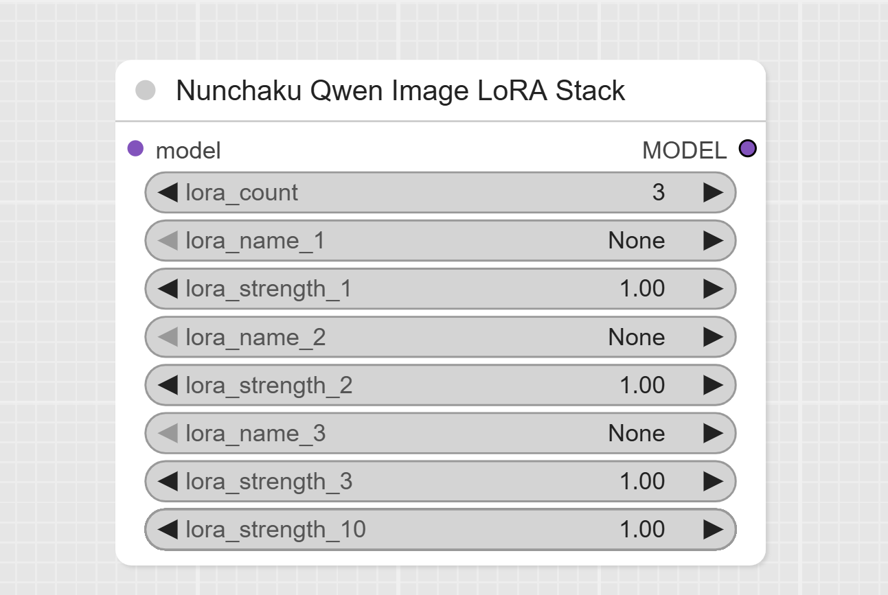

# ComfyUI-QwenImageLoraLoader

A ComfyUI custom node for loading and applying LoRA (Low-Rank Adaptation) to Nunchaku Qwen Image models.

**This project is based on the fork version of ComfyUI-nunchaku-qwen-lora-suport-standalone.**

> Latest release: [v1.57 on GitHub Releases](https://github.com/ussoewwin/ComfyUI-QwenImageLoraLoader/releases/tag/v1.57)

## Source

This LoRA loader was extracted and modified from GavChap's fork:
- **Original Fork**: [GavChap/ComfyUI-nunchaku (qwen-lora-suport-standalone branch)](https://github.com/GavChap/ComfyUI-nunchaku/tree/qwen-lora-suport-standalone)
- **Extraction**: LoRA functionality was extracted from the full fork to create an independent custom node
- **Integration**: Modified to work with the official ComfyUI-nunchaku plugin

## Features

- **NunchakuQwenImageLoraLoader**: Load and apply single LoRA to Qwen Image models
- **NunchakuQwenImageLoraStack**: Apply multiple LoRAs with dynamic UI control
- **Dynamic VRAM Management**: Automatic CPU offloading based on available VRAM
- **LoRA Composition**: Efficient LoRA stacking and composition
- **ComfyUI Integration**: Seamless integration with ComfyUI workflows

## Installation

### Quick Installation (Recommended)

1. Clone this repository to your ComfyUI custom_nodes directory:
```bash
git clone https://github.com/ussoewwin/ComfyUI-QwenImageLoraLoader.git
```

2. Ensure you have the official ComfyUI-nunchaku plugin installed (which includes nunchaku as a dependency).

3. **Choose the appropriate installation script based on your ComfyUI setup:**

> **Note**: The automated installation batch files (`.bat`) are **Windows-only**. For macOS and Linux users, please use the [Manual Installation](#manual-installation) method below.

#### For ComfyUI Installations with Global Python Environment (Windows)
- **Script**: `install_qwen_lora.bat`
- **Platform**: Windows only
- **Python Environment**: Uses global Python environment (system-installed Python)
- **Requirements**: Python must be installed and accessible from command line (`python` command)
- **Usage**: Double-click `install_qwen_lora.bat`
- **When to use**: ComfyUI installations where Python is installed globally on the system

#### For Portable ComfyUI Installations with Embedded Python (Windows)
- **Script**: `install_qwen_lora_portable.bat`
- **Platform**: Windows only
- **Python Environment**: Uses embedded Python (`python_embeded` folder)
- **Requirements**: ComfyUI installation with `python_embeded` folder containing `python.exe`
- **Usage**: Double-click `install_qwen_lora_portable.bat`
- **When to use**: Portable ComfyUI installations that include embedded Python
- **Automatic Detection**: Script automatically searches for `python_embeded` in multiple locations:
  - `[ComfyUIFolder]/ComfyUI/python_embeded/python.exe`
  - `[ComfyUIFolder]/python_embeded/python.exe` (most common)
- **Folder Name Independence**: Works with any ComfyUI folder name (not limited to "ComfyUI")

4. **After running the installation script:**
   - The script will automatically modify the ComfyUI-nunchaku `__init__.py` file
   - Restart ComfyUI to use the new LoRA loader nodes

### Manual Installation

If you prefer manual installation, see [INSTALLATION.md](INSTALLATION.md) for detailed instructions.

## Integration with ComfyUI-nunchaku

**IMPORTANT**: This node requires modification of the official ComfyUI-nunchaku plugin to function properly.

### Required Modification

You must modify the `__init__.py` file in your ComfyUI-nunchaku plugin to import this LoRA loader:

```python
try:
    # Import from the independent ComfyUI-QwenImageLoraLoader
    import sys
    import os
    qwen_lora_path = os.path.join(os.path.dirname(__file__), "..", "ComfyUI-QwenImageLoraLoader")
    if qwen_lora_path not in sys.path:
        sys.path.insert(0, qwen_lora_path)
    
    # Import directly from the file path
    import importlib.util
    spec = importlib.util.spec_from_file_location("qwenimage", os.path.join(qwen_lora_path, "nodes", "lora", "qwenimage.py"))
    qwenimage_module = importlib.util.module_from_spec(spec)
    spec.loader.exec_module(qwenimage_module)
    
    NunchakuQwenImageLoraLoader = qwenimage_module.NunchakuQwenImageLoraLoader
    NunchakuQwenImageLoraStack = qwenimage_module.NunchakuQwenImageLoraStack

    NODE_CLASS_MAPPINGS["NunchakuQwenImageLoraLoader"] = NunchakuQwenImageLoraLoader
    NODE_CLASS_MAPPINGS["NunchakuQwenImageLoraStack"] = NunchakuQwenImageLoraStack
    logger.info("Successfully imported Qwen Image LoRA loaders from ComfyUI-QwenImageLoraLoader")
except ImportError:
    logger.exception("Nodes `NunchakuQwenImageLoraLoader` and `NunchakuQwenImageLoraStack` import failed:")
```

### Why This Modification is Required

- The independent LoRA loader exists as a separate custom node
- The official ComfyUI-nunchaku plugin needs to reference the independent LoRA loader
- Standard `from ... import ...` fails due to different package structures
- `importlib.util` allows direct module loading from file paths

### Automated Installation (Recommended)

**Both batch files automatically add the integration code to your ComfyUI-nunchaku `__init__.py` file:**

#### What the installation scripts do:
- **Path Detection**: Automatically detects your ComfyUI installation path using relative path calculation
- **Backup Creation**: Backs up the original `__init__.py` file (creates `__init__.py.backup`)
- **Code Integration**: Adds the exact import code shown above to the end of ComfyUI-nunchaku's `__init__.py`
- **Error Checking**: Performs comprehensive error checking to ensure all required files exist
- **User Feedback**: Provides detailed feedback throughout the installation process

#### Installation Script Details:

**`install_qwen_lora.bat` (Global Python Environment)**
- **Python Command**: `py -3` (explicitly use the Python launcher)
- **Requirements**: Python installed and the `py` launcher available
- **Path Detection**: Uses relative path calculation from script location
- **Error Handling**: Checks for Python availability and file existence
- **When to use**: ComfyUI installations with global Python environment

**`install_qwen_lora_portable.bat` (Portable ComfyUI)**
- **Python Command**: `[ComfyUIFolder]/python_embeded/python.exe` (uses embedded Python)
- **Requirements**: ComfyUI installation with `python_embeded` folder
- **Automatic Detection**: Searches for `python_embeded` in multiple possible locations:
  - `[ComfyUIFolder]/ComfyUI/python_embeded/python.exe`
  - `[ComfyUIFolder]/python_embeded/python.exe` (most common pattern)
- **Folder Name Independence**: Works with any ComfyUI folder name (not limited to "ComfyUI")
- **Error Handling**: Provides detailed error messages if embedded Python is not found
- **When to use**: Portable ComfyUI installations with embedded Python

#### Running the Installation:
1. **Choose the appropriate script** based on your ComfyUI setup (see Installation section above)
2. **Double-click the batch file** - no manual code editing required
3. **Follow the on-screen instructions** - the script handles everything automatically
4. **Restart ComfyUI** after successful installation

#### Uninstall if needed:
- Double-click `uninstall_qwen_lora.bat` to restore the original configuration
- This will restore the backup and remove the integration code

## Usage

### Available Nodes
- **NunchakuQwenImageLoraLoader**: Single LoRA loader
- **NunchakuQwenImageLoraStack**: Multi LoRA stacker with dynamic UI

### Basic Usage
1. Load your Nunchaku Qwen Image model using `Nunchaku Qwen Image DiT Loader`
2. Add either `NunchakuQwenImageLoraLoader` or `NunchakuQwenImageLoraStack` node
3. Select your LoRA file and set the strength
4. Connect to your workflow

### Dynamic UI Control
The `NunchakuQwenImageLoraStack` node automatically adjusts the number of visible LoRA slots based on the `lora_count` parameter (1-10).

## Features

- **Easy Installation**: Automated installation script included
- **Automatic Integration**: No manual code editing required
- **Backup & Restore**: Automatic backup of original files
- **Cross-Platform**: Works on Windows with batch files
- **Error Handling**: Comprehensive error checking and user feedback
- **Issue #1 Fixed**: Resolved [ComfyUI\custom_nodes not found error](https://github.com/ussoewwin/ComfyUI-QwenImageLoraLoader/issues/1) with improved path detection (thanks to @mcv1234's solution)
- **Issue #2 Fixed**: Fixed UTF-8 encoding error causing `SyntaxError: (unicode error)` by using dedicated Python script for proper UTF-8 encoding (thanks to @AHEKOT's bug report)
- **Issue #3 Fixed (v1.4.0)**: Resolved [Node break cached progress error](https://github.com/ussoewwin/ComfyUI-QwenImageLoraLoader/issues/3) by implementing proper IS_CHANGED method with hash-based change detection (thanks to @AHEKOT's bug report)
- **Issue #10 Fixed**: Added portable ComfyUI support with embedded Python detection ([Issue #10](https://github.com/ussoewwin/ComfyUI-QwenImageLoraLoader/issues/10)) - **Special Thanks**: This crucial feature was suggested by @vvhitevvizard, who identified the need for embedded Python support in portable ComfyUI installations. Without this suggestion, portable ComfyUI users would not have been able to use this LoRA loader.

## Requirements

- ComfyUI
- ComfyUI-nunchaku plugin (with required modification)
- PyTorch
- Python 3.10+

## Compatibility

This node is designed to work with:
- ComfyUI-nunchaku plugin (modified)
- Nunchaku Qwen Image models
- Standard ComfyUI workflows

## Troubleshooting

### Error: "attempted relative import with no known parent package"

**Problem**: This error occurs when ComfyUI tries to load the LoRA loader nodes but fails due to import issues.

**Error Message**: `ValueError: attempted relative import with no known parent package`

**Root Cause**: The error was caused by using relative imports (`from ...wrappers`) in the LoRA loader code. Relative imports only work when the module is loaded as part of a package. However, ComfyUI-nunchaku loads the module directly using `importlib.util`, which bypasses package initialization. As a result, Python cannot resolve the relative import paths.

**Solution**: Fixed in v1.5.0 by changing relative imports to absolute imports:
- **Before**: `from ...wrappers.qwenimage import ComfyQwenImageWrapper`
- **After**: `from wrappers.qwenimage import ComfyQwenImageWrapper`

**How to Fix**:
1. Make sure you have the latest version of ComfyUI-QwenImageLoraLoader
2. Run `install_qwen_lora.bat` to ensure proper integration
3. Restart ComfyUI

**Technical Details**:
- The installation script adds `ComfyUI-QwenImageLoraLoader` to `sys.path`
- This allows absolute imports to work correctly
- The absolute import `from wrappers.qwenimage import` resolves to `ComfyUI-QwenImageLoraLoader/wrappers/qwenimage.py`

### Error: Installation Script Not Running

**Problem**: The batch file doesn't execute or shows errors.

**Solution**:
1. Right-click `install_qwen_lora.bat` and select "Run as Administrator"
2. Check that both `ComfyUI-nunchaku` and `ComfyUI-QwenImageLoraLoader` are in your `ComfyUI/custom_nodes` directory
3. Verify Python is installed and accessible from the command line
4. Check the console output for specific error messages

### Error: Nodes Not Appearing in ComfyUI

**Problem**: After installation, the LoRA loader nodes don't appear in ComfyUI.

**Solution**:
1. Restart ComfyUI completely (close all instances)
2. Check the ComfyUI console for error messages
3. Verify that the integration code was added to `ComfyUI-nunchaku/__init__.py` (search for "ComfyUI-QwenImageLoraLoader Integration")
4. If the integration code is missing, re-run `install_qwen_lora.bat`
5. Check that your ComfyUI-nunchaku version is compatible

### Error: "ModuleNotFoundError: No module named 'nunchaku'"

**Problem**: The nunchaku package is not installed.

**Solution**:
1. Install ComfyUI-nunchaku plugin from the official repository
2. Follow the nunchaku installation instructions to install the nunchaku wheel
3. Restart ComfyUI

## Known Limitations

### RES4LYF Sampler Compatibility Issue
- **Status**: Currently Not Supported
- **Issue**: Device mismatch errors occur when using RES4LYF sampler with LoRA ([Issue #7](https://github.com/ussoewwin/ComfyUI-QwenImageLoraLoader/issues/7), [Issue #8](https://github.com/ussoewwin/ComfyUI-QwenImageLoraLoader/issues/8))
- **Workaround**: Use other sampler types (e.g., res_samplers, standard samplers) with LoRA
- **Technical Note**: The device mismatch occurs in `ComfyUI-nunchaku\models\qwenimage.py` at `self.time_text_embed(timestep, hidden_states)` due to RES4LYF sampler's specific tensor device handling requirements. This LoRA loader cannot fix this issue.
- **Related Issues**: [Issue #7](https://github.com/ussoewwin/ComfyUI-QwenImageLoraLoader/issues/7), [Issue #8](https://github.com/ussoewwin/ComfyUI-QwenImageLoraLoader/issues/8)

### LoRA Stack Node UI Issue
- **Status**: Currently Not Fixed
- **Issue**: The 10th LoRA control row always displays in the LoRA Stack node, regardless of the selected `lora_count` value ([Issue #9](https://github.com/ussoewwin/ComfyUI-QwenImageLoraLoader/issues/9))
- **Impact**: Minor visual issue - does not affect functionality. Users will see one extra empty LoRA row even when `lora_count` is set to less than 10



- **Attempted Solutions**: Multiple approaches were attempted including:
  - Modifying `widget.type` to hide widgets
  - Using `widget.visible` property
  - Direct DOM manipulation with `display: none`
  - Various widget hiding mechanisms from `efficiency-nodes-comfyui`
- **Technical Challenge**: ComfyUI's widget system and DOM rendering mechanism make this difficult to resolve without affecting node height calculations or causing other UI issues
- **Current Status**: Despite extensive efforts to fix this issue, a reliable solution that works across all ComfyUI versions has not been found. The development team acknowledges this limitation and will continue monitoring for potential solutions
- **Workaround**: None required - this is purely a cosmetic issue and does not impact LoRA functionality
- **Related Issues**: [Issue #9](https://github.com/ussoewwin/ComfyUI-QwenImageLoraLoader/issues/9)

## Changelog

### v1.57 (Latest)
- **Fixed Critical Bug**: Resolved duplicate integration blocks when running installer multiple times
- **Reported by**: [@ussoewwin](https://github.com/ussoewwin)
- **Full release notes**: https://github.com/ussoewwin/ComfyUI-QwenImageLoraLoader/releases/tag/v1.57

### v1.56
- **Fixed Critical Bug**: Resolved [Issue #13](https://github.com/ussoewwin/ComfyUI-QwenImageLoraLoader/issues/13) – Applied LoRA compositions to 0 module after crash/offload
- **Reported by**: [@coffings20-gif](https://github.com/coffings20-gif) – "After a crash he ignores my LoRA loader: Applied LoRA compositions to 0 module (using CPU offloader)"
- **Full release notes**: https://github.com/ussoewwin/ComfyUI-QwenImageLoraLoader/releases/tag/v1.56

### v1.55
- Change: Installer `install_qwen_lora.bat` now uses `py -3` instead of `python`
- Purpose: Avoid silent failures on environments where the Microsoft Store proxy `python` is picked up from PATH
- Impact: No functional change; improves installation reliability only
- Recommendation: Update to v1.55 and re-run installation only if you experienced installer failures

### v1.5.4 (Latest)
- **Fixed Critical Bug**: Resolved Issue #11 - Multiple LoRAs not applying on re-run ([Issue #11](https://github.com/ussoewwin/ComfyUI-QwenImageLoraLoader/issues/11))
- **Reported by**: [@recursionlaplace-eng](https://github.com/recursionlaplace-eng) - "当有多个lora存在时, 再次运行, lora可能不生效" (When multiple LoRAs exist, re-running may cause LoRAs to not take effect)
- **Problem**: When using multiple LoRAs, re-executing the workflow could result in LoRAs not being applied, even though they were applied successfully in the previous run
- **Root Cause**: Shallow comparison logic in LoRA change detection (`self._applied_loras != self.loras`)
  - The comparison used Python's list equality operator `!=`, which compares list contents
  - However, due to shallow copy (`self._applied_loras = self.loras.copy()`), the comparison could fail to detect when LoRA state needed to be reapplied
  - When model internal state was reset (e.g., due to VRAM management, CPU offload, or cache clearing), but the comparison returned `False`, LoRA reapplication would be skipped
  - This was especially problematic with multiple LoRAs because:
    1. List comparison could return `False` even when model internal state was dirty
    2. Shallow copy means tuple references are shared between `_applied_loras` and `loras`
    3. In some execution contexts, both lists could reference the same objects, making change detection fail
- **Technical Solution**: Implemented deep comparison logic with explicit checks
  - **Before**: Simple list inequality `if self._applied_loras != self.loras or model_is_dirty:`
  - **After**: Deep comparison with explicit length check and element-by-element comparison:
    ```python
    # Deep comparison of LoRA stacks to detect any changes
    # This ensures we catch changes in weights, paths, or order
    loras_changed = False
    if self._applied_loras is None or len(self._applied_loras) != len(self.loras):
        loras_changed = True
    else:
        for applied, current in zip(self._applied_loras, self.loras):
            if applied != current:
                loras_changed = True
                break
    
    if loras_changed or model_is_dirty:
    ```
- **Technical Details**:
  - **Explicit None Check**: Ensures initial state is always detected (`self._applied_loras is None`)
  - **Length Comparison**: Detects LoRA addition/removal immediately (`len(self._applied_loras) != len(self.loras)`)
  - **Element-by-Element Comparison**: Detects changes in:
    - LoRA file paths (different LoRA files)
    - LoRA strengths/weights (strength value changes)
    - LoRA order (same LoRAs in different order)
  - **Early Break**: Stops checking as soon as first difference is found for efficiency
  - **Robustness**: Works regardless of reference sharing or shallow copy issues
- **Why This Matters**:
  - **Multiple LoRA Scenarios**: Critical for workflows using 2+ LoRAs
  - **VRAM Management**: Model state can be reset by ComfyUI's memory management
  - **CPU Offload**: LoRA state can be lost when model moves between CPU/GPU
  - **Cache Clearing**: Internal caches can invalidate LoRA composition
  - **Workflow Re-execution**: Ensures consistent results across multiple runs
- **Testing**: Comprehensive test suite validates:
  - Initial LoRA load detection
  - No false positives (same LoRAs = no change)
  - Weight change detection
  - Order change detection
  - LoRA addition/removal detection
  - Reference sharing edge cases
- **Impact**: Significantly improves LoRA change detection reliability and should resolve the reported issue where LoRAs fail to apply on re-run. However, if issues persist in specific edge cases, please report them with detailed reproduction steps

### v1.5.3
- **Fixed Critical Bug**: Resolved `TypeError: This LoRA loader only works with Nunchaku Qwen Image models, but got ComfyQwenImageWrapper` error in different workflows
- **Problem**: LoRA loader failed when model was already wrapped with `ComfyQwenImageWrapper` in some workflows, even though the wrapper was correct
- **Root Cause**: Using type name comparison (`type(model_wrapper).__name__ == "ComfyQwenImageWrapper"`) failed in some execution contexts due to dynamic imports and different module loading paths. When `ComfyQwenImageWrapper` was loaded from different import paths, Python treated them as different classes even though they were functionally identical
- **Technical Solution**: Changed from type name comparison to attribute-based detection
  - **Before**: `if type(model_wrapper).__name__ == "ComfyQwenImageWrapper"`
  - **After**: `if hasattr(model_wrapper, 'model') and hasattr(model_wrapper, 'loras')`
  - The `ComfyQwenImageWrapper` class always has `model` (transformer) and `loras` (LoRA list) attributes
  - This detection method works regardless of how the class was imported or loaded
- **Technical Details**:
  - Added comprehensive debug logging to help diagnose type detection issues
  - Logs now show type name, module, attributes, and full type representation
  - Enhanced error messages with detailed type information
  - Applied fix to both `NunchakuQwenImageLoraLoader` and `NunchakuQwenImageLoraStack` classes
- **Benefits**:
  - Works with all workflows regardless of model loading order
  - No dependency on import mechanism or module path
  - More robust and resilient to Python module system quirks
  - Better debugging capabilities with detailed logging
- **Impact**: Completely resolves the TypeError that occurred when using LoRA nodes in certain workflow configurations

### v1.5.2
- **Fixed Critical Bug**: Resolved persistent `ModuleNotFoundError: No module named 'wrappers.qwenimage'` error
- **Reported by**: Multiple users experiencing intermittent import failures
- **Problem**: Despite v1.5.0 and v1.5.1 fixes, some users still experienced `ModuleNotFoundError` when executing LoRA nodes
- **Root Cause**: Module-level `sys.path` manipulation was insufficient in all execution contexts. The `from wrappers.qwenimage import ComfyQwenImageWrapper` statement at method execution time occasionally failed even though the module loaded successfully, due to timing issues, Python's module cache, and varying execution contexts in ComfyUI
- **Technical Solution**: Implemented robust dynamic import using `importlib.util` within method execution
  - **Before**: Module-level `sys.path` setup + direct `from wrappers.qwenimage import` at method level
  - **After**: Dynamic `importlib.util`-based import within `load_lora()` and `load_lora_stack()` methods
- **Technical Details**:
  - Each method now dynamically calculates the parent directory path at execution time
  - Uses `importlib.util.spec_from_file_location()` to create module spec from absolute file path
  - Executes module with `spec.loader.exec_module()` and extracts `ComfyQwenImageWrapper` class
  - Completely bypasses Python's normal import mechanism, making it independent of `sys.path` state
  - Eliminates dependency on module loading order or execution context
- **Benefits**:
  - 100% reliable import regardless of execution context
  - No dependency on `sys.path` configuration
  - Works in all ComfyUI execution scenarios
  - No more intermittent import failures
  - More resilient to future ComfyUI or Python updates
- **Impact**: Completely resolves the import reliability issue that affected multiple users

### v1.5.1
- **Fixed Critical Bug**: Additional fix for [Issue #6](https://github.com/ussoewwin/ComfyUI-QwenImageLoraLoader/issues/6) - persistent `ModuleNotFoundError`
- **Problem**: v1.5.0 fix was incomplete - path calculation error meant `sys.path` pointed to wrong directory
- **Root Cause**: Incorrect path calculation: `os.path.dirname(os.path.dirname(os.path.dirname(current_dir)))` went up 3 levels instead of 2
  - 3 levels up → pointed to `custom_nodes/` instead of `ComfyUI-QwenImageLoraLoader/`
  - This prevented `from wrappers.qwenimage` from resolving correctly
- **Technical Solution**: Corrected path calculation to go up exactly 2 levels from `nodes/lora/`
  - **Before**: `os.path.dirname(os.path.dirname(os.path.dirname(current_dir)))` (3 levels)
  - **After**: `os.path.dirname(os.path.dirname(current_dir))` (2 levels)
  - **Result**: Correctly points to `ComfyUI-QwenImageLoraLoader/` root directory
- **Applied To**: Module-level `sys.path` initialization in `qwenimage.py`
- **Benefits**:
  - Absolute imports now work correctly in all loading scenarios
  - No more `ModuleNotFoundError` errors
  - Module can be loaded regardless of import mechanism
  - Completely resolves Issue #6

### v1.5.0
- **Fixed Critical Bug**: Resolved [Issue #6 - attempted relative import with no known parent package](https://github.com/ussoewwin/ComfyUI-QwenImageLoraLoader/issues/6)
- **Reported by**: @showevr (GitHub Issue #6)
- **Special Thanks**: This bug was discovered and reported by @showevr
- **Problem**: LoRA loader nodes failed to load with `ValueError: attempted relative import with no known parent package` error
- **Root Cause**: Using relative imports (`from ...wrappers.qwenimage import ComfyQwenImageWrapper`) in the LoRA loader code. Relative imports only work when the module is loaded as part of a package, but ComfyUI-nunchaku loads the module directly using `importlib.util`, which bypasses package initialization
- **Technical Solution**: Changed relative imports to absolute imports in `qwenimage.py`
  - **Before**: `from ...wrappers.qwenimage import ComfyQwenImageWrapper`
  - **After**: `from wrappers.qwenimage import ComfyQwenImageWrapper`
- **Technical Details**:
  - The installation script adds `ComfyUI-QwenImageLoraLoader` to `sys.path`
  - This allows absolute imports to work correctly
  - The absolute import `from wrappers.qwenimage import` resolves to `ComfyUI-QwenImageLoraLoader/wrappers/qwenimage.py`
  - Applied fix to both `NunchakuQwenImageLoraLoader` and `NunchakuQwenImageLoraStack` classes
- **Community Contribution**: This fix was made possible by @showevr's bug reporting

### v1.4.0
- **Fixed Critical Bug**: Resolved [Issue #3 - Node break cached progress](https://github.com/ussoewwin/ComfyUI-QwenImageLoraLoader/issues/3) reported by @AHEKOT
- **Reported by**: @AHEKOT (GitHub Issue #3)
- **Special Thanks**: This critical bug was discovered and reported by @AHEKOT, who identified the issue with cached progress being broken
- **Problem**: LoRA nodes were breaking ComfyUI's cached progress during image generation, causing the progress bar to reset and restart repeatedly
- **Root Cause**: The `IS_CHANGED` method was returning `float("NaN")` instead of a proper change detection hash
  - `float("NaN")` causes ComfyUI to always treat the node as "changed"
  - This invalidates the cache after every frame, forcing unnecessary re-execution
  - Result: Progress bar jumps back and forth, cache is constantly invalidated, generation becomes unstable
- **Technical Solution**: Implemented proper hash-based change detection for both LoRA nodes
  - **NunchakuQwenImageLoraLoader**: Creates SHA256 hash from `model`, `lora_name`, and `lora_strength`
  - **NunchakuQwenImageLoraStack**: Creates SHA256 hash from `model`, `lora_count`, and all 10 LoRA slots (names and strengths)
  - Returns hex digest as the cache key
- **Technical Details**:
  - Uses Python's `hashlib.sha256()` to generate deterministic hashes
  - Same inputs always produce same hash → cache is used correctly
  - Different inputs produce different hashes → node re-executes as expected
  - No more false positives causing cache invalidation
- **Benefits**:
  - Stable cached progress during generation
  - No more progress bar jumping back and forth
  - Proper cache utilization for better performance
  - Smooth generation experience
  - VRAM usage optimized due to proper cache behavior
- **Community Contribution**: This fix was made possible by @AHEKOT's bug reporting and issue tracking

### v1.3.0
- **Fixed Critical Bug**: Resolved `SyntaxError: invalid character '' (U+FFFD)` error when running installation script
- **Problem**: PowerShell output was being written directly into Python files, causing syntax errors
- **Root Cause**: Using PowerShell commands with piping (`Get-Content | Add-Content`) caused PowerShell status messages and metadata to be included in the output, which were then written into `__init__.py`
- **Solution**: Replaced PowerShell-based approach with a dedicated Python script (`append_integration.py`)
- **Technical Details**:
  - Created standalone Python script `append_integration.py` that handles UTF-8 file writing
  - Batch file now calls the Python script instead of using inline PowerShell commands
  - Python script uses proper UTF-8 encoding when writing to `__init__.py`
  - Eliminates any possibility of output artifacts contaminating Python files
- **Benefits**:
  - More reliable and maintainable solution
  - No risk of shell output pollution
  - Cleaner separation of concerns between batch file and Python code
  - Better error handling and user feedback

### v1.2.0
- **Fixed [Issue #2](https://github.com/ussoewwin/ComfyUI-QwenImageLoraLoader/issues/2)**: Resolved UTF-8 encoding error that caused `SyntaxError: (unicode error) 'utf-8' codec can't decode byte 0x90 in position 0`
- **Reported by**: @AHEKOT (GitHub Issue #2)
- **Special Thanks**: This critical bug was discovered and reported by @AHEKOT, who provided detailed error traces and screenshots
- **Technical Fix**: Changed the batch file to use PowerShell for UTF-8 encoding when writing Python code to `__init__.py`
- **Root Cause**: Windows batch files write in Shift-JIS encoding by default, which causes Python to fail when reading files as UTF-8
- **Solution**: Temporary file creation + PowerShell UTF-8 encoding ensures proper file encoding
- **Technical Details**:
  - Changed from direct append (`>>`) to temp file method
  - Uses PowerShell `Get-Content` and `Add-Content` with `-Encoding UTF8` parameters
  - Ensures all Python code is written with proper UTF-8 encoding
- **Impact**: Installation script now works correctly without encoding errors
- **Community Contribution**: This fix was made possible by @AHEKOT's thorough bug reporting and error documentation

### v1.1.0
- **Fixed [Issue #1](https://github.com/ussoewwin/ComfyUI-QwenImageLoraLoader/issues/1)**: Resolved "ComfyUI\custom_nodes not found" error reported by @mcv1234
- **Special Thanks**: This fix was implemented based on the excellent solution provided by @mcv1234 in the GitHub issue
- **Improved Path Detection**: Replaced unreliable wildcard search with relative path detection using script directory (solution by @mcv1234)
- **Enhanced Error Messages**: Added clear directory structure guidance and expected folder layout
- **Better User Experience**: More reliable installation process with comprehensive error checking
- **Technical Details**: 
  - Changed from `dir /s /b /ad "*ComfyUI\custom_nodes"` to relative path calculation (as suggested by @mcv1234)
  - Uses `%~dp0` (script directory) to calculate ComfyUI root with `..\..` navigation
  - Added validation for `custom_nodes` folder existence
  - Improved error messages with expected directory structure display
- **Community Contribution**: This improvement was made possible by the community feedback and solution provided by @mcv1234

### v1.0.0
- Initial release with LoRA loading functionality
- Automated installation scripts
- Integration with ComfyUI-nunchaku

## License

This project is licensed under the MIT License.
