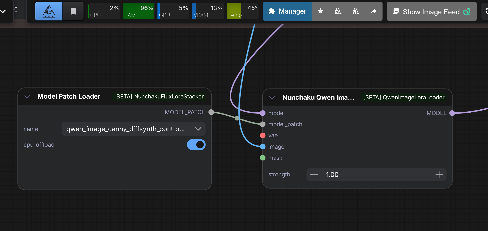

# ComfyUI-QwenImageLoraLoader

A ComfyUI custom node for loading and applying LoRA (Low-Rank Adaptation) to Nunchaku Qwen Image models. ComfyUI Nodes 2.0 compatible.

> Latest release: [v2.0.8 on GitHub Releases](https://github.com/ussoewwin/ComfyUI-QwenImageLoraLoader/releases/tag/v2.0.8)
> 
> ⚠️ **Note for v2.0+ users**: If you encounter `TypeError: got multiple values for argument 'guidance'` errors, see [troubleshooting section](#issue-30-typeerror-got-multiple-values-for-argument-guidance-v20) below.

## Source

This LoRA loader was extracted and modified from GavChap's fork:
- **Original Fork**: [GavChap/ComfyUI-nunchaku (qwen-lora-suport-standalone branch)](https://github.com/GavChap/ComfyUI-nunchaku/tree/qwen-lora-suport-standalone)
- **Extraction**: LoRA functionality was extracted from the full fork to create an independent custom node
- **Integration**: Modified to work with the official ComfyUI-nunchaku plugin

## 🎉 MAJOR UPDATE: v2.0 - Diffsynth ControlNet Support Added!

**As of v2.0, diffsynth ControlNet is now fully supported for Nunchaku Qwen Image models.**

A new dedicated node `NunchakuQwenImageDiffsynthControlnet` enables diffsynth ControlNet functionality with Nunchaku quantized Qwen Image models.

### What's New in v2.0
- ✅ **New Node**: `NunchakuQwenImageDiffsynthControlnet` - Dedicated diffsynth ControlNet loader for Nunchaku Qwen Image models
- ✅ **Full ControlNet Support**: Works with standard diffsynth ControlNet models
- ✅ **Seamless Integration**: Automatically applies ControlNet patches during model forward pass
- ✅ **Backward Compatible**: All existing LoRA functionality remains unchanged

For detailed technical explanation, see [v2.0 Release Notes](https://github.com/ussoewwin/ComfyUI-QwenImageLoraLoader/releases/tag/v2.0)

## 🎉 MAJOR UPDATE: v1.60 - Simplified Installation (No Integration Required!)

**As of v1.60, manual integration with ComfyUI-nunchaku's `__init__.py` is completely unnecessary.**

The node now operates as a fully independent custom node that works out-of-the-box. Simply clone the repository into your `custom_nodes` folder and restart ComfyUI. The nodes will automatically appear in ComfyUI's node menu through ComfyUI's built-in automatic node loading mechanism.

### What Changed in v1.60
- ✅ **Removed dependency on ComfyUI-nunchaku integration** - The LoRA loader is now a standalone plugin
- ✅ **Simplified installation** - No batch scripts or manual file editing required
- ✅ **Cleaner architecture** - Node registration happens automatically
- ✅ **Backward compatible** - All existing LoRA files and workflows continue to work

For a detailed technical explanation of why integration is no longer needed, see [v1.60 Release Notes](https://github.com/ussoewwin/ComfyUI-QwenImageLoraLoader/releases/tag/v1.60)

## Features

- **NunchakuQwenImageLoraLoader**: Load and apply single LoRA to Qwen Image models
- **NunchakuQwenImageLoraStack**: Apply multiple LoRAs with dynamic UI control
- **NunchakuQwenImageDiffsynthControlnet**: Apply diffsynth ControlNet to Nunchaku Qwen Image models (v2.0)
- **Dynamic VRAM Management**: Automatic CPU offloading based on available VRAM
- **LoRA Composition**: Efficient LoRA stacking and composition
- **ComfyUI Integration**: Seamless integration with ComfyUI workflows

## Installation

### Quick Installation (v1.60 - Simplified!)

**Prerequisites:**
- ComfyUI-nunchaku must be installed

1. Clone this repository to your ComfyUI custom_nodes directory:

```bash
cd ComfyUI/custom_nodes
git clone https://github.com/ussoewwin/ComfyUI-QwenImageLoraLoader.git
```

2. Restart ComfyUI

**That's it!** The nodes will automatically appear in ComfyUI's node menu.

### Manual Installation (Alternative)

If you prefer to install manually or are using macOS/Linux:

```bash
cd /path/to/ComfyUI/custom_nodes
git clone https://github.com/ussoewwin/ComfyUI-QwenImageLoraLoader.git
```

Then restart ComfyUI.

### Requirements

- Python 3.11+
- ComfyUI (latest version recommended)
- ComfyUI-nunchaku (required)
- CUDA-capable GPU (optional, but recommended for performance)

## Upgrade Guide for v1.57 and Earlier Users

If you have v1.57 or earlier installed with integration code in ComfyUI-nunchaku's `__init__.py`, see [UPGRADE_GUIDE_V1.57.md](UPGRADE_GUIDE_V1.57.md) for detailed upgrade instructions.

## Usage

### Available Nodes
- **NunchakuQwenImageLoraLoader**: Single LoRA loader
- **NunchakuQwenImageLoraStack**: Multi LoRA stacker with dynamic UI (Legacy)
- **NunchakuQwenImageLoraStackV2**: Multi LoRA stacker with dynamic UI - ComfyUI Nodes 2.0 (Beta) compatible
- **NunchakuQwenImageDiffsynthControlnet**: Diffsynth ControlNet loader for Nunchaku Qwen Image models (v2.0)

### Basic Usage
1. Load your Nunchaku Qwen Image model using `Nunchaku Qwen Image DiT Loader`
2. Add either `NunchakuQwenImageLoraLoader` or `NunchakuQwenImageLoraStack` node
3. Select your LoRA file and set the strength
4. Connect to your workflow

### Dynamic UI Control
The `NunchakuQwenImageLoraStack` node automatically adjusts the number of visible LoRA slots based on the `lora_count` parameter (1-10).

### Diffsynth ControlNet Usage



1. Load your diffsynth ControlNet model patch using `Model Patch Loader` from [ComfyUI-NunchakuFluxLoraStacker](https://github.com/ussoewwin/ComfyUI-NunchakuFluxLoraStacker)
2. The `Model Patch Loader` (`ModelPatchLoaderCustom`) supports CPU offload, allowing you to load ControlNet patches to CPU memory to save VRAM
3. Connect the `MODEL_PATCH` output to the `model_patch` input of `NunchakuQwenImageDiffsynthControlnet` node
4. Connect your Nunchaku Qwen Image model, VAE, and control image
5. Set the ControlNet strength and connect to your workflow

## Features

- **Easy Installation**: Simple git clone installation
- **Independent Operation**: No integration code required (v1.60+)
- **Automatic Node Discovery**: ComfyUI automatically loads the custom node
- **Error Handling**: Comprehensive error checking and user feedback
- **Issue #1 Fixed**: Resolved [ComfyUI\custom_nodes not found error](https://github.com/ussoewwin/ComfyUI-QwenImageLoraLoader/issues/1) with improved path detection (thanks to @mcv1234's solution)
- **Issue #2 Fixed**: Fixed UTF-8 encoding error causing `SyntaxError: (unicode error)` by using dedicated Python script for proper UTF-8 encoding (thanks to @AHEKOT's bug report)
- **Issue #3 Fixed (v1.4.0)**: Resolved [Node break cached progress error](https://github.com/ussoewwin/ComfyUI-QwenImageLoraLoader/issues/3) by implementing proper IS_CHANGED method with hash-based change detection (thanks to @AHEKOT's bug report)
- **Issue #10 Fixed**: Added portable ComfyUI support with embedded Python detection ([Issue #10](https://github.com/ussoewwin/ComfyUI-QwenImageLoraLoader/issues/10)) - **Special Thanks**: This crucial feature was suggested by @vvhitevvizard, who identified the need for embedded Python support in portable ComfyUI installations. Without this suggestion, portable ComfyUI users would not have been able to use this LoRA loader.

## Requirements

- ComfyUI
- ComfyUI-nunchaku plugin (official version, no modification required)
- PyTorch
- Python 3.11+

## Compatibility

This node is designed to work with:
- ComfyUI-nunchaku plugin (official version)
- Nunchaku Qwen Image models
- Standard ComfyUI workflows

## Troubleshooting

### Error: "attempted relative import with no known parent package"

**Problem**: This error occurs when ComfyUI tries to load the LoRA loader nodes but fails due to import issues.

**Error Message**: `ValueError: attempted relative import with no known parent package`

**Root Cause**: The error was caused by using relative imports (`from ...wrappers`) in the LoRA loader code. Relative imports only work when the module is loaded as part of a package. However, ComfyUI-nunchaku loads the module directly using `importlib.util`, which bypasses package initialization. As a result, Python cannot resolve the relative import paths.

**Solution**: Fixed in v1.5.0 by changing relative imports to absolute imports:
- **Before**: `from ...wrappers.qwenimage import ComfyQwenImageWrapper`
- **After**: `from wrappers.qwenimage import ComfyQwenImageWrapper`

**How to Fix**: **This error has been fixed in v1.5.0. Simply update to the latest version and restart ComfyUI.**

**Technical Details**:
- The installation script adds `ComfyUI-QwenImageLoraLoader` to `sys.path`
- This allows absolute imports to work correctly
- The absolute import `from wrappers.qwenimage import` resolves to `ComfyUI-QwenImageLoraLoader/wrappers/qwenimage.py`

### Error: Nodes Not Appearing in ComfyUI

**Problem**: After installation, the LoRA loader nodes don't appear in ComfyUI.

**Solution**:
1. Restart ComfyUI completely (close all instances)
2. Check the ComfyUI console for error messages
3. Make sure both `ComfyUI-nunchaku` and `ComfyUI-QwenImageLoraLoader` are in your `ComfyUI/custom_nodes` directory
4. Check that your ComfyUI-nunchaku version is compatible

### Error: "ModuleNotFoundError: No module named 'nunchaku'"

**Problem**: The nunchaku package is not installed.

**Solution**:
1. Install ComfyUI-nunchaku plugin from the official repository
2. Follow the nunchaku installation instructions to install the nunchaku wheel
3. Restart ComfyUI

### Issue #25: ComfyUI 0.4.0 Model Management Errors
- **Status**: ⚠️ **Environment Dependent** - May require ComfyUI core fixes
- **Issue**: After the ComfyUI 0.4.0 update, multiple nodes (including this one in some environments) experienced errors such as `TypeError: 'NoneType' object is not callable` and `AttributeError: 'NoneType' object has no attribute`. In our environment, we resolved these errors by modifying ComfyUI's core `model_management.py`. Note that in our environment, these errors did not occur with this node (ComfyUI-QwenImageLoraLoader). Nunchaku library and ComfyUI-Nunchaku nodes should use the latest versions. If errors persist even after applying the latest version of this node (ComfyUI-QwenImageLoraLoader), modification of ComfyUI's core `model_management.py` may be necessary.
- **Root Cause**: In ComfyUI 0.4.0, ComfyUI's core `model_management.py` lacks sufficient None checks, causing `TypeError` and `AttributeError` when accessing methods or attributes on objects that became `None` after models were unloaded or garbage collected. This problem is not a bug in individual nodes, but rather a structural issue in ComfyUI 0.4.0's model management (`model_management.py`).
- **GC Changes in ComfyUI 0.4.0**: Compared to ComfyUI 0.3.x, automatic model unloading occurs earlier, making the following flow more likely:

```
ModelPatcher → GC → weakref(None)
```

This also explains why the occurrence of the issue varies by user environment.
- **Technical Basis**:
  1. **Multiple Locations with "Missing None Checks"** - This is not a bug in individual nodes, but the core main logic crashes when accessing attributes on `None`. The added fixes like `if model is None: continue` are defensive code that ComfyUI core should have in all paths.
  2. **Post-Weak-Reference GC Behavior Not Considered** - The introduction of `LoadedModel._model = weakref.ref(ModelPatcher)` in ComfyUI 0.4.0 is a breaking change. When the weak reference target is garbage collected, it returns `None`, but this is not handled. Post-processing for the breaking update is incomplete.
  3. **Multiple Nodes Were Affected in a Chain Reaction** - This is not a problem with nodes, but multiple nodes were affected in a chain reaction due to core behavior changes. Model loading/unloading, memory calculation, GPU/CPU offloading, and `ModelPatcher` lifecycle are all controlled by ComfyUI core.
  4. **All Fix Locations Are Core Responsibility Areas** - The locations fixed (`model_memory`, `model_offloaded_memory`, `load_models_gpu`, `free_memory`, `model_unload`, `is_dead` checks, etc.) are all ComfyUI core functions. These are not areas that node developers should touch. The fact that all fix locations are core logic leaves no explanation other than a core defect.
  5. **Result of Applying Fixes** - After applying None check fixes to ComfyUI's core `model_management.py` in our environment, similar errors were resolved. This demonstrates that the problem can be solved by adding defensive code that the core should have.
- **Model Lifecycle and ModelPatcher Initialization Relationship**:
  - **Fact 1: Relationship between LoadedModel and ModelPatcher** - The `LoadedModel` class (lines 502-524 in ComfyUI's `model_management.py`) holds a weak reference to `ModelPatcher`:

```python
def _set_model(self, model):
    self._model = weakref.ref(model)  # Weak reference to ModelPatcher

@property
def model(self):
    return self._model()  # Returns None when garbage collected
```

  - **Fact 2: ModelPatcher Initialization** - In the `__init__` of the `ModelPatcher` class (lines 215-237 in `model_patcher.py`), the `pinned` attribute is initialized:

```python
def __init__(self, model, load_device, offload_device, size=0, weight_inplace_update=False):
    # ...
    self.pinned = set()  # Line 237: Initialized
```

  - **Fact 3: Fix Content in ComfyUI Core's model_management.py** - The fix in ComfyUI's core `model_management.py` now skips `LoadedModel` instances where `model` is `None`: In `load_models_gpu()`, skips `LoadedModel` instances where `model` is `None` (lines 712, 727, 743); In `free_memory()`, excludes `LoadedModel` instances where `model` is `None` (line 646).
  - **Fact 4: Problem Before Fix** - `LoadedModel` holds a weak reference to `ModelPatcher`. When garbage collected, `LoadedModel.model` returns `None`. Before the fix, methods were called on `LoadedModel` instances where `model` was `None`, causing errors.
  - **Fact 5: Behavior After Fix** - By skipping `LoadedModel` instances where `model` is `None`, errors do not occur. Because errors do not occur, processing continues normally.
  - **Fact 6: Why copy.deepcopy Fails** - `copy.deepcopy` fails because references to GC'd `ModelPatcher` instances remain in the dictionary being deepcopied. When these references are accessed, they return `None`, causing deepcopy to stop.
  - **Fact 7: Confirmation Items** - After applying the fix, `copy.deepcopy` and `pinned` attribute errors do not occur in our environment. Nunchaku library and ComfyUI-Nunchaku nodes should use the latest versions, but this may still be insufficient. While these errors did not occur with this node (ComfyUI-QwenImageLoraLoader) in our environment, the fix to ComfyUI's core `model_management.py` may have indirectly affected it, making errors less likely to occur.
- **Important Note: Not a Problem with Nunchaku Library** - This problem is not caused by the Nunchaku library's implementation. Nunchaku's `model_config` and `ModelPatcher` itself are normal. The problem is in the upstream = ComfyUI core's `model_management.py` GC processing.
- **Speculation (Items That May Be Environment-Dependent)**: The fix allows `ModelPatcher` initialization to complete normally. As a result, the `pinned` attribute is also properly initialized. Accessing `self.pinned` in `__del__` does not cause errors.
- **Recommendations**:
  1. Update Nunchaku library and ComfyUI-Nunchaku nodes to the latest version (addresses `model_config` issues)
  2. Consider applying None check fixes to ComfyUI's core `model_management.py` (may address the root cause)
- **Note**: This is the first support measure. I have published the technical details of the fixes I applied to ComfyUI's core `model_management.py` in my environment. See [COMFYUI_0.4.0_UPDATE_ERROR_FIXES.md](COMFYUI_0.4.0_UPDATE_ERROR_FIXES.md) for details. Note that these fixes were applied in my specific environment and may not work universally in all environments. This may also resolve `copy.deepcopy` and `pinned` attribute errors.
- **Related Issues**: 
  - [Issue #25](https://github.com/ussoewwin/ComfyUI-QwenImageLoraLoader/issues/25) - `AttributeError: 'NunchakuModelPatcher' object has no attribute 'pinned'` and deepcopy errors with `model_config`
  - [Issue #33](https://github.com/ussoewwin/ComfyUI-QwenImageLoraLoader/issues/33) - `AttributeError: 'NoneType' object has no attribute 'to'` in `to_safely` method (Fixed in v2.1.0)
  - [ComfyUI Issue #6590](https://github.com/comfyanonymous/ComfyUI/issues/6590): `'NoneType' object has no attribute 'shape'`
  - [ComfyUI Issue #6600](https://github.com/comfyanonymous/ComfyUI/issues/6600): `'NoneType' object is not callable` (Loader-related)
  - [ComfyUI Issue #6532](https://github.com/comfyanonymous/ComfyUI/issues/6532): Crash after referencing models after model unload

### Issue #30: TypeError: got multiple values for argument 'guidance' (v2.0+)

- **Issue Link**: [Issue #30](https://github.com/ussoewwin/ComfyUI-QwenImageLoraLoader/issues/30)
- **Status**: ⚠️ **May Still Occur in Some Environments** - Even with v2.0.8 fixes
- **Issue**: `TypeError: got multiple values for argument 'guidance'` error may still occur in some user environments when using v2.0+ versions with diffsynth ControlNet support, despite multiple fixes applied from v2.0.2 to v2.0.8.
- **Root Cause**: v2.0+ versions include diffsynth ControlNet support, which requires complex argument handling between ComfyUI's scheduler patches, external patches (e.g., ComfyUI-EulerDiscreteScheduler), and the QwenImageTransformer2DModel.forward signature. Even with multiple layers of defense (exclusion logic in both `forward` and `_execute_model` methods), some edge cases in certain environments may still cause argument duplication.
- **Solution for Affected Users**: If you continue to experience `TypeError: got multiple values for argument 'guidance'` errors with v2.0+ versions even after updating to v2.0.8, please use **v1.72** instead, which does not include diffsynth ControlNet support and therefore avoids these argument passing complexities.
  - **v1.72 Release**: [v1.72 Release](https://github.com/ussoewwin/ComfyUI-QwenImageLoraLoader/releases/tag/v1.72)
  - **Note**: v1.72 is the latest v1.x release before v2.0+ diffsynth ControlNet support was added. If you don't need diffsynth ControlNet functionality, v1.72 provides stable LoRA loading without the argument passing complexities introduced in v2.0+.
- **Related Issues**: 
  - [Issue #32](https://github.com/ussoewwin/ComfyUI-QwenImageLoraLoader/issues/32) - `TypeError: got multiple values for argument 'guidance'` error when using LoRA with KSampler

## Known Limitations

### LoKR (Lycoris) LoRA Support
- **Status**: ❌ **Not Supported**
- **Issue**: LoRAs in LoKR format (created by Lycoris) are **not supported**.
  - **Important Note**: This limitation applies specifically to **Nunchaku quantization models**. LoKR format LoRAs may work with standard (non-quantized) Qwen Image models, but this node is designed for Nunchaku models only.
  - LoKR weights are automatically skipped when detected (experimental conversion code is disabled).
  - Converting to Standard LoRA using SVD approximation (via external tools or scripts) has also been tested and **found to result in noise/artifacts** when applied to Nunchaku quantization models.
- **Conclusion**: At this time, we have not found a way to successfully apply LoKR weights to Nunchaku models. Please use Standard LoRA formats.
- **Supported Formats**:
  - ✅ **Standard LoRA (Rank-Decomposed)**:
    - Supported weight keys:
      - `lora_up.weight` / `lora_down.weight`
      - `lora.up.weight` / `lora.down.weight`
      - `lora_A.weight` / `lora_B.weight`
      - `lora.A.weight` / `lora.B.weight`
    - These are the standard formats produced by Kohya-ss, Diffusers, and most training scripts.
  - ❌ **LoKR (Lycoris)**: Not supported (Keys like `lokr_w1`, `lokr_w2`)
  - ❌ **LoHa**: Not supported (Keys like `hada_w1`, `hada_w2`)
  - ❌ **IA3**: Not supported
- **Related Issues**: 
  - [Issue #29](https://github.com/ussoewwin/ComfyUI-QwenImageLoraLoader/issues/29) - LyCORIS / LoKr Qwen Image LoRA not recognized by ComfyUI

### RES4LYF Sampler Compatibility Issue
- **Status**: ✅ Fixed in ComfyUI-nunchaku v1.0.2
- **Issue**: Device mismatch errors occurred when using RES4LYF sampler with LoRA ([Issue #7](https://github.com/ussoewwin/ComfyUI-QwenImageLoraLoader/issues/7), [Issue #8](https://github.com/ussoewwin/ComfyUI-QwenImageLoraLoader/issues/8))
- **Fix**: The issue was fixed in [ComfyUI-nunchaku v1.0.2](https://github.com/nunchaku-tech/ComfyUI-nunchaku/releases/tag/v1.0.2) by @devgdovg in PR #600. This fix was implemented in ComfyUI-nunchaku's codebase, not in this LoRA loader.
- **Requirement**: Update to ComfyUI-nunchaku v1.0.2 or later to use RES4LYF sampler with LoRA
- **Related Issues**: 
  - [Issue #7](https://github.com/ussoewwin/ComfyUI-QwenImageLoraLoader/issues/7) - RES4LYF sampler device mismatch error
  - [Issue #8](https://github.com/ussoewwin/ComfyUI-QwenImageLoraLoader/issues/8) - RES4LYF sampler compatibility issue

## Changelog

### v2.1.1 (latest)
- **Fixed**: ComfyUI v0.6.0+ compatibility – Migrated from `guidance` to `additional_t_cond` parameter in `_execute_model` method to support ComfyUI v0.6.0+ API changes ([PR #34](https://github.com/ussoewwin/ComfyUI-QwenImageLoraLoader/pull/34))
- **Technical Details**: See [v2.1.1 Release Notes](https://github.com/ussoewwin/ComfyUI-QwenImageLoraLoader/releases/tag/v2.1.1) for complete explanation

### v2.1.0
- **Fixed**: Resolved [Issue #33](https://github.com/ussoewwin/ComfyUI-QwenImageLoraLoader/issues/33) – Fixed `AttributeError: 'NoneType' object has no attribute 'to'` by adding None checks to `to_safely` and `forward` methods in `ComfyQwenImageWrapper`
- **Technical Details**: See [v2.1.0 Release Notes](https://github.com/ussoewwin/ComfyUI-QwenImageLoraLoader/releases/tag/v2.1.0) for complete explanation

### v2.0.8
- **Fixed**: Resolved [Issue #30](https://github.com/ussoewwin/ComfyUI-QwenImageLoraLoader/issues/30) – Fixed `TypeError: got multiple values for argument 'guidance'` error by adding final cleanup of kwargs before calling model forward
- **Technical Details**: See [v2.0.8 Release Notes](https://github.com/ussoewwin/ComfyUI-QwenImageLoraLoader/releases/tag/v2.0.8) for complete explanation

### v2.0.2 - v2.0.7
- **v2.0.7 Fixed**: Enhanced [Issue #32](https://github.com/ussoewwin/ComfyUI-QwenImageLoraLoader/issues/32) fix by adding exclusion processing in `forward` method in addition to `_execute_model` method to prevent duplicate argument errors
  - **Technical Details**: See [v2.0.7 Release Notes](https://github.com/ussoewwin/ComfyUI-QwenImageLoraLoader/releases/tag/v2.0.7) for complete explanation
- **v2.0.6 Fixed**: Excluded `ref_latents`, `transformer_options`, and `attention_mask` from kwargs to prevent duplicate argument errors
  - **Technical Details**: See [v2.0.6 Release Notes](https://github.com/ussoewwin/ComfyUI-QwenImageLoraLoader/releases/tag/v2.0.6) for complete explanation
- **v2.0.5 Fixed**: Resolved [Issue #32](https://github.com/ussoewwin/ComfyUI-QwenImageLoraLoader/issues/32) – Fixed `TypeError: got multiple values for argument 'guidance'` error by passing guidance as positional argument to match QwenImageTransformer2DModel.forward signature
  - **Technical Details**: See [v2.0.5 Release Notes](https://github.com/ussoewwin/ComfyUI-QwenImageLoraLoader/releases/tag/v2.0.5) for complete explanation
- **v2.0.4 Fixed**: Resolved [Issue #32](https://github.com/ussoewwin/ComfyUI-QwenImageLoraLoader/issues/32) – Fixed `TypeError: got multiple values for argument 'guidance'` error by removing guidance from transformer_options
  - **Technical Details**: See [v2.0.4 Release Notes](https://github.com/ussoewwin/ComfyUI-QwenImageLoraLoader/releases/tag/v2.0.4) for complete explanation
- **v2.0.3 Fixed**: Resolved [Issue #31](https://github.com/ussoewwin/ComfyUI-QwenImageLoraLoader/issues/31) – Fixed nodes not appearing when `comfy.ldm.lumina.controlnet` module is unavailable
  - **Technical Details**: See [v2.0.3 Release Notes](https://github.com/ussoewwin/ComfyUI-QwenImageLoraLoader/releases/tag/v2.0.3) for complete explanation
- **v2.0.2 Fixed**: Resolved [Issue #30](https://github.com/ussoewwin/ComfyUI-QwenImageLoraLoader/issues/30) and [Issue #32](https://github.com/ussoewwin/ComfyUI-QwenImageLoraLoader/issues/32) – Fixed `TypeError: got multiple values for argument 'guidance'` error when using LoRA with KSampler
  - **Technical Details**: See [v2.0.2 Release Notes](https://github.com/ussoewwin/ComfyUI-QwenImageLoraLoader/releases/tag/v2.0.2) for complete explanation

### v2.0
- **MAJOR UPDATE**: Added diffsynth ControlNet support for Nunchaku Qwen Image models
- **New Node**: `NunchakuQwenImageDiffsynthControlnet` - Enables diffsynth ControlNet to work with Nunchaku quantized Qwen Image models
- **Features**: 
  - Full diffsynth ControlNet functionality for Nunchaku Qwen Image models
  - Automatic patch registration and application
- **Technical Details**: See [v2.0 Release Notes](https://github.com/ussoewwin/ComfyUI-QwenImageLoraLoader/releases/tag/v2.0) for complete explanation

### v1.72
- **Fixed**: Resolved compatibility issue with kjai node updates – Added default value `"disable"` for `cpu_offload` parameter in LoRA loader methods ([PR #28](https://github.com/ussoewwin/ComfyUI-QwenImageLoraLoader/pull/28))
- **Reported by**: [@enternalsaga](https://github.com/enternalsaga) ([PR #28](https://github.com/ussoewwin/ComfyUI-QwenImageLoraLoader/pull/28))
- **Technical Details**: See [v1.72 Release Notes](https://github.com/ussoewwin/ComfyUI-QwenImageLoraLoader/releases/tag/v1.72) for complete explanation

### v1.71
- **Fixed**: Resolved [Issue #27](https://github.com/ussoewwin/ComfyUI-QwenImageLoraLoader/issues/27) – Fixed indentation error on line 882 in `lora_qwen.py` causing `SyntaxError: expected an indented block after 'else' statement` (reported by [@youyin400c-cpu](https://github.com/youyin400c-cpu))
- **Attempted Fix**: Addressed [Issue #25](https://github.com/ussoewwin/ComfyUI-QwenImageLoraLoader/issues/25) – `AttributeError: 'NunchakuModelPatcher' object has no attribute 'pinned'` and deepcopy errors with `model_config`
- **Reported by**: [@LacklusterOpsec](https://github.com/LacklusterOpsec) ([Issue #25](https://github.com/ussoewwin/ComfyUI-QwenImageLoraLoader/issues/25))
- **Current Status**: ⚠️ **This error does not occur in our stable ComfyUI environment** - The fix was implemented based on the reported issue, but we cannot guarantee it will completely resolve the issue as we cannot reproduce it in our environment. If you encounter this error, please report with your ComfyUI version and environment details.
- **Technical Details**: See [v1.71 Release Notes](https://github.com/ussoewwin/ComfyUI-QwenImageLoraLoader/releases/tag/v1.71) for complete explanation

### v1.70
- **Added**: V2 loader with ComfyUI Nodes 2.0 (Beta) support
- **New Node**: `NunchakuQwenImageLoraStackV2` - V2 loader node added
- **Fixed**: Resolved [Issue #9](https://github.com/ussoewwin/ComfyUI-QwenImageLoraLoader/issues/9) – The 10th LoRA control row no longer displays when `lora_count` is set to less than 10. Dynamic UI now correctly hides unused LoRA slots and adjusts node height automatically
- **Features**:
  - Full compatibility with ComfyUI Nodes 2.0 (Beta)
  - Complete feature parity with V1 implementation
  - Dynamic UI for adjusting slot count
  - Automatic node height adjustment
- **Technical Details**: 
  - Flexible widget management using `optional` inputs
  - Clean implementation using Flux V2-style widget array reconstruction
  - Complete feature reproduction in both Python backend and JavaScript frontend

### v1.63
- **Fixed**: Addressed [Issue #21](https://github.com/ussoewwin/ComfyUI-QwenImageLoraLoader/issues/21) – User-configurable CPU offload setting
- **Problem**: CPU offload setting was hardcoded to `"auto"`, causing unnecessary slowdowns when VRAM was sufficient
- **Solution**: Added `cpu_offload` parameter to `INPUT_TYPES` allowing users to select from `["auto", "enable", "disable"]` with default `"disable"` for performance
- **Technical Details**: See [v1.63 Release Notes](https://github.com/ussoewwin/ComfyUI-QwenImageLoraLoader/releases/tag/v1.63) for complete explanation


### v1.62
- **Attempted Fix**: Addressed [Issue #14](https://github.com/ussoewwin/ComfyUI-QwenImageLoraLoader/issues/14) – Multi-stage workflow cache not resetting when LoRAs change
- **Problem**: Cache was not being reset when switching between different LoRA sets in multi-stage workflows, causing incorrect results
- **Solution Attempted**: Cache invalidation logic was added to reset cache when LoRAs change
- **Current Status**: ⚠️ **Issue is still not fully resolved** - The fix was implemented but the problem persists in some multi-stage workflow scenarios
- **Technical Details**: See [v1.62 Release Notes](https://github.com/ussoewwin/ComfyUI-QwenImageLoraLoader/releases/tag/v1.62) for complete explanation

### v1.60
- **MAJOR UPDATE**: Removed ComfyUI-nunchaku integration requirement - now a fully independent custom node
- **Simplified Installation**: No batch scripts or manual file editing needed - just `git clone` and restart
- **Cleaner Architecture**: Node registration happens automatically via ComfyUI's built-in mechanism
- **Backward Compatible**: All existing LoRA files and workflows continue to work
- **Technical Details**: See [v1.60 Release Notes](https://github.com/ussoewwin/ComfyUI-QwenImageLoraLoader/releases/tag/v1.60) for complete explanation
- **Full release notes**: https://github.com/ussoewwin/ComfyUI-QwenImageLoraLoader/releases/tag/v1.60

### Previous Releases (v1.0.0 to v1.57)

For detailed release notes from v1.0.0 to v1.57, please see [RELEASE_NOTES_V1.0.0_TO_V1.57.md](RELEASE_NOTES/RELEASE_NOTES_V1.0.0_TO_V1.57.md).

This document contains comprehensive information about all bug fixes, features, and technical details for earlier versions of the project.

## License

This project is licensed under the MIT License.
