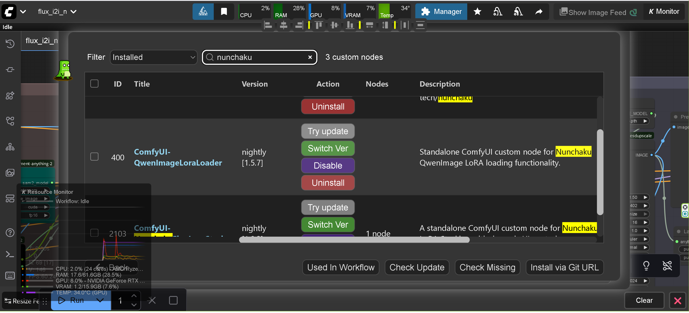

# ComfyUI-QwenImageLoraLoader

A ComfyUI custom node for loading and applying LoRA (Low-Rank Adaptation) to Nunchaku Qwen Image models.

**This project is based on the fork version of ComfyUI-nunchaku-qwen-lora-suport-standalone.**

> Latest release: [v1.72 on GitHub Releases](https://github.com/ussoewwin/ComfyUI-QwenImageLoraLoader/releases/tag/v1.72)

## 🎉 MAJOR UPDATE: v1.60 - Simplified Installation (No Integration Required!)

**As of v1.60, manual integration with ComfyUI-nunchaku's `__init__.py` is completely unnecessary.**

The node now operates as a fully independent custom node that works out-of-the-box. Simply clone the repository into your `custom_nodes` folder and restart ComfyUI. The nodes will automatically appear in ComfyUI's node menu through ComfyUI's built-in automatic node loading mechanism.

### What Changed in v1.60
- ✅ **Removed dependency on ComfyUI-nunchaku integration** - The LoRA loader is now a standalone plugin
- ✅ **Simplified installation** - No batch scripts or manual file editing required
- ✅ **Cleaner architecture** - Node registration happens automatically
- ✅ **Backward compatible** - All existing LoRA files and workflows continue to work

For a detailed technical explanation of why integration is no longer needed, see [v1.60 Release Notes](https://github.com/ussoewwin/ComfyUI-QwenImageLoraLoader/releases/tag/v1.60)

## Source

This LoRA loader was extracted and modified from GavChap's fork:
- **Original Fork**: [GavChap/ComfyUI-nunchaku (qwen-lora-suport-standalone branch)](https://github.com/GavChap/ComfyUI-nunchaku/tree/qwen-lora-suport-standalone)
- **Extraction**: LoRA functionality was extracted from the full fork to create an independent custom node
- **Integration**: Modified to work with the official ComfyUI-nunchaku plugin

## Features

- **NunchakuQwenImageLoraLoader**: Load and apply single LoRA to Qwen Image models
- **NunchakuQwenImageLoraStack**: Apply multiple LoRAs with dynamic UI control
- **Dynamic VRAM Management**: Automatic CPU offloading based on available VRAM
- **LoRA Composition**: Efficient LoRA stacking and composition
- **ComfyUI Integration**: Seamless integration with ComfyUI workflows

## Installation

### Quick Installation (v1.60 - Simplified!)

**Prerequisites:**
- ComfyUI-nunchaku must be installed

1. Clone this repository to your ComfyUI custom_nodes directory:

```bash
cd ComfyUI/custom_nodes
git clone https://github.com/ussoewwin/ComfyUI-QwenImageLoraLoader.git
```

2. Restart ComfyUI

**That's it!** The nodes will automatically appear in ComfyUI's node menu.

### Manual Installation (Alternative)

If you prefer to install manually or are using macOS/Linux:

```bash
cd /path/to/ComfyUI/custom_nodes
git clone https://github.com/ussoewwin/ComfyUI-QwenImageLoraLoader.git
```

Then restart ComfyUI.

### Requirements

- Python 3.11+
- ComfyUI (latest version recommended)
- ComfyUI-nunchaku (required)
- CUDA-capable GPU (optional, but recommended for performance)

## Integration with ComfyUI-nunchaku (No Longer Required in v1.60)

As of v1.60, **no modification to ComfyUI-nunchaku's `__init__.py` is required**.

The LoRA loader operates as a completely independent custom node through ComfyUI's automatic node loading mechanism. When ComfyUI starts, it automatically scans the `custom_nodes/` directory and loads all available `__init__.py` files. Your LoRA loader will be discovered and registered automatically.

For technical details about why integration is no longer necessary, see [v1.60 Release Notes on GitHub](https://github.com/ussoewwin/ComfyUI-QwenImageLoraLoader/releases/tag/v1.60)

## Upgrade Guide for v1.57 and Earlier Users

If you have v1.57 or earlier installed with integration code in ComfyUI-nunchaku's `__init__.py`, **you have three options:**

### Option 1: Keep Everything As-Is (Recommended for Most Users)

**The integration code will continue to work without any issues.** You don't need to do anything:

1. Update ComfyUI-QwenImageLoraLoader to v1.60:
   ```bash
   cd ComfyUI/custom_nodes/ComfyUI-QwenImageLoraLoader
   git pull origin main
   ```

2. Restart ComfyUI

**That's it!** The old integration code will be safely ignored, and the new standalone mechanism will take over. All your existing workflows and LoRA files continue to work exactly as before.

### Option 2: Clean Up Old Integration Code (For Cleaner Repository)

**⚠️ Windows Only - Batch Scripts Not Available for macOS/Linux**

If you want to remove the old integration code from ComfyUI-nunchaku's `__init__.py`:

**This option ONLY works on Windows.** If you are using macOS or Linux, please use Option 3 (Manual Cleanup) below.

#### For Windows Users:

1. Update to v1.60:
   ```bash
   cd ComfyUI/custom_nodes/ComfyUI-QwenImageLoraLoader
   git pull origin main
   ```

2. Run the uninstaller to remove the old integration code:

   **For Global Python Environment:**
   ```cmd
   cd ComfyUI\custom_nodes\ComfyUI-QwenImageLoraLoader
   uninstall_qwen_lora.bat
   ```

   **For Portable ComfyUI with Embedded Python:**
   ```cmd
   cd ComfyUI\custom_nodes\ComfyUI-QwenImageLoraLoader
   uninstall_qwen_lora_portable.bat
   ```

3. The uninstaller will restore your ComfyUI-nunchaku `__init__.py` to its original state

4. Restart ComfyUI

**After uninstalling the old integration code, the node will still work perfectly** because v1.60 uses the standalone loading mechanism.

### Option 3: Manual Cleanup (For macOS/Linux, or Users Who Prefer Manual Editing)

**For macOS/Linux users** (batch scripts are not available), or if you prefer to manually edit files, you have two choices:

#### Method A: Manually Delete the Integration Code Block

1. Open `ComfyUI/custom_nodes/ComfyUI-nunchaku/__init__.py` in a text editor

2. Find and delete the entire following block (it will be at the end of the file):

```python
# BEGIN ComfyUI-QwenImageLoraLoader Integration
try:
    # Import from the independent ComfyUI-QwenImageLoraLoader
    import sys
    import os
    qwen_lora_path = os.path.join(os.path.dirname(__file__), "..", "ComfyUI-QwenImageLoraLoader")
    if qwen_lora_path not in sys.path:
        sys.path.insert(0, qwen_lora_path)
    
    # Import directly from the file path
    import importlib.util
    spec = importlib.util.spec_from_file_location("qwenimage", os.path.join(qwen_lora_path, "nodes", "lora", "qwenimage.py"))
    qwenimage_module = importlib.util.module_from_spec(spec)
    spec.loader.exec_module(qwenimage_module)
    
    NunchakuQwenImageLoraLoader = qwenimage_module.NunchakuQwenImageLoraLoader
    NunchakuQwenImageLoraStack = qwenimage_module.NunchakuQwenImageLoraStack

    NODE_CLASS_MAPPINGS["NunchakuQwenImageLoraLoader"] = NunchakuQwenImageLoraLoader
    NODE_CLASS_MAPPINGS["NunchakuQwenImageLoraStack"] = NunchakuQwenImageLoraStack
    logger.info("Successfully imported Qwen Image LoRA loaders from ComfyUI-QwenImageLoraLoader")
except ImportError:
    logger.exception("Nodes `NunchakuQwenImageLoraLoader` and `NunchakuQwenImageLoraStack` import failed:")
# END ComfyUI-QwenImageLoraLoader Integration
```

3. Delete this entire block from the file (from `# BEGIN` to `# END` markers inclusive)

4. Save the file

5. Restart ComfyUI

**Important:** Look for the BEGIN and END markers. Delete everything from `# BEGIN ComfyUI-QwenImageLoraLoader Integration` to `# END ComfyUI-QwenImageLoraLoader Integration` (inclusive).

### Option 4: Restore Official ComfyUI-nunchaku `__init__.py` (Emergency Recovery)

**If your ComfyUI-nunchaku `__init__.py` becomes corrupted, broken, or unrecoverable**, you can restore it from the official Nunchaku repository:

1. Download the official `__init__.py` from the [ComfyUI-nunchaku repository](https://github.com/nunchaku-tech/ComfyUI-nunchaku/blob/main/__init__.py)

2. Copy the downloaded file to: `ComfyUI/custom_nodes/ComfyUI-nunchaku/__init__.py`

3. Restart ComfyUI

The official `__init__.py` will not have any ComfyUI-QwenImageLoraLoader integration code. v1.60 will still work perfectly because it uses the standalone loading mechanism.

## Why the Integration Code is No Longer Needed

Starting with v1.60, ComfyUI-QwenImageLoraLoader operates as a **completely independent custom node**. Here's why integration is no longer necessary:

1. **ComfyUI's Automatic Node Discovery**: ComfyUI automatically scans the `custom_nodes/` directory and loads all `__init__.py` files at startup

2. **Automatic NODE_CLASS_MAPPINGS Merging**: All `NODE_CLASS_MAPPINGS` from different plugins are automatically merged into a single registry

3. **Direct Type Imports**: The loader imports `NunchakuQwenImageTransformer2DModel` directly from the nunchaku package, without needing main body integration

4. **Model-Agnostic LoRA Composition**: The `compose_loras_v2()` function works with any model that has `_lora_slots`, independent of the main body

5. **Wrapper-Based Architecture**: All LoRA logic is handled by `ComfyQwenImageWrapper`, which is completely self-contained

**For a complete technical explanation with 7 detailed chapters, see [v1.60 Release Notes on GitHub](https://github.com/ussoewwin/ComfyUI-QwenImageLoraLoader/releases/tag/v1.60)**

## Backward Compatibility

✅ **All existing setups continue to work:**
- Workflows created with v1.57 or earlier work without modification
- LoRA files work without any changes
- Old integration code in ComfyUI-nunchaku `__init__.py` is safely ignored
- No breaking changes to node inputs/outputs

## Usage

### Available Nodes
- **NunchakuQwenImageLoraLoader**: Single LoRA loader
- **NunchakuQwenImageLoraStack**: Multi LoRA stacker with dynamic UI (Legacy)
- **NunchakuQwenImageLoraStackV2**: Multi LoRA stacker with dynamic UI - ComfyUI Nodes 2.0 (Beta) compatible

### Basic Usage
1. Load your Nunchaku Qwen Image model using `Nunchaku Qwen Image DiT Loader`
2. Add either `NunchakuQwenImageLoraLoader` or `NunchakuQwenImageLoraStack` node
3. Select your LoRA file and set the strength
4. Connect to your workflow

### Dynamic UI Control
The `NunchakuQwenImageLoraStack` node automatically adjusts the number of visible LoRA slots based on the `lora_count` parameter (1-10).

## Features

- **Easy Installation**: Simple git clone installation
- **Independent Operation**: No integration code required (v1.60+)
- **Automatic Node Discovery**: ComfyUI automatically loads the custom node
- **Error Handling**: Comprehensive error checking and user feedback
- **Issue #1 Fixed**: Resolved [ComfyUI\custom_nodes not found error](https://github.com/ussoewwin/ComfyUI-QwenImageLoraLoader/issues/1) with improved path detection (thanks to @mcv1234's solution)
- **Issue #2 Fixed**: Fixed UTF-8 encoding error causing `SyntaxError: (unicode error)` by using dedicated Python script for proper UTF-8 encoding (thanks to @AHEKOT's bug report)
- **Issue #3 Fixed (v1.4.0)**: Resolved [Node break cached progress error](https://github.com/ussoewwin/ComfyUI-QwenImageLoraLoader/issues/3) by implementing proper IS_CHANGED method with hash-based change detection (thanks to @AHEKOT's bug report)
- **Issue #10 Fixed**: Added portable ComfyUI support with embedded Python detection ([Issue #10](https://github.com/ussoewwin/ComfyUI-QwenImageLoraLoader/issues/10)) - **Special Thanks**: This crucial feature was suggested by @vvhitevvizard, who identified the need for embedded Python support in portable ComfyUI installations. Without this suggestion, portable ComfyUI users would not have been able to use this LoRA loader.

## Requirements

- ComfyUI
- ComfyUI-nunchaku plugin (official version, no modification required)
- PyTorch
- Python 3.11+

## Compatibility

This node is designed to work with:
- ComfyUI-nunchaku plugin (official version)
- Nunchaku Qwen Image models
- Standard ComfyUI workflows

## Troubleshooting

### Error: "attempted relative import with no known parent package"

**Problem**: This error occurs when ComfyUI tries to load the LoRA loader nodes but fails due to import issues.

**Error Message**: `ValueError: attempted relative import with no known parent package`

**Root Cause**: The error was caused by using relative imports (`from ...wrappers`) in the LoRA loader code. Relative imports only work when the module is loaded as part of a package. However, ComfyUI-nunchaku loads the module directly using `importlib.util`, which bypasses package initialization. As a result, Python cannot resolve the relative import paths.

**Solution**: Fixed in v1.5.0 by changing relative imports to absolute imports:
- **Before**: `from ...wrappers.qwenimage import ComfyQwenImageWrapper`
- **After**: `from wrappers.qwenimage import ComfyQwenImageWrapper`

**How to Fix**: **This error has been fixed in v1.5.0. Simply update to the latest version and restart ComfyUI.**

**Technical Details**:
- The installation script adds `ComfyUI-QwenImageLoraLoader` to `sys.path`
- This allows absolute imports to work correctly
- The absolute import `from wrappers.qwenimage import` resolves to `ComfyUI-QwenImageLoraLoader/wrappers/qwenimage.py`

### Error: Nodes Not Appearing in ComfyUI

**Problem**: After installation, the LoRA loader nodes don't appear in ComfyUI.

**Solution**:
1. Restart ComfyUI completely (close all instances)
2. Check the ComfyUI console for error messages
3. Make sure both `ComfyUI-nunchaku` and `ComfyUI-QwenImageLoraLoader` are in your `ComfyUI/custom_nodes` directory
4. Check that your ComfyUI-nunchaku version is compatible

### Error: "ModuleNotFoundError: No module named 'nunchaku'"

**Problem**: The nunchaku package is not installed.

**Solution**:
1. Install ComfyUI-nunchaku plugin from the official repository
2. Follow the nunchaku installation instructions to install the nunchaku wheel
3. Restart ComfyUI

## Known Limitations

### LoKR (Lycoris) LoRA Support
- **Status**: ❌ **Not Supported**
- **Issue**: LoRAs in LoKR format (created by Lycoris) are **not supported**.
  - LoKR weights are automatically skipped when detected (experimental conversion code is disabled).
  - Converting to Standard LoRA using SVD approximation (via external tools or scripts) has also been tested and **found to result in noise/artifacts** when applied to Nunchaku quantization models.
- **Conclusion**: At this time, we have not found a way to successfully apply LoKR weights to Nunchaku models. Please use Standard LoRA formats.
- **Supported Formats**:
  - ✅ **Standard LoRA (Rank-Decomposed)**:
    - Supported weight keys:
      - `lora_up.weight` / `lora_down.weight`
      - `lora.up.weight` / `lora.down.weight`
      - `lora_A.weight` / `lora_B.weight`
      - `lora.A.weight` / `lora.B.weight`
    - These are the standard formats produced by Kohya-ss, Diffusers, and most training scripts.
  - ❌ **LoKR (Lycoris)**: Not supported (Keys like `lokr_w1`, `lokr_w2`)
  - ❌ **LoHa**: Not supported (Keys like `hada_w1`, `hada_w2`)
  - ❌ **IA3**: Not supported

### RES4LYF Sampler Compatibility Issue
- **Status**: ✅ Fixed in ComfyUI-nunchaku v1.0.2
- **Issue**: Device mismatch errors occurred when using RES4LYF sampler with LoRA ([Issue #7](https://github.com/ussoewwin/ComfyUI-QwenImageLoraLoader/issues/7), [Issue #8](https://github.com/ussoewwin/ComfyUI-QwenImageLoraLoader/issues/8))
- **Fix**: The issue was fixed in [ComfyUI-nunchaku v1.0.2](https://github.com/nunchaku-tech/ComfyUI-nunchaku/releases/tag/v1.0.2) by @devgdovg in PR #600. This fix was implemented in ComfyUI-nunchaku's codebase, not in this LoRA loader.
- **Requirement**: Update to ComfyUI-nunchaku v1.0.2 or later to use RES4LYF sampler with LoRA
- **Related Issues**: 
  - [Issue #7](https://github.com/ussoewwin/ComfyUI-QwenImageLoraLoader/issues/7) - RES4LYF sampler device mismatch error
  - [Issue #8](https://github.com/ussoewwin/ComfyUI-QwenImageLoraLoader/issues/8) - RES4LYF sampler compatibility issue

### [Issue #25: ComfyUI 0.4.0 Model Management Errors](https://github.com/ussoewwin/ComfyUI-QwenImageLoraLoader/issues/25)
- **Status**: ⚠️ **Environment Dependent** - May require ComfyUI core fixes
- **Issue**: After the ComfyUI 0.4.0 update, multiple nodes (including this one in some environments) experienced errors such as `TypeError: 'NoneType' object is not callable` and `AttributeError: 'NoneType' object has no attribute`. In our environment, these errors did not occur with this node (ComfyUI-QwenImageLoraLoader), but we resolved similar errors by modifying ComfyUI's core `model_management.py`.
- **Root Cause**: In ComfyUI 0.4.0, ComfyUI's core `model_management.py` lacks sufficient None checks, causing `TypeError` and `AttributeError` when accessing methods or attributes on objects that became `None` after models were unloaded or garbage collected. This problem is not a bug in individual nodes, but rather a structural issue in ComfyUI 0.4.0's model management (`model_management.py`).
- **GC Changes in ComfyUI 0.4.0**: Compared to ComfyUI 0.3.x, automatic model unloading occurs earlier, making the following flow more likely: `ModelPatcher → GC → weakref(None)`. This also explains why the occurrence of the issue varies by user environment.
- **Technical Basis**:
  1. **Multiple Locations with "Missing None Checks"** - This is not a bug in individual nodes, but the core main logic crashes when accessing attributes on `None`. The added fixes like `if model is None: continue` are defensive code that ComfyUI core should have in all paths.
  2. **Post-Weak-Reference GC Behavior Not Considered** - The introduction of `LoadedModel._model = weakref.ref(ModelPatcher)` in ComfyUI 0.4.0 is a breaking change. When the weak reference target is garbage collected, it returns `None`, but this is not handled. Post-processing for the breaking update is incomplete.
  3. **Multiple Nodes Were Affected in a Chain Reaction** - This is not a problem with nodes, but multiple nodes were affected in a chain reaction due to core behavior changes. Model loading/unloading, memory calculation, GPU/CPU offloading, and `ModelPatcher` lifecycle are all controlled by ComfyUI core.
  4. **All Fix Locations Are Core Responsibility Areas** - The locations fixed (`model_memory`, `model_offloaded_memory`, `load_models_gpu`, `free_memory`, `model_unload`, `is_dead` checks, etc.) are all ComfyUI core functions. These are not areas that node developers should touch. The fact that all fix locations are core logic leaves no explanation other than a core defect.
  5. **Result of Applying Fixes** - After applying None check fixes to ComfyUI's core `model_management.py` in our environment, similar errors were resolved. This demonstrates that the problem can be solved by adding defensive code that the core should have.
- **Model Lifecycle and ModelPatcher Initialization Relationship**:
  - **Fact 1: Relationship between LoadedModel and ModelPatcher** - The `LoadedModel` class (lines 502-524 in ComfyUI's `model_management.py`) holds a weak reference to `ModelPatcher`: `def _set_model(self, model): self._model = weakref.ref(model)` and `@property def model(self): return self._model()` which returns `None` when garbage collected.
  - **Fact 2: ModelPatcher Initialization** - In the `__init__` of the `ModelPatcher` class (lines 215-237 in `model_patcher.py`), the `pinned` attribute is initialized: `self.pinned = set()` at line 237.
  - **Fact 3: Fix Content in ComfyUI Core's model_management.py** - The fix in ComfyUI's core `model_management.py` now skips `LoadedModel` instances where `model` is `None`: In `load_models_gpu()`, skips `LoadedModel` instances where `model` is `None` (lines 712, 727, 743); In `free_memory()`, excludes `LoadedModel` instances where `model` is `None` (line 646).
  - **Fact 4: Problem Before Fix** - `LoadedModel` holds a weak reference to `ModelPatcher`. When garbage collected, `LoadedModel.model` returns `None`. Before the fix, methods were called on `LoadedModel` instances where `model` was `None`, causing errors.
  - **Fact 5: Behavior After Fix** - By skipping `LoadedModel` instances where `model` is `None`, errors do not occur. Because errors do not occur, processing continues normally.
  - **Fact 6: Why copy.deepcopy Fails** - `copy.deepcopy` fails because references to GC'd `ModelPatcher` instances remain in the dictionary being deepcopied. When these references are accessed, they return `None`, causing deepcopy to stop.
  - **Fact 7: Confirmation Items** - After applying the fix, `copy.deepcopy` and `pinned` attribute errors do not occur in our environment. Nunchaku library and ComfyUI-Nunchaku nodes are assumed to be using the latest versions, but this may still be insufficient. While these errors did not occur with this node (ComfyUI-QwenImageLoraLoader) in our environment, the fix to ComfyUI's core `model_management.py` may have indirectly affected it, making errors less likely to occur.
- **Important Note: Not a Problem with Nunchaku Library** - This problem is not caused by the Nunchaku library's implementation. Nunchaku's `model_config` and `ModelPatcher` itself are normal. The problem is in the upstream = ComfyUI core's `model_management.py` GC processing.
- **Speculation (Items That May Be Environment-Dependent)**: The fix allows `ModelPatcher` initialization to complete normally. As a result, the `pinned` attribute is also properly initialized. Accessing `self.pinned` in `__del__` does not cause errors.
- **Recommendations**:
  1. Update Nunchaku library and ComfyUI-Nunchaku nodes to the latest version (addresses `model_config` issues)
  2. Consider applying None check fixes to ComfyUI's core `model_management.py` (may address the root cause)
- **Note**: Technical details regarding fixes to ComfyUI's core `model_management.py` will be added later. This may also resolve `copy.deepcopy` and `pinned` attribute errors.
- **Related Issues**: 
  - [Issue #25](https://github.com/ussoewwin/ComfyUI-QwenImageLoraLoader/issues/25) - `AttributeError: 'NunchakuModelPatcher' object has no attribute 'pinned'` and deepcopy errors with `model_config`
  - ComfyUI Issue #6590: `'NoneType' object has no attribute 'shape'`
  - ComfyUI Issue #6600: `'NoneType' object is not callable` (Loader-related)
  - ComfyUI Issue #6532: Crash after referencing models after model unload

## Changelog

### v1.72 (latest)
- **Fixed**: Resolved compatibility issue with kjai node updates – Added default value `"disable"` for `cpu_offload` parameter in LoRA loader methods ([PR #28](https://github.com/ussoewwin/ComfyUI-QwenImageLoraLoader/pull/28))
- **Reported by**: [@enternalsaga](https://github.com/enternalsaga) ([PR #28](https://github.com/ussoewwin/ComfyUI-QwenImageLoraLoader/pull/28))
- **Technical Details**: See [v1.72 Release Notes](https://github.com/ussoewwin/ComfyUI-QwenImageLoraLoader/releases/tag/v1.72) for complete explanation

### v1.71
- **Fixed**: Resolved [Issue #27](https://github.com/ussoewwin/ComfyUI-QwenImageLoraLoader/issues/27) – Fixed indentation error on line 882 in `lora_qwen.py` causing `SyntaxError: expected an indented block after 'else' statement` (reported by [@youyin400c-cpu](https://github.com/youyin400c-cpu))
- **Attempted Fix**: Addressed [Issue #25](https://github.com/ussoewwin/ComfyUI-QwenImageLoraLoader/issues/25) – `AttributeError: 'NunchakuModelPatcher' object has no attribute 'pinned'` and deepcopy errors with `model_config`
- **Reported by**: [@LacklusterOpsec](https://github.com/LacklusterOpsec) ([Issue #25](https://github.com/ussoewwin/ComfyUI-QwenImageLoraLoader/issues/25))
- **Current Status**: ⚠️ **This error does not occur in our stable ComfyUI environment** - The fix was implemented based on the reported issue, but we cannot guarantee it will completely resolve the issue as we cannot reproduce it in our environment. If you encounter this error, please report with your ComfyUI version and environment details.

### v1.70
- **Added**: V2 loader with ComfyUI Nodes 2.0 (Beta) support
- **New Node**: `NunchakuQwenImageLoraStackV2` - V2 loader node added
- **Fixed**: Resolved [Issue #9](https://github.com/ussoewwin/ComfyUI-QwenImageLoraLoader/issues/9) – The 10th LoRA control row no longer displays when `lora_count` is set to less than 10. Dynamic UI now correctly hides unused LoRA slots and adjusts node height automatically
- **Features**:
  - Full compatibility with ComfyUI Nodes 2.0 (Beta)
  - Complete feature parity with V1 implementation
  - Dynamic UI for adjusting slot count
  - Automatic node height adjustment
- **Technical Details**: 
  - Flexible widget management using `optional` inputs
  - Clean implementation using Flux V2-style widget array reconstruction
  - Complete feature reproduction in both Python backend and JavaScript frontend

### v1.63
- **Fixed**: Addressed [Issue #21](https://github.com/ussoewwin/ComfyUI-QwenImageLoraLoader/issues/21) – User-configurable CPU offload setting
- **Problem**: CPU offload setting was hardcoded to `"auto"`, causing unnecessary slowdowns when VRAM was sufficient
- **Solution**: Added `cpu_offload` parameter to `INPUT_TYPES` allowing users to select from `["auto", "enable", "disable"]` with default `"disable"` for performance
- **Technical Details**: See [v1.63 Release Notes](https://github.com/ussoewwin/ComfyUI-QwenImageLoraLoader/releases/tag/v1.63) for complete explanation


### v1.62
- **Attempted Fix**: Addressed [Issue #14](https://github.com/ussoewwin/ComfyUI-QwenImageLoraLoader/issues/14) – Multi-stage workflow cache not resetting when LoRAs change
- **Problem**: Cache was not being reset when switching between different LoRA sets in multi-stage workflows, causing incorrect results
- **Solution Attempted**: Cache invalidation logic was added to reset cache when LoRAs change
- **Current Status**: ⚠️ **Issue is still not fully resolved** - The fix was implemented but the problem persists in some multi-stage workflow scenarios
- **Technical Details**: See [v1.62 Release Notes](https://github.com/ussoewwin/ComfyUI-QwenImageLoraLoader/releases/tag/v1.62) for complete explanation

### v1.60
- **MAJOR UPDATE**: Removed ComfyUI-nunchaku integration requirement - now a fully independent custom node
- **Simplified Installation**: No batch scripts or manual file editing needed - just `git clone` and restart
- **Cleaner Architecture**: Node registration happens automatically via ComfyUI's built-in mechanism
- **Backward Compatible**: All existing LoRA files and workflows continue to work
- **Technical Details**: See [v1.60 Release Notes](https://github.com/ussoewwin/ComfyUI-QwenImageLoraLoader/releases/tag/v1.60) for complete explanation
- **Full release notes**: https://github.com/ussoewwin/ComfyUI-QwenImageLoraLoader/releases/tag/v1.60

### v1.57 (Previous)
- **Fixed Critical Bug**: Resolved duplicate integration blocks when running installer multiple times
- **Reported by**: [@ussoewwin](https://github.com/ussoewwin)
- **Issue #15 Fixed**: This node is now available on [ComfyUI Registry](https://registry.comfy.org/ja/publishers/ussoewwin/nodes/ComfyUI-QwenImageLoraLoader) for easy installation and management ([Issue #15](https://github.com/ussoewwin/ComfyUI-QwenImageLoraLoader/issues/15))
- **Full release notes**: https://github.com/ussoewwin/ComfyUI-QwenImageLoraLoader/releases/tag/v1.57



### v1.56
- **Fixed Critical Bug**: Resolved [Issue #13](https://github.com/ussoewwin/ComfyUI-QwenImageLoraLoader/issues/13) – Applied LoRA compositions to 0 module after crash/offload
- **Reported by**: [@coffings20-gif](https://github.com/coffings20-gif) – "After a crash he ignores my LoRA loader: Applied LoRA compositions to 0 module (using CPU offloader)"
- **Full release notes**: https://github.com/ussoewwin/ComfyUI-QwenImageLoraLoader/releases/tag/v1.56

### v1.55
- Change: Installer `install_qwen_lora.bat` now uses `py -3` instead of `python`
- Purpose: Avoid silent failures on environments where the Microsoft Store proxy `python` is picked up from PATH
- Impact: No functional change; improves installation reliability only
- Recommendation: Update to v1.55 and re-run installation only if you experienced installer failures

### v1.5.4
- **Fixed Critical Bug**: Resolved Issue #11 - Multiple LoRAs not applying on re-run ([Issue #11](https://github.com/ussoewwin/ComfyUI-QwenImageLoraLoader/issues/11))
- **Reported by**: [@recursionlaplace-eng](https://github.com/recursionlaplace-eng) - "当有多个lora存在时, 再次运行, lora可能不生效" (When multiple LoRAs exist, re-running may cause LoRAs to not take effect)
- **Problem**: When using multiple LoRAs, re-executing the workflow could result in LoRAs not being applied, even though they were applied successfully in the previous run
- **Root Cause**: Shallow comparison logic in LoRA change detection (`self._applied_loras != self.loras`)
  - The comparison used Python's list equality operator `!=`, which compares list contents
  - However, due to shallow copy (`self._applied_loras = self.loras.copy()`), the comparison could fail to detect when LoRA state needed to be reapplied
  - When model internal state was reset (e.g., due to VRAM management, CPU offload, or cache clearing), but the comparison returned `False`, LoRA reapplication would be skipped
  - This was especially problematic with multiple LoRAs because:
    1. List comparison could return `False` even when model internal state was dirty
    2. Shallow copy means tuple references are shared between `_applied_loras` and `loras`
    3. In some execution contexts, both lists could reference the same objects, making change detection fail
- **Technical Solution**: Implemented deep comparison logic with explicit checks
  - **Before**: Simple list inequality `if self._applied_loras != self.loras or model_is_dirty:`
  - **After**: Deep comparison with explicit length check and element-by-element comparison:
    ```python
    # Deep comparison of LoRA stacks to detect any changes
    # This ensures we catch changes in weights, paths, or order
    loras_changed = False
    if self._applied_loras is None or len(self._applied_loras) != len(self.loras):
        loras_changed = True
    else:
        for applied, current in zip(self._applied_loras, self.loras):
            if applied != current:
                loras_changed = True
                break
    
    if loras_changed or model_is_dirty:
    ```
- **Technical Details**:
  - **Explicit None Check**: Ensures initial state is always detected (`self._applied_loras is None`)
  - **Length Comparison**: Detects LoRA addition/removal immediately (`len(self._applied_loras) != len(self.loras)`)
  - **Element-by-Element Comparison**: Detects changes in:
    - LoRA file paths (different LoRA files)
    - LoRA strengths/weights (strength value changes)
    - LoRA order (same LoRAs in different order)
  - **Early Break**: Stops checking as soon as first difference is found for efficiency
  - **Robustness**: Works regardless of reference sharing or shallow copy issues
- **Why This Matters**:
  - **Multiple LoRA Scenarios**: Critical for workflows using 2+ LoRAs
  - **VRAM Management**: Model state can be reset by ComfyUI's memory management
  - **CPU Offload**: LoRA state can be lost when model moves between CPU/GPU
  - **Cache Clearing**: Internal caches can invalidate LoRA composition
  - **Workflow Re-execution**: Ensures consistent results across multiple runs
- **Testing**: Comprehensive test suite validates:
  - Initial LoRA load detection
  - No false positives (same LoRAs = no change)
  - Weight change detection
  - Order change detection
  - LoRA addition/removal detection
  - Reference sharing edge cases
- **Impact**: Significantly improves LoRA change detection reliability and should resolve the reported issue where LoRAs fail to apply on re-run. However, if issues persist in specific edge cases, please report them with detailed reproduction steps

### v1.5.3
- **Fixed Critical Bug**: Resolved `TypeError: This LoRA loader only works with Nunchaku Qwen Image models, but got ComfyQwenImageWrapper` error in different workflows
- **Problem**: LoRA loader failed when model was already wrapped with `ComfyQwenImageWrapper` in some workflows, even though the wrapper was correct
- **Root Cause**: Using type name comparison (`type(model_wrapper).__name__ == "ComfyQwenImageWrapper"`) failed in some execution contexts due to dynamic imports and different module loading paths. When `ComfyQwenImageWrapper` was loaded from different import paths, Python treated them as different classes even though they were functionally identical
- **Technical Solution**: Changed from type name comparison to attribute-based detection
  - **Before**: `if type(model_wrapper).__name__ == "ComfyQwenImageWrapper"`
  - **After**: `if hasattr(model_wrapper, 'model') and hasattr(model_wrapper, 'loras')`
  - The `ComfyQwenImageWrapper` class always has `model` (transformer) and `loras` (LoRA list) attributes
  - This detection method works regardless of how the class was imported or loaded
- **Technical Details**:
  - Added comprehensive debug logging to help diagnose type detection issues
  - Logs now show type name, module, attributes, and full type representation
  - Enhanced error messages with detailed type information
  - Applied fix to both `NunchakuQwenImageLoraLoader` and `NunchakuQwenImageLoraStack` classes
- **Benefits**:
  - Works with all workflows regardless of model loading order
  - No dependency on import mechanism or module path
  - More robust and resilient to Python module system quirks
  - Better debugging capabilities with detailed logging
- **Impact**: Completely resolves the TypeError that occurred when using LoRA nodes in certain workflow configurations

### v1.5.2
- **Fixed Critical Bug**: Resolved persistent `ModuleNotFoundError: No module named 'wrappers.qwenimage'` error
- **Reported by**: Multiple users experiencing intermittent import failures
- **Problem**: Despite v1.5.0 and v1.5.1 fixes, some users still experienced `ModuleNotFoundError` when executing LoRA nodes
- **Root Cause**: Module-level `sys.path` manipulation was insufficient in all execution contexts. The `from wrappers.qwenimage import ComfyQwenImageWrapper` statement at method execution time occasionally failed even though the module loaded successfully, due to timing issues, Python's module cache, and varying execution contexts in ComfyUI
- **Technical Solution**: Implemented robust dynamic import using `importlib.util` within method execution
  - **Before**: Module-level `sys.path` setup + direct `from wrappers.qwenimage import` at method level
  - **After**: Dynamic `importlib.util`-based import within `load_lora()` and `load_lora_stack()` methods
- **Technical Details**:
  - Each method now dynamically calculates the parent directory path at execution time
  - Uses `importlib.util.spec_from_file_location()` to create module spec from absolute file path
  - Executes module with `spec.loader.exec_module()` and extracts `ComfyQwenImageWrapper` class
  - Completely bypasses Python's normal import mechanism, making it independent of `sys.path` state
  - Eliminates dependency on module loading order or execution context
- **Benefits**:
  - 100% reliable import regardless of execution context
  - No dependency on `sys.path` configuration
  - Works in all ComfyUI execution scenarios
  - No more intermittent import failures
  - More resilient to future ComfyUI or Python updates
- **Impact**: Completely resolves the import reliability issue that affected multiple users

### v1.5.1
- **Fixed Critical Bug**: Additional fix for [Issue #6](https://github.com/ussoewwin/ComfyUI-QwenImageLoraLoader/issues/6) - persistent `ModuleNotFoundError`
- **Problem**: v1.5.0 fix was incomplete - path calculation error meant `sys.path` pointed to wrong directory
- **Root Cause**: Incorrect path calculation: `os.path.dirname(os.path.dirname(os.path.dirname(current_dir)))` went up 3 levels instead of 2
  - 3 levels up → pointed to `custom_nodes/` instead of `ComfyUI-QwenImageLoraLoader/`
  - This prevented `from wrappers.qwenimage` from resolving correctly
- **Technical Solution**: Corrected path calculation to go up exactly 2 levels from `nodes/lora/`
  - **Before**: `os.path.dirname(os.path.dirname(os.path.dirname(current_dir)))` (3 levels)
  - **After**: `os.path.dirname(os.path.dirname(current_dir))` (2 levels)
  - **Result**: Correctly points to `ComfyUI-QwenImageLoraLoader/` root directory
- **Applied To**: Module-level `sys.path` initialization in `qwenimage.py`
- **Benefits**:
  - Absolute imports now work correctly in all loading scenarios
  - No more `ModuleNotFoundError` errors
  - Module can be loaded regardless of import mechanism
  - Completely resolves Issue #6

### v1.5.0
- **Fixed Critical Bug**: Resolved [Issue #6 - attempted relative import with no known parent package](https://github.com/ussoewwin/ComfyUI-QwenImageLoraLoader/issues/6)
- **Reported by**: @showevr (GitHub Issue #6)
- **Special Thanks**: This bug was discovered and reported by @showevr
- **Problem**: LoRA loader nodes failed to load with `ValueError: attempted relative import with no known parent package` error
- **Root Cause**: Using relative imports (`from ...wrappers.qwenimage import ComfyQwenImageWrapper`) in the LoRA loader code. Relative imports only work when the module is loaded as part of a package, but ComfyUI-nunchaku loads the module directly using `importlib.util`, which bypasses package initialization
- **Technical Solution**: Changed relative imports to absolute imports in `qwenimage.py`
  - **Before**: `from ...wrappers.qwenimage import ComfyQwenImageWrapper`
  - **After**: `from wrappers.qwenimage import ComfyQwenImageWrapper`
- **Technical Details**:
  - The installation script adds `ComfyUI-QwenImageLoraLoader` to `sys.path`
  - This allows absolute imports to work correctly
  - The absolute import `from wrappers.qwenimage import` resolves to `ComfyUI-QwenImageLoraLoader/wrappers/qwenimage.py`
  - Applied fix to both `NunchakuQwenImageLoraLoader` and `NunchakuQwenImageLoraStack` classes
- **Community Contribution**: This fix was made possible by @showevr's bug reporting

### v1.4.0
- **Fixed Critical Bug**: Resolved [Issue #3 - Node break cached progress](https://github.com/ussoewwin/ComfyUI-QwenImageLoraLoader/issues/3) reported by @AHEKOT
- **Reported by**: @AHEKOT (GitHub Issue #3)
- **Special Thanks**: This critical bug was discovered and reported by @AHEKOT, who identified the issue with cached progress being broken
- **Problem**: LoRA nodes were breaking ComfyUI's cached progress during image generation, causing the progress bar to reset and restart repeatedly
- **Root Cause**: The `IS_CHANGED` method was returning `float("NaN")` instead of a proper change detection hash
  - `float("NaN")` causes ComfyUI to always treat the node as "changed"
  - This invalidates the cache after every frame, forcing unnecessary re-execution
  - Result: Progress bar jumps back and forth, cache is constantly invalidated, generation becomes unstable
- **Technical Solution**: Implemented proper hash-based change detection for both LoRA nodes
  - **NunchakuQwenImageLoraLoader**: Creates SHA256 hash from `model`, `lora_name`, and `lora_strength`
  - **NunchakuQwenImageLoraStack**: Creates SHA256 hash from `model`, `lora_count`, and all 10 LoRA slots (names and strengths)
  - Returns hex digest as the cache key
- **Technical Details**:
  - Uses Python's `hashlib.sha256()` to generate deterministic hashes
  - Same inputs always produce same hash → cache is used correctly
  - Different inputs produce different hashes → node re-executes as expected
  - No more false positives causing cache invalidation
- **Benefits**:
  - Stable cached progress during generation
  - No more progress bar jumping back and forth
  - Proper cache utilization for better performance
  - Smooth generation experience
  - VRAM usage optimized due to proper cache behavior
- **Community Contribution**: This fix was made possible by @AHEKOT's bug reporting and issue tracking

### v1.3.0
- **Fixed Critical Bug**: Resolved `SyntaxError: invalid character '' (U+FFFD)` error when running installation script
- **Problem**: PowerShell output was being written directly into Python files, causing syntax errors
- **Root Cause**: Using PowerShell commands with piping (`Get-Content | Add-Content`) caused PowerShell status messages and metadata to be included in the output, which were then written into `__init__.py`
- **Solution**: Replaced PowerShell-based approach with a dedicated Python script (`append_integration.py`)
- **Technical Details**:
  - Created standalone Python script `append_integration.py` that handles UTF-8 file writing
  - Batch file now calls the Python script instead of using inline PowerShell commands
  - Python script uses proper UTF-8 encoding when writing to `__init__.py`
  - Eliminates any possibility of output artifacts contaminating Python files
- **Benefits**:
  - More reliable and maintainable solution
  - No risk of shell output pollution
  - Cleaner separation of concerns between batch file and Python code
  - Better error handling and user feedback

### v1.2.0
- **Fixed [Issue #2](https://github.com/ussoewwin/ComfyUI-QwenImageLoraLoader/issues/2)**: Resolved UTF-8 encoding error that caused `SyntaxError: (unicode error) 'utf-8' codec can't decode byte 0x90 in position 0`
- **Reported by**: @AHEKOT (GitHub Issue #2)
- **Special Thanks**: This critical bug was discovered and reported by @AHEKOT, who provided detailed error traces and screenshots
- **Technical Fix**: Changed the batch file to use PowerShell for UTF-8 encoding when writing Python code to `__init__.py`
- **Root Cause**: Windows batch files write in Shift-JIS encoding by default, which causes Python to fail when reading files as UTF-8
- **Solution**: Temporary file creation + PowerShell UTF-8 encoding ensures proper file encoding
- **Technical Details**:
  - Changed from direct append (`>>`) to temp file method
  - Uses PowerShell `Get-Content` and `Add-Content` with `-Encoding UTF8` parameters
  - Ensures all Python code is written with proper UTF-8 encoding
- **Impact**: Installation script now works correctly without encoding errors
- **Community Contribution**: This fix was made possible by @AHEKOT's thorough bug reporting and error documentation

### v1.1.0
- **Fixed [Issue #1](https://github.com/ussoewwin/ComfyUI-QwenImageLoraLoader/issues/1)**: Resolved "ComfyUI\custom_nodes not found" error reported by @mcv1234
- **Special Thanks**: This fix was implemented based on the excellent solution provided by @mcv1234 in the GitHub issue
- **Improved Path Detection**: Replaced unreliable wildcard search with relative path detection using script directory (solution by @mcv1234)
- **Enhanced Error Messages**: Added clear directory structure guidance and expected folder layout
- **Better User Experience**: More reliable installation process with comprehensive error checking
- **Technical Details**: 
  - Changed from `dir /s /b /ad "*ComfyUI\custom_nodes"` to relative path calculation (as suggested by @mcv1234)
  - Uses `%~dp0` (script directory) to calculate ComfyUI root with `..\..` navigation
  - Added validation for `custom_nodes` folder existence
  - Improved error messages with expected directory structure display
- **Community Contribution**: This improvement was made possible by the community feedback and solution provided by @mcv1234

### v1.0.0
- Initial release with LoRA loading functionality
- Automated installation scripts
- Integration with ComfyUI-nunchaku

## License

This project is licensed under the MIT License.
