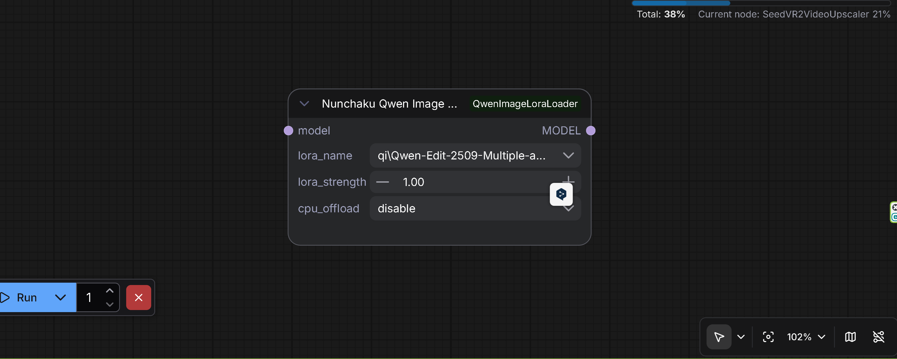
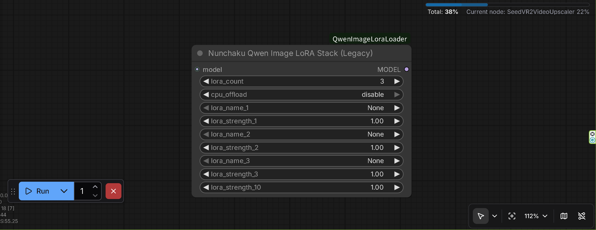
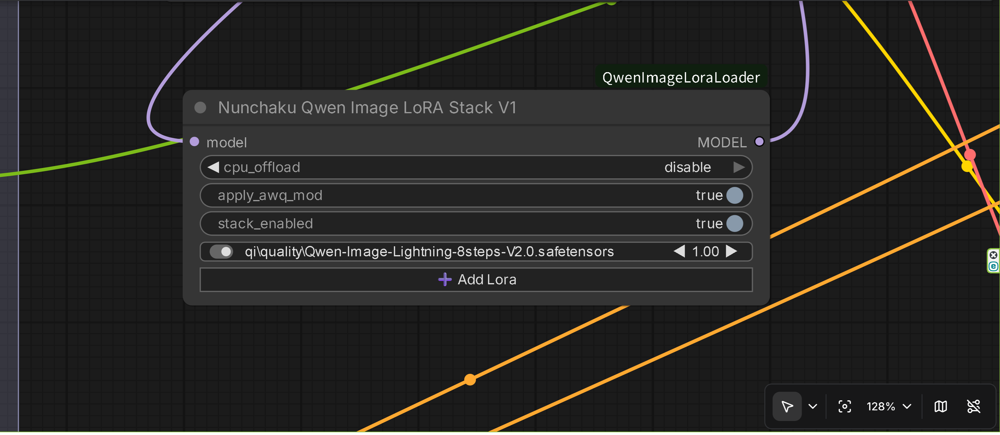
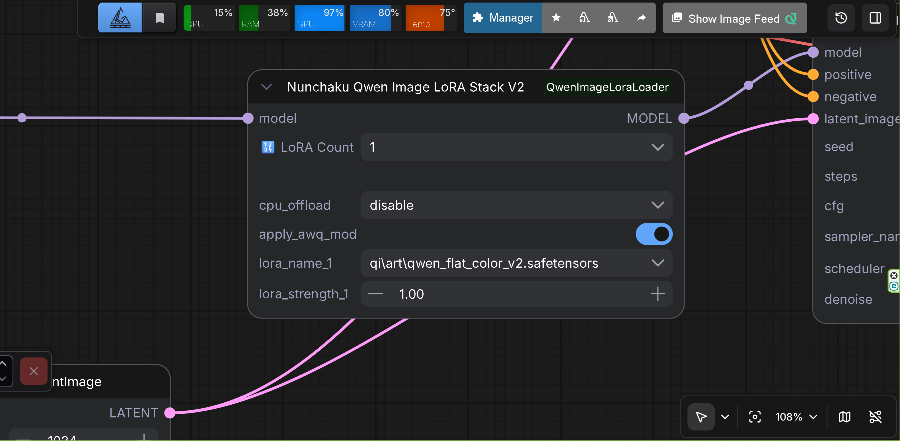
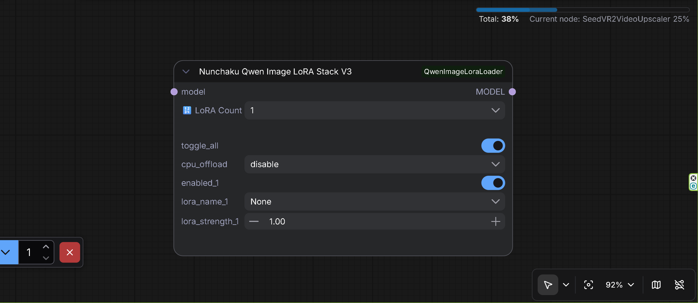

# ComfyUI-Nunchaku QwenImage＆ZImageTurboLoraStack

A ComfyUI custom node for loading and applying LoRA (Low-Rank Adaptation) to Nunchaku Qwen Image and Z-ImageTurbo models. ComfyUI Nodes 2.0 compatible. **Requires Nunchaku 1.2.0+ and ComfyUI-Nunchaku 1.2.0+ for v4 functionality.**

## ⚠️ **DEVELOPMENT STATUS**

**Currently under development and testing. Debug logs are being output extensively. This does not affect functionality.**

> Latest release: [v2.3.9 on GitHub Releases](https://github.com/ussoewwin/ComfyUI-QwenImageLoraLoader/releases/tag/v2.3.9)
> 

## Source

This LoRA loader was extracted and modified from GavChap's fork:
- **Original Fork**: [GavChap/ComfyUI-nunchaku (qwen-lora-suport-standalone branch)](https://github.com/GavChap/ComfyUI-nunchaku/tree/qwen-lora-suport-standalone)
- **Extraction**: LoRA functionality was extracted from the full fork to create an independent custom node
- **Integration**: Modified to work with the official ComfyUI-nunchaku plugin

## 🎉 MAJOR UPDATE: v2.2.0 - Nunchaku Z Image Turbo LoRA Support Added!

For detailed technical explanation, see [v2.2.0 Release Notes](https://github.com/ussoewwin/ComfyUI-QwenImageLoraLoader/releases/tag/v2.2.0)

## 🎉 MAJOR UPDATE: v1.60 - Simplified Installation (No Integration Required!)

For installation instructions, features, and requirements, see [Installation Guide](md/installation.md).

## Upgrade Guide for v1.57 and Earlier Users

If you have v1.57 or earlier installed with integration code in ComfyUI-nunchaku's `__init__.py`, see [UPGRADE_GUIDE_V1.57.md](md/UPGRADE_GUIDE_V1.57.md) for detailed upgrade instructions.

## Usage

### Debug logs (optional)

By default, detailed debug logs are **muted**. If you want detailed debug output (Key Diffusion / key mapping inspection, `[APPLY]`, `[AWQ_MOD]`, etc.), set the environment variable `nunchaku_log=1` before starting ComfyUI.

### Available Nodes

- **NunchakuQwenImageLoraLoader**: Single LoRA loader



- **NunchakuQwenImageLoraStack**: Multi LoRA stacker with dynamic UI (Legacy)



- **NunchakuQwenImageLoraStackV1**: Multi LoRA stacker with rgthree-style UI - ComfyUI Nodes 2.0 compatible
  - Clean, minimalist design inspired by [Power Lora Loader (rgthree-comfy)](https://github.com/rgthree/rgthree-comfy). Toggle, LoRA name, and strength per row.



- **NunchakuQwenImageLoraStackV2**: Multi LoRA stacker with dynamic UI - ComfyUI Nodes 2.0 (Beta) compatible
  - **AWQ Modulation Layer Support**: Includes experimental support for applying LoRA to AWQ quantized modulation layers (`img_mod.1` / `txt_mod.1`) via the "Apply AWQ Mod" toggle. This feature uses Runtime Monkey Patch with Manual Planar Injection to fix noise issues. ⚠️ **Warning**: **This is an experimental feature currently implemented only in V2 nodes.** If no issues are found, this feature will be applied to V1 and V3 nodes as well.



- **NunchakuQwenImageLoraStackV3**: Multi LoRA stacker with dynamic UI - ComfyUI Nodes 2.0 (Beta) compatible
  - **AWQ Modulation Layer Support**: AWQ quantized modulation layers (`img_mod.1` / `txt_mod.1`) LoRA application is **always enabled** (no switch needed). This feature uses Runtime Monkey Patch with Manual Planar Injection to fix noise issues. ✅ **V3 nodes always apply AWQ modulation layer LoRA by default.**



- **NunchakuZImageTurboLoraStackV4**: Z-Image-Turbo LoRA stacker with dynamic UI - Standard ComfyUI LoRA loader format (CLIP input/output) - ComfyUI Nodes 2.0 compatible


- **NunchakuZImageTurboLoraStackV2**: Z-Image-Turbo LoRA stacker with dynamic UI - **Unofficial loader only** - ComfyUI Nodes 2.0 compatible
  - ⚠️ **Warning**: This node is **only compatible with the unofficial Nunchaku Z-Image-Turbo DiT Loader** from [ComfyUI-nunchaku-unofficial-loader](https://github.com/ussoewwin/ComfyUI-nunchaku-unofficial-loader)
  - ⚠️ **Not Compatible**: This node is **not compatible** with the official Nunchaku Z-Image-Turbo DiT Loader from ComfyUI-Nunchaku

### Basic Usage

**For Nunchaku Qwen Image models:**
1. Load your Nunchaku Qwen Image model using `Nunchaku Qwen Image DiT Loader`
2. Add either `NunchakuQwenImageLoraLoader` or `NunchakuQwenImageLoraStack` node
3. Select your LoRA file and set the strength
4. Connect to your workflow

**For Nunchaku Z-Image-Turbo models:**
1. Load your Nunchaku Z-Image-Turbo model using `Nunchaku Z-Image DiT Loader` (official ComfyUI-Nunchaku)
2. Add `Nunchaku Z-Image-Turbo LoRA Stack V4` node
3. Connect CLIP input (required in v4)
4. Select your LoRA file and set the strength
5. Connect to your workflow

## Features

- **Easy Installation**: Simple git clone installation
- **Independent Operation**: No integration code required (v1.60+)
- **Automatic Node Discovery**: ComfyUI automatically loads the custom node
- **Error Handling**: Comprehensive error checking and user feedback
- **Issue #1 Fixed**: Resolved [ComfyUI\custom_nodes not found error](https://github.com/ussoewwin/ComfyUI-QwenImageLoraLoader/issues/1) with improved path detection (thanks to @mcv1234's solution)
- **Issue #2 Fixed**: Fixed UTF-8 encoding error causing `SyntaxError: (unicode error)` by using dedicated Python script for proper UTF-8 encoding (thanks to @AHEKOT's bug report)
- **Issue #3 Fixed (v1.4.0)**: Resolved [Node break cached progress error](https://github.com/ussoewwin/ComfyUI-QwenImageLoraLoader/issues/3) by implementing proper IS_CHANGED method with hash-based change detection (thanks to @AHEKOT's bug report)
- **Issue #10 Fixed**: Added portable ComfyUI support with embedded Python detection ([Issue #10](https://github.com/ussoewwin/ComfyUI-QwenImageLoraLoader/issues/10)) - **Special Thanks**: This crucial feature was suggested by @vvhitevvizard, who identified the need for embedded Python support in portable ComfyUI installations. Without this suggestion, portable ComfyUI users would not have been able to use this LoRA loader.
- **PR #48 Merged (v2.3.8)**: Improved PEFT format LoRA detection and added safety skip logs ([PR #48](https://github.com/ussoewwin/ComfyUI-QwenImageLoraLoader/pull/48)) - **Special Thanks**: We are deeply grateful to [@avan06](https://github.com/avan06) for identifying and fixing a critical mapping defect that caused PEFT format LoRAs to be incorrectly skipped. This fix significantly improves LoRA format compatibility and ensures proper detection of LoRA files created with Hugging Face PEFT library.

## Requirements

- ComfyUI
- ComfyUI-nunchaku plugin (official version, no modification required)
- PyTorch
- Python 3.11+

## Compatibility

This node is designed to work with:
- ComfyUI-nunchaku plugin (official version)
- Nunchaku Qwen Image models
- Standard ComfyUI workflows

## Troubleshooting

### Error: "ModuleNotFoundError: No module named 'nunchaku'"

**Problem**: The nunchaku package is not installed.

**Solution**:
1. Install ComfyUI-nunchaku plugin from the official repository
2. Follow the nunchaku installation instructions to install the nunchaku wheel
3. Restart ComfyUI

### Issue #25: ComfyUI 0.4.0+ Model Management Errors
- **Status**: ⚠️ **Environment Dependent** - May require ComfyUI core fixes

For detailed information, see [COMFYUI_0.4.0_MODEL_MANAGEMENT_ERRORS.md](md/COMFYUI_0.4.0_MODEL_MANAGEMENT_ERRORS.md).

- **Related Issues**: 
  - [Issue #25](https://github.com/ussoewwin/ComfyUI-QwenImageLoraLoader/issues/25) - `AttributeError: 'NunchakuModelPatcher' object has no attribute 'pinned'` and deepcopy errors with `model_config`
  - [Issue #33](https://github.com/ussoewwin/ComfyUI-QwenImageLoraLoader/issues/33) - `AttributeError: 'NoneType' object has no attribute 'to'` in `to_safely` method (Fixed in v2.1.0)
  - [ComfyUI Issue #6590](https://github.com/comfyanonymous/ComfyUI/issues/6590) - `'NoneType' object has no attribute 'shape'`
  - [ComfyUI Issue #6600](https://github.com/comfyanonymous/ComfyUI/issues/6600) - `'NoneType' object is not callable` (Loader-related)
  - [ComfyUI Issue #6532](https://github.com/comfyanonymous/ComfyUI/issues/6532) - Crash after referencing models after model unload

### Error: "No module named 'diffusers.models.transformers.transformer_z_image'"

**Problem**: This error occurs when using Qwen-Edit models or Z-Image-Turbo models with an outdated `diffusers` library version.

**Error Message**: `ModuleNotFoundError: No module named 'diffusers.models.transformers.transformer_z_image'`

**Root Cause**: The most likely cause is that the `diffusers` library version is too old and does not include the `transformer_z_image` module, which is required for Z-Image-Turbo model support. When ComfyUI-nunchaku's model loader tries to load Z-Image-Turbo models (or Qwen-Edit models that may be detected as Z-Image format), it attempts to import this module, but it doesn't exist in older `diffusers` versions. This module was added in a later version of `diffusers` to support Z-Image-Turbo models.

**Solution**: Update the `diffusers` library to the latest version:

**If using a virtual environment (venv):**
```bash
pip install --upgrade diffusers
```

**If using ComfyUI's embedded Python:**
```bash
ComfyUI\python_embeded\python.exe -m pip install --upgrade diffusers
```

**How to Verify**: After updating, restart ComfyUI and try loading your model again. The error should be resolved.

**Related Issues**: [Issue #38](https://github.com/ussoewwin/ComfyUI-QwenImageLoraLoader/issues/38), [Issue #40](https://github.com/ussoewwin/ComfyUI-QwenImageLoraLoader/issues/40)

## Known Limitations

### LoKR (Lycoris) LoRA Support
- **Status**: ❌ **Not Supported**
- **Issue**: LoRAs in LoKR format (created by Lycoris) are **not supported**.
  - **Important Note**: This limitation applies specifically to **Nunchaku quantization models**. LoKR format LoRAs may work with standard (non-quantized) Qwen Image models, but this node is designed for Nunchaku models only.
  - ⚠️ **Development History**: **We have spent considerable time analyzing the internal structure of LoKR format and performing extensive mapping tests. Despite these efforts, we have not been able to find a successful way to apply LoKR weights to Nunchaku quantization models.** The experimental conversion code has been tested but ultimately disabled due to incompatibility issues.
  - LoKR weights are automatically skipped when detected (experimental conversion code is disabled).
  - Converting to Standard LoRA using SVD approximation (via external tools or scripts) has also been tested and **found to result in noise/artifacts** when applied to Nunchaku quantization models.
- **Conclusion**: At this time, we have not found a way to successfully apply LoKR weights to Nunchaku models. Please use Standard LoRA formats.
- **Supported Formats**:
  - ✅ **Standard LoRA (Rank-Decomposed)**:
    - Supported weight keys:
      - `lora_up.weight` / `lora_down.weight`
      - `lora.up.weight` / `lora.down.weight`
      - `lora_A.weight` / `lora_B.weight`
      - `lora.A.weight` / `lora.B.weight`
    - These are the standard formats produced by Kohya-ss, Diffusers, and most training scripts.
  - ✅ **PEFT Format LoRA** (v2.3.8+):
    - Supported weight keys (examples):
      - `lora_A.default.weight` / `lora_B.default.weight`
      - `lora.up.default.weight` / `lora.down.default.weight`
    - Additional tags between `lora_A`/`lora_B` and `.weight` are supported (e.g. `.default`).
    - These formats are produced by the Hugging Face PEFT library. Support was added in v2.3.8 (PR #48).
  - ❌ **LoKR (Lycoris)**: Not supported (Keys like `lokr_w1`, `lokr_w2`)
  - ❌ **LoHa**: Not supported (Keys like `hada_w1`, `hada_w2`)
  - ❌ **IA3**: Not supported
- **Related Issues**: 
  - [Issue #29](https://github.com/ussoewwin/ComfyUI-QwenImageLoraLoader/issues/29) - LyCORIS / LoKr Qwen Image LoRA not recognized by ComfyUI
  - [Issue #44](https://github.com/ussoewwin/ComfyUI-QwenImageLoraLoader/issues/44) - [MISS] Module found but unsupported/missing proj_down/proj_up (performance slowdown issue fixed in v2.2.8)

### context_refiner and noise_refiner Layer Support
- **Status**: ❌ **Not Currently Supported**
- **Issue**: LoRA keys for `context_refiner` and `noise_refiner` layers are **not currently supported**. These are specialized layers used in Z-Image-Turbo models for refiner functionality.
- **Details**: 
  - ⚠️ **Testing Limitation**: We have not tested LoRAs that contain `context_refiner` and `noise_refiner` layers with actual models. The reason we cannot test them is that **we do not know which LoRAs are in this format**. If we can identify specific LoRAs that contain these layers, we can proceed with testing.
  - Without testing, we cannot determine if correct key mappings are possible for these layers. The current key mapping system does not include mappings for these layers, and they **will not work** at this time.
- **Conclusion**: Support for `context_refiner` and `noise_refiner` layers is not implemented because we have not been able to test LoRAs containing these layers. Even if we test them, it is unknown whether correct key mappings can be determined. Please use LoRAs that target the standard transformer layers only.
- **Related Issues**: 
  - [#41](https://github.com/ussoewwin/ComfyUI-QwenImageLoraLoader/issues/41) - 无法加载context_refiner和noise_refiner层的参数

### RES4LYF Sampler Compatibility Issue
- **Status**: ✅ Fixed in ComfyUI-nunchaku v1.0.2
- **Issue**: Device mismatch errors occurred when using RES4LYF sampler with LoRA ([Issue #7](https://github.com/ussoewwin/ComfyUI-QwenImageLoraLoader/issues/7), [Issue #8](https://github.com/ussoewwin/ComfyUI-QwenImageLoraLoader/issues/8))
- **Fix**: The issue was fixed in [ComfyUI-nunchaku v1.0.2](https://github.com/nunchaku-tech/ComfyUI-nunchaku/releases/tag/v1.0.2) by @devgdovg in PR #600. This fix was implemented in ComfyUI-nunchaku's codebase, not in this LoRA loader.
- **Requirement**: Update to ComfyUI-nunchaku v1.0.2 or later to use RES4LYF sampler with LoRA
- **Related Issues**: 
  - [Issue #7](https://github.com/ussoewwin/ComfyUI-QwenImageLoraLoader/issues/7) - RES4LYF sampler device mismatch error
  - [Issue #8](https://github.com/ussoewwin/ComfyUI-QwenImageLoraLoader/issues/8) - RES4LYF sampler compatibility issue

## Changelog

### v2.3.9
- **Added**: Key Diffusion (key analysis logging) - Added detailed key analysis logging to all Qwen Image LoRA nodes (Loader, Legacy Stack, V2 Stack, V3 Stack). When enabled via `nunchaku_log=1` environment variable, displays key mapping information (`Key: <original key> -> Mapped to: <mapped target> (Group: <group>)`) for debugging and verification purposes. This feature matches the functionality already available in Z-Image Turbo LoRA nodes. **Note**: Logs are muted by default and only displayed when `nunchaku_log=1` is set.
- **Technical Details**: See [v2.3.9 Release Notes](https://github.com/ussoewwin/ComfyUI-QwenImageLoraLoader/releases/tag/v2.3.9) for complete explanation

### v2.3.8
- **Fixed**: PEFT format LoRA detection - Fixed issue where LoRA files created with Hugging Face PEFT library (`.lora_A.default.weight` format) were incorrectly detected as "unsupported" and skipped. Changed pattern matching to support PEFT format while maintaining backward compatibility.
- **Added**: Warning log for skipped LoRA weights - Added logging to display which LoRA files had weights automatically skipped for AWQ modulation layers.
- **Merged**: [PR #48](https://github.com/ussoewwin/ComfyUI-QwenImageLoraLoader/pull/48) - feat(lora_qwen): improve format detection and add safety skip logs (proposed by [avan06](https://github.com/avan06))
- **Related Issues**: [Issue #44](https://github.com/ussoewwin/ComfyUI-QwenImageLoraLoader/issues/44) - Module resolution failures and unsupported LoRA format issues
- **Technical Details**: See [v2.3.8 Release Notes](RELEASE_NOTES/RELEASE_NOTES_V2.3.8.md) for complete explanation

### v2.3.7
- **Updated**: V3 nodes - AWQ modulation layer LoRA application is now **always enabled** (no switch needed). V3 nodes (`NunchakuQwenImageLoraStackV3`) automatically apply LoRA to AWQ quantized modulation layers (`img_mod.1` / `txt_mod.1`) without requiring the `apply_awq_mod` toggle that was needed in V2 nodes.
- **Reason**: After v2.3.6 implementation, no noise issues have been reported, so we determined it is safe to always enable AWQ modulation layer LoRA application in V3 nodes.
- **Note**: The `apply_awq_mod` switch in V2 nodes is **currently retained** for backward compatibility and user preference. V2 users can still manually control AWQ modulation layer LoRA application via the toggle.
- **Impact**: V3 users no longer need to manually enable the AWQ modulation layer toggle. The Manual Planar Injection fix is automatically applied for all LoRAs in V3 nodes.
- **Technical Details**: See [v2.3.7 Release Notes](RELEASE_NOTES/RELEASE_NOTES_V2.3.7.md) for complete explanation

### v2.3.6
- **Fixed**: AWQ modulation layer LoRA application - Implemented Runtime Monkey Patch with Manual Planar Injection to fix noise issues when applying LoRA to AWQ quantized modulation layers (`img_mod.1` / `txt_mod.1`). The fix uses a runtime patch to inject LoRA weights directly into the transformer block forward pass, bypassing layout/transpose issues.
- **Impact**: This fix enables all standard format LoRA keys that were previously excluded from AWQ modulation layers to be fully applied. Previously, these layers were skipped to prevent noise, but now they work correctly with the Manual Planar Injection approach.
- ⚠️ **Warning**: **This is an experimental feature currently implemented only in V2 nodes.** If no issues are found, this feature will be applied to V1 and V3 nodes as well.
- **Related Issues**: [Issue #44](https://github.com/ussoewwin/ComfyUI-QwenImageLoraLoader/issues/44) - Module resolution failures and unsupported LoRA format issues
- **Technical Details**: See [v2.3.6 Release Notes](RELEASE_NOTES/RELEASE_NOTES_V2.3.6.md) for complete explanation

### v2.3.5
- **Restored**: `NunchakuZImageTurboLoraStackV2` node registration has been restored
- ⚠️ **Important**: This node is **only compatible with the unofficial Nunchaku Z-Image-Turbo DiT Loader** provided by [ComfyUI-nunchaku-unofficial-loader](https://github.com/ussoewwin/ComfyUI-nunchaku-unofficial-loader)
- ⚠️ **Not Compatible**: This node is **not compatible** with the official Nunchaku Z-Image-Turbo DiT Loader from ComfyUI-Nunchaku

### v2.3.1 (latest)
- **Fixed**: Resolved [Issue #46](https://github.com/ussoewwin/ComfyUI-QwenImageLoraLoader/issues/46) – Fixed `NameError: name 'ZIMAGETURBO_V4_NAMES' is not defined` error that occurred when `zimageturbo_v4` module import failed. Initialized `ZIMAGETURBO_V4_NAMES`, `ZIMAGETURBO_V4_NODES`, `QWEN_V3_NAMES`, and `QWEN_V3_NODES` before the import block to prevent NameError on import failure.
- **Fixed**: Resolved [Issue #47](https://github.com/ussoewwin/ComfyUI-QwenImageLoraLoader/issues/47) – Added missing v4 files to Git repository (`nodes/lora/zimageturbo_v4.py`, `js/zimageturbo_lora_dynamic_v4.js`). These files were created but not committed to Git, causing `ModuleNotFoundError` in previous releases. The files are now included in the repository.

### v2.3.0
- **Removed**: Z-ImageTurbo Loader v3 registration - Removed from ComfyUI node registration
- **Updated**: Z-ImageTurbo Loader v4 - Conforms to standard ComfyUI LoRA loader format (CLIP input/output, no CPU offload parameter) while maintaining perfect mapping functionality
- **Removed**: Diffsynth ControlNet support - Removed `NunchakuQI&ZITDiffsynthControlnet` node registration and all related documentation. ComfyUI-Nunchaku now has native support for ZIT (Z-Image-Turbo) Diffsynth ControlNet, so this custom node is no longer needed.
- **Technical Details**: See [v2.3.0 Release Notes](https://github.com/ussoewwin/ComfyUI-QwenImageLoraLoader/releases/tag/v2.3.0) for complete explanation

### Previous Releases (v1.6.0 to v2.2.8)

For detailed release notes from v1.6.0 to v2.2.8, please see [RELEASE_NOTES_V1.6.0_TO_V2.2.8.md](RELEASE_NOTES/RELEASE_NOTES_V1.6.0_TO_V2.2.8.md).

This document contains comprehensive information about all bug fixes, features, and technical details for these versions of the project.

### Previous Releases (v1.0.0 to v1.57)

For detailed release notes from v1.0.0 to v1.57, please see [RELEASE_NOTES_V1.0.0_TO_V1.57.md](RELEASE_NOTES/RELEASE_NOTES_V1.0.0_TO_V1.57.md).

This document contains comprehensive information about all bug fixes, features, and technical details for earlier versions of the project.

## License

This project is licensed under the MIT License.
