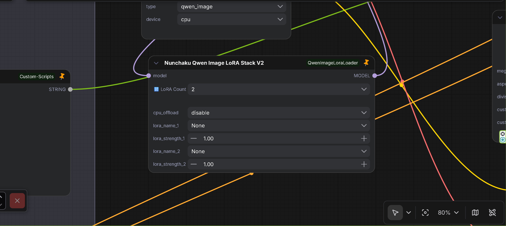
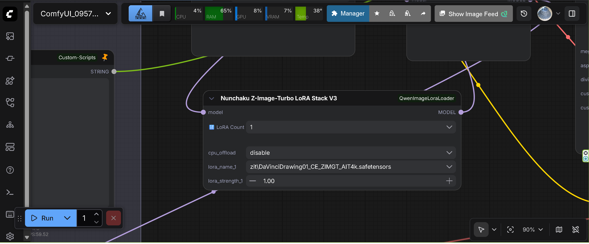
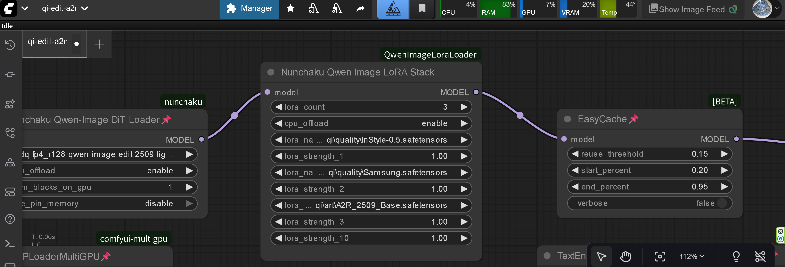

# ComfyUI-Nunchaku QwenImage＆ZImageTurboLoraStack

A ComfyUI custom node for loading and applying LoRA (Low-Rank Adaptation) to Nunchaku Qwen Image and Z-ImageTurbo models. ComfyUI Nodes 2.0 compatible.

## ⚠️ **DEVELOPMENT STATUS**

**Currently under development and testing. Debug logs are being output extensively. This does not affect functionality.**

> Latest release: [v2.3.1 on GitHub Releases](https://github.com/ussoewwin/ComfyUI-QwenImageLoraLoader/releases/tag/v2.3.1)
> 
> ⚠️ **Note for v2.0+ users**: If you encounter `TypeError: got multiple values for argument 'guidance'` errors, see [troubleshooting section](#issue-30-typeerror-got-multiple-values-for-argument-guidance-v20) below.

## Source

This LoRA loader was extracted and modified from GavChap's fork:
- **Original Fork**: [GavChap/ComfyUI-nunchaku (qwen-lora-suport-standalone branch)](https://github.com/GavChap/ComfyUI-nunchaku/tree/qwen-lora-suport-standalone)
- **Extraction**: LoRA functionality was extracted from the full fork to create an independent custom node
- **Integration**: Modified to work with the official ComfyUI-nunchaku plugin

## 🎉 MAJOR UPDATE: v2.2.0 - Nunchaku Z Image Turbo LoRA Support Added!

For detailed technical explanation, see [v2.2.0 Release Notes](https://github.com/ussoewwin/ComfyUI-QwenImageLoraLoader/releases/tag/v2.2.0)

## 🎉 MAJOR UPDATE: v1.60 - Simplified Installation (No Integration Required!)

For installation instructions, features, and requirements, see [Installation Guide](md/installation.md).

## Upgrade Guide for v1.57 and Earlier Users

If you have v1.57 or earlier installed with integration code in ComfyUI-nunchaku's `__init__.py`, see [UPGRADE_GUIDE_V1.57.md](md/UPGRADE_GUIDE_V1.57.md) for detailed upgrade instructions.

## Usage

### Available Nodes
- **NunchakuQwenImageLoraLoader**: Single LoRA loader
- **NunchakuQwenImageLoraStack**: Multi LoRA stacker with dynamic UI (Legacy)
- **NunchakuQwenImageLoraStackV2**: Multi LoRA stacker with dynamic UI - ComfyUI Nodes 2.0 (Beta) compatible
- **NunchakuQwenImageLoraStackV3**: Multi LoRA stacker with dynamic UI - ComfyUI Nodes 2.0 (Beta) compatible
- **NunchakuZImageTurboLoraStackV4**: Z-Image-Turbo LoRA stacker with dynamic UI - Standard ComfyUI LoRA loader format (CLIP input/output) - ComfyUI Nodes 2.0 compatible

### Basic Usage

**For Nunchaku Qwen Image models:**
1. Load your Nunchaku Qwen Image model using `Nunchaku Qwen Image DiT Loader`
2. Add either `NunchakuQwenImageLoraLoader` or `NunchakuQwenImageLoraStack` node
3. Select your LoRA file and set the strength
4. Connect to your workflow

**For Nunchaku Z-Image-Turbo models:**
1. Load your Nunchaku Z-Image-Turbo model using `Nunchaku Z-Image DiT Loader`
2. Add `Nunchaku Z-Image-Turbo LoRA Stack V4` node
3. Connect CLIP input (required in v4)
4. Select your LoRA file and set the strength
5. Connect to your workflow

### Dynamic UI Control




The `NunchakuQwenImageLoraStack` and `NunchakuZImageTurboLoraStackV3` nodes automatically adjust the number of visible LoRA slots based on the `lora_count` parameter (1-10).

## Features

- **Easy Installation**: Simple git clone installation
- **Independent Operation**: No integration code required (v1.60+)
- **Automatic Node Discovery**: ComfyUI automatically loads the custom node
- **Error Handling**: Comprehensive error checking and user feedback
- **Issue #1 Fixed**: Resolved [ComfyUI\custom_nodes not found error](https://github.com/ussoewwin/ComfyUI-QwenImageLoraLoader/issues/1) with improved path detection (thanks to @mcv1234's solution)
- **Issue #2 Fixed**: Fixed UTF-8 encoding error causing `SyntaxError: (unicode error)` by using dedicated Python script for proper UTF-8 encoding (thanks to @AHEKOT's bug report)
- **Issue #3 Fixed (v1.4.0)**: Resolved [Node break cached progress error](https://github.com/ussoewwin/ComfyUI-QwenImageLoraLoader/issues/3) by implementing proper IS_CHANGED method with hash-based change detection (thanks to @AHEKOT's bug report)
- **Issue #10 Fixed**: Added portable ComfyUI support with embedded Python detection ([Issue #10](https://github.com/ussoewwin/ComfyUI-QwenImageLoraLoader/issues/10)) - **Special Thanks**: This crucial feature was suggested by @vvhitevvizard, who identified the need for embedded Python support in portable ComfyUI installations. Without this suggestion, portable ComfyUI users would not have been able to use this LoRA loader.

## Requirements

- ComfyUI
- ComfyUI-nunchaku plugin (official version, no modification required)
- PyTorch
- Python 3.11+

## Compatibility

This node is designed to work with:
- ComfyUI-nunchaku plugin (official version)
- Nunchaku Qwen Image models
- Standard ComfyUI workflows

## Troubleshooting

### Error: "ModuleNotFoundError: No module named 'nunchaku'"

**Problem**: The nunchaku package is not installed.

**Solution**:
1. Install ComfyUI-nunchaku plugin from the official repository
2. Follow the nunchaku installation instructions to install the nunchaku wheel
3. Restart ComfyUI

### Issue #25: ComfyUI 0.4.0+ Model Management Errors
- **Status**: ⚠️ **Environment Dependent** - May require ComfyUI core fixes

For detailed information, see [COMFYUI_0.4.0_MODEL_MANAGEMENT_ERRORS.md](md/COMFYUI_0.4.0_MODEL_MANAGEMENT_ERRORS.md).

- **Related Issues**: 
  - [Issue #25](https://github.com/ussoewwin/ComfyUI-QwenImageLoraLoader/issues/25) - `AttributeError: 'NunchakuModelPatcher' object has no attribute 'pinned'` and deepcopy errors with `model_config`
  - [Issue #33](https://github.com/ussoewwin/ComfyUI-QwenImageLoraLoader/issues/33) - `AttributeError: 'NoneType' object has no attribute 'to'` in `to_safely` method (Fixed in v2.1.0)
  - [ComfyUI Issue #6590](https://github.com/comfyanonymous/ComfyUI/issues/6590) - `'NoneType' object has no attribute 'shape'`
  - [ComfyUI Issue #6600](https://github.com/comfyanonymous/ComfyUI/issues/6600) - `'NoneType' object is not callable` (Loader-related)
  - [ComfyUI Issue #6532](https://github.com/comfyanonymous/ComfyUI/issues/6532) - Crash after referencing models after model unload

### Issue #30: TypeError: got multiple values for argument 'guidance' (v2.0+)

- **Issue Link**: [Issue #30](https://github.com/ussoewwin/ComfyUI-QwenImageLoraLoader/issues/30)
- **Status**: ⚠️ **May Still Occur in Some Environments** - Even with v2.0.8 fixes
- **Issue**: `TypeError: got multiple values for argument 'guidance'` error may still occur in some user environments when using v2.0+ versions with diffsynth ControlNet support, despite multiple fixes applied from v2.0.2 to v2.0.8.
- **Root Cause**: v2.0+ versions include diffsynth ControlNet support, which requires complex argument handling between ComfyUI's scheduler patches, external patches (e.g., ComfyUI-EulerDiscreteScheduler), and the QwenImageTransformer2DModel.forward signature. Even with multiple layers of defense (exclusion logic in both `forward` and `_execute_model` methods), some edge cases in certain environments may still cause argument duplication.
- **Solution for Affected Users**: If you continue to experience `TypeError: got multiple values for argument 'guidance'` errors with v2.0+ versions even after updating to v2.0.8, please use **v1.72** instead, which does not include diffsynth ControlNet support and therefore avoids these argument passing complexities.
  - **v1.72 Release**: [v1.72 Release](https://github.com/ussoewwin/ComfyUI-QwenImageLoraLoader/releases/tag/v1.72)
  - **Note**: v1.72 is the latest v1.x release before v2.0+ diffsynth ControlNet support was added. If you don't need diffsynth ControlNet functionality, v1.72 provides stable LoRA loading without the argument passing complexities introduced in v2.0+.
- **Related Issues**: 
  - [Issue #32](https://github.com/ussoewwin/ComfyUI-QwenImageLoraLoader/issues/32) - `TypeError: got multiple values for argument 'guidance'` error when using LoRA with KSampler

### Error: "No module named 'diffusers.models.transformers.transformer_z_image'"

**Problem**: This error occurs when using Qwen-Edit models or Z-Image-Turbo models with an outdated `diffusers` library version.

**Error Message**: `ModuleNotFoundError: No module named 'diffusers.models.transformers.transformer_z_image'`

**Root Cause**: The most likely cause is that the `diffusers` library version is too old and does not include the `transformer_z_image` module, which is required for Z-Image-Turbo model support. When ComfyUI-nunchaku's model loader tries to load Z-Image-Turbo models (or Qwen-Edit models that may be detected as Z-Image format), it attempts to import this module, but it doesn't exist in older `diffusers` versions. This module was added in a later version of `diffusers` to support Z-Image-Turbo models.

**Solution**: Update the `diffusers` library to the latest version:

**If using a virtual environment (venv):**
```bash
pip install --upgrade diffusers
```

**If using ComfyUI's embedded Python:**
```bash
ComfyUI\python_embeded\python.exe -m pip install --upgrade diffusers
```

**How to Verify**: After updating, restart ComfyUI and try loading your model again. The error should be resolved.

**Related Issues**: [Issue #38](https://github.com/ussoewwin/ComfyUI-QwenImageLoraLoader/issues/38), [Issue #40](https://github.com/ussoewwin/ComfyUI-QwenImageLoraLoader/issues/40)

## Known Limitations

### LoKR (Lycoris) LoRA Support
- **Status**: ❌ **Not Supported**
- **Issue**: LoRAs in LoKR format (created by Lycoris) are **not supported**.
  - **Important Note**: This limitation applies specifically to **Nunchaku quantization models**. LoKR format LoRAs may work with standard (non-quantized) Qwen Image models, but this node is designed for Nunchaku models only.
  - ⚠️ **Development History**: **We have spent considerable time analyzing the internal structure of LoKR format and performing extensive mapping tests. Despite these efforts, we have not been able to find a successful way to apply LoKR weights to Nunchaku quantization models.** The experimental conversion code has been tested but ultimately disabled due to incompatibility issues.
  - LoKR weights are automatically skipped when detected (experimental conversion code is disabled).
  - Converting to Standard LoRA using SVD approximation (via external tools or scripts) has also been tested and **found to result in noise/artifacts** when applied to Nunchaku quantization models.
- **Conclusion**: At this time, we have not found a way to successfully apply LoKR weights to Nunchaku models. Please use Standard LoRA formats.
- **Supported Formats**:
  - ✅ **Standard LoRA (Rank-Decomposed)**:
    - Supported weight keys:
      - `lora_up.weight` / `lora_down.weight`
      - `lora.up.weight` / `lora.down.weight`
      - `lora_A.weight` / `lora_B.weight`
      - `lora.A.weight` / `lora.B.weight`
    - These are the standard formats produced by Kohya-ss, Diffusers, and most training scripts.
  - ❌ **LoKR (Lycoris)**: Not supported (Keys like `lokr_w1`, `lokr_w2`)
  - ❌ **LoHa**: Not supported (Keys like `hada_w1`, `hada_w2`)
  - ❌ **IA3**: Not supported
- **Related Issues**: 
  - [Issue #29](https://github.com/ussoewwin/ComfyUI-QwenImageLoraLoader/issues/29) - LyCORIS / LoKr Qwen Image LoRA not recognized by ComfyUI
  - [Issue #44](https://github.com/ussoewwin/ComfyUI-QwenImageLoraLoader/issues/44) - [MISS] Module found but unsupported/missing proj_down/proj_up (performance slowdown issue fixed in v2.2.8)

### context_refiner and noise_refiner Layer Support
- **Status**: ❌ **Not Currently Supported**
- **Issue**: LoRA keys for `context_refiner` and `noise_refiner` layers are **not currently supported**. These are specialized layers used in Z-Image-Turbo models for refiner functionality.
- **Details**: 
  - ⚠️ **Testing Limitation**: We have not tested LoRAs that contain `context_refiner` and `noise_refiner` layers with actual models. The reason we cannot test them is that **we do not know which LoRAs are in this format**. If we can identify specific LoRAs that contain these layers, we can proceed with testing.
  - Without testing, we cannot determine if correct key mappings are possible for these layers. The current key mapping system does not include mappings for these layers, and they **will not work** at this time.
- **Conclusion**: Support for `context_refiner` and `noise_refiner` layers is not implemented because we have not been able to test LoRAs containing these layers. Even if we test them, it is unknown whether correct key mappings can be determined. Please use LoRAs that target the standard transformer layers only.
- **Related Issues**: 
  - [#41](https://github.com/ussoewwin/ComfyUI-QwenImageLoraLoader/issues/41) - 无法加载context_refiner和noise_refiner层的参数

### RES4LYF Sampler Compatibility Issue
- **Status**: ✅ Fixed in ComfyUI-nunchaku v1.0.2
- **Issue**: Device mismatch errors occurred when using RES4LYF sampler with LoRA ([Issue #7](https://github.com/ussoewwin/ComfyUI-QwenImageLoraLoader/issues/7), [Issue #8](https://github.com/ussoewwin/ComfyUI-QwenImageLoraLoader/issues/8))
- **Fix**: The issue was fixed in [ComfyUI-nunchaku v1.0.2](https://github.com/nunchaku-tech/ComfyUI-nunchaku/releases/tag/v1.0.2) by @devgdovg in PR #600. This fix was implemented in ComfyUI-nunchaku's codebase, not in this LoRA loader.
- **Requirement**: Update to ComfyUI-nunchaku v1.0.2 or later to use RES4LYF sampler with LoRA
- **Related Issues**: 
  - [Issue #7](https://github.com/ussoewwin/ComfyUI-QwenImageLoraLoader/issues/7) - RES4LYF sampler device mismatch error
  - [Issue #8](https://github.com/ussoewwin/ComfyUI-QwenImageLoraLoader/issues/8) - RES4LYF sampler compatibility issue

## Changelog

### v2.3.1 (latest)
- **Fixed**: Resolved [Issue #46](https://github.com/ussoewwin/ComfyUI-QwenImageLoraLoader/issues/46) – Fixed `NameError: name 'ZIMAGETURBO_V4_NAMES' is not defined` error that occurred when `zimageturbo_v4` module import failed. Initialized `ZIMAGETURBO_V4_NAMES`, `ZIMAGETURBO_V4_NODES`, `QWEN_V3_NAMES`, and `QWEN_V3_NODES` before the import block to prevent NameError on import failure.
- **Fixed**: Resolved [Issue #47](https://github.com/ussoewwin/ComfyUI-QwenImageLoraLoader/issues/47) – Added missing v4 files to Git repository (`nodes/lora/zimageturbo_v4.py`, `js/zimageturbo_lora_dynamic_v4.js`). These files were created but not committed to Git, causing `ModuleNotFoundError` in previous releases. The files are now included in the repository.

### v2.3.0
- **Removed**: Z-ImageTurbo Loader v3 registration - Removed from ComfyUI node registration
- **Updated**: Z-ImageTurbo Loader v4 - Conforms to standard ComfyUI LoRA loader format (CLIP input/output, no CPU offload parameter) while maintaining perfect mapping functionality
- **Removed**: Diffsynth ControlNet support - Removed `NunchakuQI&ZITDiffsynthControlnet` node registration and all related documentation. ComfyUI-Nunchaku now has native support for ZIT (Z-Image-Turbo) Diffsynth ControlNet, so this custom node is no longer needed.
- **Technical Details**: See [v2.3.0 Release Notes](https://github.com/ussoewwin/ComfyUI-QwenImageLoraLoader/releases/tag/v2.3.0) for complete explanation

### v2.2.8
- **Fixed**: Resolved [Issue #44](https://github.com/ussoewwin/ComfyUI-QwenImageLoraLoader/issues/44) – Fixed performance slowdown issue when loading unsupported LoRA formats (LoKR, LoHa, IA3, etc.). Unsupported formats are now detected early and detailed key inspection is skipped to prevent console slowdown. Retry logic is also skipped for unsupported formats to prevent duplicate logging
- **Technical Details**: See [v2.2.8 Release Notes](https://github.com/ussoewwin/ComfyUI-QwenImageLoraLoader/releases/tag/v2.2.8) for complete explanation

### v2.2.7
- **Performance**: LoRA loading speed improvement - Implemented optimization by eliminating duplicate file reads. The first LoRA file loaded for debug logging is now cached and reused in actual processing, eliminating duplicate file I/O and deserialization operations
- **Technical Details**: See [v2.2.7 Release Notes](https://github.com/ussoewwin/ComfyUI-QwenImageLoraLoader/releases/tag/v2.2.7) for complete explanation
- **Acknowledgments**: 本次性能改进参考了知乎（zhihu.com）上 Jimmy 先生发表的文章《【closerAI ComfyUI】nunchaku V1.1 支持 z-image + 支持 zimage-LoRA 的修复方案，短板一次性补全，nunchaku zimage 全面高速生图解决方案！》。虽然本项目采用的实现方案在具体设计与实现细节上可能与 Jimmy 先生的方案有所不同，但该文章促使我重新审视 LoRA 加载流程中的性能瓶颈，并意识到在速度优化方面仍然存在改进空间。借此机会，谨向 Jimmy 先生表示诚挚的感谢。

### v2.2.6
- **Fixed**: Resolved [Issue #43](https://github.com/ussoewwin/ComfyUI-QwenImageLoraLoader/issues/43) – Fixed `TypeError: QwenTimestepProjEmbeddings.forward() takes 3 positional arguments but 4 were given` error by forcing `guidance=None` after converting to `additional_t_cond` to prevent ComfyUI-nunchaku's buggy code path from executing
- **Technical Details**: See [v2.2.6 Release Notes](https://github.com/ussoewwin/ComfyUI-QwenImageLoraLoader/releases/tag/v2.2.6) for complete explanation

### v2.2.5
- **Fixed**: Repository recovery - All updates after v2.0.8 were completely broken, and recovery work has been performed to restore all functionality. Related to [Issue #39](https://github.com/ussoewwin/ComfyUI-QwenImageLoraLoader/releases/tag/v2.2.5).
- **Recovery Details**: Restored all deleted files (images/, nodes/, wrappers/, nunchaku_code/, js/, md/, LICENSE, pyproject.toml) from local backups
- **Feature Verification**: Verified and restored all features from v2.0.8 through v2.2.4 (NextDiT support, AWQ skip logic, toggle buttons, LoRA format detection)
- **Fixed**: Issue #42 - Fixed toggle button logic in `NunchakuQwenImageLoraStackV3` and `NunchakuZImageTurboLoraStackV3` nodes. Individual LoRAs can now be enabled even when `toggle_all` is `False`. ([Issue #42](https://github.com/ussoewwin/ComfyUI-QwenImageLoraLoader/issues/42))
- **Technical Details**: See [v2.2.5 Release Notes](https://github.com/ussoewwin/ComfyUI-QwenImageLoraLoader/releases/tag/v2.2.5) for complete explanation

### v2.2.4
- **Added**: AWQ modulation layer detection and skip logic - `img_mod.1` and `txt_mod.1` layers are detected and LoRA application is skipped by default to prevent noise. Can be overridden with `QWENIMAGE_LORA_APPLY_AWQ_MOD=1` environment variable.
- **Removed**: `NunchakuZImageTurboLoraStackV2` node registration has been removed from ComfyUI node list to avoid confusion when using official Nunchaku Z-Image loader. The node file remains in the repository but is no longer registered. Users of the official loader should use `NunchakuZImageTurboLoraStackV3` instead. ([Issue #37](https://github.com/ussoewwin/ComfyUI-QwenImageLoraLoader/issues/37))
- **Technical Details**: See [v2.2.4 Release Notes](https://github.com/ussoewwin/ComfyUI-QwenImageLoraLoader/releases/tag/v2.2.4) for complete explanation

### v2.2.3
- **Added**: Toggle buttons to enable/disable individual LoRA slots and all LoRAs at once. Resolved [Issue #12](https://github.com/ussoewwin/ComfyUI-QwenImageLoraLoader/issues/12) and [Issue #36](https://github.com/ussoewwin/ComfyUI-QwenImageLoraLoader/issues/36)
- ⚠️ **DEVELOPMENT STATUS**: These features are currently experimental implementations for the `NunchakuQwenImageLoraStackV3` and `NunchakuZImageTurboLoraStackV3` nodes. ComfyUI Nodes 2.0 environment only. With current technical capabilities, it is not possible to fully implement all requested features in JavaScript.
- **Technical Details**: See [v2.2.3 Release Notes](https://github.com/ussoewwin/ComfyUI-QwenImageLoraLoader/releases/tag/v2.2.3) for complete explanation

### v2.2.2
- **Added**: Diffsynth ControlNet support for Nunchaku Z-ImageTurbo models
- **Technical Details**: See [v2.2.2 Release Notes](https://github.com/ussoewwin/ComfyUI-QwenImageLoraLoader/releases/tag/v2.2.2)for complete explanation

### v2.2.0
- **Added**: NunchakuZImageTurboLoraStackV3 node – Z-Image-Turbo LoRA stacker with dynamic UI for official Nunchaku Z-Image loader
- **Technical Details**: See [v2.2.0 Release Notes](https://github.com/ussoewwin/ComfyUI-QwenImageLoraLoader/releases/tag/v2.2.0) for complete explanation

### v2.1.1
- **Fixed**: ComfyUI v0.6.0+ compatibility – Migrated from `guidance` to `additional_t_cond` parameter in `_execute_model` method to support ComfyUI v0.6.0+ API changes ([PR #34](https://github.com/ussoewwin/ComfyUI-QwenImageLoraLoader/pull/34))
- **Technical Details**: See [v2.1.1 Release Notes](https://github.com/ussoewwin/ComfyUI-QwenImageLoraLoader/releases/tag/v2.1.1) for complete explanation

### v2.1.0
- **Fixed**: Resolved [Issue #33](https://github.com/ussoewwin/ComfyUI-QwenImageLoraLoader/issues/33) – Fixed `AttributeError: 'NoneType' object has no attribute 'to'` by adding None checks to `to_safely` and `forward` methods in `ComfyQwenImageWrapper`
- **Technical Details**: See [v2.1.0 Release Notes](https://github.com/ussoewwin/ComfyUI-QwenImageLoraLoader/releases/tag/v2.1.0) for complete explanation

### v2.0.2 - v2.0.8
- **v2.0.8 Fixed**: Resolved [Issue #30](https://github.com/ussoewwin/ComfyUI-QwenImageLoraLoader/issues/30) – Fixed `TypeError: got multiple values for argument 'guidance'` error by adding final cleanup of kwargs before calling model forward
  - **Technical Details**: See [v2.0.8 Release Notes](https://github.com/ussoewwin/ComfyUI-QwenImageLoraLoader/releases/tag/v2.0.8) for complete explanation
- **v2.0.7 Fixed**: Enhanced [Issue #32](https://github.com/ussoewwin/ComfyUI-QwenImageLoraLoader/issues/32) fix by adding exclusion processing in `forward` method in addition to `_execute_model` method to prevent duplicate argument errors
  - **Technical Details**: See [v2.0.7 Release Notes](https://github.com/ussoewwin/ComfyUI-QwenImageLoraLoader/releases/tag/v2.0.7) for complete explanation
- **v2.0.6 Fixed**: Excluded `ref_latents`, `transformer_options`, and `attention_mask` from kwargs to prevent duplicate argument errors
  - **Technical Details**: See [v2.0.6 Release Notes](https://github.com/ussoewwin/ComfyUI-QwenImageLoraLoader/releases/tag/v2.0.6) for complete explanation
- **v2.0.5 Fixed**: Resolved [Issue #32](https://github.com/ussoewwin/ComfyUI-QwenImageLoraLoader/issues/32) – Fixed `TypeError: got multiple values for argument 'guidance'` error by passing guidance as positional argument to match QwenImageTransformer2DModel.forward signature
  - **Technical Details**: See [v2.0.5 Release Notes](https://github.com/ussoewwin/ComfyUI-QwenImageLoraLoader/releases/tag/v2.0.5) for complete explanation
- **v2.0.4 Fixed**: Resolved [Issue #32](https://github.com/ussoewwin/ComfyUI-QwenImageLoraLoader/issues/32) – Fixed `TypeError: got multiple values for argument 'guidance'` error by removing guidance from transformer_options
  - **Technical Details**: See [v2.0.4 Release Notes](https://github.com/ussoewwin/ComfyUI-QwenImageLoraLoader/releases/tag/v2.0.4) for complete explanation
- **v2.0.3 Fixed**: Resolved [Issue #31](https://github.com/ussoewwin/ComfyUI-QwenImageLoraLoader/issues/31) – Fixed nodes not appearing when `comfy.ldm.lumina.controlnet` module is unavailable
  - **Technical Details**: See [v2.0.3 Release Notes](https://github.com/ussoewwin/ComfyUI-QwenImageLoraLoader/releases/tag/v2.0.3) for complete explanation
- **v2.0.2 Fixed**: Resolved [Issue #30](https://github.com/ussoewwin/ComfyUI-QwenImageLoraLoader/issues/30) and [Issue #32](https://github.com/ussoewwin/ComfyUI-QwenImageLoraLoader/issues/32) – Fixed `TypeError: got multiple values for argument 'guidance'` error when using LoRA with KSampler
  - **Technical Details**: See [v2.0.2 Release Notes](https://github.com/ussoewwin/ComfyUI-QwenImageLoraLoader/releases/tag/v2.0.2) for complete explanation

### v2.0
- **MAJOR UPDATE**: Added diffsynth ControlNet support for Nunchaku Qwen Image models
- **New Node**: `NunchakuQI&ZITDiffsynthControlnet` - Enables diffsynth ControlNet to work with Nunchaku quantized Qwen Image models, Z Image Turbo BF16.safetensors, and Nunchaku Z Image Turbo models
- **Features**: 
  - Full diffsynth ControlNet functionality for Nunchaku Qwen Image models
  - Automatic patch registration and application
- **Technical Details**: See [v2.0 Release Notes](https://github.com/ussoewwin/ComfyUI-QwenImageLoraLoader/releases/tag/v2.0) for complete explanation

### v1.72
- **Fixed**: Resolved compatibility issue with kjai node updates – Added default value `"disable"` for `cpu_offload` parameter in LoRA loader methods ([PR #28](https://github.com/ussoewwin/ComfyUI-QwenImageLoraLoader/pull/28))
- **Reported by**: [@enternalsaga](https://github.com/enternalsaga) ([PR #28](https://github.com/ussoewwin/ComfyUI-QwenImageLoraLoader/pull/28))
- **Technical Details**: See [v1.72 Release Notes](https://github.com/ussoewwin/ComfyUI-QwenImageLoraLoader/releases/tag/v1.72) for complete explanation

### v1.71
- **Fixed**: Resolved [Issue #27](https://github.com/ussoewwin/ComfyUI-QwenImageLoraLoader/issues/27) – Fixed indentation error on line 882 in `lora_qwen.py` causing `SyntaxError: expected an indented block after 'else' statement` (reported by [@youyin400c-cpu](https://github.com/youyin400c-cpu))
- **Attempted Fix**: Addressed [Issue #25](https://github.com/ussoewwin/ComfyUI-QwenImageLoraLoader/issues/25) – `AttributeError: 'NunchakuModelPatcher' object has no attribute 'pinned'` and deepcopy errors with `model_config`
- **Reported by**: [@LacklusterOpsec](https://github.com/LacklusterOpsec) ([Issue #25](https://github.com/ussoewwin/ComfyUI-QwenImageLoraLoader/issues/25))
- **Current Status**: ⚠️ **This error does not occur in our stable ComfyUI environment** - The fix was implemented based on the reported issue, but we cannot guarantee it will completely resolve the issue as we cannot reproduce it in our environment. If you encounter this error, please report with your ComfyUI version and environment details.
- **Technical Details**: See [v1.71 Release Notes](https://github.com/ussoewwin/ComfyUI-QwenImageLoraLoader/releases/tag/v1.71) for complete explanation

### v1.70
- **Added**: V2 loader with ComfyUI Nodes 2.0 (Beta) support
- **New Node**: `NunchakuQwenImageLoraStackV2` - V2 loader node added
- **Fixed**: Resolved [Issue #9](https://github.com/ussoewwin/ComfyUI-QwenImageLoraLoader/issues/9) – The 10th LoRA control row no longer displays when `lora_count` is set to less than 10. Dynamic UI now correctly hides unused LoRA slots and adjusts node height automatically
- **Features**:
  - Full compatibility with ComfyUI Nodes 2.0 (Beta)
  - Complete feature parity with V1 implementation
  - Dynamic UI for adjusting slot count
  - Automatic node height adjustment
- **Technical Details**: See [v1.70 Release Notes](https://github.com/ussoewwin/ComfyUI-QwenImageLoraLoader/releases/tag/v1.70) for complete explanation

### v1.63
- **Fixed**: Addressed [Issue #21](https://github.com/ussoewwin/ComfyUI-QwenImageLoraLoader/issues/21) – User-configurable CPU offload setting
- **Problem**: CPU offload setting was hardcoded to `"auto"`, causing unnecessary slowdowns when VRAM was sufficient
- **Solution**: Added `cpu_offload` parameter to `INPUT_TYPES` allowing users to select from `["auto", "enable", "disable"]` with default `"disable"` for performance
- **Technical Details**: See [v1.63 Release Notes](https://github.com/ussoewwin/ComfyUI-QwenImageLoraLoader/releases/tag/v1.63) for complete explanation



### v1.62
- **Attempted Fix**: Addressed [Issue #14](https://github.com/ussoewwin/ComfyUI-QwenImageLoraLoader/issues/14) – Multi-stage workflow cache not resetting when LoRAs change
- **Problem**: Cache was not being reset when switching between different LoRA sets in multi-stage workflows, causing incorrect results
- **Solution Attempted**: Cache invalidation logic was added to reset cache when LoRAs change
- **Current Status**: ⚠️ **Issue is still not fully resolved** - The fix was implemented but the problem persists in some multi-stage workflow scenarios
- **Technical Details**: See [v1.62 Release Notes](https://github.com/ussoewwin/ComfyUI-QwenImageLoraLoader/releases/tag/v1.62) for complete explanation

### v1.60
- **MAJOR UPDATE**: Removed ComfyUI-nunchaku integration requirement - now a fully independent custom node
- **Simplified Installation**: No batch scripts or manual file editing needed - just `git clone` and restart
- **Cleaner Architecture**: Node registration happens automatically via ComfyUI's built-in mechanism
- **Backward Compatible**: All existing LoRA files and workflows continue to work
- **Technical Details**: See [v1.60 Release Notes](https://github.com/ussoewwin/ComfyUI-QwenImageLoraLoader/releases/tag/v1.60) for complete explanation
- **Full release notes**: https://github.com/ussoewwin/ComfyUI-QwenImageLoraLoader/releases/tag/v1.60

### Previous Releases (v1.0.0 to v1.57)

For detailed release notes from v1.0.0 to v1.57, please see [RELEASE_NOTES_V1.0.0_TO_V1.57.md](RELEASE_NOTES/RELEASE_NOTES_V1.0.0_TO_V1.57.md).

This document contains comprehensive information about all bug fixes, features, and technical details for earlier versions of the project.

## License

This project is licensed under the MIT License.
