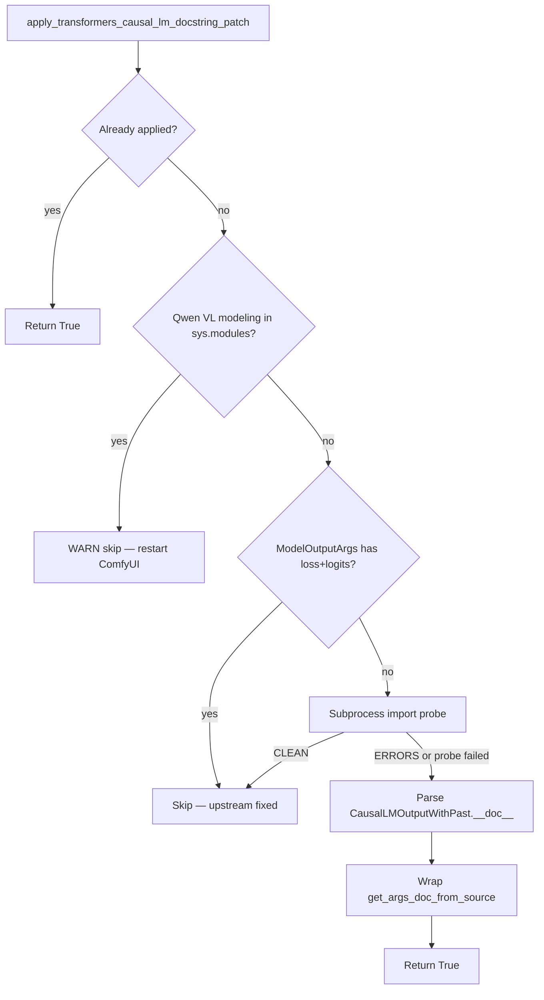
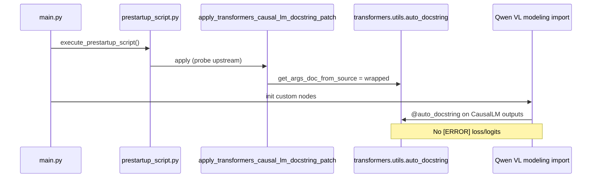

<table align="center">
  <tr>
    <td align="center" bgcolor="#3478ca" width="88" height="36"><font color="#ffffff"><b>EN</b></font></td>
    <td align="center" bgcolor="#e5e7eb" width="88" height="36"><a href="https://github.com/ussoewwin/ComfyUI-QwenImageLoraLoader/blob/main/zhmd/v2.4.7.md"><font color="#4b5563"><b>中文</b></font></a></td>
  </tr>
</table>

This document records the ComfyUI startup `[ERROR] loss` / `[ERROR] logits` messages from Hugging Face `transformers` when importing Qwen VL `*CausalLMOutputWithPast` classes, the root cause inside upstream `auto_docstring`, the **conditional upstream-safe monkey-patch**, modified files, full patched code, and verification for **ComfyUI-QwenImageLoraLoader** v2.4.7.

**This is not a defect in this node's LoRA loading logic.** The messages come from upstream `transformers` Qwen VL `@auto_docstring` validation. Because it is unclear when Hugging Face will fix upstream, this node absorbs the issue locally via `prestartup_script.py` only (no `site-packages` edits, no stderr filtering).

**Environment when fixed (2026-06):**

| Item | Value |
|------|--------|
| transformers | 5.12.1 |
| ComfyUI-QwenImageLoraLoader | v2.4.7 (`4bcd1e8` — upstream auto-disable docstring patch) |
| Affected classes | `Qwen3VLCausalLMOutputWithPast`, `Qwen2_5_VLCausalLMOutputWithPast` |

---

## Design constraints

1. **Do not edit `transformers` in `site-packages`.** The workaround only monkey-patches `get_args_doc_from_source` in-process from this custom node.
2. **Apply only from `prestartup_script.py`.** The docstring patch runs **before** the v2.4.6 `apply_rotary_emb` compat block so Qwen VL imports see the wrapper first.
3. **Fully automatic upstream auto-disable.** Probe upstream on every ComfyUI start; install the wrapper only while upstream still emits `[ERROR] loss` / `[ERROR] logits`. **No user env vars or toggles** (unlike v2.4.6 `apply_rotary_emb` compat, which still allows `QWENIMAGE_ROTARY_COMPAT` opt-out).

### Decision table

| Condition | Action | Log level |
|-----------|--------|-----------|
| Tagged wrapper already on `get_args_doc_from_source` | **Return True** (idempotent) | — |
| Qwen VL modeling modules already in `sys.modules` | **Skip** — restart required | WARNING |
| `ModelOutputArgs` already documents `loss` and `logits` | **Skip** — upstream schema fixed | INFO |
| Subprocess import probe prints `CLEAN` (no `[ERROR] loss/logits`) | **Skip** — upstream behavior fixed | INFO |
| Subprocess probe prints `ERRORS` or probe cannot run (`None`) | **Apply** wrapper if prior rows did not skip | INFO |
| `transformers.utils.auto_docstring` missing / no `get_args_doc_from_source` | **Skip** | DEBUG |

When Hugging Face fixes upstream, startup logs show a **skip** line instead of **Patched …**; no `pip` edits and no permanent `site-packages` mutation.

### Decision flow



---

## 1. Symptom and import chain

### 1.1 Exact error text

When ComfyUI loads custom nodes that import Qwen VL modeling modules, `transformers` may print four lines like:

```text
[ERROR] `loss` is part of Qwen3VLCausalLMOutputWithPast.__init__'s signature, but not documented. Make sure to add it to the docstring of the function in ...\transformers\models\qwen3_vl\modeling_qwen3_vl.py.
[ERROR] `logits` is part of Qwen3VLCausalLMOutputWithPast.__init__'s signature, but not documented. Make sure to add it to the docstring of the function in ...\transformers\models\qwen3_vl\modeling_qwen3_vl.py.
[ERROR] `loss` is part of Qwen2_5_VLCausalLMOutputWithPast.__init__'s signature, but not documented. Make sure to add it to the docstring of the function in ...\transformers\models\qwen2_5_vl\modeling_qwen2_5_vl.py.
[ERROR] `logits` is part of Qwen2_5_VLCausalLMOutputWithPast.__init__'s signature, but not documented. Make sure to add it to the docstring of the function in ...\transformers\models\qwen2_5_vl\modeling_qwen2_5_vl.py.
```

These are **not** Python exceptions. They are strings appended to an internal list during `@auto_docstring` processing at **import time**, then printed when the decorator runs.

### 1.2 Typical ComfyUI import chain

```text
ComfyUI main.py
  └─ prestartup_script.py (ComfyUI-QwenImageLoraLoader)  ← patch applied here
  └─ custom node __init__.py imports
       └─ transformers.models.qwen3_vl.modeling_qwen3_vl
            └─ @auto_docstring on Qwen3VLCausalLMOutputWithPast  → [ERROR] loss/logits
       └─ transformers.models.qwen2_5_vl.modeling_qwen2_5_vl
            └─ @auto_docstring on Qwen2_5_VLCausalLMOutputWithPast → [ERROR] loss/logits
```

Any workflow or node that triggers those module imports before the patch runs will still show errors until ComfyUI is restarted.

### 1.3 What still works

- ComfyUI and other custom nodes continue loading after the noisy import.
- **LoRA behavior is unchanged** — this patch does not touch nunchaku planar injection or LoRA compose logic.
- Unrelated: v2.4.6 `apply_rotary_emb` compat is a separate `prestartup` block.

### 1.4 Log after fix

**When the wrapper applies** (upstream still broken, prestartup ran before Qwen VL import):

```text
[INFO] Patched transformers.utils.auto_docstring.get_args_doc_from_source for Qwen VL CausalLM ModelOutput docstrings (loss/logits); removes when upstream adds them
[INFO] ComfyUI-QwenImageLoraLoader prestartup: CausalLM ModelOutput docstring patch applied
```

**When upstream is already fixed** (schema or probe skip — no wrapper):

```text
[INFO] CausalLM ModelOutput docstring patch skipped: transformers ModelOutputArgs already documents loss and logits (upstream fixed — patch not installed)
```

or

```text
[INFO] CausalLM ModelOutput docstring patch skipped: Qwen VL ModelOutput docstrings resolve loss/logits without docstring errors (upstream fixed — patch not installed)
[DEBUG] ComfyUI-QwenImageLoraLoader prestartup: CausalLM ModelOutput docstring patch not applied
```

**When Qwen VL imported too early** (restart required):

```text
[WARNING] CausalLM ModelOutput docstring patch skipped: Qwen VL modeling modules already imported before prestartup — restart ComfyUI
[DEBUG] ComfyUI-QwenImageLoraLoader prestartup: CausalLM ModelOutput docstring patch not applied
```

In all success cases: **zero** stdout lines containing `[ERROR]` and `` `loss` `` or `` `logits` `` for the Qwen VL `*CausalLMOutputWithPast` classes after a clean restart.

---

## 2. Root cause (upstream behavior)

### 2.1 What `@auto_docstring` does for ModelOutput subclasses

Qwen VL defines dataclass outputs that subclass `CausalLMOutputWithPast`:

```python
@auto_docstring
@dataclass
class Qwen3VLCausalLMOutputWithPast(CausalLMOutputWithPast):
    r"""
    rope_deltas (...):
        ...
    """
    rope_deltas: torch.LongTensor | None = None
```

In `transformers.utils.auto_docstring.auto_class_docstring` (ModelOutput branch, ~line 4200):

1. `custom_args` is set from the class docstring (only `rope_deltas` for Qwen3 VL).
2. The **direct parent** docstring is appended: `CausalLMOutputWithPast.__doc__` (contains `loss`, `logits`, etc. under an `Args:` block).
3. `auto_method_docstring` builds `__init__` documentation using `source_args_dict=get_args_doc_from_source(ModelOutputArgs)` — a static dict of generic ModelOutput field templates.

### 2.2 Why `loss` and `logits` are “undocumented”

**Parent doc has the fields.** `CausalLMOutputWithPast.__doc__` documents `loss` and `logits` under `Args:`.

**`ModelOutputArgs` does not.** The fallback template class used for all ModelOutput dataclasses omits `loss` and `logits`.

**Validation compares signature vs merged docs.** Any `__init__` parameter not found in the merged documentation triggers an `[ERROR]` line (~line 3352 in `auto_docstring.py`).

**Why parent `Args:` does not help by default:** `parse_docstring` uses `max_indent_level=0` at normal call sites. Parameters under `Args:` are indented (typically 4–8 spaces). With `max_indent_level=0`, only zero-indent lines match — so `loss` / `logits` inside the parent’s indented `Args:` block are **not** parsed into `params`. The code then falls back to `ModelOutputArgs`, which still lacks those keys.

### 2.3 Why not patch `site-packages` or filter stdout?

| Approach | Problem |
|----------|---------|
| Edit `transformers` in `site-packages` | Lost on upgrade; violates project constraint |
| Filter / hide `[ERROR]` on stdout | Masks real issues; does not fix validation |
| Patch `auto_class_docstring` only | Insufficient: `source_args_dict` comes from `get_args_doc_from_source(ModelOutputArgs)` |

The working fix patches **`get_args_doc_from_source`** so that whenever upstream requests `ModelOutputArgs`, the returned dict includes `loss` and `logits` extracted from `CausalLMOutputWithPast.__doc__` with `parse_docstring(..., max_indent_level=4)`.

### 2.4 Why `prestartup_script.py`

ComfyUI runs `execute_prestartup_script()` in `main.py` **before** `init_custom_nodes()`. The docstring wrapper must be installed before any custom node imports Qwen VL modeling modules.

### 2.5 Relationship to v2.4.6

| Release | Fix | Opt-out |
|---------|-----|---------|
| v2.4.6 | `apply_rotary_emb` → `apply_rope1` alias for ComfyUI-nunchaku | `QWENIMAGE_ROTARY_COMPAT` env var |
| v2.4.7 | `get_args_doc_from_source` wrapper for Qwen VL CausalLM outputs | **None** — skip only via upstream probes |

Both run from the same `prestartup_script.py`; docstring patch runs **first**.

---

## 3. Modified files

| File | Role |
|------|------|
| `patches/transformers_qwen_vl_docstring_patch.py` | **New.** Core monkey-patch, upstream probes, apply |
| `prestartup_script.py` | **Updated.** Applies docstring patch before rotary compat patch |

**Not modified:**

- `transformers` in `site-packages`
- `patches/nunchaku_patch.py` (separate v2.4.6 rotary compat)

**Git:** `fix: Qwen VL CausalLM docstring patch at prestartup` (`4bcd1e8` on `main`).

---

## 4. Full patched code

### 4.1 `prestartup_script.py` (entire file)

```python
"""
Inject apply_rotary_emb on comfy.ldm.qwen_image.model before any custom node __init__.

ComfyUI-nunchaku loads before ComfyUI-QwenImageLoraLoader (Windows listdir order), so
__init__.py alone is too late. prestartup_script.py runs from main.execute_prestartup_script().
"""
import importlib.util
import logging
import os

logger = logging.getLogger(__name__)

_PATCH_DIR = os.path.join(os.path.dirname(os.path.abspath(__file__)), "patches")
_NUNCHAKU_PATCH_PATH = os.path.join(_PATCH_DIR, "nunchaku_patch.py")
_DOCSTRING_PATCH_PATH = os.path.join(_PATCH_DIR, "transformers_qwen_vl_docstring_patch.py")


def _load_patch_module(module_name: str, path: str):
    spec = importlib.util.spec_from_file_location(module_name, path)
    if spec is None or spec.loader is None:
        raise RuntimeError(f"Failed to load patch module spec from {path}")
    module = importlib.util.module_from_spec(spec)
    spec.loader.exec_module(module)
    return module


try:
    _docstring_patch_module = _load_patch_module(
        "comfyui_qwenimageloraloader_docstring_patch_prestartup",
        _DOCSTRING_PATCH_PATH,
    )
    if _docstring_patch_module.apply_transformers_causal_lm_docstring_patch():
        logger.info("ComfyUI-QwenImageLoraLoader prestartup: CausalLM ModelOutput docstring patch applied")
    else:
        logger.debug(
            "ComfyUI-QwenImageLoraLoader prestartup: CausalLM ModelOutput docstring patch not applied"
        )
except Exception:
    logger.exception("ComfyUI-QwenImageLoraLoader prestartup: CausalLM ModelOutput docstring patch failed")

try:
    _patch_module = _load_patch_module(
        "comfyui_qwenimageloraloader_nunchaku_patch_prestartup",
        _NUNCHAKU_PATCH_PATH,
    )
    if _patch_module.apply_qwen_image_apply_rotary_emb_compat():
        logger.info("ComfyUI-QwenImageLoraLoader prestartup: apply_rotary_emb compat applied")
    else:
        logger.debug(
            "ComfyUI-QwenImageLoraLoader prestartup: apply_rotary_emb compat not needed or already present"
        )
except Exception:
    logger.exception("ComfyUI-QwenImageLoraLoader prestartup: apply_rotary_emb compat failed")
```

### 4.2 `patches/transformers_qwen_vl_docstring_patch.py` (entire file)

```python
"""
Patch transformers auto_docstring for Qwen VL CausalLM ModelOutput classes.

When Hugging Face transformers merges CausalLMOutputWithPast docs into Qwen VL
ModelOutput subclasses, validation falls back to ModelOutputArgs — which lacks
loss/logits — and prints [ERROR] at import time.

Fully automatic at ComfyUI prestartup (no user env vars):
  - Probe upstream ModelOutputArgs before installing any wrapper.
  - If upstream already documents loss/logits, skip (no wrapper).
  - If a subprocess import probe shows clean stdout, skip.
  - Otherwise install the wrapper (default when upstream is still broken).

Fix: wrap get_args_doc_from_source to merge loss/logits into the returned dict
while upstream ModelOutputArgs still omits those fields.
"""

from __future__ import annotations

import importlib
import logging
import os
import subprocess
import sys
from typing import Any, Callable, Dict, Optional, Tuple

logger = logging.getLogger(__name__)

_PATCH_TAG = "_qwen_lora_loader_causal_lm_docstring_patch"
_CAUSAL_LM_OUTPUT_FIELDS = ("loss", "logits")

_QWEN_VL_MODELING_MODULES = (
    "transformers.models.qwen3_vl.modeling_qwen3_vl",
    "transformers.models.qwen2_5_vl.modeling_qwen2_5_vl",
)

_patch_applied: bool = False
_original_get_args_doc_from_source: Optional[Callable[..., dict]] = None


def _qwen_vl_modeling_already_imported() -> bool:
    return any(name in sys.modules for name in _QWEN_VL_MODELING_MODULES)


def _upstream_model_output_args_has_causal_lm_fields(auto_docstring_module) -> bool:
    """Probe upstream native state (never via patched get_args_doc_from_source)."""
    model_output_args = auto_docstring_module.ModelOutputArgs
    for field in _CAUSAL_LM_OUTPUT_FIELDS:
        entry = getattr(model_output_args, field, None)
        if not isinstance(entry, dict) or not entry.get("description"):
            return False
    return True


def _build_causal_lm_extra_args(auto_docstring_module) -> Dict[str, dict]:
    """Extract loss/logits entries from CausalLMOutputWithPast.__doc__."""
    try:
        modeling_outputs = importlib.import_module("transformers.modeling_outputs")
    except ImportError:
        return {}

    parent_doc = getattr(modeling_outputs.CausalLMOutputWithPast, "__doc__", None)
    if not parent_doc:
        return {}

    normalized = auto_docstring_module.set_min_indent(parent_doc.strip(), 0)
    documented_params, _remainder = auto_docstring_module.parse_docstring(
        normalized,
        max_indent_level=4,
    )

    extra: Dict[str, dict] = {}
    for field in _CAUSAL_LM_OUTPUT_FIELDS:
        param = documented_params.get(field)
        if not param:
            continue
        extra[field] = {
            "description": param.get("description", ""),
            "shape": param.get("shape"),
            "optional": param.get("optional", False),
            "additional_info": param.get("additional_info", ""),
            "type": param.get("type", ""),
        }
        if param.get("default") is not None:
            extra[field]["default"] = param["default"]
    return extra


def _model_output_args_requested(args_classes: Any, model_output_args_type: type) -> bool:
    if args_classes is model_output_args_type:
        return True
    if isinstance(args_classes, (list, tuple)):
        return model_output_args_type in args_classes
    return False


def _make_patched_get_args_doc_from_source(
    auto_docstring_module,
    original: Callable[..., dict],
) -> Callable[..., dict]:
    model_output_args_type = auto_docstring_module.ModelOutputArgs
    cached_extra: Dict[str, dict] = {}

    def patched_get_args_doc_from_source(args_classes: Any) -> dict:
        result = original(args_classes)

        if not _model_output_args_requested(args_classes, model_output_args_type):
            return result

        if all(field in result for field in _CAUSAL_LM_OUTPUT_FIELDS):
            return result

        nonlocal cached_extra
        if not cached_extra:
            cached_extra = _build_causal_lm_extra_args(auto_docstring_module)

        if not cached_extra:
            return result

        merged = dict(result)
        for field in _CAUSAL_LM_OUTPUT_FIELDS:
            if field in cached_extra:
                merged.setdefault(field, cached_extra[field])
        return merged

    setattr(patched_get_args_doc_from_source, _PATCH_TAG, True)
    return patched_get_args_doc_from_source


def _import_probe_reports_clean() -> Optional[bool]:
    """
    True: Qwen VL imports emit no [ERROR] loss/logits on stdout.
    False: errors still present (patch may be needed).
    None: probe could not run.
    """
    python_exe = sys.executable
    code = (
        "import importlib, io, contextlib\n"
        "buf = io.StringIO()\n"
        "with contextlib.redirect_stdout(buf):\n"
        "    importlib.import_module('transformers.models.qwen3_vl.modeling_qwen3_vl')\n"
        "    importlib.import_module('transformers.models.qwen2_5_vl.modeling_qwen2_5_vl')\n"
        "lines = buf.getvalue().splitlines()\n"
        "errs = [l for l in lines if '[ERROR]' in l and ('loss' in l or 'logits' in l)]\n"
        "print('CLEAN' if not errs else 'ERRORS')\n"
    )
    try:
        proc = subprocess.run(
            [python_exe, "-c", code],
            capture_output=True,
            text=True,
            timeout=120,
        )
    except (OSError, subprocess.SubprocessError) as exc:
        logger.debug("CausalLM docstring import probe failed: %s", exc)
        return None

    if proc.returncode != 0:
        logger.debug(
            "CausalLM docstring import probe exit %s stderr=%s",
            proc.returncode,
            proc.stderr[:500] if proc.stderr else "",
        )
        return None

    last_line = (proc.stdout or "").strip().splitlines()
    if not last_line:
        return None
    status = last_line[-1].strip()
    if status == "CLEAN":
        return True
    if status == "ERRORS":
        return False
    return None


def apply_transformers_causal_lm_docstring_patch() -> bool:
    """
    Install get_args_doc_from_source wrapper unless upstream already fixed the issue.

    Returns True if wrapper is active (or was already applied), False if skipped.
    """
    global _patch_applied, _original_get_args_doc_from_source

    if _patch_applied:
        return True

    if _qwen_vl_modeling_already_imported():
        logger.warning(
            "CausalLM ModelOutput docstring patch skipped: Qwen VL modeling modules "
            "already imported before prestartup — restart ComfyUI"
        )
        return False

    try:
        auto_docstring_module = importlib.import_module("transformers.utils.auto_docstring")
    except ImportError:
        logger.debug("transformers.utils.auto_docstring not available; patch skipped")
        return False

    get_args = getattr(auto_docstring_module, "get_args_doc_from_source", None)
    if get_args is None:
        return False

    if getattr(get_args, _PATCH_TAG, False):
        _patch_applied = True
        return True

    if _upstream_model_output_args_has_causal_lm_fields(auto_docstring_module):
        logger.info(
            "CausalLM ModelOutput docstring patch skipped: transformers ModelOutputArgs "
            "already documents loss and logits (upstream fixed — patch not installed)"
        )
        return False

    import_probe = _import_probe_reports_clean()
    if import_probe is True:
        logger.info(
            "CausalLM ModelOutput docstring patch skipped: Qwen VL ModelOutput docstrings "
            "resolve loss/logits without docstring errors (upstream fixed — patch not installed)"
        )
        return False

    _original_get_args_doc_from_source = get_args
    auto_docstring_module.get_args_doc_from_source = _make_patched_get_args_doc_from_source(
        auto_docstring_module,
        _original_get_args_doc_from_source,
    )
    _patch_applied = True

    logger.info(
        "Patched transformers.utils.auto_docstring.get_args_doc_from_source for Qwen VL "
        "CausalLM ModelOutput docstrings (loss/logits); removes when upstream adds them"
    )
    return True


def is_patch_applied() -> bool:
    return _patch_applied


def is_patch_wrapped() -> bool:
    try:
        auto_docstring_module = importlib.import_module("transformers.utils.auto_docstring")
    except ImportError:
        return False
    get_args = getattr(auto_docstring_module, "get_args_doc_from_source", None)
    return get_args is not None and getattr(get_args, _PATCH_TAG, False)
```

---

## 5. Runtime behavior

### 5.1 Injection point

| Function | Role |
|----------|------|
| `get_args_doc_from_source(ModelOutputArgs)` | Returns `ModelOutputArgs.__dict__` (missing `loss` / `logits`) |
| **Wrapped** `get_args_doc_from_source` | Merges `loss` / `logits` entries when the requested class is `ModelOutputArgs` |
| `auto_class_docstring` → `auto_method_docstring` | Uses enriched dict; validation passes |

Supplemental entries are built once at apply time from `CausalLMOutputWithPast.__doc__` using `parse_docstring(..., max_indent_level=4)`.

### 5.2 Startup order in `prestartup_script.py`

1. Load `patches/transformers_qwen_vl_docstring_patch.py` via `importlib` and call `apply_transformers_causal_lm_docstring_patch()`.
2. Load `patches/nunchaku_patch.py` and call `apply_qwen_image_apply_rotary_emb_compat()` (v2.4.6; separate fix).

### 5.3 Startup timeline (wrapper applies)



### 5.4 Idempotency

The wrapper sets `_qwen_lora_loader_causal_lm_docstring_patch = True` on the function object. A second `apply_*()` call detects the tag and returns without double-wrapping.

### 5.5 Return value of `apply_transformers_causal_lm_docstring_patch()`

| Return | Meaning |
|--------|---------|
| `True` | Wrapper applied this call, or already applied / tagged wrapper present |
| `False` | Skipped (upstream fixed, late import, missing API, or error logged) |

`prestartup_script.py` logs INFO only when return is `True`; skip paths use DEBUG at prestartup (INFO inside patch for skip reasons).

### 5.6 Risk assessment

| Topic | Assessment |
|-------|------------|
| LoRA / nunchaku behavior | **Unchanged** — patch only affects docstring generation at import |
| `site-packages` | **Not modified** |
| Overwrite after upstream fix | **Prevented** — schema + subprocess probes skip install |
| Performance | **Low** — one-time wrap at prestartup; subprocess probe may add seconds on first start |
| Other custom nodes | **Low** — only enriches `ModelOutputArgs` dict lookups |

---

## 6. Automatic upstream disable

| Scenario | Behavior |
|----------|----------|
| **A. Upstream fix (schema)** | `ModelOutputArgs` has `loss` and `logits` with non-empty `description` → skip patch, log INFO |
| **B. Upstream fix (probe)** | Subprocess imports Qwen VL without this patch; stdout ends with `CLEAN` → skip patch, log INFO |
| **C. Late import** | Qwen VL modules already in `sys.modules` before prestartup → WARN; patch not applied until restart |
| **D. Missing API** | No `get_args_doc_from_source` or cannot parse parent doc → skip, log DEBUG |
| **E. Probe inconclusive** | Subprocess probe fails (`None`) but schema still broken → **install** wrapper (safe default) |

**Difference from v2.4.6 rotary compat:** this docstring patch has **no** `QWENIMAGE_*` (or other) environment opt-out.

---

## 7. Verification

### 7.1 Production (ComfyUI startup)

Restart ComfyUI and confirm:

1. No `[ERROR]` lines mentioning `` `loss` `` or `` `logits` `` for Qwen3 / Qwen2.5 VL CausalLM output classes.
2. Either **Patched …** or a **docstring patch skipped:** INFO line (section 1.4).
3. Qwen VL–related custom nodes load; LoRA workflows unchanged.

### 7.2 After upgrading `transformers`

1. Restart ComfyUI.
2. If Hugging Face fixed `ModelOutputArgs`, confirm logs show **skipped** (not **Patched**).
3. Confirm startup remains clean (no `[ERROR] loss/logits`).

### 7.3 Functional

Run your usual Qwen Image / Qwen VL workflow — inference behavior should match pre-v2.4.7 except for absent error spam at startup.

---

## 8. Rollback and cleanup

**Full rollback:**

1. Remove the docstring patch block from `prestartup_script.py` (first `try` / `_DOCSTRING_PATCH_PATH` section).
2. Delete `patches/transformers_qwen_vl_docstring_patch.py`.
3. Restart ComfyUI.

**After upstream fix:**

The wrapper should skip automatically. You may remove the docstring patch files later for a cleaner tree once you no longer need to support broken `transformers` versions.

---

## 9. Summary

| Question | Answer |
|----------|--------|
| What broke? | `[ERROR] loss` / `[ERROR] logits` printed at Qwen VL `*CausalLMOutputWithPast` import time. |
| Why? | `ModelOutputArgs` lacks `loss`/`logits`; parent `Args:` not parsed at indent 0 during validation. |
| LoRA bug? | **No** — upstream `transformers` `@auto_docstring` issue; LoRA logic untouched. |
| Fix? | Wrap `get_args_doc_from_source` in `prestartup_script.py` before custom nodes load. |
| Self-disable? | Yes — upstream `ModelOutputArgs` fix and/or clean subprocess import probe; **no env vars**. |
| Files? | `prestartup_script.py`, `patches/transformers_qwen_vl_docstring_patch.py`. |
| `site-packages` touched? | **No**. |
| Related? | [v2.4.6 `apply_rotary_emb` compat](https://github.com/ussoewwin/ComfyUI-QwenImageLoraLoader/releases/tag/v2.4.6) — same prestartup / probe-first pattern. |

---

## 10. References (upstream source lines, transformers 5.12.1)

| Location | Line (approx.) | Note |
|----------|----------------|------|
| `modeling_outputs.py` — `CausalLMOutputWithPast` | 610–641 | Source of `loss` / `logits` doc text |
| `modeling_qwen3_vl.py` — `Qwen3VLCausalLMOutputWithPast` | 1267–1276 | `@auto_docstring` dataclass |
| `auto_docstring.py` — `ModelOutputArgs` | 2171+ | Missing `loss` / `logits` |
| `auto_docstring.py` — `get_args_doc_from_source` | 2855–2858 | Patch target |
| `auto_docstring.py` — `parse_docstring` | 2617+ | `max_indent_level` behavior |
| `auto_docstring.py` — ModelOutput branch | 4200–4219 | Uses `ModelOutputArgs` dict |
| `auto_docstring.py` — error message | 3351–3353 | `[ERROR] ... not documented` |

---

*Document version: 2026-06 — v2.4.7 upstream-safe Qwen VL CausalLM docstring patch (`4bcd1e8`).*
