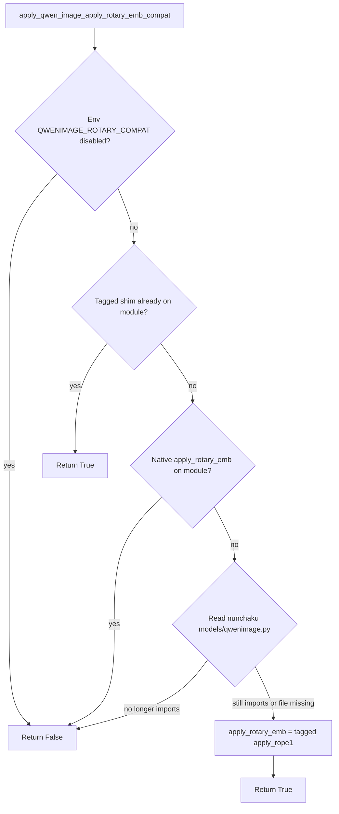
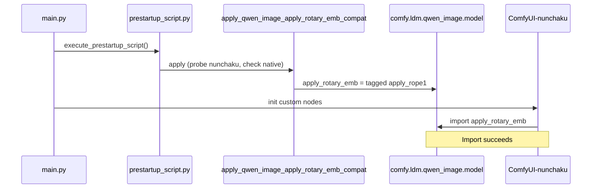
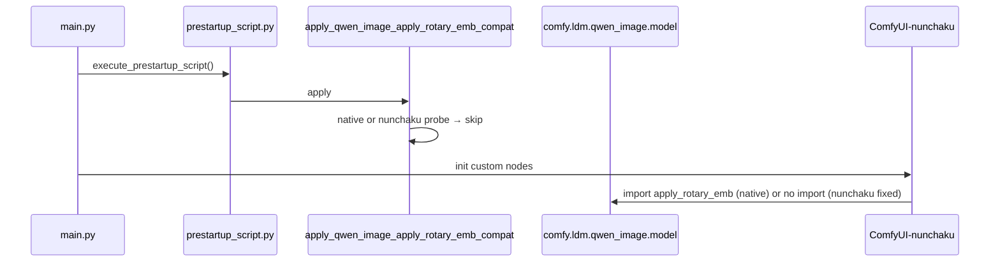

# Qwen Image `apply_rotary_emb` Compatibility Fix — Full Explanation

This document records the error, root cause, **conditional upstream-safe shim**, modified files, full patched code, and verification for the **ComfyUI 0.24.x + ComfyUI-nunchaku** `apply_rotary_emb` import failure fix in **ComfyUI-QwenImageLoraLoader**.

**Environment when fixed (2026-06-10):**

| Item | Value |
|------|-------|
| ComfyUI | v0.24.1 (`ba9ffa0a2`) |
| ComfyUI-nunchaku | v1.2.1 (folder `custom_nodes/ComfyUI-nunchaku`) |
| ComfyUI-QwenImageLoraLoader | v2.4.6 (`b3539cf` — self-disabling compat) |
| Python | 3.13 (embedded) |
| PyTorch | 2.12.0+cu132 |

---

## Design constraints

1. **Do not edit `ComfyUI-nunchaku` upstream files.** The compat layer only **reads** `models/qwenimage.py` to detect whether nunchaku still imports `apply_rotary_emb`.
2. **Apply the shim only from ComfyUI-QwenImageLoraLoader** (`prestartup_script.py` + `patches/nunchaku_patch.py`).
3. **Self-disable when upstream fixes land.** If ComfyUI restores a native `apply_rotary_emb`, or nunchaku stops importing it, the shim **must not** patch the module (no overwrite, no stale alias).

### Decision table

| Condition | Action | Log level |
|-----------|--------|-----------|
| `QWENIMAGE_ROTARY_COMPAT` is `0`, `false`, `no`, `off`, `disable`, or `disabled` | **Skip** — manual opt-out | INFO |
| Our tagged shim is already on `comfy.ldm.qwen_image.model` | **Skip** (idempotent) | — |
| ComfyUI exports **native** `apply_rotary_emb` (not our shim) | **Skip** — never overwrite | INFO |
| `ComfyUI-nunchaku/models/qwenimage.py` **no longer** imports `apply_rotary_emb` | **Skip** — nunchaku fixed the import | INFO |
| Symbol missing **and** nunchaku still imports it (or `qwenimage.py` not found) | **Apply** — alias `apply_rope1`, tag `_qwen_lora_loader_rotary_shim` | INFO |

When upstream fixes ship, startup logs show a **skip** line instead of **Patched …**; no nunchaku file edits and no permanent mutation of ComfyUI core.

### Decision flow



---

## 1. Error content

### 1.1 Symptom

On ComfyUI startup, **ComfyUI-nunchaku** failed while loading Qwen Image nodes:

```text
ImportError: cannot import name 'apply_rotary_emb' from 'comfy.ldm.qwen_image.model'
```

### 1.2 Import chain

```
ComfyUI-nunchaku/__init__.py
  → nodes/models/qwenimage.py
      → models/qwenimage.py
          → from comfy.ldm.qwen_image.model import (..., apply_rotary_emb,)
```

Failing file (typical path):

- `custom_nodes/ComfyUI-nunchaku/models/qwenimage.py` (import block around lines 20–27)

### 1.3 What still worked

- **nunchaku** wheel installed (`Nunchaku version: 1.3.0.dev20260515` in logs).
- Other extensions could load **after** nunchaku finished importing.
- Unrelated: cuDNN `SUBLIBRARY_VERSION_MISMATCH`, `nunchaku_versions.json` minimal mode.

### 1.4 Log after fix

**When the shim applies** (symbol still missing, nunchaku still imports it):

```text
[INFO] Patched comfy.ldm.qwen_image.model.apply_rotary_emb -> apply_rope1 (ComfyUI-nunchaku Qwen Image compat)
[INFO] ComfyUI-QwenImageLoraLoader prestartup: apply_rotary_emb compat applied
```

**When the shim self-disables** (upstream already fixed):

```text
[INFO] apply_rotary_emb compat skipped: ComfyUI already exports apply_rotary_emb
```

or

```text
[INFO] apply_rotary_emb compat skipped: ComfyUI-nunchaku no longer imports apply_rotary_emb
```

**When manually disabled:**

```text
[INFO] apply_rotary_emb compat skipped (QWENIMAGE_ROTARY_COMPAT is disabled)
```

If compat was not needed, prestartup may only emit DEBUG:

```text
[DEBUG] ComfyUI-QwenImageLoraLoader prestartup: apply_rotary_emb compat not needed or already present
```

In all success cases: **no** `cannot import name 'apply_rotary_emb'`, and ComfyUI-nunchaku initialization completes.

---

## 2. Root cause

### 2.1 API removal in ComfyUI 0.24

In **ComfyUI v0.24.x**, `comfy/ldm/qwen_image/model.py` no longer defines `apply_rotary_emb`. The Qwen Image attention path uses **`apply_rope1`** from `comfy.ldm.flux.math`:

```python
from comfy.ldm.flux.math import apply_rope1
joint_query = apply_rope1(joint_query, image_rotary_emb)
joint_key = apply_rope1(joint_key, image_rotary_emb)
```

The old local `apply_rotary_emb` helper was removed (upstream “Remove useless code”, PR #14178 area). Rotary logic was consolidated on Flux-style `apply_rope1`.

### 2.2 ComfyUI-nunchaku still targets the old API

`ComfyUI-nunchaku/models/qwenimage.py` (based on ComfyUI **v0.3.51** Qwen Image code) still does:

```python
from comfy.ldm.qwen_image.model import (
    ...
    apply_rotary_emb,
)
```

and calls it with the same arity as `apply_rope1`:

```python
joint_query = apply_rotary_emb(joint_query, image_rotary_emb)
joint_key = apply_rotary_emb(joint_key, image_rotary_emb)
```

Failure is **import-time version skew**, not an attention logic bug:

| Side | Expectation |
|------|-------------|
| ComfyUI 0.24.x | `apply_rotary_emb` absent; use `apply_rope1` |
| ComfyUI-nunchaku (affected releases) | `apply_rotary_emb` must exist on `comfy.ldm.qwen_image.model` |

### 2.3 Why `__init__.py` alone is too late

Custom nodes load in **directory name order**. On Windows, **`ComfyUI-nunchaku`** sorts before **`ComfyUI-QwenImageLoraLoader`**.

1. `ComfyUI-nunchaku/__init__.py` runs first.
2. It imports `models/qwenimage.py`, which imports `apply_rotary_emb` immediately.
3. **ImportError** before `ComfyUI-QwenImageLoraLoader/__init__.py` can patch anything.

### 2.4 Why `prestartup_script.py`

ComfyUI runs `execute_prestartup_script()` in `main.py` **before** `init_custom_nodes()`:

```python
execute_prestartup_script()
# ... later: init_custom_nodes()
```

Any custom node folder may ship `prestartup_script.py`. Running the shim there injects `apply_rotary_emb` **before** nunchaku imports.

### 2.5 Why alias `apply_rope1`

`apply_rope1(x, freqs_cis)` in `comfy/ldm/flux/math.py` takes one tensor and rotary embedding `freqs_cis` — same role as nunchaku’s `apply_rotary_emb(...)`. Aliasing on the **module object** `comfy.ldm.qwen_image.model` restores the import without editing nunchaku sources.

### 2.6 Why a tagged shim (v2.4.6+)

A naive alias always assigns `apply_rope1` whenever the name is missing. That breaks forward compatibility:

- If ComfyUI **restores** a real `apply_rotary_emb`, overwriting it with `apply_rope1` could change behavior.
- If nunchaku **stops importing** the name, leaving an alias on the module is unnecessary.

The fix tags our alias with `_qwen_lora_loader_rotary_shim` on the function object, probes nunchaku’s `qwenimage.py` with regex (read-only), and **skips** when native export or upstream nunchaku fix is detected.

---

## 3. Modified files

| File | Role |
|------|------|
| `prestartup_script.py` | Early execution; loads `nunchaku_patch.py` via `importlib` and calls `apply_qwen_image_apply_rotary_emb_compat()` |
| `patches/nunchaku_patch.py` | `apply_qwen_image_apply_rotary_emb_compat()` + call from `apply_nunchaku_patch()` (second-chance guard) |

**Not modified:**

- `custom_nodes/ComfyUI-nunchaku/**` (any file)
- ComfyUI core `comfy/ldm/qwen_image/model.py`

**Git:** `fix: auto-disable rotary compat when upstream restores apply_rotary_emb` (`b3539cf` on `main`).

---

## 4. Full patched code

### 4.1 `prestartup_script.py` (entire file)

```python
"""
Inject apply_rotary_emb on comfy.ldm.qwen_image.model before any custom node __init__.

ComfyUI-nunchaku loads before ComfyUI-QwenImageLoraLoader (Windows listdir order), so
__init__.py alone is too late. prestartup_script.py runs from main.execute_prestartup_script().
"""
import importlib.util
import logging
import os

logger = logging.getLogger(__name__)

_PATCH_PATH = os.path.join(os.path.dirname(os.path.abspath(__file__)), "patches", "nunchaku_patch.py")


def _load_patch_module():
    spec = importlib.util.spec_from_file_location(
        "comfyui_qwenimageloraloader_nunchaku_patch_prestartup",
        _PATCH_PATH,
    )
    if spec is None or spec.loader is None:
        raise RuntimeError(f"Failed to load patch module spec from {_PATCH_PATH}")
    module = importlib.util.module_from_spec(spec)
    spec.loader.exec_module(module)
    return module


try:
    _patch_module = _load_patch_module()
    if _patch_module.apply_qwen_image_apply_rotary_emb_compat():
        logger.info("ComfyUI-QwenImageLoraLoader prestartup: apply_rotary_emb compat applied")
    else:
        logger.debug(
            "ComfyUI-QwenImageLoraLoader prestartup: apply_rotary_emb compat not needed or already present"
        )
except Exception:
    logger.exception("ComfyUI-QwenImageLoraLoader prestartup: apply_rotary_emb compat failed")
```

### 4.2 Rotary compat block in `patches/nunchaku_patch.py`

Added constants, helpers, and `apply_qwen_image_apply_rotary_emb_compat()`:

```python
_qwen_apply_rotary_emb_compat_applied: bool = False

_ROTARY_SHIM_TAG = "_qwen_lora_loader_rotary_shim"
_NUNCHAKU_QWENIMAGE_APPLY_ROTARY_PATTERNS = (
    re.compile(
        r"from\s+comfy\.ldm\.qwen_image\.model\s+import\s+\([^)]*\bapply_rotary_emb\b",
        re.MULTILINE | re.DOTALL,
    ),
    re.compile(
        r"from\s+comfy\.ldm\.qwen_image\.model\s+import\s+[^\n#]*\bapply_rotary_emb\b",
    ),
)


def _rotary_compat_disabled_by_env() -> bool:
    value = os.environ.get("QWENIMAGE_ROTARY_COMPAT", "").strip().lower()
    return value in ("0", "false", "no", "off", "disable", "disabled")


def _mark_rotary_shim(fn: Callable) -> Callable:
    setattr(fn, _ROTARY_SHIM_TAG, True)
    return fn


def _rotary_shim_installed_on(qwen_image_model) -> bool:
    fn = getattr(qwen_image_model, "apply_rotary_emb", None)
    return fn is not None and getattr(fn, _ROTARY_SHIM_TAG, False)


def _comfyui_has_native_apply_rotary_emb(qwen_image_model) -> bool:
    return (
        getattr(qwen_image_model, "apply_rotary_emb", None) is not None
        and not _rotary_shim_installed_on(qwen_image_model)
    )


def _find_nunchaku_qwenimage_py() -> Optional[str]:
    custom_nodes = os.path.abspath(
        os.path.join(os.path.dirname(__file__), os.pardir, os.pardir)
    )
    for folder in ("ComfyUI-nunchaku", "ComfyUI_Nunchaku", "comfyui-nunchaku"):
        path = os.path.join(custom_nodes, folder, "models", "qwenimage.py")
        if os.path.isfile(path):
            return path
    return None


def _nunchaku_qwenimage_still_imports_apply_rotary_emb() -> Optional[bool]:
    """
    True: nunchaku still imports apply_rotary_emb (compat may be needed).
    False: nunchaku source no longer imports it (skip shim).
    None: qwenimage.py not found (apply only if symbol missing).
    """
    path = _find_nunchaku_qwenimage_py()
    if path is None:
        return None

    try:
        with open(path, encoding="utf-8", errors="replace") as handle:
            text = handle.read()
    except OSError as exc:
        logger.debug("Could not read %s for rotary compat probe: %s", path, exc)
        return None

    for pattern in _NUNCHAKU_QWENIMAGE_APPLY_ROTARY_PATTERNS:
        if pattern.search(text):
            return True
    return False


def apply_qwen_image_apply_rotary_emb_compat() -> bool:
    """
    ComfyUI >= 0.24 removed comfy.ldm.qwen_image.model.apply_rotary_emb.
    ComfyUI-nunchaku still imports it; alias to comfy.ldm.flux.math.apply_rope1
    only when the import is still required and ComfyUI has not restored the symbol.
    """
    global _qwen_apply_rotary_emb_compat_applied
    if _qwen_apply_rotary_emb_compat_applied:
        return True

    if _rotary_compat_disabled_by_env():
        logger.info(
            "apply_rotary_emb compat skipped (QWENIMAGE_ROTARY_COMPAT is disabled)"
        )
        return False

    try:
        import comfy.ldm.qwen_image.model as qwen_image_model
        from comfy.ldm.flux.math import apply_rope1

        if _rotary_shim_installed_on(qwen_image_model):
            _qwen_apply_rotary_emb_compat_applied = True
            return True

        if _comfyui_has_native_apply_rotary_emb(qwen_image_model):
            logger.info(
                "apply_rotary_emb compat skipped: ComfyUI already exports apply_rotary_emb"
            )
            return False

        nunchaku_needs = _nunchaku_qwenimage_still_imports_apply_rotary_emb()
        if nunchaku_needs is False:
            logger.info(
                "apply_rotary_emb compat skipped: ComfyUI-nunchaku no longer imports apply_rotary_emb"
            )
            return False

        qwen_image_model.apply_rotary_emb = _mark_rotary_shim(apply_rope1)
        _qwen_apply_rotary_emb_compat_applied = True
        logger.info(
            "Patched comfy.ldm.qwen_image.model.apply_rotary_emb -> apply_rope1 "
            "(ComfyUI-nunchaku Qwen Image compat)"
        )
        return True
    except Exception as e:
        logger.error("Failed to apply apply_rotary_emb compat patch: %s", e)
        return False
```

**Nunchaku probe details:**

- Searches `custom_nodes/{ComfyUI-nunchaku,ComfyUI_Nunchaku,comfyui-nunchaku}/models/qwenimage.py`.
- Matches parenthesized and single-line `from comfy.ldm.qwen_image.model import … apply_rotary_emb`.
- **Read-only** — never writes to nunchaku tree.
- If the file is missing (`None`), compat may still apply when the symbol is absent (safe default for broken installs).

### 4.3 `apply_nunchaku_patch()` integration

```python
def apply_nunchaku_patch():
    """
    Apply ComfyUI-nunchaku compatibility patches (LoRA planar injection + lazy Linear fixes).
    Returns True if at least one patch was applied or was already active.
    """
    rotary_compat = apply_qwen_image_apply_rotary_emb_compat()
    lazy_from = apply_svdqw4a4_lazy_linear_patch()
    lazy_fuse = apply_nunchaku_zimage_fuse_lazy_linear_patch()
    # ... planar injection ...
    return planar_ok or lazy_from or rotary_compat
```

`apply_qwen_image_apply_rotary_emb_compat()` runs again at normal node load if prestartup did not run; idempotency is on the singleton `comfy.ldm.qwen_image.model` module.

---

## 5. Runtime behavior

### 5.1 Startup timeline (shim applies)



### 5.2 Startup timeline (shim skipped)



### 5.3 Idempotency and double module load

- Prestartup loads `nunchaku_patch.py` under module name `comfyui_qwenimageloraloader_nunchaku_patch_prestartup`.
- Later, `__init__.py` imports `patches.nunchaku_patch` as a package submodule (separate module object, separate `_qwen_apply_rotary_emb_compat_applied` flag).
- Effect is on the **singleton** `comfy.ldm.qwen_image.model`. The second call sees tagged shim or native export and does not re-patch.
- Expect **one** INFO “Patched …” line per startup when apply runs.

### 5.4 Return value of `apply_qwen_image_apply_rotary_emb_compat()`

| Return | Meaning |
|--------|---------|
| `True` | Shim applied this call, or already applied / tagged shim present |
| `False` | Skipped (native export, nunchaku no longer imports, env disabled, or error logged) |

`prestartup_script.py` logs INFO only when return is `True`; skip paths use DEBUG at prestartup (INFO inside patch for skip reasons).

### 5.5 Environment variable

| Variable | Values that disable compat |
|----------|---------------------------|
| `QWENIMAGE_ROTARY_COMPAT` | `0`, `false`, `no`, `off`, `disable`, `disabled` (case-insensitive) |

Unset or any other value: compat logic runs normally.

### 5.6 Risk assessment

| Topic | Assessment |
|-------|------------|
| Correctness vs ComfyUI 0.24 | **Aligned** when applied — same `apply_rope1` the core model uses |
| Overwrite native symbol | **Prevented** — native detection skips patch |
| Stale shim after nunchaku fix | **Prevented** — source probe skips patch |
| Other custom nodes | **Low** — only adds a name when needed; does not edit core files |
| Performance | **None** — direct alias, no wrapper |
| nunchaku tree | **Read-only probe** — no writes |

### 5.7 Unrelated: `nunchaku_versions.json`

```text
'nunchaku_versions.json' not found. Node will start in minimal mode.
```

From **NunchakuWheelInstaller** only; does not block Qwen inference when `nunchaku` is installed.

---

## 6. Verification

### 6.1 Quick check (ComfyUI embedded Python)

From your ComfyUI install (adjust paths):

```bat
D:\USERFILES\ComfyUI\python_embeded\python.exe -c ^
  "import comfy.ldm.qwen_image.model as m; from comfy.ldm.flux.math import apply_rope1; ^
   print('has apply_rotary_emb:', hasattr(m, 'apply_rotary_emb')); ^
   print('is apply_rope1:', getattr(m, 'apply_rotary_emb', None) is apply_rope1); ^
   print('is our shim:', getattr(getattr(m, 'apply_rotary_emb', None), '_qwen_lora_loader_rotary_shim', False))"
```

Interpretation:

| `has apply_rotary_emb` | `is apply_rope1` | `is our shim` | Typical meaning |
|------------------------|------------------|---------------|-----------------|
| `True` | `True` | `True` | Shim applied (needed) |
| `True` | `False` | `False` | ComfyUI native export |
| `False` | — | — | Run **after** prestartup in a full ComfyUI start, or compat skipped |

Run inside a full ComfyUI startup context (or import `prestartup_script` logic first) for accurate results.

### 6.2 Production (ComfyUI startup)

Restart ComfyUI and confirm:

1. No `cannot import name 'apply_rotary_emb'`.
2. Either **Patched …** or a **compat skipped:** INFO line (section 1.4).
3. ComfyUI-nunchaku initialization completes; Qwen nodes register.

### 6.3 Functional

Run a minimal Qwen Image + Nunchaku workflow (load `NunchakuQwenImageDiTLoader`, one sampling step).

### 6.4 After upgrading ComfyUI or ComfyUI-nunchaku

1. Restart ComfyUI.
2. Confirm logs show **skipped** (not **Patched**) if upstream fixed the mismatch.
3. Confirm Qwen workflow still runs.

---

## 7. Rollback and cleanup

**Full rollback:**

1. Delete `prestartup_script.py`.
2. Remove rotary compat code from `patches/nunchaku_patch.py` (`apply_qwen_image_apply_rotary_emb_compat` and its call in `apply_nunchaku_patch`).
3. Restart ComfyUI.

**Temporary disable (keep code):**

```bat
set QWENIMAGE_ROTARY_COMPAT=0
```

**After upstream fix:**

The shim should skip automatically. You may later remove `prestartup_script.py` and compat code for a cleaner tree once you no longer support the old nunchaku import pattern.

---

## 8. Summary

| Question | Answer |
|----------|--------|
| What broke? | `ImportError: cannot import name 'apply_rotary_emb'` during ComfyUI-nunchaku load. |
| Why? | ComfyUI 0.24 removed the symbol; nunchaku still imports it; LoraLoader `__init__` is too late. |
| Fix? | Early `prestartup_script.py` + **conditional** `apply_rope1` alias with upstream probes and shim tag. |
| Self-disable? | Yes — skip if ComfyUI restores native `apply_rotary_emb` or nunchaku drops the import. |
| Files? | `prestartup_script.py`, `patches/nunchaku_patch.py`. |
| nunchaku touched? | **No** (read-only probe of `models/qwenimage.py`). |
| Opt-out? | `QWENIMAGE_ROTARY_COMPAT=0` (and aliases). |

---

*Document version: 2026-06-10 — v2.4.6 conditional upstream-safe `apply_rotary_emb` compat (`b3539cf`).*
