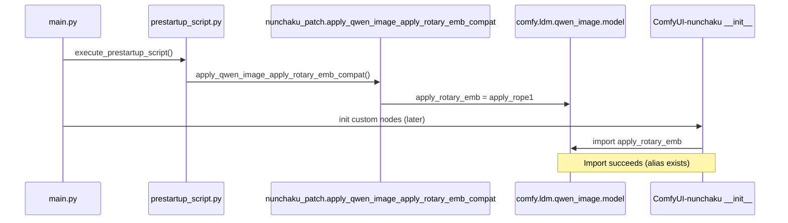

# Qwen Image `apply_rotary_emb` Compatibility Fix — Full Explanation

This document records the error, root cause, modified files, full patched code, and verification for the **ComfyUI 0.24.x + ComfyUI-nunchaku** `apply_rotary_emb` import failure fix applied in **ComfyUI-QwenImageLoraLoader**.

**Environment when fixed (2026-06-10):**

| Item | Value |
|------|-------|
| ComfyUI | v0.24.1 (`ba9ffa0a2`) |
| ComfyUI-nunchaku | v1.2.1 (folder `custom_nodes/ComfyUI-nunchaku`) |
| ComfyUI-QwenImageLoraLoader | v2.4.5 |
| Python | 3.13 (embedded) |
| PyTorch | 2.12.0+cu132 |

**Design constraint:** Do **not** edit `ComfyUI-nunchaku` upstream files. Apply the shim only from **ComfyUI-QwenImageLoraLoader**.

---

## 1. Error Content

### 1.1 Symptom

On ComfyUI startup, **ComfyUI-nunchaku** failed while loading Qwen Image nodes. The console showed an `ImportError` similar to:

```text
ImportError: cannot import name 'apply_rotary_emb' from 'comfy.ldm.qwen_image.model'
```

### 1.2 Where it failed (import chain)

```
ComfyUI-nunchaku/__init__.py
  → nodes/models/qwenimage.py
      → models/qwenimage.py   (package root under ComfyUI-nunchaku)
          → line 20–27: from comfy.ldm.qwen_image.model import (..., apply_rotary_emb,)
```

The failing statement is in:

- `custom_nodes/ComfyUI-nunchaku/models/qwenimage.py` (lines 20–27)

### 1.3 What still worked

- **nunchaku** Python wheel was installed (`Nunchaku version: 1.3.0.dev20260515` in logs).
- Other extensions (e.g. ComfyUI-QwenImageLoraLoader LoRA patches) could load **after** nunchaku finished importing.
- This error is **unrelated** to cuDNN `SUBLIBRARY_VERSION_MISMATCH` or `nunchaku_versions.json` minimal mode.

### 1.4 Log after fix (success indicators)

After the patch, startup logs include:

```text
[INFO] Patched comfy.ldm.qwen_image.model.apply_rotary_emb -> apply_rope1 (ComfyUI-nunchaku Qwen Image compat)
[INFO] ComfyUI-QwenImageLoraLoader prestartup: apply_rotary_emb compat applied
```

And **no** `cannot import name 'apply_rotary_emb'` message. ComfyUI-nunchaku initialization completes normally.

---

## 2. Essential Root Cause

### 2.1 API removal in ComfyUI 0.24

In **ComfyUI v0.24.1**, `comfy/ldm/qwen_image/model.py` no longer defines or exports `apply_rotary_emb`.

The official Qwen Image attention path now uses **`apply_rope1`** from `comfy.ldm.flux.math`:

```python
from comfy.ldm.flux.math import apply_rope1
# ...
joint_query = apply_rope1(joint_query, image_rotary_emb)
joint_key = apply_rope1(joint_key, image_rotary_emb)
```

Historically, ComfyUI had a local `apply_rotary_emb` helper in the Qwen Image model module; it was removed (upstream commit context: “Remove useless code”, PR #14178 area). The rotary logic was consolidated onto the Flux-style `apply_rope1` implementation.

### 2.2 ComfyUI-nunchaku still targets an older ComfyUI API

`ComfyUI-nunchaku/models/qwenimage.py` is documented as inheriting from ComfyUI **v0.3.51** Qwen Image code. It still does:

```python
from comfy.ldm.qwen_image.model import (
    ...
    apply_rotary_emb,
)
```

And later calls it with **two arguments** (tensor + rotary embedding), same as `apply_rope1`:

```python
joint_query = apply_rotary_emb(joint_query, image_rotary_emb)
joint_key = apply_rotary_emb(joint_key, image_rotary_emb)
```

So the failure is not a logic bug in attention itself; it is a **missing symbol at import time** — a **version skew** between:

| Side | Expectation |
|------|-------------|
| ComfyUI 0.24.x | `apply_rotary_emb` does not exist; use `apply_rope1` |
| ComfyUI-nunchaku (current) | `apply_rotary_emb` must exist on `comfy.ldm.qwen_image.model` |

### 2.3 Why patching only in `__init__.py` is too late

Custom nodes are loaded in **directory name order** on Windows. **`ComfyUI-nunchaku`** sorts before **`ComfyUI-QwenImageLoraLoader`**.

Therefore:

1. `ComfyUI-nunchaku/__init__.py` runs first.
2. It imports `models/qwenimage.py`, which immediately imports `apply_rotary_emb`.
3. **ImportError** occurs before `ComfyUI-QwenImageLoraLoader/__init__.py` can run any patch.

### 2.4 Why `prestartup_script.py` is the correct hook

ComfyUI runs `execute_prestartup_script()` in `main.py` **before** loading custom node modules:

```python
execute_prestartup_script()
# ... later: init_custom_nodes() loads each custom_nodes/*/ __init__.py
```

Any custom node folder may ship `prestartup_script.py`. ComfyUI executes all of them early. Putting the shim there guarantees `comfy.ldm.qwen_image.model.apply_rotary_emb` exists **before** `ComfyUI-nunchaku` imports.

### 2.5 Why alias `apply_rope1` is correct

`apply_rope1(x, freqs_cis)` in `comfy/ldm/flux/math.py`:

- Takes **one** tensor and **rotary embedding** `freqs_cis`.
- Applies RoPE via `comfy.quant_ops.ck.apply_rope1` in inference (or `_apply_rope1` in training).

ComfyUI-nunchaku calls `apply_rotary_emb(joint_query, image_rotary_emb)` — same arity and role as `apply_rope1`. Aliasing the name on the **module object** `comfy.ldm.qwen_image.model` restores the import without changing nunchaku source files.

---

## 3. Modified Files

| File | Change |
|------|--------|
| `custom_nodes/ComfyUI-QwenImageLoraLoader/prestartup_script.py` | **New file** — early shim injection |
| `custom_nodes/ComfyUI-QwenImageLoraLoader/patches/nunchaku_patch.py` | **Modified** — added `apply_qwen_image_apply_rotary_emb_compat()`; call it from `apply_nunchaku_patch()` |

**Not modified:**

- `custom_nodes/ComfyUI-nunchaku/**` (any file)
- ComfyUI core `comfy/ldm/qwen_image/model.py`

**Optional (verification only, not required for production):**

- `custom_nodes/ComfyUI-QwenImageLoraLoader/scripts/_test_rotary_compat.py`

---

## 4. Full Text of Modified / New Code

### 4.1 New file: `prestartup_script.py` (entire file)

```python
"""
Inject apply_rotary_emb on comfy.ldm.qwen_image.model before any custom node __init__.

ComfyUI-nunchaku loads before ComfyUI-QwenImageLoraLoader (Windows listdir order), so
__init__.py alone is too late. prestartup_script.py runs from main.execute_prestartup_script().
"""
import importlib.util
import logging
import os

logger = logging.getLogger(__name__)

_PATCH_PATH = os.path.join(os.path.dirname(os.path.abspath(__file__)), "patches", "nunchaku_patch.py")


def _load_patch_module():
    spec = importlib.util.spec_from_file_location(
        "comfyui_qwenimageloraloader_nunchaku_patch_prestartup",
        _PATCH_PATH,
    )
    if spec is None or spec.loader is None:
        raise RuntimeError(f"Failed to load patch module spec from {_PATCH_PATH}")
    module = importlib.util.module_from_spec(spec)
    spec.loader.exec_module(module)
    return module


try:
    _patch_module = _load_patch_module()
    if _patch_module.apply_qwen_image_apply_rotary_emb_compat():
        logger.info("ComfyUI-QwenImageLoraLoader prestartup: apply_rotary_emb compat applied")
    else:
        logger.debug(
            "ComfyUI-QwenImageLoraLoader prestartup: apply_rotary_emb compat not needed or already present"
        )
except Exception:
    logger.exception("ComfyUI-QwenImageLoraLoader prestartup: apply_rotary_emb compat failed")
```

### 4.2 Added to `patches/nunchaku_patch.py` — module flag and compat function

```python
_qwen_apply_rotary_emb_compat_applied: bool = False


def apply_qwen_image_apply_rotary_emb_compat() -> bool:
    """
    ComfyUI >= 0.24 removed comfy.ldm.qwen_image.model.apply_rotary_emb.
    ComfyUI-nunchaku still imports it; alias to comfy.ldm.flux.math.apply_rope1.
    """
    global _qwen_apply_rotary_emb_compat_applied
    if _qwen_apply_rotary_emb_compat_applied:
        return True

    try:
        import comfy.ldm.qwen_image.model as qwen_image_model
        from comfy.ldm.flux.math import apply_rope1

        if hasattr(qwen_image_model, "apply_rotary_emb"):
            _qwen_apply_rotary_emb_compat_applied = True
            return False

        qwen_image_model.apply_rotary_emb = apply_rope1
        _qwen_apply_rotary_emb_compat_applied = True
        logger.info(
            "Patched comfy.ldm.qwen_image.model.apply_rotary_emb -> apply_rope1 "
            "(ComfyUI-nunchaku Qwen Image compat)"
        )
        return True
    except Exception as e:
        logger.error("Failed to apply apply_rotary_emb compat patch: %s", e)
        return False
```

### 4.3 Modified in `patches/nunchaku_patch.py` — `apply_nunchaku_patch()` entry and return

**Before (conceptual):** `apply_nunchaku_patch()` only applied LoRA planar injection and lazy-Linear patches; return value ignored rotary compat.

**After (full function as patched):**

```python
def apply_nunchaku_patch():
    """
    Apply ComfyUI-nunchaku compatibility patches (LoRA planar injection + lazy Linear fixes).
    Returns True if at least one patch was applied or was already active.
    """
    rotary_compat = apply_qwen_image_apply_rotary_emb_compat()
    lazy_from = apply_svdqw4a4_lazy_linear_patch()
    lazy_fuse = apply_nunchaku_zimage_fuse_lazy_linear_patch()
    if not lazy_fuse:
        schedule_nunchaku_zimage_fuse_patch_retries()

    planar_ok = False
    try:
        target_class = None

        try:
            from nunchaku.models.qwenimage import NunchakuQwenImageTransformerBlock

            target_class = NunchakuQwenImageTransformerBlock
        except ImportError:
            pass

        if target_class is None:
            for module_name, module in sys.modules.items():
                if "qwenimage" in module_name and hasattr(module, "NunchakuQwenImageTransformerBlock"):
                    target_class = getattr(module, "NunchakuQwenImageTransformerBlock")
                    logger.info("Found NunchakuQwenImageTransformerBlock in %s", module_name)
                    break

        if target_class:
            logger.info("Applying Manual Planar Injection Monkey Patch to NunchakuQwenImageTransformerBlock")
            target_class.forward = forward_with_manual_planar_injection
            planar_ok = True
        else:
            logger.warning(
                "Could not find NunchakuQwenImageTransformerBlock to patch. "
                "Manual Planar Injection logic will not work if the original file is reverted."
            )

    except Exception as e:
        logger.error("Failed to apply Nunchaku planar patch: %s", e)

    return planar_ok or lazy_from or rotary_compat
```

The only behavioral change inside `apply_nunchaku_patch()` relative to the prior version:

1. First line calls `apply_qwen_image_apply_rotary_emb_compat()` (second-chance guard if prestartup did not run).
2. Return expression includes `or rotary_compat`.

---

## 5. Detailed Explanation

### 5.1 Execution timeline (startup)



### 5.2 What the shim does (step by step)

1. Import `comfy.ldm.qwen_image.model` as a module object (not only symbols from `__init__` if any).
2. If `apply_rotary_emb` **already exists** (future ComfyUI or another patcher), do nothing and return `False`.
3. Otherwise assign `qwen_image_model.apply_rotary_emb = apply_rope1`.
4. Python’s `from comfy.ldm.qwen_image.model import apply_rotary_emb` binds the name at import time to whatever attribute exists on the module **at that moment**. Injecting the attribute on the module **before** nunchaku’s import is sufficient.

### 5.3 Idempotency and double execution

- `prestartup_script.py` loads `nunchaku_patch.py` via `importlib` under a **unique module name** (`comfyui_qwenimageloraloader_nunchaku_patch_prestartup`).
- Later, `__init__.py` imports `patches.nunchaku_patch` as a normal package submodule (second module object, separate `_qwen_apply_rotary_emb_compat_applied` flag).
- That is acceptable: the **real effect** is on `comfy.ldm.qwen_image.model`, which is a singleton module. The second call sees `hasattr(qwen_image_model, "apply_rotary_emb")` as true and skips re-patching.
- Startup logs therefore show the INFO lines **once** (from prestartup), not twice.

### 5.4 Return values of `apply_qwen_image_apply_rotary_emb_compat()`

| Return | Meaning |
|--------|---------|
| `True` | Shim was applied in this call (attribute was missing and was added). |
| `False` | Shim not needed (`apply_rotary_emb` already present) or apply failed (logged as error). |
| `True` (immediate) | Already applied in **this** module instance’s prior call (`_qwen_apply_rotary_emb_compat_applied` flag). |

### 5.5 Risk assessment

| Topic | Assessment |
|-------|------------|
| Correctness vs ComfyUI 0.24 native path | **Aligned** — same function the core model uses (`apply_rope1`). |
| Effect on other custom nodes | **Low** — only adds a name on `comfy.ldm.qwen_image.model` if missing; does not replace ComfyUI core files. |
| Upstream nunchaku fix | Eventually nunchaku may switch imports to `apply_rope1`; then `hasattr` branch skips shim (harmless). |
| Performance | **None** — alias only, no extra wrapper. |

### 5.6 Unrelated warning: `nunchaku_versions.json`

Log line:

```text
'nunchaku_versions.json' not found. Node will start in minimal mode.
```

This comes from **NunchakuWheelInstaller** (`nodes/tools/installers.py`). It only means the local wheel version list cache is missing; the **Nunchaku Installer** node dropdowns are limited. It does **not** block Qwen Image inference when `nunchaku` is already installed. See ComfyUI-nunchaku docs / `example_workflows/install_wheel.json`.

---

## 6. Verification

### 6.1 Automated (standalone script)

```bat
D:\USERFILES\ComfyUI\python_embeded\python.exe ^
  D:\USERFILES\ComfyUI\ComfyUI\custom_nodes\ComfyUI-QwenImageLoraLoader\scripts\_test_rotary_compat.py
```

Expected:

- `prestartup: apply_rotary_emb alias OK`
- `apply_rotary_emb is apply_rope1`

### 6.2 Production (ComfyUI startup)

Restart ComfyUI and confirm:

1. No `cannot import name 'apply_rotary_emb'`.
2. Lines quoted in section 1.4 appear early in the log.
3. `ComfyUI-nunchaku Initialization` completes; Qwen-related nodes register.

### 6.3 Functional (recommended)

Run a minimal Qwen Image + Nunchaku workflow (load `NunchakuQwenImageDiTLoader`, sample one step). Confirms runtime RoPE path, not only import.

---

## 7. Rollback

1. Delete `custom_nodes/ComfyUI-QwenImageLoraLoader/prestartup_script.py`.
2. Revert changes in `patches/nunchaku_patch.py` (remove `apply_qwen_image_apply_rotary_emb_compat` and its call in `apply_nunchaku_patch`).
3. Restart ComfyUI.

Alternatively, upgrade **ComfyUI-nunchaku** to a release that imports `apply_rope1` directly (when upstream publishes one), then remove this shim.

---

## 8. Summary

| Question | Answer |
|----------|--------|
| What broke? | `ImportError: cannot import name 'apply_rotary_emb'` during ComfyUI-nunchaku load. |
| Why? | ComfyUI 0.24 removed `apply_rotary_emb`; nunchaku still imports it; LoraLoader `__init__` runs too late. |
| Fix? | Early `prestartup_script.py` + `apply_rope1` alias on `comfy.ldm.qwen_image.model`; duplicate guard in `apply_nunchaku_patch()`. |
| Files? | `prestartup_script.py` (new), `patches/nunchaku_patch.py` (modified). |
| nunchaku touched? | **No.** |

---

*Document version: 2026-06-10 — ComfyUI-QwenImageLoraLoader local compatibility patch.*
