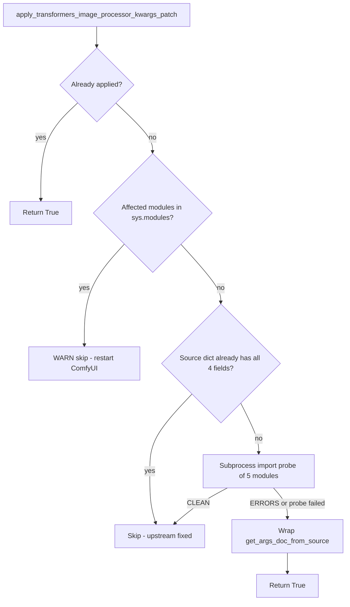

# Transformers ImageProcessorKwargs "not documented" Docstring Patch
### deepseek_vl_hybrid / kimi_k25 / paddleocr_vl

This document is the complete explanation of the fix that removes the
`[ERROR]` ... `but not documented` lines printed by Hugging Face `transformers`
at ComfyUI startup. The fix lives **entirely inside the
ComfyUI-QwenImageLoraLoader custom node** — no `site-packages` files are
touched, no output is filtered, and the patch **removes itself automatically**
once upstream `transformers` fixes the underlying defect.

**Environment when documented (2026-08-27):**

| Item | Value |
|------|-------|
| transformers | 5.15.1 |
| ComfyUI-QwenImageLoraLoader | v2.5.8 (commit `8d82442`) |
| Affected TypedDicts | `DeepseekVLHybridImageProcessorKwargs`, `Kimi_K25ImageProcessorKwargs`, `PaddleOCRVLImageProcessorKwargs` |
| Missing fields | `high_res_size`, `merge_size`, `min_pixels`, `max_pixels` |

---

## Design constraints

1. **Do not edit `transformers` in `site-packages`.** The workaround only
   monkey-patches `get_args_doc_from_source` in-process from this custom node.
2. **Apply only from `prestartup_script.py`.** The patch must be installed
   **before** any custom node imports the affected transformers modules
   (`main.execute_prestartup_script()` runs before custom node loading).
3. **Fully automatic upstream auto-disable.** Probe upstream on every ComfyUI
   start; install the wrapper only while upstream still emits the `[ERROR]`
   lines. **No user env vars or toggles.**

### Decision table

| Condition | Action | Log level |
|-----------|--------|-----------|
| Tagged wrapper already on `get_args_doc_from_source` | **Return True** (idempotent) | — |
| Affected transformers modules already in `sys.modules` | **Skip** — restart required | WARNING |
| Source dict (ImageProcessorArgs/VideoProcessorArgs) already documents all 4 fields | **Skip** — upstream schema fixed | INFO |
| Subprocess import probe prints `CLEAN` (no `[ERROR] ... not documented`) | **Skip** — upstream behavior fixed | INFO |
| Subprocess probe prints `ERRORS`, or probe cannot run (`None`) | **Apply** wrapper if prior rows did not skip | INFO |
| `transformers.utils.auto_docstring` missing / no `get_args_doc_from_source` | **Skip** | DEBUG |

### Decision flow



---

## 1. What was the problem

### 1.1 Symptom

At ComfyUI startup, after the custom-node initialization banners, `transformers`
printed **13 `[ERROR]` lines** into the console, for example:

```text
[ERROR] `high_res_size` is part of DeepseekVLHybridImageProcessorKwargs, but not documented. Make sure to add it to the docstring of the function in D:\USERFILES\ComfyUI\python_embeded\Lib\site-packages\transformers\models\deepseek_vl_hybrid\image_processing_deepseek_vl_hybrid.py.
[ERROR] `merge_size` is part of Kimi_K25ImageProcessorKwargs, but not documented. Make sure to add it to the docstring of the function in D:\USERFILES\ComfyUI\python_embeded\Lib\site-packages\transformers\models\kimi_k25\image_processing_kimi_k25.py.
[ERROR] `min_pixels` is part of PaddleOCRVLImageProcessorKwargs, but not documented. Make sure to add it to the docstring of the function in ...\image_processing_paddleocr_vl.py.
[ERROR] `max_pixels` is part of PaddleOCRVLImageProcessorKwargs, but not documented. Make sure to add it to the docstring of the function in ...\image_processing_paddleocr_vl.py.
```

The complete breakdown (13 lines in the observed startup log):

| Source file (in `transformers\models\...`) | Missing field(s) | Lines printed |
|--------------------------------------------|------------------|---------------|
| `deepseek_vl_hybrid\image_processing_deepseek_vl_hybrid.py` | `high_res_size` | 1 |
| `deepseek_vl_hybrid\image_processing_pil_deepseek_vl_hybrid.py` | `high_res_size` | 2 |
| `kimi_k25\image_processing_kimi_k25.py` | `merge_size` | 2 |
| `paddleocr_vl\image_processing_paddleocr_vl.py` | `min_pixels`, `max_pixels` | 4 |
| `paddleocr_vl\image_processing_pil_paddleocr_vl.py` | `min_pixels`, `max_pixels` | 4 |

### 1.2 Impact

- **No functional breakage.** These lines are validation noise produced while
  `transformers` auto-generates documentation strings at import time.
  ComfyUI, the image processors, and the models all work normally.
- **Log pollution / alarm.** The lines look like real errors, make the startup
  log noisy, and make genuine errors harder to spot.
- Because the messages originate **inside the installed `transformers`
  package**, a naive "fix" would edit files under `site-packages` — which is
  unacceptable (see §2.4): the change would be lost on every `pip` upgrade and
  would diverge from the upstream package.

---

## 2. Root cause

### 2.1 The validation machinery: `transformers.utils.auto_docstring`

In `transformers` 5.x, image-processor classes are decorated with
`@auto_docstring`. At **module import time** the decorator inspects the class
and its `__call__` signature and rebuilds the docstring. Part of that pipeline
is `_process_kwargs_parameters()`, which handles `**kwargs` parameters typed
with a TypedDict such as `DeepseekVLHybridImageProcessorKwargs`.

The relevant logic (from `transformers\utils\auto_docstring.py`,
transformers 5.15.1):

```python
# _process_kwargs_parameters()
kwargs_documentation = kwarg_param.annotation.__args__[0].__doc__   # the TypedDict's OWN docstring
if kwargs_documentation is not None:
    documented_kwargs = parse_docstring(kwargs_documentation)[0]    # parse it

for param_name, param_type_annotation in kwarg_param.annotation.__args__[0].__annotations__.items():
    ...
    param_type, optional_string, shape_string, additional_info, description, is_documented = (
        _get_parameter_info(param_name, documented_kwargs, source_args_dict, param_type, optional)
    )
    ...
    else:   # not documented
        undocumented_parameters.append(
            f"[ERROR] `{param_name}` is part of {kwarg_param.annotation.__args__[0].__qualname__}, "
            f"but not documented. Make sure to add it to the docstring of the function in {func.__code__.co_filename}."
        )
```

and the collected messages are emitted with a plain `print()`:

```python
# _process_parameters_section()
if len(undocumented_parameters) > 0:
    print("\n".join(undocumented_parameters))
```

Key detail: the error is **printed via `print()`**, not through the
`transformers` logging system — so changing `TRANSFORMERS_VERBOSITY` or log
levels cannot silence it.

`_get_parameter_info()` resolves each annotation key against three sources, in
priority order:

```python
if param_name in documented_params:      # 1. the function's own docstring
    ...
elif param_name in source_args_dict:     # 2. the generic args source dict (fallback)
    ...
else:                                    # 3. nothing -> is_documented = False -> [ERROR]
    is_documented = False
```

The **fallback** `source_args_dict` is produced by:

```python
def get_args_doc_from_source(args_classes: object | list[object]) -> dict:
    if isinstance(args_classes, list | tuple):
        return _merge_args_dicts(tuple(args_classes))   # merges cls.__dict__ of each class
    return args_classes.__dict__
```

For image processors it is called as
`get_args_doc_from_source([ImageProcessorArgs, VideoProcessorArgs])`.

The docstring parser that decides whether a key is "documented" uses this
pre-compiled regex:

```python
_re_param = re.compile(
    r"^\s{0,0}(\w+)\s*\(\s*([^, \)]*)(\s*.*?)\s*\)\s*:\s*((?:(?!\n^\s{0,0}\w+\s*\().)*)",
    re.DOTALL | re.MULTILINE,
)
```

`^\s{0,0}` means: **the parameter name must start exactly at column 0** of the
line (after the common indentation has been stripped by `set_min_indent`).
Any leading whitespace left on the line makes the entry invisible to the
parser.

### 2.2 Three distinct upstream defects (all in `transformers` 5.15.1)

**Defect A — `DeepseekVLHybridImageProcessorKwargs` (both backend files):
a stray space hides `high_res_size`.**

The TypedDict's docstring *does* document `high_res_size`, but the line was
written with **five** leading spaces instead of four:

```python
class DeepseekVLHybridImageProcessorKwargs(ImagesKwargs, total=False):
    r"""
    min_size (`int`, *optional*, defaults to 14):
        The minimum allowed size for the resized image. ...
     high_res_size (`dict`, *optional*, defaults to `{"height": 1024, "width": 1024}`):   # <-- 5 spaces!
        Size of the high resolution output image after resizing. ...
```

`set_min_indent()` strips the smallest common indent (4 spaces), leaving
`high_res_size` at 1 space — which `^\s{0,0}` cannot match. The field is
therefore treated as *undocumented even though it is documented*.

**Defect B — `Kimi_K25ImageProcessorKwargs`: name mismatch.**

The TypedDict annotation declares `merge_size` (default `2`), but the
docstring documents a non-existent parameter `merge_kernel_size`:

```python
class Kimi_K25ImageProcessorKwargs(ImagesKwargs, total=False):
    r"""
    max_patches (`int`, *optional*, defaults to `16384`): ...
    patch_size (`int`, *optional*, defaults to 14): ...
    merge_kernel_size (`int`, *optional*, defaults to 2):   # <-- annotation says "merge_size"
    """
```

The processor code itself uses `merge_size` (`merge_size = images_kwargs.get("merge_size", self.merge_size)`),
so the docstring simply has the wrong name.

**Defect C — `PaddleOCRVLImageProcessorKwargs` (both backend files):
`min_pixels` / `max_pixels` are never documented.**

The TypedDict declares five fields but its docstring documents only three:

```python
class PaddleOCRVLImageProcessorKwargs(ImagesKwargs, total=False):
    r"""
    patch_size (`int`, *optional*, defaults to 14): ...
    temporal_patch_size (`int`, *optional*, defaults to 1): ...
    merge_size (`int`, *optional*, defaults to 2): ...
    """   # <-- min_pixels / max_pixels annotations exist but are missing here
```

### 2.3 Why the error text mentions "the function" but the fix is in the TypedDict

The message string uses `func.__code__.co_filename` (the processor module
file) for the location hint, but the **text that is actually parsed** is the
TypedDict class's own `__doc__`
(`kwarg_param.annotation.__args__[0].__doc__`). That is why the message is
misleading: editing the *function's* docstring would not help at all — the
TypedDict's docstring (or the fallback source dict) is what must change.

### 2.4 Why direct `site-packages` edits were rejected

The first attempt fixed the five files under
`...\python_embeded\Lib\site-packages\transformers\models\...` directly
(fix the indent, rename the kimi field, add the paddleocr entries). It worked,
but it was **not acceptable** because:

- `pip` upgrades / reinstalls of `transformers` silently revert the edits;
- every ComfyUI environment would need the same manual surgery;
- it forks the local package away from upstream, hiding the upstream bug.

Therefore the direct edits were **fully reverted** (verified: the exact 13
`[ERROR]` lines reproduced again), and the fix was re-implemented as a
repo-native, in-process runtime patch described in §3–§5.

---

## 3. Files added / modified

| File | Change | Kind |
|------|--------|------|
| `patches/transformers_image_processor_kwargs_patch.py` | **Added** — new patch module implementing the wrapper + upstream probes | new file |
| `prestartup_script.py` | **Modified** — one new path constant + one load/apply block for the new patch | edited |

Committed and pushed as:

```text
8d82442  fix(patches): suppress transformers ImageProcessorKwargs 'not documented' startup noise
```

> Note: `patches/nunchaku_patch.py` shows a local modification (one blank
> line) that is unrelated to this fix and was intentionally **not** included
> in the commit.

---

## 4. Full code

### 4.1 New file: `patches/transformers_image_processor_kwargs_patch.py`

```python
# -*- coding: utf-8 -*-
"""
Patch transformers auto_docstring for ImageProcessorKwargs TypedDict fields.

transformers 5.15.x auto_docstring validation parses each *ImageProcessorKwargs
TypedDict's own __doc__ at import time and prints [ERROR] for every annotation
key that the parser cannot find in that docstring. Known upstream breakages
(transformers 5.15.1):

  - DeepseekVLHybridImageProcessorKwargs: the `high_res_size` docstring entry
    has a stray leading space, so the docstring parser never matches it.
  - Kimi_K25ImageProcessorKwargs: the docstring documents `merge_kernel_size`,
    but the TypedDict annotation is `merge_size`.
  - PaddleOCRVLImageProcessorKwargs: `min_pixels` / `max_pixels` annotations
    are not documented at all.

Fix: wrap transformers.utils.auto_docstring.get_args_doc_from_source so the
returned source dict also carries those four fields. _get_parameter_info()
falls back to source_args_dict when a TypedDict key is missing from its own
docstring, which stops the [ERROR] output without touching site-packages.

Fully automatic at ComfyUI prestartup (no user env vars):
  - Probe upstream state before installing any wrapper.
  - If the source dict already documents the fields, skip (no wrapper).
  - If a subprocess import probe shows clean stdout, skip (no wrapper).
  - Otherwise install the wrapper (default when upstream is still broken).

The wrapper is inert once upstream fixes the docstrings: the fields are only
consulted for TypedDict annotations that declare them, and only when they are
missing from that TypedDict's own docstring.
"""

from __future__ import annotations

import importlib
import logging
import subprocess
import sys
from typing import Any, Callable, Dict, Optional

logger = logging.getLogger(__name__)

_PATCH_TAG = "_qwen_lora_loader_image_processor_kwargs_patch"

# Fields missing from the affected TypedDict docstrings, added to the
# ImageProcessorArgs/VideoProcessorArgs source dict as a fallback.
_EXTRA_KWARGS: Dict[str, Dict[str, Any]] = {
    "high_res_size": {
        "type": "dict",
        "shape": None,
        "description": """
    Size of the high resolution output image after resizing. Can be overridden by the `high_res_size` parameter in the `preprocess` method.
    """,
    },
    "merge_size": {
        "type": "int",
        "shape": None,
        "description": """
    The merge size of the vision encoder to llm encoder.
    """,
    },
    "min_pixels": {
        "type": "int",
        "shape": None,
        "description": """
    The minimum allowed number of pixels for the resized image. Ensures the total pixel count does not fall below this value after resizing.
    """,
    },
    "max_pixels": {
        "type": "int",
        "shape": None,
        "description": """
    The maximum allowed number of pixels for the resized image. Ensures the total pixel count does not exceed this value after resizing.
    """,
    },
}

_AFFECTED_MODULES = (
    "transformers.models.deepseek_vl_hybrid.image_processing_deepseek_vl_hybrid",
    "transformers.models.deepseek_vl_hybrid.image_processing_pil_deepseek_vl_hybrid",
    "transformers.models.kimi_k25.image_processing_kimi_k25",
    "transformers.models.paddleocr_vl.image_processing_paddleocr_vl",
    "transformers.models.paddleocr_vl.image_processing_pil_paddleocr_vl",
)

_patch_applied: bool = False
_original_get_args_doc_from_source: Optional[Callable[..., dict]] = None


def _affected_modules_already_imported() -> bool:
    return any(name in sys.modules for name in _AFFECTED_MODULES)


def _upstream_documents_extra_kwargs(auto_docstring_module) -> bool:
    """Probe upstream native state (never via the patched get_args_doc_from_source)."""
    args_classes = []
    for name in ("ImageProcessorArgs", "VideoProcessorArgs"):
        cls = getattr(auto_docstring_module, name, None)
        if cls is not None:
            args_classes.append(cls)
    if not args_classes:
        return False
    try:
        source = auto_docstring_module.get_args_doc_from_source(args_classes)
    except Exception:
        return False
    return all(field in source for field in _EXTRA_KWARGS)


def _image_processor_args_requested(args_classes: Any, image_processor_args_type: type) -> bool:
    if args_classes is image_processor_args_type:
        return True
    if isinstance(args_classes, (list, tuple)):
        return image_processor_args_type in args_classes
    return False


def _make_patched_get_args_doc_from_source(
    auto_docstring_module,
    original: Callable[..., dict],
) -> Callable[..., dict]:
    image_processor_args_type = auto_docstring_module.ImageProcessorArgs

    def patched_get_args_doc_from_source(args_classes: Any) -> dict:
        result = original(args_classes)

        if not _image_processor_args_requested(args_classes, image_processor_args_type):
            return result

        if all(field in result for field in _EXTRA_KWARGS):
            return result

        merged = dict(result)
        for field, entry in _EXTRA_KWARGS.items():
            merged.setdefault(field, dict(entry))
        return merged

    setattr(patched_get_args_doc_from_source, _PATCH_TAG, True)
    return patched_get_args_doc_from_source


def _import_probe_reports_clean() -> Optional[bool]:
    """
    True: affected transformers modules import with no [ERROR] ... not documented lines.
    False: errors still present (patch may be needed).
    None: probe could not run.
    """
    python_exe = sys.executable
    module_list = ", ".join(repr(m) for m in _AFFECTED_MODULES)
    code = (
        "import importlib, io, contextlib\n"
        "buf = io.StringIO()\n"
        "with contextlib.redirect_stdout(buf):\n"
        f"    for m in ({module_list}):\n"
        "        importlib.import_module(m)\n"
        "lines = buf.getvalue().splitlines()\n"
        "errs = [l for l in lines if '[ERROR]' in l and 'but not documented' in l]\n"
        "print('CLEAN' if not errs else 'ERRORS')\n"
    )
    try:
        proc = subprocess.run(
            [python_exe, "-c", code],
            capture_output=True,
            text=True,
            timeout=180,
        )
    except (OSError, subprocess.SubprocessError) as exc:
        logger.debug("ImageProcessorKwargs docstring import probe failed: %s", exc)
        return None

    if proc.returncode != 0:
        logger.debug(
            "ImageProcessorKwargs docstring import probe exit %s stderr=%s",
            proc.returncode,
            proc.stderr[:500] if proc.stderr else "",
        )
        return None

    last_line = (proc.stdout or "").strip().splitlines()
    if not last_line:
        return None
    status = last_line[-1].strip()
    if status == "CLEAN":
        return True
    if status == "ERRORS":
        return False
    return None


def apply_transformers_image_processor_kwargs_patch() -> bool:
    """
    Install get_args_doc_from_source wrapper unless upstream already fixed the issue.

    Returns True if the wrapper is active (or was already applied), False if skipped.
    """
    global _patch_applied, _original_get_args_doc_from_source

    if _patch_applied:
        return True

    if _affected_modules_already_imported():
        logger.warning(
            "ImageProcessorKwargs docstring patch skipped: affected transformers modules "
            "already imported before prestartup; restart ComfyUI"
        )
        return False

    try:
        auto_docstring_module = importlib.import_module("transformers.utils.auto_docstring")
    except ImportError:
        logger.debug("transformers.utils.auto_docstring not available; patch skipped")
        return False

    get_args = getattr(auto_docstring_module, "get_args_doc_from_source", None)
    if get_args is None:
        return False

    if getattr(get_args, _PATCH_TAG, False):
        _patch_applied = True
        return True

    if _upstream_documents_extra_kwargs(auto_docstring_module):
        logger.info(
            "ImageProcessorKwargs docstring patch skipped: transformers source dict "
            "already documents the fields (upstream fixed; patch not installed)"
        )
        return False

    import_probe = _import_probe_reports_clean()
    if import_probe is True:
        logger.info(
            "ImageProcessorKwargs docstring patch skipped: affected transformers modules "
            "import without docstring errors (upstream fixed; patch not installed)"
        )
        return False

    _original_get_args_doc_from_source = get_args
    auto_docstring_module.get_args_doc_from_source = _make_patched_get_args_doc_from_source(
        auto_docstring_module,
        _original_get_args_doc_from_source,
    )
    _patch_applied = True

    logger.info(
        "Patched transformers.utils.auto_docstring.get_args_doc_from_source for "
        "ImageProcessorKwargs fields (high_res_size/merge_size/min_pixels/max_pixels); "
        "removes when upstream fixes the docstrings"
    )
    return True


def is_patch_applied() -> bool:
    return _patch_applied


def is_patch_wrapped() -> bool:
    try:
        auto_docstring_module = importlib.import_module("transformers.utils.auto_docstring")
    except ImportError:
        return False
    get_args = getattr(auto_docstring_module, "get_args_doc_from_source", None)
    return get_args is not None and getattr(get_args, _PATCH_TAG, False)
```

### 4.2 Modified file: `prestartup_script.py` (current full content)

The **two additions** are marked with `[ADDED]`; everything else is
pre-existing code.

```python
"""
Inject apply_rotary_emb on comfy.ldm.qwen_image.model before any custom node __init__.

ComfyUI-nunchaku loads before ComfyUI-QwenImageLoraLoader (Windows listdir order), so
__init__.py alone is too late. prestartup_script.py runs from main.execute_prestartup_script().
"""
import importlib.util
import logging
import os

logger = logging.getLogger(__name__)

_PATCH_DIR = os.path.join(os.path.dirname(os.path.abspath(__file__)), "patches")
_NUNCHAKU_PATCH_PATH = os.path.join(_PATCH_DIR, "nunchaku_patch.py")
_DOCSTRING_PATCH_PATH = os.path.join(_PATCH_DIR, "transformers_qwen_vl_docstring_patch.py")
_IP_KWARGS_PATCH_PATH = os.path.join(_PATCH_DIR, "transformers_image_processor_kwargs_patch.py")  # [ADDED]


def _load_patch_module(module_name: str, path: str):
    spec = importlib.util.spec_from_file_location(module_name, path)
    if spec is None or spec.loader is None:
        raise RuntimeError(f"Failed to load patch module spec from {path}")
    module = importlib.util.module_from_spec(spec)
    spec.loader.exec_module(module)
    return module


# Load the nunchaku patch module once; reuse it for warning suppression and the
# apply_rotary_emb compat shim.
_patch_module = None
try:
    _patch_module = _load_patch_module(
        "comfyui_qwenimageloraloader_nunchaku_patch_prestartup",
        _NUNCHAKU_PATCH_PATH,
    )
except Exception:
    logger.exception("ComfyUI-QwenImageLoraLoader prestartup: failed to load nunchaku patch module")

# Install the cosmetic 'Torch already imported' warning filter first, before any
# prestartup step imports comfy.ldm (which imports torch) and before main.py logs it.
if _patch_module is not None:
    try:
        if _patch_module.suppress_torch_preimport_warning():
            logger.debug(
                "ComfyUI-QwenImageLoraLoader prestartup: torch pre-import warning suppressed"
            )
    except Exception:
        logger.exception(
            "ComfyUI-QwenImageLoraLoader prestartup: torch warning suppression failed"
        )

try:
    _docstring_patch_module = _load_patch_module(
        "comfyui_qwenimageloraloader_docstring_patch_prestartup",
        _DOCSTRING_PATCH_PATH,
    )
    if _docstring_patch_module.apply_transformers_causal_lm_docstring_patch():
        logger.info("ComfyUI-QwenImageLoraLoader prestartup: CausalLM ModelOutput docstring patch applied")
    else:
        logger.debug(
            "ComfyUI-QwenImageLoraLoader prestartup: CausalLM ModelOutput docstring patch not applied"
        )
except Exception:
    logger.exception("ComfyUI-QwenImageLoraLoader prestartup: CausalLM ModelOutput docstring patch failed")

# ImageProcessorKwargs docstring patch (deepseek_vl_hybrid / kimi_k25 / paddleocr_vl   # [ADDED] block start
# [ERROR] "but not documented" noise): wraps get_args_doc_from_source at prestartup,
# before any custom node imports those transformers modules.
try:
    _ip_kwargs_patch_module = _load_patch_module(
        "comfyui_qwenimageloraloader_image_processor_kwargs_patch_prestartup",
        _IP_KWARGS_PATCH_PATH,
    )
    if _ip_kwargs_patch_module.apply_transformers_image_processor_kwargs_patch():
        logger.info(
            "ComfyUI-QwenImageLoraLoader prestartup: ImageProcessorKwargs docstring patch applied"
        )
    else:
        logger.debug(
            "ComfyUI-QwenImageLoraLoader prestartup: ImageProcessorKwargs docstring patch not applied"
        )
except Exception:
    logger.exception(
        "ComfyUI-QwenImageLoraLoader prestartup: ImageProcessorKwargs docstring patch failed"
    )
# [ADDED] block end

if _patch_module is not None:
    try:
        if _patch_module.apply_qwen_image_apply_rotary_emb_compat():
            logger.info("ComfyUI-QwenImageLoraLoader prestartup: apply_rotary_emb compat applied")
        else:
            logger.debug(
                "ComfyUI-QwenImageLoraLoader prestartup: apply_rotary_emb compat not needed or already present"
            )
    except Exception:
        logger.exception("ComfyUI-QwenImageLoraLoader prestartup: apply_rotary_emb compat failed")
```

---

## 5. What the fix means

### 5.1 Mechanism: closing the fallback gap

The validation logic in `_get_parameter_info()` consults, in order:

1. the TypedDict's own docstring (`documented_kwargs`) — where the fields are
   wrongly absent (the three upstream defects), then
2. the generic source dict returned by
   `get_args_doc_from_source([ImageProcessorArgs, VideoProcessorArgs])` —
   which we now augment, then
3. "undocumented" — which previously produced the `[ERROR]` lines.

The patch wraps step 2's function. Whenever `ImageProcessorArgs` is among the
requested argument classes, the wrapper adds the four missing fields to the
returned dict (`merged.setdefault(...)`, so it never overwrites real upstream
entries). Now the second branch of `_get_parameter_info()` resolves
`high_res_size`, `merge_size`, `min_pixels`, and `max_pixels`, `is_documented`
becomes `True`, and no `[ERROR]` is appended.

Why this is safe and precise:

- The extra keys are only **consulted** by TypedDicts whose annotations
  actually declare them (the loop iterates
  `kwarg_param.annotation.__args__[0].__annotations__`). No other model's
  documentation changes.
- The wrapper returns the original dict untouched for every non-image-processor
  call (e.g. `ModelArgs`-only calls) and delegates all actual work to the
  original function.
- Only the *docstring generation input* is influenced. No runtime inference
  path, tensor shape, or model behavior is touched — the generated docstrings
  are cosmetic by design.

### 5.2 Self-disabling behavior

On every ComfyUI start the patch first asks: *"is the problem still there?"*

1. Cheap in-process check: does the source dict already contain all four
   fields? If yes, upstream has been fixed at the schema level — skip.
2. Subprocess probe: import the five affected modules in a clean interpreter
   and look for `[ERROR] ... but not documented` on stdout. If clean — skip.
3. Only if both checks fail is the wrapper installed.

So the day Hugging Face fixes the indent, the kimi field name, and the
paddleocr entries, the startup log will simply show a *skip* line instead of
`Patched ...`. No cleanup task, no uninstall step, and — because the wrapper
only ever adds missing keys — even a stale wrapper would remain inert.

### 5.3 Why no `site-packages` edits

The wrapper monkey-patches one function **in process memory** from the custom
node's own `prestartup_script.py`. Nothing under
`python_embeded\Lib\site-packages` is written, so `pip` upgrades, environment
moves, and other machines keep working without manual surgery. The patch is
versioned with the custom node (commit `8d82442`) and travels with it.

### 5.4 Verification results

Verification was performed with the embedded Python
(`D:\USERFILES\ComfyUI\python_embeded\python.exe`) in clean subprocesses:

| Phase | Setup | `[ERROR] ... not documented` lines |
|-------|-------|------------------------------------|
| A — baseline | Package reverted to original; patch not loaded | **13** (exactly matching the original startup log — proves the revert restored the pristine state and the errors are reproducible) |
| B — patched | Patch module loaded + `apply_transformers_image_processor_kwargs_patch()` | **0** (`WRAPPED=True`, merged source dict contains all 4 keys) |

Both `prestartup_script.py` and the new patch module pass `py_compile`.

### 5.5 What you should see after restarting ComfyUI

With the wrapper active, the startup log shows:

```text
INFO  ComfyUI-QwenImageLoraLoader prestartup: ImageProcessorKwargs docstring patch applied
```

and **no** `[ERROR] \`...\` is part of ...ImageProcessorKwargs` lines. After an
upstream `transformers` fix, the line changes to a skip message instead:

```text
INFO  ... ImageProcessorKwargs docstring patch skipped: ... (upstream fixed; patch not installed)
```

### 5.6 Removing the patch (if ever needed)

The patch is two small, self-contained changes. To remove it:

```bash
git revert 8d82442
```

or delete `patches/transformers_image_processor_kwargs_patch.py` and the
`[ADDED]` block plus constant in `prestartup_script.py`.

---

## Appendix — history of the fix

1. **First attempt (rejected):** the five transformer files under
   `site-packages` were edited directly (indent fix, field rename, added
   entries). It silenced the errors but modified installed package files —
   unacceptable: lost on every `pip` upgrade and invisible to version control.
2. **Revert:** all five files were restored byte-for-byte; Phase A above
   confirmed the original 13 `[ERROR]` lines return.
3. **Final fix (this document):** a repo-native runtime wrapper in
   `patches/transformers_image_processor_kwargs_patch.py`, wired through
   `prestartup_script.py`, following the exact design already used by the
   sibling patch `TRANSFORMERS_QWEN_VL_CAUSAL_LM_DOCSTRING_PATCH.md`.
4. Committed and pushed: `8d82442` on `main`.

## Related documents

- `md/TRANSFORMERS_QWEN_VL_CAUSAL_LM_DOCSTRING_PATCH.md` — the sibling patch
  for Qwen VL `CausalLMOutputWithPast` `loss` / `logits` docstring errors
  (same design: probe, wrap `get_args_doc_from_source`, auto-disable).
- `md/TORCH_PREIMPORT_WARNING_SUPPRESSION.md` — another startup-noise fix in
  the same prestartup pipeline.
