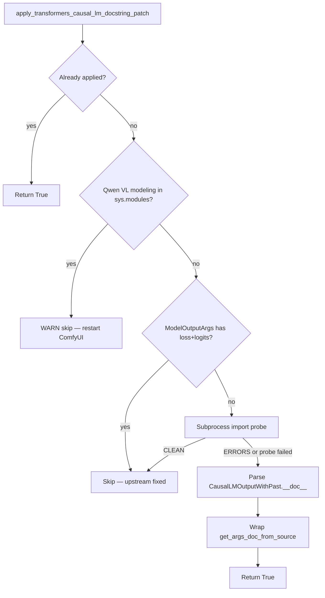

# Transformers Qwen VL CausalLM ModelOutput Docstring Patch (loss / logits)

This document explains the ComfyUI startup `[ERROR] loss` / `[ERROR] logits` messages from Hugging Face `transformers` when importing Qwen VL `ModelOutput` classes, the root cause inside upstream `auto_docstring`, and the fix implemented entirely inside **ComfyUI-QwenImageLoraLoader** (no `site-packages` edits, no stdout filtering).

**Environment when documented (2026-06):**

| Item | Value |
|------|--------|
| transformers | 5.12.1 |
| ComfyUI-QwenImageLoraLoader | v2.4.7 |
| Affected classes | `Qwen3VLCausalLMOutputWithPast`, `Qwen2_5_VLCausalLMOutputWithPast` |

---

## Design constraints

1. **Do not edit `transformers` in `site-packages`.** The workaround only monkey-patches `get_args_doc_from_source` in-process from this custom node.
2. **Apply only from `prestartup_script.py`.** Docstring patch runs **before** the v2.4.6 `apply_rotary_emb` compat block so Qwen VL imports see the wrapper first.
3. **Fully automatic upstream auto-disable.** Probe upstream on every ComfyUI start; install the wrapper only while upstream still emits `[ERROR] loss` / `[ERROR] logits`. **No user env vars or toggles.**

### Decision table

| Condition | Action | Log level |
|-----------|--------|-----------|
| Tagged wrapper already on `get_args_doc_from_source` | **Return True** (idempotent) | — |
| Qwen VL modeling modules already in `sys.modules` | **Skip** — restart required | WARNING |
| `ModelOutputArgs` already documents `loss` and `logits` | **Skip** — upstream schema fixed | INFO |
| Subprocess import probe prints `CLEAN` (no `[ERROR] loss/logits`) | **Skip** — upstream behavior fixed | INFO |
| Subprocess probe prints `ERRORS` or probe cannot run (`None`) | **Apply** wrapper if prior rows did not skip | INFO |
| `transformers.utils.auto_docstring` missing / no `get_args_doc_from_source` | **Skip** | DEBUG |

When Hugging Face fixes upstream, startup logs show a **skip** line instead of **Patched …**; no `pip` edits and no permanent `site-packages` mutation.

### Decision flow



---

## 1. Symptom and import chain

### 1.1 Exact error text

When ComfyUI loads custom nodes that import Qwen VL modeling modules, `transformers` may print four lines like:

```text
[ERROR] `loss` is part of Qwen3VLCausalLMOutputWithPast.__init__'s signature, but not documented. Make sure to add it to the docstring of the function in ...\transformers\models\qwen3_vl\modeling_qwen3_vl.py.
[ERROR] `logits` is part of Qwen3VLCausalLMOutputWithPast.__init__'s signature, but not documented. Make sure to add it to the docstring of the function in ...\transformers\models\qwen3_vl\modeling_qwen3_vl.py.
[ERROR] `loss` is part of Qwen2_5_VLCausalLMOutputWithPast.__init__'s signature, but not documented. Make sure to add it to the docstring of the function in ...\transformers\models\qwen2_5_vl\modeling_qwen2_5_vl.py.
[ERROR] `logits` is part of Qwen2_5_VLCausalLMOutputWithPast.__init__'s signature, but not documented. Make sure to add it to the docstring of the function in ...\transformers\models\qwen2_5_vl\modeling_qwen2_5_vl.py.
```

These are **not** Python exceptions. They are strings appended to an internal list during `@auto_docstring` processing at **import time**, then printed when the decorator runs.

### 1.2 Typical ComfyUI import chain

```text
ComfyUI main.py
  └─ prestartup_script.py (ComfyUI-QwenImageLoraLoader)  ← patch applied here
  └─ custom node __init__.py imports
       └─ transformers.models.qwen3_vl.modeling_qwen3_vl
            └─ @auto_docstring on Qwen3VLCausalLMOutputWithPast  → [ERROR] loss/logits
       └─ transformers.models.qwen2_5_vl.modeling_qwen2_5_vl
            └─ @auto_docstring on Qwen2_5_VLCausalLMOutputWithPast → [ERROR] loss/logits
```

Any workflow or node that triggers those module imports before the patch runs will still show errors until ComfyUI is restarted.

### 1.3 Verified environment

| Item | Value |
|------|--------|
| transformers | 5.12.1 |
| Affected classes | `Qwen3VLCausalLMOutputWithPast`, `Qwen2_5_VLCausalLMOutputWithPast` |
| Fix location | `ComfyUI-QwenImageLoraLoader` only |

---

## 2. Root cause (upstream behavior)

### 2.1 What `@auto_docstring` does for ModelOutput subclasses

Qwen VL defines dataclass outputs that subclass `CausalLMOutputWithPast`:

```python
@auto_docstring
@dataclass
class Qwen3VLCausalLMOutputWithPast(CausalLMOutputWithPast):
    r"""
    rope_deltas (...):
        ...
    """
    rope_deltas: torch.LongTensor | None = None
```

In `transformers.utils.auto_docstring.auto_class_docstring` (ModelOutput branch, ~line 4200):

1. `custom_args` is set from the class docstring (only `rope_deltas` for Qwen3 VL).
2. The **direct parent** docstring is appended: `CausalLMOutputWithPast.__doc__` (contains `loss`, `logits`, etc. under an `Args:` block).
3. `auto_method_docstring` builds `__init__` documentation using:
   - `source_args_dict=get_args_doc_from_source(ModelOutputArgs)` — a static dict of generic ModelOutput field templates.

Relevant upstream code (`transformers/utils/auto_docstring.py`, ModelOutput branch, ~lines 4200–4219):

```python
elif "ModelOutput" in (x.__name__ for x in cls.__mro__):
    # We have a data class
    is_dataclass = True
    ...
    direct_ancestor = cls.__mro__[1]
    if direct_ancestor.__name__ != "ModelOutput" and direct_ancestor.__doc__:
        custom_args = "" if custom_args is None else custom_args
        custom_args = "\n" + set_min_indent(direct_ancestor.__doc__.strip("\n"), 0) + "\n" + custom_args

    docstring_args = auto_method_docstring(
        cls.__init__,
        parent_class=cls,
        custom_args=custom_args,
        checkpoint=checkpoint,
        source_args_dict=get_args_doc_from_source(ModelOutputArgs),
    ).__doc__
```

### 2.2 Why `loss` and `logits` are “undocumented”

**Parent doc has the fields.** `CausalLMOutputWithPast.__doc__` documents `loss` and `logits`:

```python
# transformers/modeling_outputs.py — CausalLMOutputWithPast (~lines 610–618)
class CausalLMOutputWithPast(ModelOutput):
    """
    Base class for causal language model (or autoregressive) outputs.

    Args:
        loss (`torch.FloatTensor` of shape `(1,)`, *optional*, returned when `labels` is provided):
            Language modeling loss (for next-token prediction).
        logits (`torch.FloatTensor` of shape `(batch_size, sequence_length, config.vocab_size)`):
            Prediction scores of the language modeling head (scores for each vocabulary token before SoftMax).
```

**`ModelOutputArgs` does not.** The fallback template class used for all ModelOutput dataclasses omits `loss` and `logits`:

```python
# transformers/utils/auto_docstring.py — ModelOutputArgs (~lines 2171+)
class ModelOutputArgs:
    last_hidden_state = {
        "description": """
    Sequence of hidden-states at the output of the last layer of the model.
    """,
```

**Validation compares signature vs merged docs.** During doc generation, any `__init__` parameter not found in the merged documentation triggers an `[ERROR]` line (~line 3352):

```python
# transformers/utils/auto_docstring.py (~lines 3351–3353)
undocumented_parameters.append(
    f"[ERROR] `{param_name}` is part of {func.__qualname__}'s signature, but not documented. ..."
)
```

**Why parent `Args:` does not help by default:** `parse_docstring` uses `max_indent_level=0` at normal call sites. Parameters under `Args:` are indented (typically 4–8 spaces). With `max_indent_level=0`, only zero-indent lines match — so `loss` / `logits` inside the parent’s indented `Args:` block are **not** parsed into `params` when the concatenated `custom_args` string is processed. The code then falls back to `ModelOutputArgs`, which still lacks those keys.

### 2.3 Why not patch `site-packages` or filter stdout?

| Approach | Problem |
|----------|---------|
| Edit `transformers` in `site-packages` | Lost on upgrade; violates project constraint |
| Filter / hide `[ERROR]` on stdout | Masks real issues; does not fix validation |
| Patch `auto_class_docstring` only | Insufficient: `source_args_dict` comes from `get_args_doc_from_source(ModelOutputArgs)` |

The working fix patches **`get_args_doc_from_source`** so that whenever upstream requests `ModelOutputArgs`, the returned dict includes `loss` and `logits` extracted from `CausalLMOutputWithPast.__doc__` with `parse_docstring(..., max_indent_level=4)`.

---

## 3. Modified files (this extension)

| File | Change |
|------|--------|
| `patches/transformers_qwen_vl_docstring_patch.py` | **New.** Core monkey-patch, upstream probes, apply |
| `prestartup_script.py` | **Updated.** Applies docstring patch before rotary compat patch |
| `md/TRANSFORMERS_QWEN_VL_CAUSAL_LM_DOCSTRING_PATCH.md` | **This document** |

Unchanged for this fix: `patches/nunchaku_patch.py` (separate v2.4.6 `apply_rotary_emb` compat).

---

## 4. Source files (canonical)

Full implementation lives in the repository (not duplicated here, to avoid stale copies).

| File | Role |
|------|------|
| `patches/transformers_qwen_vl_docstring_patch.py` | Upstream probes; installs wrapper only when probes say patch is still needed |
| `prestartup_script.py` | Loads docstring patch via `importlib` **before** rotary compat |

Public API:

| Function | Returns |
|----------|---------|
| `apply_transformers_causal_lm_docstring_patch()` | `True` if wrapper active; `False` if skipped (upstream fixed or late import) |
| `is_patch_applied()` | Whether this process installed the wrapper |
| `is_patch_wrapped()` | Whether `get_args_doc_from_source` carries the patch tag |

`apply_transformers_causal_lm_docstring_patch()` decision order (matches **Design constraints** above):

1. Already applied → return `True`
2. Qwen VL modeling already in `sys.modules` → warn, return `False` (restart ComfyUI)
3. `ModelOutputArgs` already documents `loss` and `logits` → skip (upstream fixed)
4. Subprocess import probe prints `CLEAN` → skip (no docstring errors without patch)
5. Subprocess probe prints `ERRORS` **or** probe cannot run (`None`) → install wrapper around `get_args_doc_from_source`

**No environment variables.** When Hugging Face fixes `transformers`, steps 3–4 skip installation automatically on the next ComfyUI start.

---

## 5. How the fix works (runtime)

### 5.1 Injection point

| Function | Role |
|----------|------|
| `get_args_doc_from_source(ModelOutputArgs)` | Returns `ModelOutputArgs.__dict__` (missing `loss` / `logits`) |
| **Wrapped** `get_args_doc_from_source` | Same return value, but merges `loss` / `logits` entries when the requested class is `ModelOutputArgs` |
| `auto_class_docstring` → `auto_method_docstring` | Uses enriched dict; validation passes |

Supplemental entries are built once at apply time from `CausalLMOutputWithPast.__doc__` using the same `parse_docstring` helper upstream uses, with **`max_indent_level=4`** so indented `Args:` entries are captured.

### 5.2 Startup order in `prestartup_script.py`

1. Load `patches/transformers_qwen_vl_docstring_patch.py` via `importlib` and call `apply_transformers_causal_lm_docstring_patch()`.
2. Load `patches/nunchaku_patch.py` and call `apply_qwen_image_apply_rotary_emb_compat()` (v2.4.6; separate fix).

See **Decision flow** under **Design constraints** for the docstring patch decision tree.

### 5.3 Idempotency

The wrapper sets `_qwen_lora_loader_causal_lm_docstring_patch = True`. A second `apply_*()` call detects the tag and returns without double-wrapping.

---

## 6. Automatic upstream disable (same idea as v2.4.6 rotary patch)

**Fully automatic on every ComfyUI start.** No user configuration. The wrapper is installed **only while upstream `transformers` still triggers `[ERROR] loss` / `[ERROR] logits`**, and **is not installed** once Hugging Face fixes `ModelOutputArgs` or a clean subprocess import probe shows zero errors.

| Scenario | Behavior |
|----------|----------|
| **A. Upstream fix (schema)** | `ModelOutputArgs` has `loss` and `logits` with non-empty `description` → skip patch, log INFO |
| **B. Upstream fix (probe)** | Subprocess imports Qwen VL without this patch; stdout ends with `CLEAN` → skip patch, log INFO |
| **C. Late import** | Qwen VL modules already in `sys.modules` before prestartup → WARN; patch not applied until restart |
| **D. Missing API** | No `get_args_doc_from_source` or cannot parse parent doc → skip, log DEBUG |
| **E. Probe inconclusive** | Subprocess probe fails (`None`) but schema still broken → **install** wrapper (safe default) |

When **A** or **B** applies, no wrapper is installed — the same prestartup / probe-first pattern as v2.4.6 `apply_rotary_emb` compat.

**Difference from v2.4.6 rotary compat:** this docstring patch has **no** `QWENIMAGE_*` (or other) environment opt-out. Skipping is driven only by upstream probes (schema + subprocess import) or late-import / missing-API conditions in the decision table above.

---

## 7. Verification

### 7.1 Expected ComfyUI log

**When the wrapper applies** (upstream still broken, prestartup ran before Qwen VL import):

```text
[INFO] Patched transformers.utils.auto_docstring.get_args_doc_from_source for Qwen VL CausalLM ModelOutput docstrings (loss/logits); removes when upstream adds them
[INFO] ComfyUI-QwenImageLoraLoader prestartup: CausalLM ModelOutput docstring patch applied
```

**When upstream is already fixed** (schema or probe skip — no wrapper):

```text
[INFO] CausalLM ModelOutput docstring patch skipped: transformers ModelOutputArgs already documents loss and logits (upstream fixed — patch not installed)
```

or

```text
[INFO] CausalLM ModelOutput docstring patch skipped: Qwen VL ModelOutput docstrings resolve loss/logits without docstring errors (upstream fixed — patch not installed)
[DEBUG] ComfyUI-QwenImageLoraLoader prestartup: CausalLM ModelOutput docstring patch not applied
```

**When Qwen VL imported too early** (restart required):

```text
[WARNING] CausalLM ModelOutput docstring patch skipped: Qwen VL modeling modules already imported before prestartup — restart ComfyUI
[DEBUG] ComfyUI-QwenImageLoraLoader prestartup: CausalLM ModelOutput docstring patch not applied
```

In all success cases: **zero** stdout lines containing `[ERROR]` and `` `loss` `` or `` `logits` `` for the Qwen VL `*CausalLMOutputWithPast` classes after a clean restart.

---

## 8. Summary

| Topic | Detail |
|-------|--------|
| **Problem** | `@auto_docstring` on Qwen VL `*CausalLMOutputWithPast` dataclasses |
| **Cause** | `ModelOutputArgs` lacks `loss`/`logits`; parent `Args:` not parsed at indent 0 |
| **Fix** | Wrap `get_args_doc_from_source` in custom node `prestartup_script.py` |
| **Scope** | ComfyUI-QwenImageLoraLoader only; no `site-packages` changes |
| **Auto-disable** | Upstream `ModelOutputArgs` fix and/or clean subprocess import probe; no user env vars |
| **Related** | [v2.4.6 apply_rotary_emb compat](https://github.com/ussoewwin/ComfyUI-QwenImageLoraLoader/releases/tag/v2.4.6) — same prestartup / self-disable pattern |

---

## 9. References (upstream source lines, transformers 5.12.1)

| Location | Line (approx.) | Note |
|----------|----------------|------|
| `modeling_outputs.py` — `CausalLMOutputWithPast` | 610–641 | Source of `loss` / `logits` doc text |
| `modeling_qwen3_vl.py` — `Qwen3VLCausalLMOutputWithPast` | 1267–1276 | `@auto_docstring` dataclass |
| `auto_docstring.py` — `ModelOutputArgs` | 2171+ | Missing `loss` / `logits` |
| `auto_docstring.py` — `get_args_doc_from_source` | 2855–2858 | Patch target |
| `auto_docstring.py` — `parse_docstring` | 2617+ | `max_indent_level` behavior |
| `auto_docstring.py` — ModelOutput branch | 4200–4219 | Uses `ModelOutputArgs` dict |
| `auto_docstring.py` — error message | 3351–3353 | `[ERROR] ... not documented` |
