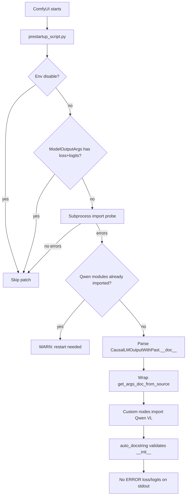

# Transformers Qwen VL CausalLM ModelOutput Docstring Patch (loss / logits)

This document explains the ComfyUI startup `[ERROR] loss` / `[ERROR] logits` messages from Hugging Face `transformers` when importing Qwen VL `ModelOutput` classes, the root cause inside upstream `auto_docstring`, and the fix implemented entirely inside **ComfyUI-QwenImageLoraLoader** (no `site-packages` edits, no stdout filtering).

---

## 1. Symptom and import chain

### 1.1 Exact error text

When ComfyUI loads custom nodes that import Qwen VL modeling modules, `transformers` may print four lines like:

```text
[ERROR] `loss` is part of Qwen3VLCausalLMOutputWithPast.__init__'s signature, but not documented. Make sure to add it to the docstring of the function in ...\transformers\models\qwen3_vl\modeling_qwen3_vl.py.
[ERROR] `logits` is part of Qwen3VLCausalLMOutputWithPast.__init__'s signature, but not documented. Make sure to add it to the docstring of the function in ...\transformers\models\qwen3_vl\modeling_qwen3_vl.py.
[ERROR] `loss` is part of Qwen2_5_VLCausalLMOutputWithPast.__init__'s signature, but not documented. Make sure to add it to the docstring of the function in ...\transformers\models\qwen2_5_vl\modeling_qwen2_5_vl.py.
[ERROR] `logits` is part of Qwen2_5_VLCausalLMOutputWithPast.__init__'s signature, but not documented. Make sure to add it to the docstring of the function in ...\transformers\models\qwen2_5_vl\modeling_qwen2_5_vl.py.
```

These are **not** Python exceptions. They are strings appended to an internal list during `@auto_docstring` processing at **import time**, then printed when the decorator runs.

### 1.2 Typical ComfyUI import chain

```text
ComfyUI main.py
  └─ prestartup_script.py (ComfyUI-QwenImageLoraLoader)  ← patch applied here
  └─ custom node __init__.py imports
       └─ transformers.models.qwen3_vl.modeling_qwen3_vl
            └─ @auto_docstring on Qwen3VLCausalLMOutputWithPast  → [ERROR] loss/logits
       └─ transformers.models.qwen2_5_vl.modeling_qwen2_5_vl
            └─ @auto_docstring on Qwen2_5_VLCausalLMOutputWithPast → [ERROR] loss/logits
```

Any workflow or node that triggers those module imports before the patch runs will still show errors until ComfyUI is restarted.

### 1.3 Verified environment

| Item | Value |
|------|--------|
| transformers | 5.12.1 |
| Affected classes | `Qwen3VLCausalLMOutputWithPast`, `Qwen2_5_VLCausalLMOutputWithPast` |
| Fix location | `ComfyUI-QwenImageLoraLoader` only |

---

## 2. Root cause (upstream behavior)

### 2.1 What `@auto_docstring` does for ModelOutput subclasses

Qwen VL defines dataclass outputs that subclass `CausalLMOutputWithPast`:

```python
@auto_docstring
@dataclass
class Qwen3VLCausalLMOutputWithPast(CausalLMOutputWithPast):
    r"""
    rope_deltas (...):
        ...
    """
    rope_deltas: torch.LongTensor | None = None
```

In `transformers.utils.auto_docstring.auto_class_docstring` (ModelOutput branch, ~line 4200):

1. `custom_args` is set from the class docstring (only `rope_deltas` for Qwen3 VL).
2. The **direct parent** docstring is appended: `CausalLMOutputWithPast.__doc__` (contains `loss`, `logits`, etc. under an `Args:` block).
3. `auto_method_docstring` builds `__init__` documentation using:
   - `source_args_dict=get_args_doc_from_source(ModelOutputArgs)` — a static dict of generic ModelOutput field templates.

Relevant upstream code:

```4200:4219:D:\USERFILES\ComfyUI\python_embeded\Lib\site-packages\transformers\utils\auto_docstring.py
    elif "ModelOutput" in (x.__name__ for x in cls.__mro__):
        # We have a data class
        is_dataclass = True
        ...
        direct_ancestor = cls.__mro__[1]
        if direct_ancestor.__name__ != "ModelOutput" and direct_ancestor.__doc__:
            custom_args = "" if custom_args is None else custom_args
            custom_args = "\n" + set_min_indent(direct_ancestor.__doc__.strip("\n"), 0) + "\n" + custom_args

        docstring_args = auto_method_docstring(
            cls.__init__,
            parent_class=cls,
            custom_args=custom_args,
            checkpoint=checkpoint,
            source_args_dict=get_args_doc_from_source(ModelOutputArgs),
        ).__doc__
```

### 2.2 Why `loss` and `logits` are “undocumented”

**Parent doc has the fields.** `CausalLMOutputWithPast.__doc__` documents `loss` and `logits`:

```610:618:D:\USERFILES\ComfyUI\python_embeded\Lib\site-packages\transformers\modeling_outputs.py
class CausalLMOutputWithPast(ModelOutput):
    """
    Base class for causal language model (or autoregressive) outputs.

    Args:
        loss (`torch.FloatTensor` of shape `(1,)`, *optional*, returned when `labels` is provided):
            Language modeling loss (for next-token prediction).
        logits (`torch.FloatTensor` of shape `(batch_size, sequence_length, config.vocab_size)`):
            Prediction scores of the language modeling head (scores for each vocabulary token before SoftMax).
```

**`ModelOutputArgs` does not.** The fallback template class used for all ModelOutput dataclasses omits `loss` and `logits`:

```2171:2177:D:\USERFILES\ComfyUI\python_embeded\Lib\site-packages\transformers\utils\auto_docstring.py
class ModelOutputArgs:
    last_hidden_state = {
        "description": """
    Sequence of hidden-states at the output of the last layer of the model.
    """,
```

**Validation compares signature vs merged docs.** During doc generation, any `__init__` parameter not found in the merged documentation triggers an `[ERROR]` line (~line 3352):

```3351:3353:D:\USERFILES\ComfyUI\python_embeded\Lib\site-packages\transformers\utils\auto_docstring.py
            undocumented_parameters.append(
                f"[ERROR] `{param_name}` is part of {func.__qualname__}'s signature, but not documented. Make sure to add it to the docstring of the function in {_source_file}."
            )
```

**Why parent `Args:` does not help by default:** `parse_docstring` uses `max_indent_level=0` at all normal call sites. Parameters under `Args:` are indented (e.g. 8 spaces). With `max_indent_level=0`, only top-level `(^\\s{0,0}\\w+...)` matches — so `loss` / `logits` inside the parent’s indented `Args:` block are **not** parsed into `params` when the concatenated `custom_args` string is processed. The code then falls back to `ModelOutputArgs`, which still lacks those keys.

### 2.3 Why not patch `site-packages` or filter stdout?

| Approach | Problem |
|----------|---------|
| Edit `transformers` in `site-packages` | Lost on upgrade; violates project constraint |
| Filter / hide `[ERROR]` on stdout | Masks real issues; does not fix validation |
| Patch `auto_class_docstring` only | Insufficient: `source_args_dict` comes from `get_args_doc_from_source(ModelOutputArgs)` |

The working fix patches **`get_args_doc_from_source`** so that whenever upstream requests `ModelOutputArgs`, the returned dict includes `loss` and `logits` extracted from `CausalLMOutputWithPast.__doc__` with `parse_docstring(..., max_indent_level=4)`.

---

## 3. Modified files (this extension)

| File | Change |
|------|--------|
| `patches/transformers_qwen_vl_docstring_patch.py` | **New.** Core monkey-patch, probes, apply/remove |
| `prestartup_script.py` | **Updated.** Applies docstring patch before rotary compat patch |
| `md/TRANSFORMERS_QWEN_VL_CAUSAL_LM_DOCSTRING_PATCH.md` | **This document** |

Unchanged for this fix: `patches/nunchaku_patch.py` (separate v2.4.6 `apply_rotary_emb` compat).

---

## 4. Full added / modified source code

### 4.1 `patches/transformers_qwen_vl_docstring_patch.py` (complete)

```python
"""
Runtime patch for transformers Qwen VL CausalLM ModelOutput @auto_docstring errors.

At import time, @auto_docstring on Qwen3VLCausalLMOutputWithPast and
Qwen2_5_VLCausalLMOutputWithPast validates __init__ parameters against
documentation built from ModelOutputArgs. That template omits loss/logits
even though subclasses inherit those fields from CausalLMOutputWithPast.

Fix: wrap get_args_doc_from_source so ModelOutputArgs merges loss/logits
from CausalLMOutputWithPast.__doc__ (parse_docstring max_indent_level=4).

Self-disables when upstream ModelOutputArgs already documents loss+logits,
when env TRANSFORMERS_CAUSAL_LM_DOCSTRING_PATCH disables the patch, or when
a subprocess import probe shows no [ERROR] loss/logits without the patch.

No site-packages edits. Idempotent via _qwen_lora_loader_causal_lm_docstring_patch.
"""

from __future__ import annotations

import importlib
import io
import os
import subprocess
import sys
from contextlib import redirect_stdout
from typing import Any, Callable

_PATCH_TAG = "_qwen_lora_loader_causal_lm_docstring_patch"
_ENV_DISABLE = "TRANSFORMERS_CAUSAL_LM_DOCSTRING_PATCH"
_DISABLE_VALUES = frozenset({"0", "false", "off", "no", "disable", "disabled"})

_QWEN3_MODULE = "transformers.models.qwen3_vl.modeling_qwen3_vl"
_QWEN25_MODULE = "transformers.models.qwen2_5_vl.modeling_qwen2_5_vl"
_QWEN3_CLASS = "Qwen3VLCausalLMOutputWithPast"
_QWEN25_CLASS = "Qwen2_5_VLCausalLMOutputWithPast"

_ERROR_MARKERS = (
    "[ERROR] `loss`",
    "[ERROR] `logits`",
)


def _env_disabled() -> bool:
    return os.environ.get(_ENV_DISABLE, "").strip().lower() in _DISABLE_VALUES


def _get_auto_docstring_module():
    return importlib.import_module("transformers.utils.auto_docstring")


def _get_model_output_args_class(auto_mod):
    return getattr(auto_mod, "ModelOutputArgs", None)


def _get_causal_lm_output_with_past(auto_mod):
    try:
        from transformers.modeling_outputs import CausalLMOutputWithPast
        return CausalLMOutputWithPast
    except ImportError:
        return None


def _parse_docstring(auto_mod, docstring: str, max_indent_level: int = 4) -> dict:
    parse_fn = getattr(auto_mod, "parse_docstring", None)
    if parse_fn is None:
        return {}
    result = parse_fn(docstring, max_indent_level=max_indent_level)
    if isinstance(result, tuple):
        params = result[0]
        return params if isinstance(params, dict) else {}
    return result if isinstance(result, dict) else {}


def _extract_loss_logits_from_causal_lm_doc(auto_mod) -> dict[str, Any]:
    causal_cls = _get_causal_lm_output_with_past(auto_mod)
    if causal_cls is None or not getattr(causal_cls, "__doc__", None):
        return {}
    params = _parse_docstring(auto_mod, causal_cls.__doc__, max_indent_level=4)
    out: dict[str, Any] = {}
    for key in ("loss", "logits"):
        if key in params:
            out[key] = params[key]
    return out


def _model_output_args_has_loss_logits(auto_mod) -> bool:
    moa = _get_model_output_args_class(auto_mod)
    if moa is None:
        return False
    loss = getattr(moa, "loss", None)
    logits = getattr(moa, "logits", None)
    if not isinstance(loss, dict) or not isinstance(logits, dict):
        return False
    return bool(loss.get("description")) and bool(logits.get("description"))


def _is_model_output_args(obj: Any, auto_mod) -> bool:
    moa = _get_model_output_args_class(auto_mod)
    return moa is not None and obj is moa


def _make_wrapped_get_args(
    original: Callable[..., dict],
    auto_mod,
    supplemental: dict[str, Any],
) -> Callable[..., dict]:
    def wrapped(args_classes: object | list[object]) -> dict:
        result = dict(original(args_classes))
        if _is_model_output_args(args_classes, auto_mod):
            for key, value in supplemental.items():
                if key not in result:
                    result[key] = value
        elif isinstance(args_classes, (list, tuple)):
            for cls in args_classes:
                if _is_model_output_args(cls, auto_mod):
                    for key, value in supplemental.items():
                        if key not in result:
                            result[key] = value
                    break
        return result

    setattr(wrapped, _PATCH_TAG, True)
    wrapped._qwen_lora_loader_original = original  # type: ignore[attr-defined]
    return wrapped


def _qwen_modules_already_imported() -> bool:
    return _QWEN3_MODULE in sys.modules or _QWEN25_MODULE in sys.modules


def _count_error_markers(text: str) -> int:
    return sum(text.count(m) for m in _ERROR_MARKERS)


def _subprocess_import_probe() -> tuple[bool, str]:
    """
    Import Qwen VL output classes in a child process without our patch.
    Returns (needs_patch, diagnostic_message).
    """
    code = f"""
import io, sys
from contextlib import redirect_stdout
buf = io.StringIO()
try:
    with redirect_stdout(buf):
        import transformers.models.qwen3_vl.modeling_qwen3_vl as m3
        import transformers.models.qwen2_5_vl.modeling_qwen2_5_vl as m25
        _ = m3.{_QWEN3_CLASS}
        _ = m25.{_QWEN25_CLASS}
except Exception as e:
    print("PROBE_EXCEPTION:", e, file=buf)
out = buf.getvalue()
markers = sum(out.count(x) for x in {list(_ERROR_MARKERS)!r})
print("PROBE_MARKERS", markers)
print("PROBE_LEN", len(out))
"""
    try:
        proc = subprocess.run(
            [sys.executable, "-c", code],
            capture_output=True,
            text=True,
            timeout=120,
            env={k: v for k, v in os.environ.items() if k != _ENV_DISABLE},
        )
    except (subprocess.TimeoutExpired, OSError) as exc:
        return True, f"subprocess probe failed ({exc}); applying patch conservatively"

    combined = (proc.stdout or "") + (proc.stderr or "")
    markers = 0
    for line in combined.splitlines():
        if line.startswith("PROBE_MARKERS"):
            try:
                markers = int(line.split()[-1])
            except ValueError:
                pass
    if proc.returncode != 0 and markers == 0:
        return True, f"subprocess probe exit {proc.returncode}; applying patch conservatively"
    if markers > 0:
        return True, f"subprocess probe saw {markers} loss/logits error marker(s)"
    return False, "subprocess probe: no loss/logits error markers without patch"


def apply_transformers_qwen_vl_causal_lm_docstring_patch() -> bool:
    """
    Install get_args_doc_from_source wrapper if needed.
    Returns True if patch is active (installed or already present).
    """
    if _env_disabled():
        print(
            f"[INFO] ComfyUI-QwenImageLoraLoader: {_ENV_DISABLE} set; "
            "skipping CausalLM ModelOutput docstring patch"
        )
        return False

    auto_mod = _get_auto_docstring_module()
    get_args = getattr(auto_mod, "get_args_doc_from_source", None)
    if get_args is None:
        print(
            "[WARNING] ComfyUI-QwenImageLoraLoader: "
            "transformers.utils.auto_docstring.get_args_doc_from_source not found; "
            "skipping docstring patch"
        )
        return False

    if getattr(get_args, _PATCH_TAG, False):
        return True

    if _model_output_args_has_loss_logits(auto_mod):
        print(
            "[INFO] ComfyUI-QwenImageLoraLoader: upstream ModelOutputArgs already "
            "documents loss/logits; skipping docstring patch"
        )
        return False

    needs_patch, probe_msg = _subprocess_import_probe()
    if not needs_patch:
        print(
            f"[INFO] ComfyUI-QwenImageLoraLoader: {probe_msg}; "
            "skipping docstring patch"
        )
        return False

    if _qwen_modules_already_imported():
        print(
            "[WARNING] ComfyUI-QwenImageLoraLoader: Qwen VL modeling modules already "
            "imported before docstring patch; restart ComfyUI for a clean apply. "
            f"({probe_msg})"
        )
        return False

    supplemental = _extract_loss_logits_from_causal_lm_doc(auto_mod)
    if "loss" not in supplemental or "logits" not in supplemental:
        print(
            "[WARNING] ComfyUI-QwenImageLoraLoader: could not extract loss/logits "
            "from CausalLMOutputWithPast.__doc__; skipping docstring patch"
        )
        return False

    wrapped = _make_wrapped_get_args(get_args, auto_mod, supplemental)
    auto_mod.get_args_doc_from_source = wrapped
    print(
        "[INFO] Patched transformers.utils.auto_docstring.get_args_doc_from_source "
        "for Qwen VL CausalLM ModelOutput docstrings (loss/logits); "
        "removes when upstream adds them"
    )
    return True


def remove_transformers_qwen_vl_causal_lm_docstring_patch() -> bool:
    """Restore original get_args_doc_from_source if our wrapper is installed."""
    auto_mod = _get_auto_docstring_module()
    get_args = getattr(auto_mod, "get_args_doc_from_source", None)
    if get_args is None or not getattr(get_args, _PATCH_TAG, False):
        return False
    original = getattr(get_args, "_qwen_lora_loader_original", None)
    if original is not None:
        auto_mod.get_args_doc_from_source = original
        return True
    return False


def verify_patch_in_process() -> dict[str, Any]:
    """Import Qwen VL output classes in-process; return error counts (for tests)."""
    auto_mod = _get_auto_docstring_module()
    get_args = getattr(auto_mod, "get_args_doc_from_source", None)
    buf = io.StringIO()
    errors_before = 0
    try:
        with redirect_stdout(buf):
            if _QWEN3_MODULE in sys.modules:
                del sys.modules[_QWEN3_MODULE]
            if _QWEN25_MODULE in sys.modules:
                del sys.modules[_QWEN25_MODULE]
            import transformers.models.qwen3_vl.modeling_qwen3_vl as m3
            import transformers.models.qwen2_5_vl.modeling_qwen2_5_vl as m25
            _ = m3.Qwen3VLCausalLMOutputWithPast
            _ = m25.Qwen2_5_VLCausalLMOutputWithPast
    except Exception as exc:
        return {
            "ok": False,
            "exception": str(exc),
            "errors": -1,
            "output": buf.getvalue(),
            "patched": bool(get_args and getattr(get_args, _PATCH_TAG, False)),
        }
    out = buf.getvalue()
    errors = _count_error_markers(out)
    return {
        "ok": errors == 0,
        "errors": errors,
        "output": out,
        "patched": bool(get_args and getattr(get_args, _PATCH_TAG, False)),
    }
```

### 4.2 `prestartup_script.py` (complete)

```python
"""
ComfyUI prestartup hook for ComfyUI-QwenImageLoraLoader.

Runs before custom node package __init__ files are loaded so runtime patches
apply before heavy imports (transformers Qwen VL, nunchaku, etc.).
"""

from __future__ import annotations

import os
import sys


def _patch_nunchaku_apply_rotary_emb_compat() -> None:
    """Apply apply_rotary_emb compat patch (v2.4.6); see md/QWEN_IMAGE_APPLY_ROTARY_EMB_COMPAT_FIX.md."""
    try:
        from patches.nunchaku_patch import apply_nunchaku_patch

        apply_nunchaku_patch()
    except Exception as exc:
        print(
            f"[WARNING] ComfyUI-QwenImageLoraLoader prestartup: "
            f"nunchaku apply_rotary_emb compat patch failed: {exc}"
        )


def _patch_transformers_qwen_vl_causal_lm_docstring() -> None:
    """Apply transformers Qwen VL CausalLM ModelOutput docstring patch (loss/logits)."""
    try:
        from patches.transformers_qwen_vl_docstring_patch import (
            apply_transformers_qwen_vl_causal_lm_docstring_patch,
        )

        if apply_transformers_qwen_vl_causal_lm_docstring_patch():
            print(
                "[INFO] ComfyUI-QwenImageLoraLoader prestartup: "
                "CausalLM ModelOutput docstring patch applied"
            )
    except Exception as exc:
        print(
            f"[WARNING] ComfyUI-QwenImageLoraLoader prestartup: "
            f"CausalLM ModelOutput docstring patch failed: {exc}"
        )


# Docstring patch first: must run before any Qwen VL modeling import.
_patch_transformers_qwen_vl_causal_lm_docstring()
_patch_nunchaku_apply_rotary_emb_compat()
```

---

## 5. How the fix works (runtime)

### 5.1 Injection point

| Function | Role |
|----------|------|
| `get_args_doc_from_source(ModelOutputArgs)` | Returns `ModelOutputArgs.__dict__` (missing `loss` / `logits`) |
| **Wrapped** `get_args_doc_from_source` | Same return value, but merges `loss` / `logits` entries when the requested class is `ModelOutputArgs` |
| `auto_class_docstring` → `auto_method_docstring` | Uses enriched dict; validation passes |

Supplemental entries are built once at apply time from `CausalLMOutputWithPast.__doc__` using the same `parse_docstring` helper upstream uses, with **`max_indent_level=4`** so indented `Args:` entries are captured.

### 5.2 Flow (mermaid)



### 5.3 Idempotency

The wrapper sets `_qwen_lora_loader_causal_lm_docstring_patch = True`. A second `apply_*()` call detects the tag and returns without double-wrapping.

---

## 6. Upstream self-disable (same idea as v2.4.6 rotary patch)

The patch is **temporary**. It should stop applying when Hugging Face fixes upstream or when the environment no longer needs it.

| Scenario | Behavior |
|----------|----------|
| **A. Upstream fix** | `ModelOutputArgs` gains `loss` and `logits` with non-empty `description` → skip patch, log info |
| **B. User disable** | `TRANSFORMERS_CAUSAL_LM_DOCSTRING_PATCH=0` (or `false` / `off` / `no` / `disable` / `disabled`) → skip patch |
| **C. Subprocess probe** | Fresh Python imports Qwen VL classes without patch; if zero `[ERROR] loss/logits` markers → skip patch |
| **D. Late import** | Qwen VL modules already in `sys.modules` → warn; patch not applied (restart required) |
| **E. Missing API** | No `get_args_doc_from_source` or cannot parse parent doc → skip with warning |

This mirrors the v2.4.6 pattern: probe upstream, patch only when needed, document removal conditions.

---

## 7. Verification

### 7.1 Expected ComfyUI log (success)

After a clean restart with the patch applied **before** any Qwen VL import:

```text
[INFO] Patched transformers.utils.auto_docstring.get_args_doc_from_source for Qwen VL CausalLM ModelOutput docstrings (loss/logits); removes when upstream adds them
[INFO] ComfyUI-QwenImageLoraLoader prestartup: CausalLM ModelOutput docstring patch applied
```

Full startup should show **zero** lines containing `[ERROR] \`loss\`` or `[ERROR] \`logits\`` for the Qwen VL output classes.

### 7.2 In-process check (optional)

From the extension root, with ComfyUI’s Python:

```bat
cmd /c "cd /d D:\USERFILES\ComfyUI\ComfyUI\custom_nodes\ComfyUI-QwenImageLoraLoader && D:\USERFILES\ComfyUI\python_embeded\python.exe -c \"from patches.transformers_qwen_vl_docstring_patch import apply_transformers_qwen_vl_causal_lm_docstring_patch, verify_patch_in_process; apply_transformers_qwen_vl_causal_lm_docstring_patch(); print(verify_patch_in_process())\""
```

Expected: `'ok': True`, `'errors': 0`, `'patched': True`.

### 7.3 Disable probe

```bat
set TRANSFORMERS_CAUSAL_LM_DOCSTRING_PATCH=0
```

Restart ComfyUI: patch skip message should appear; if upstream is still broken, `[ERROR] loss/logits` may return.

---

## 8. Summary

| Topic | Detail |
|-------|--------|
| **Problem** | `@auto_docstring` on Qwen VL `*CausalLMOutputWithPast` dataclasses |
| **Cause** | `ModelOutputArgs` lacks `loss`/`logits`; parent `Args:` not parsed at indent 0 |
| **Fix** | Wrap `get_args_doc_from_source` in custom node `prestartup_script.py` |
| **Scope** | ComfyUI-QwenImageLoraLoader only; no `site-packages` changes |
| **Self-disable** | Upstream fix, env var, subprocess probe, idempotent wrapper |
| **Related** | [v2.4.6 apply_rotary_emb compat](https://github.com/ussoewwin/ComfyUI-QwenImageLoraLoader/releases/tag/v2.4.6) — same prestartup / self-disable pattern |

---

## 9. References (upstream source lines, transformers 5.12.1)

| Location | Line (approx.) | Note |
|----------|----------------|------|
| `modeling_outputs.py` — `CausalLMOutputWithPast` | 610–641 | Source of `loss` / `logits` doc text |
| `modeling_qwen3_vl.py` — `Qwen3VLCausalLMOutputWithPast` | 1267–1276 | `@auto_docstring` dataclass |
| `auto_docstring.py` — `ModelOutputArgs` | 2171+ | Missing `loss` / `logits` |
| `auto_docstring.py` — `get_args_doc_from_source` | 2855–2858 | Patch target |
| `auto_docstring.py` — `parse_docstring` | 2617+ | `max_indent_level` behavior |
| `auto_docstring.py` — ModelOutput branch | 4200–4219 | Uses `ModelOutputArgs` dict |
| `auto_docstring.py` — error message | 3351–3353 | `[ERROR] ... not documented` |
