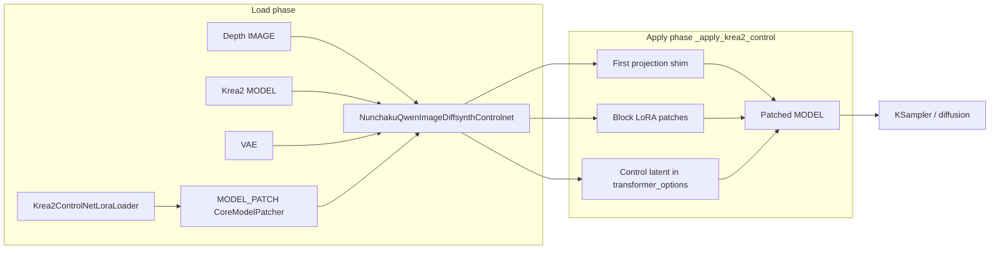

<table align="center">
  <tr>
    <td align="center" bgcolor="#3478ca" width="88" height="36"><font color="#ffffff"><b>EN</b></font></td>
    <td align="center" bgcolor="#e5e7eb" width="88" height="36"><a href="https://github.com/ussoewwin/ComfyUI-QwenImageLoraLoader/blob/main/zhmd/v2.5.1.md"><font color="#4b5563"><b>中文</b></font></a></td>
  </tr>
</table>

## 1. Baseline and commit range

| Item | Value |
|------|--------|
| Baseline commit | `ddb37ff19ee358c6fd9ec777bd4334c72b18d229` |
| Compare range | `ddb37ff..HEAD` (22 commits at time of writing) |
| Feature commits (core) | `84d111a`, `c191309`, `e0e0231`, `7622aca`, `188bc83`, `a47ca7d`, `f9f8de4`, `035bad4` |

At baseline, **`NunchakuQwenImageDiffsynthControlnet`** only routed Z-Image, Nunchaku Qwen Image, and standard Qwen Image. There was **no Krea2 path** and **no `Krea2ControlNetLoraLoader`**.

---

## 2. Files created or modified

| File | Status | Role |
|------|--------|------|
| `nodes/lora/krea2_controlnet_lora.py` | **New** | Load Krea2 control LoRA from `controlnet/` → `MODEL_PATCH` |
| `nodes/controlnet.py` | **Modified** | Krea2 routing + three-layer control apply (first projection, block LoRA, control latent) |
| `__init__.py` | **Modified** | Register `Krea2ControlNetLoraLoader` node |

---

## 3. Architecture overview

Krea2 control is **not** a classic DiffSynth ControlNet UNet patch. The safetensors file is a **LoRA-style bundle** that:

1. **Expands** `diffusion_model.first` (concat image + control token features at the first linear)
2. **Patches** transformer block weights via ComfyUI `LoRAAdapter` + `add_patches`
3. **Injects** a VAE-encoded **control latent** each forward via a diffusion-model wrapper



### 3.1 Routing table (`_classify_controlnet_target`)

| Route | Detection | Handler |
|-------|-----------|---------|
| `zimage` | `model_patch.model` is `ZImage_Control` | `ZImageControlPatch` |
| `nunchaku_qwenimage` | `model.model.__class__.__name__ == "NunchakuQwenImage"` | `DiffSynthCnetBlockReplace` loop |
| `qwenimage_standard` | `diffusion_model` is `ComfyQwenImageWrapper` or `NunchakuQwenImageTransformer2DModel` | `DiffSynthCnetPatch` |
| `krea2` | `diffusion_model` is `SingleStreamDiT` **or** module path contains `comfy.ldm.krea2` | `_apply_krea2_control` |
| `unknown` | Anything else | **`RuntimeError`** (strict; no silent fallback) |

**Important change vs baseline:** Previously, `ComfyQwenImageWrapper` could be treated as Nunchaku when the base was `NunchakuQwenImage`. Routing is now **split by model family** so Krea2 LoRA weights never run through Qwen/Z-Image DiffSynth paths (`c191309`).

### 3.2 Call path (load + sampling)

**Load phase (workflow wiring, once per graph execution):**

```
Krea2ControlNetLoraLoader.load_model_patch(name)
  → comfy.utils.load_torch_file(controlnet/<name>)
  → _Krea2LoraAsModelPatch(state_dict)
  → CoreModelPatcher(...)  # MODEL_PATCH output

NunchakuQwenImageDiffsynthControlnet.diffsynth_controlnet_nunchaku(model, model_patch, vae, image, strength)
  → model.clone()
  → _classify_controlnet_target(model, model_patch)  → "krea2"
  → _apply_krea2_control(model_patched, model_patch, vae, image, strength)
       ├─ expanded first.weight → _Krea2FirstProjection
       ├─ blocks.* LoRA pairs → add_patches(LoRAAdapter, strength_patch=strength)
       ├─ VAE encode(depth image) → transformer_options["krea2_control_latent"]
       ├─ add_wrapper_with_key(DIFFUSION_MODEL, _krea2_make_wrapper)
       ├─ set_injections(_krea2_make_injection)
       └─ ON_DETACH / ON_CLEANUP callbacks → _krea2_restore_callback
  → return (patched MODEL,)
```

**Sampling phase (each diffusion forward):**

```
KSampler
  → comfy.sample.sample
    → samplers: calc_cond_batch / model apply
      → patched MODEL forward
        → diffusion_model wrapper (_krea2_make_wrapper)
             ├─ read transformer_options["krea2_control_latent"]
             ├─ _krea2_latent_to_tokens(...) → projection.control_tokens
             ├─ swap diffusion_model.first → _Krea2FirstProjection
             └─ finally: restore previous first / control_tokens
        → _Krea2FirstProjection.forward(image_tokens)
             ├─ concat(image_tokens, control_tokens * strength) on last dim
             └─ F.linear with expanded weight from LoRA file
        → SingleStreamDiT blocks (with LoRA patches merged on weights)
```

**Key point:** The loader only carries weights. All Krea2 math runs in `nodes/controlnet.py` after routing selects `krea2`. Block LoRA is applied via ComfyUI’s standard `add_patches`; first-layer control and latent injection run via wrapper + projection shim.

### 3.3 `_classify_controlnet_target` — line-by-line

| Step | Condition | Return | Why |
|------|-----------|--------|-----|
| 1 | `model_patch.model` is `ZImage_Control` | `zimage` | Z-Image DiffSynth controlnet patch type. |
| 2 | `model` has no `.model` | `unknown` | Cannot inspect base architecture. |
| 3 | `model.model.__class__.__name__ == "NunchakuQwenImage"` | `nunchaku_qwenimage` | Nunchaku Qwen path uses block-replace loop (not Krea2). |
| 4 | No `model.model.diffusion_model` | `unknown` | No DiT to patch. |
| 5 | `dm` is `ComfyQwenImageWrapper` or `NunchakuQwenImageTransformer2DModel` | `qwenimage_standard` | **Split from Nunchaku** (`c191309`) — wrapper no longer mis-routed as Nunchaku when base differs. |
| 6 | `dm` is `SingleStreamDiT` **or** module path contains `comfy.ldm.krea2` | `krea2` | Dedicated Krea2 apply path (`_apply_krea2_control`). |
| 7 | Else | `unknown` | `diffsynth_controlnet_nunchaku` raises **`RuntimeError`** — no silent fallback to Qwen/ZI. |

---

## 4. New file: `nodes/lora/krea2_controlnet_lora.py` (full source)

### 4.1 Full code

```python
import logging

import comfy.model_management
import comfy.model_patcher
import comfy.ops
import comfy.utils
import folder_paths


logger = logging.getLogger(__name__)


class _Krea2LoraAsModelPatch:
    """
    Minimal MODEL_PATCH backend to carry Krea2 Control LoRA weights.
    Control execution stays in controlnet patcher side.
    """

    def __init__(self, state_dict):
        self.state_dict = state_dict


class Krea2ControlNetLoraLoader:
    """
    Krea2 ControlNet LoRA file loader (MODEL_PATCH output only).
    Follows existing controlnet model loader style: select file and output model_patch.
    """

    @classmethod
    def INPUT_TYPES(cls):
        return {
            "required": {
                "name": (folder_paths.get_filename_list("controlnet"),),
            }
        }

    RETURN_TYPES = ("MODEL_PATCH",)
    FUNCTION = "load_model_patch"
    CATEGORY = "advanced/loaders/krea2"
    DESCRIPTION = "Load a Krea2 controlnet LoRA file and output MODEL_PATCH."

    def load_model_patch(self, name):
        lora_file = folder_paths.get_full_path_or_raise("controlnet", name)
        logger.info(f"[Krea2ControlNetLoraLoader] Loading controlnet LoRA: {lora_file}")
        lora_state_dict = comfy.utils.load_torch_file(lora_file, safe_load=True)
        if not isinstance(lora_state_dict, dict) or len(lora_state_dict) == 0:
            raise ValueError(f"Invalid or empty state dict: {lora_file}")

        model = _Krea2LoraAsModelPatch(lora_state_dict)
        model_patcher = comfy.model_patcher.CoreModelPatcher(
            model,
            load_device=comfy.model_management.get_torch_device(),
            offload_device=comfy.model_management.unet_offload_device(),
        )
        logger.info("[Krea2ControlNetLoraLoader] Loaded successfully")
        return (model_patcher,)

```

### 4.2 Meaning (line by line)

| Lines | Meaning |
|-------|---------|
| 1–10 | Standard ComfyUI imports. **`comfy.ops`** is imported but **unused** in this file (harmless leftover; no runtime effect). |
| 13–20 | **`_Krea2LoraAsModelPatch`**: Minimal carrier. ComfyUI `MODEL_PATCH` expects `model_patch.model`; here `model` is this class with only **`state_dict`**. No `forward`, no patch logic — apply is entirely in `controlnet.py`. |
| 23–27 | **`Krea2ControlNetLoraLoader` docstring**: Documents MODEL_PATCH-only output and parity with other controlnet loader style. |
| 29–35 | **`INPUT_TYPES`**: Single required dropdown **`name`** from **`folder_paths.get_filename_list("controlnet")`** → files under ComfyUI **`models/controlnet/`** (`e0e0231`). |
| 37–40 | **`RETURN_TYPES` / `FUNCTION` / `CATEGORY`**: Output type **`MODEL_PATCH`**, method **`load_model_patch`**, menu **`advanced/loaders/krea2`**. |
| 42–56 | **`load_model_patch`**: Resolve path → **`load_torch_file(..., safe_load=True)`** → reject empty/non-dict → wrap state in **`CoreModelPatcher`** with **`get_torch_device()`** / **`unet_offload_device()`** → return **`(model_patcher,)`** tuple for graph wiring to **`NunchakuQwenImageDiffsynthControlnet.model_patch`**. |

**Design choice:** Do not embed Krea2 math in the loader. One loader + one apply path keeps LoRA keys and projection logic in one place (`_apply_krea2_control`).

---

## 5. Modified file: `__init__.py` (added lines only)

### 5.1 Baseline vs current (diff)

**Added import (line 56):**

```python
    from .nodes.lora.krea2_controlnet_lora import Krea2ControlNetLoraLoader
```

**Added version stamp (line 76):**

```python
    Krea2ControlNetLoraLoader.__version__ = __version__
```

**Added node registration (line 88):**

```python
    NODE_CLASS_MAPPINGS["Krea2ControlNetLoraLoader"] = Krea2ControlNetLoraLoader
```

**Added display name (line 115):**

```python
NODE_DISPLAY_NAME_MAPPINGS["Krea2ControlNetLoraLoader"] = "Krea2 controlnet lora loader"
```

### 5.2 Meaning

| Change | Meaning |
|--------|---------|
| **Import** | Exposes `Krea2ControlNetLoraLoader` to the extension’s node registry (same pattern as other loader nodes in this repo). |
| **`__version__` on class** | ComfyUI Manager / debugging: loader class carries the same version string as the extension (`__init__.py` `__version__`). |
| **`NODE_CLASS_MAPPINGS`** | Internal node id **`Krea2ControlNetLoraLoader`** → class. Used in workflow JSON `class_type`. |
| **`NODE_DISPLAY_NAME_MAPPINGS`** | Menu label **`Krea2 controlnet lora loader`** under **`advanced/loaders/krea2`**. Display only; does not change tensor behavior. |

No other nodes or mappings were modified for Krea2. Existing Qwen / Z-Image / Nunchaku nodes are unchanged.

---

## 6. Modified file: `nodes/controlnet.py` — imports added for Krea2

Baseline at `ddb37ff` already had `import torch`, `comfy.utils`, `comfy.model_management`, `comfy.latent_formats`, `comfy.ldm.lumina.controlnet`, `logging`, etc. **Only the following imports were added** for the Krea2 block:

```python
import torch.nn as nn
import torch.nn.functional as F
import comfy.ldm.common_dit
import comfy.patcher_extension
from comfy.weight_adapter.lora import LoRAAdapter
```

| Import | Purpose in Krea2 code |
|--------|---------------------|
| `nn`, `F` | `_Krea2FirstProjection` module; `F.linear` for expanded first projection |
| `comfy.ldm.common_dit` | `pad_to_patch_size` when turning control latent into patch tokens |
| `comfy.patcher_extension` | `WrappersMP.DIFFUSION_MODEL`, `PatcherInjection`, `CallbacksMP.ON_DETACH` / `ON_CLEANUP` |
| `LoRAAdapter` | ComfyUI-native LoRA patch objects passed to `model_patcher.add_patches` |

No other import lines changed for Krea2. Existing DiffSynth / Z-Image controlnet code in the same file is unchanged except for routing in `diffsynth_controlnet_nunchaku` (§8).

---

## 7. `nodes/controlnet.py` — Krea2 block (full added code, lines 15–463)

The following is the **complete Krea2 section** added after baseline. Baseline had no lines 15–463; routing in `diffsynth_controlnet_nunchaku` was inline ZI/QI detection only.

```python
KREA2_CONTROL_LATENT_KEY = "krea2_control_latent"
KREA2_CONTROL_WRAPPER_KEY = "krea2_control_inline"


def _classify_controlnet_target(model, model_patch):
    """
    Classify ControlNet target route strictly to avoid mixing model families.

    Returns one of:
      - "zimage"
      - "nunchaku_qwenimage"
      - "qwenimage_standard"
      - "krea2"
      - "unknown"
    """
    if isinstance(model_patch.model, comfy.ldm.lumina.controlnet.ZImage_Control):
        return "zimage"

    if not hasattr(model, "model"):
        return "unknown"

    model_base_name = model.model.__class__.__name__
    if model_base_name == "NunchakuQwenImage":
        return "nunchaku_qwenimage"

    if not hasattr(model.model, "diffusion_model"):
        return "unknown"

    dm = model.model.diffusion_model
    dm_name = dm.__class__.__name__
    dm_module = getattr(dm.__class__, "__module__", "")

    if dm_name in ("ComfyQwenImageWrapper", "NunchakuQwenImageTransformer2DModel"):
        return "qwenimage_standard"

    if dm_name == "SingleStreamDiT" or "comfy.ldm.krea2" in dm_module:
        return "krea2"

    return "unknown"


class _Krea2FirstProjection(nn.Module):
    """
    Runtime projection shim for Krea2 control tokens.
    """

    def __init__(self, expanded_weight, base_in_features, base_first, bias=None):
        super().__init__()
        self.base_in_features = int(base_in_features)
        self.control_in_features = int(expanded_weight.shape[1] - base_in_features)
        if self.control_in_features <= 0:
            raise RuntimeError("Invalid Krea2 control projection width.")
        self.base_first = base_first
        self.weight = nn.Parameter(expanded_weight.detach().cpu().clone(), requires_grad=False)
        self.bias = None if bias is None else nn.Parameter(bias.detach().cpu().clone(), requires_grad=False)
        self.control_tokens = None
        self.control_strength = 1.0
        self.ab_logged = False

    def forward(self, image_tokens):
        logger.info(
            "[Krea2Control] first_forward attached=%s image_tokens_shape=%s",
            self.control_tokens is not None,
            tuple(image_tokens.shape),
        )
        if image_tokens.shape[-1] != self.base_in_features:
            raise RuntimeError(
                f"Krea2 first projection expects {self.base_in_features} image features, got {image_tokens.shape[-1]}."
            )
        if self.control_tokens is None:
            return self.base_first(image_tokens)
        control_tokens = comfy.utils.repeat_to_batch_size(self.control_tokens, image_tokens.shape[0])
        control_tokens = control_tokens.to(device=image_tokens.device, dtype=image_tokens.dtype)
        control_tokens = control_tokens * float(self.control_strength)
        if control_tokens.shape[1] != image_tokens.shape[1]:
            raise RuntimeError(
                f"Krea2 control token count mismatch: image={image_tokens.shape[1]}, control={control_tokens.shape[1]}."
            )
        x = torch.cat((image_tokens, control_tokens), dim=-1)
        weight = comfy.model_management.cast_to_device(self.weight, x.device, x.dtype)
        bias = None
        if self.bias is not None:
            bias = comfy.model_management.cast_to_device(self.bias, x.device, x.dtype)
        out = F.linear(x, weight, bias)

        # One-shot A/B diff log per run: control off vs on.
        if not self.ab_logged:
            self.ab_logged = True
            with torch.no_grad():
                base_out = self.base_first(image_tokens)
                delta = (out - base_out).detach().abs().mean().float().cpu().item()
                logger.info(
                    "[Krea2Control] first_output_delta_mean_abs=%.6f control_strength=%.4f",
                    float(delta),
                    float(self.control_strength),
                )
        return out


def _krea2_get_lora_state_dict(model_patch):
    state_dict = getattr(getattr(model_patch, "model", None), "state_dict", None)
    if not isinstance(state_dict, dict) or len(state_dict) == 0:
        raise RuntimeError("Krea2 route expects MODEL_PATCH from Krea2 controlnet lora loader.")
    return state_dict


def _krea2_find_expanded_first_weight(state_dict, out_features, in_features):
    candidates = (
        "first.weight",
        "diffusion_model.first.weight",
        "model.diffusion_model.first.weight",
        "transformer.first.weight",
    )
    for key in candidates:
        w = state_dict.get(key)
        if torch.is_tensor(w) and w.ndim == 2 and tuple(w.shape) == (out_features, in_features):
            return key
    return None


def _krea2_find_bias_for_first(state_dict, weight_key, out_features):
    check = []
    if weight_key.endswith(".weight"):
        check.append(weight_key[:-7] + ".bias")
    check.extend(
        (
            "first.bias",
            "diffusion_model.first.bias",
            "model.diffusion_model.first.bias",
            "transformer.first.bias",
        )
    )
    for key in check:
        b = state_dict.get(key)
        if torch.is_tensor(b) and b.ndim == 1 and tuple(b.shape) == (out_features,):
            return b
    return None


def _krea2_lora_pairs(state_dict):
    patterns = (
        (".lora_down.weight", ".lora_up.weight"),
        (".lora_down", ".lora_up"),
        ("_lora.down.weight", "_lora.up.weight"),
        (".A", ".B"),
        (".lora_A.weight", ".lora_B.weight"),
        (".lora_A", ".lora_B"),
    )
    seen = set()
    for down_suffix, up_suffix in patterns:
        for down_key in state_dict.keys():
            if not down_key.endswith(down_suffix):
                continue
            base = down_key[: -len(down_suffix)]
            up_key = base + up_suffix
            if up_key not in state_dict:
                continue
            pair = (down_key, up_key)
            if pair in seen:
                continue
            seen.add(pair)
            yield base, down_key, up_key


def _krea2_target_key(base):
    prefixes = ("model.diffusion_model.", "diffusion_model.", "transformer.", "model.")
    changed = True
    while changed:
        changed = False
        for prefix in prefixes:
            if base.startswith(prefix):
                base = base[len(prefix) :]
                changed = True
    if base.startswith("blocks."):
        return f"diffusion_model.{base}.weight"
    return None


def _krea2_model_key_shape(model_patcher, key):
    try:
        cur = model_patcher.model
        for part in key.split("."):
            cur = getattr(cur, part)
    except Exception:
        return None
    shape = getattr(cur, "shape", None)
    if shape is not None:
        return tuple(shape)
    data = getattr(cur, "data", None)
    if data is not None:
        tensor_shape = getattr(data, "tensor_shape", None)
        if tensor_shape is not None:
            return tuple(tensor_shape)
    tensor_shape = getattr(cur, "tensor_shape", None)
    if tensor_shape is not None:
        return tuple(tensor_shape)
    return None


def _krea2_build_block_patches(state_dict, model_patcher):
    patches = {}
    model_sd = model_patcher.model.state_dict()
    for base, down_key, up_key in _krea2_lora_pairs(state_dict):
        target_key = _krea2_target_key(base)
        if target_key is None:
            continue
        down = state_dict[down_key]
        up = state_dict[up_key]
        if not (torch.is_tensor(down) and torch.is_tensor(up) and down.ndim == 2 and up.ndim == 2):
            continue

        target_shape = _krea2_model_key_shape(model_patcher, target_key)
        if target_shape is None:
            t = model_sd.get(target_key)
            if torch.is_tensor(t):
                target_shape = tuple(t.shape)
        if target_shape is None or len(target_shape) < 2:
            continue

        out_features, in_features = target_shape[0], target_shape[1]
        if not (up.shape[0] == out_features and down.shape[1] == in_features and up.shape[1] == down.shape[0]):
            if down.shape[0] == in_features and up.shape[1] == out_features and down.shape[1] == up.shape[0]:
                down = down.t().contiguous()
                up = up.t().contiguous()
            else:
                continue

        rank = down.shape[0]
        alpha = rank
        alpha_key = None
        for suffix in (".alpha", ".network_alpha", ".scale"):
            candidate = base + suffix
            if candidate in state_dict:
                alpha_key = candidate
                val = state_dict[candidate]
                alpha = float(val.detach().cpu().reshape(-1)[0]) if torch.is_tensor(val) else float(val)
                break

        used = {down_key, up_key}
        if alpha_key is not None:
            used.add(alpha_key)
        patches[target_key] = LoRAAdapter(used, (up, down, alpha, None, None, None))
    return patches


def _krea2_prepare_control_latent(model_patcher, vae, image):
    control_image = image[:, :, :, :3].clamp(0.0, 1.0)
    control_latent = vae.encode(control_image)
    if hasattr(model_patcher.model, "process_latent_in"):
        control_latent = model_patcher.model.process_latent_in(control_latent)
    return control_latent


def _krea2_spatial_patch_size(patch_size):
    if isinstance(patch_size, int):
        return int(patch_size), int(patch_size)
    if isinstance(patch_size, (list, tuple)):
        if len(patch_size) == 0:
            raise RuntimeError("Krea2 patch_size is empty.")
        if len(patch_size) == 1:
            v = int(patch_size[0])
            return v, v
        return int(patch_size[-2]), int(patch_size[-1])
    raise RuntimeError(f"Unsupported Krea2 patch_size type: {type(patch_size)}")


def _krea2_control_latent_to_4d(control_latent):
    if control_latent.ndim == 4:
        return control_latent
    if control_latent.ndim == 5:
        b, c, t, h, w = control_latent.shape
        return control_latent.permute(0, 2, 1, 3, 4).reshape(b * t, c, h, w)
    raise RuntimeError(f"Krea2 control latent must be 4D or 5D, got {tuple(control_latent.shape)}")


def _krea2_latent_to_tokens(control_latent, x, patch_size, expected_control_features):
    if x.ndim == 5:
        batch = x.shape[0] * x.shape[2]
    elif x.ndim == 4:
        batch = x.shape[0]
    else:
        raise RuntimeError(f"Krea2 input latent must be 4D or 5D, got {tuple(x.shape)}")

    patch_h, patch_w = _krea2_spatial_patch_size(patch_size)

    control_source = _krea2_control_latent_to_4d(control_latent)
    control = comfy.utils.repeat_to_batch_size(control_source, batch)
    control = comfy.model_management.cast_to_device(control, x.device, x.dtype)

    target_h, target_w = x.shape[-2], x.shape[-1]
    if control.shape[-2:] != (target_h, target_w):
        control = comfy.utils.common_upscale(control, target_w, target_h, "bilinear", "disabled")

    control = comfy.ldm.common_dit.pad_to_patch_size(control, (patch_h, patch_w))
    b, c, h, w = control.shape
    token_features = c * patch_h * patch_w
    if token_features != expected_control_features:
        raise RuntimeError(
            f"Krea2 control token feature mismatch: got {token_features}, expected {expected_control_features}."
        )
    control = control.reshape(b, c, h // patch_h, patch_h, w // patch_w, patch_w)
    return control.permute(0, 2, 4, 1, 3, 5).reshape(b, (h // patch_h) * (w // patch_w), token_features)


def _krea2_extract_transformer_options(args, kwargs):
    transformer_options = kwargs.get("transformer_options")
    if transformer_options is None and len(args) >= 5 and isinstance(args[4], dict):
        transformer_options = args[4]
    if transformer_options is None and len(args) > 0 and isinstance(args[-1], dict):
        transformer_options = args[-1]
    return transformer_options


def _krea2_restore_projection(diffusion_model, projection):
    projection.control_tokens = None
    if getattr(diffusion_model, "first", None) is projection:
        diffusion_model.first = projection.base_first


def _krea2_make_injection(projection):
    def inject(model_patcher):
        dm = getattr(model_patcher.model, "diffusion_model", None)
        if dm is None:
            return
        current_first = getattr(dm, "first", None)
        if isinstance(current_first, _Krea2FirstProjection):
            current_first = current_first.base_first
        if current_first is not None:
            projection.base_first = current_first
            dm.first = current_first
        projection.control_tokens = None

    def eject(model_patcher):
        dm = getattr(model_patcher.model, "diffusion_model", None)
        if dm is not None:
            _krea2_restore_projection(dm, projection)

    return [comfy.patcher_extension.PatcherInjection(inject=inject, eject=eject)]


def _krea2_restore_callback(model_patcher, *args):
    attachment = model_patcher.get_attachment(KREA2_CONTROL_WRAPPER_KEY)
    if not isinstance(attachment, dict):
        return
    projection = attachment.get("projection")
    if not isinstance(projection, _Krea2FirstProjection):
        return
    dm = getattr(model_patcher.model, "diffusion_model", None)
    if dm is None:
        return
    _krea2_restore_projection(dm, projection)


def _krea2_make_wrapper(projection):
    def wrapper(executor, *args, **kwargs):
        transformer_options = _krea2_extract_transformer_options(args, kwargs)
        if not isinstance(transformer_options, dict):
            raise RuntimeError("Krea2 control wrapper could not read transformer_options.")

        control_latent = transformer_options.get(KREA2_CONTROL_LATENT_KEY)
        if control_latent is None:
            raise RuntimeError("Krea2 control latent missing in transformer_options.")

        diffusion_model = executor.class_obj
        x = args[0]
        previous_first = getattr(diffusion_model, "first", None)
        previous_tokens = projection.control_tokens
        try:
            control_tokens = _krea2_latent_to_tokens(
                control_latent,
                x,
                diffusion_model.patch,
                projection.control_in_features,
            )
            control_tokens_mean_abs = float(control_tokens.detach().abs().mean().cpu().item())
            logger.info(
                "[Krea2Control] control_tokens_shape=%s mean_abs=%.6f",
                tuple(control_tokens.shape),
                control_tokens_mean_abs,
            )
            projection.control_tokens = control_tokens
            projection.ab_logged = False
            if getattr(diffusion_model, "first", None) is not projection:
                diffusion_model.first = projection
            logger.info(
                "[Krea2Control] first_injected=%s",
                getattr(diffusion_model, "first", None) is projection,
            )
            return executor(*args, **kwargs)
        finally:
            projection.control_tokens = previous_tokens
            if getattr(diffusion_model, "first", None) is projection:
                diffusion_model.first = projection.base_first if projection.base_first is not None else previous_first

    return wrapper


def _apply_krea2_control(model_patched, model_patch, vae, image, strength):
    state_dict = _krea2_get_lora_state_dict(model_patch)
    first = model_patched.get_model_object("diffusion_model.first")
    first_weight = getattr(first, "weight", None)
    if first_weight is None or len(first_weight.shape) != 2:
        raise RuntimeError("Current MODEL is not Krea2-compatible (missing 2D diffusion_model.first.weight).")
    out_features, base_in_features = int(first_weight.shape[0]), int(first_weight.shape[1])

    expanded_key = _krea2_find_expanded_first_weight(state_dict, out_features, base_in_features * 2)
    if expanded_key is None:
        raise RuntimeError(
            f"Expanded first projection weight ({out_features}, {base_in_features * 2}) not found in Krea2 control LoRA."
        )
    expanded_weight = state_dict[expanded_key]
    expanded_bias = _krea2_find_bias_for_first(state_dict, expanded_key, out_features)
    if expanded_bias is None and hasattr(first, "bias") and torch.is_tensor(first.bias):
        expanded_bias = first.bias.detach()

    projection = _Krea2FirstProjection(expanded_weight, base_in_features, first, expanded_bias)
    projection.control_strength = float(strength)

    lora_patches = _krea2_build_block_patches(state_dict, model_patched)
    if not lora_patches:
        raise RuntimeError("No block LoRA patches matched the current Krea2 model.")
    patched_keys = model_patched.add_patches(lora_patches, strength_patch=strength, strength_model=1.0)
    if not patched_keys:
        raise RuntimeError("Krea2 model did not accept any control LoRA block patches.")

    control_latent = _krea2_prepare_control_latent(model_patched, vae, image)
    logger.info("[Krea2Control] control_latent_shape=%s", tuple(control_latent.shape))
    model_patched.add_wrapper_with_key(
        comfy.patcher_extension.WrappersMP.DIFFUSION_MODEL,
        KREA2_CONTROL_WRAPPER_KEY,
        _krea2_make_wrapper(projection),
    )
    model_patched.set_injections(KREA2_CONTROL_WRAPPER_KEY, _krea2_make_injection(projection))
    model_patched.add_callback_with_key(
        comfy.patcher_extension.CallbacksMP.ON_DETACH,
        KREA2_CONTROL_WRAPPER_KEY,
        _krea2_restore_callback,
    )
    model_patched.add_callback_with_key(
        comfy.patcher_extension.CallbacksMP.ON_CLEANUP,
        KREA2_CONTROL_WRAPPER_KEY,
        _krea2_restore_callback,
    )
    model_patched.set_attachments(
        KREA2_CONTROL_WRAPPER_KEY,
        {"projection": projection, "patched_model_keys": len(patched_keys)},
    )
    transformer_options = model_patched.model_options.setdefault("transformer_options", {})
    transformer_options[KREA2_CONTROL_LATENT_KEY] = control_latent
```


### 7.0 Meaning — constants, routing, and helpers

| Symbol / function | Role |
|-------------------|------|
| **`KREA2_CONTROL_LATENT_KEY`** (`"krea2_control_latent"`) | Key in `model_patcher.model_options["transformer_options"]` where VAE-encoded control latent is stored for the wrapper to read each forward. |
| **`KREA2_CONTROL_WRAPPER_KEY`** (`"krea2_control_inline"`) | Key for wrapper, injection, callback, and attachment registration on `CoreModelPatcher` — keeps Krea2 hooks grouped and removable. |
| **`_classify_controlnet_target`** | Returns `zimage` / `nunchaku_qwenimage` / `qwenimage_standard` / `krea2` / `unknown`. Checks `model_patch` type first (ZImage_Control), then base model class, then `diffusion_model` class name and module path. **`krea2`** when `SingleStreamDiT` or module contains `comfy.ldm.krea2`. |
| **`_krea2_get_lora_state_dict`** | Unwraps `model_patch.model.state_dict` from `Krea2ControlNetLoraLoader` output. Raises if not a non-empty dict (wrong patch type wired). |
| **`_krea2_find_expanded_first_weight`** | Scans known key prefixes for `first.weight` with shape **`(out_features, base_in_features * 2)`** — training doubled the input width for control concat. |
| **`_krea2_find_bias_for_first`** | Finds matching `first.bias` (or sibling of discovered weight key) with shape `(out_features,)`. |
| **`_krea2_lora_pairs`** | Iterates all `down`/`up` suffix pairs in state dict (`.lora_down`/`.lora_up`, `.A`/`.B`, `lora_A`/`lora_B`, etc.). Dedupes with `seen` set. **`7622aca`**: removed overly strict key gate. |
| **`_krea2_target_key`** | Strips `model.diffusion_model.` / `diffusion_model.` / `transformer.` / `model.` prefixes from LoRA base name. Returns **`diffusion_model.blocks.N....weight`** only if base starts with `blocks.`; else `None` (skip non-block keys). |
| **`_krea2_model_key_shape`** | Resolves tensor shape for a live model key via `getattr` walk or `data.tensor_shape` (Nunchaku-style parameters). |
| **`_krea2_build_block_patches`** | For each LoRA pair: resolve target key + shape, optionally transpose down/up, read optional alpha, build **`LoRAAdapter(used_keys, (up, down, alpha, ...))`** dict keyed by model weight name. |
| **`_krea2_prepare_control_latent`** | RGB clamp → **`vae.encode`** → optional **`model.process_latent_in`** (Krea2 checkpoint latent format). |
| **`_krea2_spatial_patch_size`** | Normalizes `diffusion_model.patch` (int, tuple, or list) to `(patch_h, patch_w)`. |
| **`_krea2_control_latent_to_4d`** | Accepts 4D latent or 5D video latent; folds time into batch dim (`a47ca7d`). |
| **`_krea2_latent_to_tokens`** | Upscale control latent to match noise `x` spatial size, pad to patch grid, reshape to **`(B, num_patches, C*patch_h*patch_w)`** — must match **`projection.control_in_features`**. |
| **`_krea2_extract_transformer_options`** | Reads `transformer_options` from kwargs or positional args (ComfyUI call signature variance). |
| **`_krea2_restore_projection`** | Clears `control_tokens`; restores `diffusion_model.first` from projection shim to `base_first`. |
| **`_krea2_make_injection`** | **`inject`**: capture real `dm.first` into `projection.base_first` on load. **`eject`**: restore on unload. |
| **`_krea2_restore_callback`** | ON_DETACH / ON_CLEANUP handler: reads attachment, calls `_krea2_restore_projection` so clones do not keep the shim. |
| **`_krea2_make_wrapper`** | Per-forward: latent → tokens, set `projection.control_tokens`, temporarily set `dm.first = projection`, call inner forward, **`finally`** restore tokens and `first`. |
| **`_apply_krea2_control`** | Orchestrates all three layers (first projection, block LoRA, control latent + hooks). Fail-loud if expanded first or block patches missing. |

### 7.1 `_Krea2FirstProjection` — first-layer concat

Krea2 depth LoRA training expands the first linear from **`(out, in)`** to **`(out, in + control_in)`**. The safetensors file stores the **full expanded weight**; runtime does **not** add a separate control branch module. Instead:

1. **`control_in_features`** = `expanded_weight.shape[1] - base_in_features` (derived in `__init__`).
2. Each forward, if **`control_tokens`** is set: **`torch.cat((image_tokens, control_tokens), dim=-1)`** then **`F.linear`** with frozen expanded weight/bias.
3. If **`control_tokens is None`**: delegate to **`base_first(image_tokens)`** (passthrough, no control).

**`control_strength`**: Multiplies control tokens before concat (same scalar as node **`strength`**).

**Validation**: Token count on dim 1 must match between image and control; feature dim on last axis must match **`base_in_features`**.

**`ab_logged` / A/B delta**: Once per “control attached” cycle, logs **`first_output_delta_mean_abs`** = mean abs diff vs `base_first` output — proves control is non-zero (`035bad4`).

#### 7.1.1 `_Krea2FirstProjection` — line-by-line (`__init__` + `forward`)

| Lines (§7 block) | Code | Meaning |
|------------------|------|---------|
| 61–62 | `super().__init__()` | Standard `nn.Module` init. |
| 63 | `base_in_features = int(base_in_features)` | Image token width from live **`diffusion_model.first.weight.shape[1]`** (not from LoRA file alone). |
| 64 | `control_in_features = expanded.shape[1] - base_in_features` | Control side width baked into expanded first weight (depth LoRA training artifact). |
| 65–66 | `if control_in_features <= 0: raise` | Reject malformed expanded weights (no control channel). |
| 67 | `self.base_first = base_first` | Original first linear module; used for passthrough and A/B baseline. |
| 68–69 | `nn.Parameter(..., requires_grad=False)` | Expanded weight/bias copied to CPU, frozen — inference-only shim. |
| 70–72 | `control_tokens`, `control_strength`, `ab_logged` | Runtime state set by wrapper before each forward group. |
| 74–79 | `forward` entry log | Confirms whether control tokens were attached and logs `image_tokens` shape. |
| 80–83 | `image_tokens.shape[-1] != base_in_features` | Hard fail if noise tokens do not match base model first in_features. |
| 84–85 | `if control_tokens is None: return base_first(...)` | No control latent → identical to unpatched first layer. |
| 86–88 | `repeat_to_batch_size`, device/dtype, `* control_strength` | Batch-align control tokens; match activation device; scale depth influence. |
| 89–92 | token count check on dim 1 | Patch grid token count must match between image and control streams. |
| 93 | `torch.cat((image_tokens, control_tokens), dim=-1)` | **Core Krea2 concat** on feature axis before single expanded linear. |
| 94–98 | `cast_to_device` + `F.linear` | Run expanded first projection with LoRA-trained weights. |
| 101–110 | A/B one-shot log | Compare `out` vs `base_first(image_tokens)`; log mean abs delta once. |
| 111 | `return out` | Output feeds rest of `SingleStreamDiT` blocks (with block LoRA patches active). |

### 7.2 Block LoRA — state dict → `LoRAAdapter`

Not a separate ControlNet UNet. Keys under **`blocks.N.*`** with standard LoRA down/up pairs are mapped to **`diffusion_model.blocks.N.*.weight`** on the loaded Krea2 model.

- **`_krea2_lora_pairs`**: Enumerates compatible suffix patterns so different training export formats still match.
- **`_krea2_target_key`**: Non-`blocks.*` keys (e.g. `first.*`) are skipped here — first layer is handled by projection shim, not `add_patches`.
- **`_krea2_build_block_patches`**: Shape check against live model; auto-transpose if down/up ranks are swapped; alpha from `.alpha` / `.network_alpha` / `.scale` or defaults to rank.

**`add_patches(..., strength_patch=strength, strength_model=1.0)`**: User **`strength`** scales block LoRA contribution; model weights stay at 1.0.

#### 7.2.1 `_krea2_build_block_patches` — inner loop

For each **`(key, tensor)`** in the LoRA **`state_dict`**:

| Step | Function / check | Meaning |
|------|------------------|---------|
| 1 | `_krea2_target_key(key)` | Map `blocks.0.attn.qkv.lora_down` → `diffusion_model.blocks.0.attn.qkv.weight`. Returns **`None`** for `first.*` (handled by projection shim). |
| 2 | `_krea2_lora_pairs(key)` | Find `(down_suffix, up_suffix)` among `.lora_down`/`.lora_up`, `.lora_A`/`.lora_B`, `.lora_down.weight`/`.lora_up.weight`. |
| 3 | Pair completeness | Both down and up tensors must exist; otherwise key is skipped (not an error). |
| 4 | `target_key in model_sd` | Target weight must exist on loaded Krea2 checkpoint. |
| 5 | `target_weight.ndim == 2` | Only 2D linear weights are patched (Krea2 blocks use matrix weights). |
| 6 | Rank / shape validation | `down` is `(rank, in)` or `(in, rank)`; `up` is `(out, rank)` or `(rank, out)`; auto-transpose if swapped. |
| 7 | Alpha | From `.alpha` / `.network_alpha` / `.scale` sibling key, else **`alpha = rank`**. |
| 8 | `patches[target_key] = (LoRAAdapter(...), (alpha, down, up))` | ComfyUI-native patch tuple consumed by **`model_patcher.add_patches`**. |

After the loop, **`len(patches) == 0`** → **`RuntimeError("No block LoRA patches matched...")`** so a wrong file cannot silently no-op.

### 7.3 Control latent → patch tokens

1. **`_krea2_prepare_control_latent`**: Depth **`IMAGE`** (RGB) → VAE latent, with Krea2 **`process_latent_in`** if present on base model.
2. Stored once in **`transformer_options[KREA2_CONTROL_LATENT_KEY]`** inside **`_apply_krea2_control`**.
3. Each diffusion forward, **`_krea2_make_wrapper`** reads that latent and **`_krea2_latent_to_tokens`**:
   - Align batch with noise input `x` (4D or 5D video).
   - **`common_upscale`** bilinear if H/W differ from current denoise latent.
   - **`pad_to_patch_size`** then patchify to token layout consistent with DiT **`diffusion_model.patch`**.

**`control_in_features`** in projection must equal **`C * patch_h * patch_w`** from that patchify step — mismatch raises **`RuntimeError`**.

### 7.4 `_apply_krea2_control` — three layers and lifecycle

| Layer | What | Where |
|-------|------|--------|
| **A. First projection** | `_Krea2FirstProjection` + temporary `dm.first` swap | Wrapper each forward |
| **B. Block LoRA** | `LoRAAdapter` patches on `blocks.*.weight` | `add_patches` at apply time |
| **C. Control signal** | VAE latent in `transformer_options` | Set at apply; consumed each forward |

**Setup sequence in `_apply_krea2_control`:**

1. Load state dict; read live **`diffusion_model.first.weight`** shape for `out_features` / `base_in_features`.
2. Find expanded first weight/bias in LoRA file; build **`_Krea2FirstProjection`**; set **`control_strength`**.
3. Build block patches; **`add_patches`**; error if zero keys accepted.
4. Encode control image; log **`control_latent_shape`**.
5. Register **wrapper**, **injections**, **detach/cleanup callbacks**, **attachments** (holds projection + patch count).
6. Write control latent into **`transformer_options`**.

**Mask:** Krea2 branch ignores **`mask`** today (full-frame depth). Z-Image / Qwen paths still use mask when provided (§8.2).

---

## 8. `diffsynth_controlnet_nunchaku` — routing change (full current method)

### 8.1 Baseline at `ddb37ff` (full method body)

Source: `nodes/controlnet.py` lines 225–286 at commit `ddb37ff19ee358c6fd9ec777bd4334c72b18d229`.

```python
    def diffsynth_controlnet_nunchaku(self, model, model_patch, vae, image, strength, mask=None):
        model_patched = model.clone()
        image = image[:, :, :, :3]
        if mask is not None:
            if mask.ndim == 3:
                mask = mask.unsqueeze(1)
            if mask.ndim == 4:
                mask = mask.unsqueeze(2)
            mask = 1.0 - mask

        # Detect ControlNet model type
        is_zimage_control = isinstance(model_patch.model, comfy.ldm.lumina.controlnet.ZImage_Control)

        # Detect Nunchaku Qwen Image model
        # Nunchaku's _forward() processes patches_replace but ignores patches["double_block"],
        # so we need to use set_model_patch_replace() instead of set_model_double_block_patch().
        is_nunchaku_qwenimage = False
        if not is_zimage_control and hasattr(model, 'model'):
            # Check model base class name (NunchakuQwenImage from ComfyUI-nunchaku model_base)
            model_base_name = model.model.__class__.__name__
            if model_base_name == 'NunchakuQwenImage':
                is_nunchaku_qwenimage = True
            # Check diffusion model class name
            elif hasattr(model.model, 'diffusion_model'):
                dm_name = model.model.diffusion_model.__class__.__name__
                if dm_name in ('ComfyQwenImageWrapper', 'NunchakuQwenImageTransformer2DModel'):
                    is_nunchaku_qwenimage = True

        logger.info(f"[ControlNet] is_zimage={is_zimage_control}, is_nunchaku_qwenimage={is_nunchaku_qwenimage}")

        if is_zimage_control:
            # ZImage ControlNet (works for both standard and Nunchaku Z-Image)
            logger.info("[ControlNet] Using ZImageControlPatch")
            patch = ZImageControlPatch(model_patch, vae, image, strength, mask=mask)
            model_patched.set_model_noise_refiner_patch(patch)
            model_patched.set_model_double_block_patch(patch)
        elif is_nunchaku_qwenimage:
            # Nunchaku Qwen Image: use patches_replace since _forward ignores patches["double_block"]
            logger.info("[ControlNet] Using DiffSynthCnetBlockReplace for Nunchaku Qwen Image")
            cnet_patch = DiffSynthCnetPatch(model_patch, vae, image, strength, mask)
            # Register via set_model_double_block_patch for model loading (models() discovery)
            model_patched.set_model_double_block_patch(cnet_patch)
            # Get number of transformer blocks from the diffusion model
            dm = model.model.diffusion_model
            try:
                num_blocks = len(dm.transformer_blocks)
            except AttributeError:
                num_blocks = 60  # Default for Qwen Image
                logger.warning(f"[ControlNet] Could not determine block count, using default {num_blocks}")
            # Register patches_replace entries for actual ControlNet execution in Nunchaku
            for i in range(num_blocks):
                model_patched.set_model_patch_replace(
                    DiffSynthCnetBlockReplace(cnet_patch, i),
                    "dit", "double_block", i
                )
            logger.info(f"[ControlNet] Registered {num_blocks} patches_replace entries for Nunchaku Qwen Image")
        else:
            # Standard Qwen Image: use patches["double_block"] (processed by ComfyUI's _forward)
            logger.info("[ControlNet] Using DiffSynthCnetPatch (standard)")
            model_patched.set_model_double_block_patch(DiffSynthCnetPatch(model_patch, vae, image, strength, mask))

        return (model_patched,)
```

**Baseline behavior summary:**

- Inline boolean flags `is_zimage_control` and `is_nunchaku_qwenimage`.
- Three branches only: ZImage, Nunchaku Qwen Image (`patches_replace`), else standard `DiffSynthCnetPatch`.
- No `_classify_controlnet_target`, no `krea2` route, no `qwenimage_standard` split, no `RuntimeError` on unknown models.

### 8.2 Current HEAD (full method body)

Source: `nodes/controlnet.py` lines 680–733.

**Current (full `diffsynth_controlnet_nunchaku` method at HEAD, lines 680–733):**

```python
    def diffsynth_controlnet_nunchaku(self, model, model_patch, vae, image, strength, mask=None):
        model_patched = model.clone()
        image = image[:, :, :, :3]
        if mask is not None:
            if mask.ndim == 3:
                mask = mask.unsqueeze(1)
            if mask.ndim == 4:
                mask = mask.unsqueeze(2)
            mask = 1.0 - mask

        route = _classify_controlnet_target(model, model_patch)
        logger.info(f"[ControlNet] route={route}")

        if route == "zimage":
            # ZImage ControlNet (works for both standard and Nunchaku Z-Image)
            logger.info("[ControlNet] Using ZImageControlPatch")
            patch = ZImageControlPatch(model_patch, vae, image, strength, mask=mask)
            model_patched.set_model_noise_refiner_patch(patch)
            model_patched.set_model_double_block_patch(patch)
        elif route == "nunchaku_qwenimage":
            # Nunchaku Qwen Image: use patches_replace since _forward ignores patches["double_block"]
            logger.info("[ControlNet] Using DiffSynthCnetBlockReplace for Nunchaku Qwen Image")
            cnet_patch = DiffSynthCnetPatch(model_patch, vae, image, strength, mask)
            # Register via set_model_double_block_patch for model loading (models() discovery)
            model_patched.set_model_double_block_patch(cnet_patch)
            # Get number of transformer blocks from the diffusion model
            dm = model.model.diffusion_model
            try:
                num_blocks = len(dm.transformer_blocks)
            except AttributeError:
                num_blocks = 60  # Default for Qwen Image
                logger.warning(f"[ControlNet] Could not determine block count, using default {num_blocks}")
            # Register patches_replace entries for actual ControlNet execution in Nunchaku
            for i in range(num_blocks):
                model_patched.set_model_patch_replace(
                    DiffSynthCnetBlockReplace(cnet_patch, i),
                    "dit", "double_block", i
                )
            logger.info(f"[ControlNet] Registered {num_blocks} patches_replace entries for Nunchaku Qwen Image")
        elif route == "krea2":
            # Krea2 path: dedicated Krea2 runtime patching flow.
            logger.info("[ControlNet] Applying dedicated Krea2 control route")
            _apply_krea2_control(model_patched, model_patch, vae, image, strength)
        elif route == "qwenimage_standard":
            # Standard Qwen Image: use patches["double_block"] (processed by ComfyUI's _forward)
            logger.info("[ControlNet] Using DiffSynthCnetPatch (qwenimage_standard)")
            model_patched.set_model_double_block_patch(DiffSynthCnetPatch(model_patch, vae, image, strength, mask))
        else:
            raise RuntimeError(
                "Unsupported model/controlnet route. "
                "Control routing is strict to avoid mixing QI/ZI/Nunchaku/Krea2 branches."
            )

        return (model_patched,)
```

**Note:** Krea2 branch does **not** use `mask` today; depth control is full-frame. ZI/QI paths unchanged except classification moved to `_classify_controlnet_target`.

### 8.3 Meaning — what changed vs baseline

| Aspect | Baseline (`ddb37ff`) | Current (HEAD) |
|--------|----------------------|----------------|
| **Detection** | Inline `is_zimage_control` + `is_nunchaku_qwenimage` booleans | Single **`_classify_controlnet_target`** → string route |
| **Qwen split** | `ComfyQwenImageWrapper` could be lumped with Nunchaku when base is `NunchakuQwenImage` | **`nunchaku_qwenimage`** vs **`qwenimage_standard`** are separate routes (`c191309`) |
| **Krea2** | Not supported — fell through to **`DiffSynthCnetPatch`** (wrong) | **`route == "krea2"`** → **`_apply_krea2_control`** |
| **Unknown models** | Always used standard Qwen patch (silent wrong path) | **`RuntimeError`** — fail loud |
| **Logging** | `is_zimage=..., is_nunchaku_qwenimage=...` | `route=zimage|nunchaku_qwenimage|qwenimage_standard|krea2` |

**Why this matters for Krea2:** Depth LoRA weights (expanded `first`, `blocks.*` LoRA pairs) must never be interpreted as DiffSynth ControlNet tensors. The dedicated **`krea2`** branch ensures only **`_apply_krea2_control`** touches the model when **`SingleStreamDiT`** / **`comfy.ldm.krea2`** is detected.

**Unchanged for ZI/QI:** Z-Image still uses **`ZImageControlPatch`**; Nunchaku Qwen still uses **`DiffSynthCnetPatch`** + **`DiffSynthCnetBlockReplace`** loop; standard Qwen still uses **`set_model_double_block_patch(DiffSynthCnetPatch(...))`**. Image/mask preprocessing at the top of the method is identical.

---

## 9. Expected safetensors keys (Krea2 depth LoRA)

| Key pattern | Required | Role |
|-------------|----------|------|
| `first.weight` (or prefixed variants) shape `(O, 2*I)` | **Yes** | Expanded first linear |
| `first.bias` (optional) shape `(O,)` | No | Bias; falls back to base model bias |
| `blocks.N.*.lora_down` / `lora_up` (any supported suffix pair) | **Yes** (≥1 block) | Transformer block LoRA |
| `blocks.N.*.alpha` / `.network_alpha` / `.scale` | No | LoRA alpha; default = rank |

If expanded first or zero block patches match → **`RuntimeError`** with explicit message (fail loud, not silent no-op).

---

## 10. Workflow usage

1. Load **Krea2 base model** (checkpoint with `SingleStreamDiT`).
2. **`Krea2ControlNetLoraLoader`**: pick depth control LoRA from **`models/controlnet/`**.
3. **`NunchakuQwenImageDiffsynthControlnet`** (category `advanced/loaders/qwen`):
   - `model` ← Krea2 MODEL
   - `model_patch` ← loader output
   - `vae` ← same VAE as the workflow
   - `image` ← depth map (RGB, values in Comfy image range)
   - `strength` ← control strength (also scales block LoRA via `strength_patch`)
4. Connect patched **MODEL** to sampler.

Console should show:

```
[ControlNet] route=krea2
[ControlNet] Applying dedicated Krea2 control route
[Krea2Control] control_latent_shape=(...)
[Krea2Control] control_tokens_shape=... mean_abs=...
[Krea2Control] first_forward attached=True ...
[Krea2Control] first_output_delta_mean_abs=...
```

---

## 11. Fix history (since baseline)

| Commit | Fix |
|--------|-----|
| `84d111a` | Initial Krea2 loader + apply path |
| `c191309` | Strict family routing; no cross-family patch mixing |
| `e0e0231` | Load from `controlnet` folder file list |
| `7622aca` | Remove strict LoRA key gate; accept multiple naming patterns |
| `188bc83` | Dedicated `krea2` route branch |
| `a47ca7d` | 4D/5D control latent handling |
| `f9f8de4` / `035bad4` | Debug logging + A/B first-layer delta + strength on control tokens |

---

## 12. Troubleshooting

| Symptom | Likely cause |
|---------|----------------|
| `Unsupported model/controlnet route` | Base model is not Krea2 / patch is Z-Image ControlNet / wrong MODEL wired |
| `Expanded first projection weight ... not found` | LoRA file is not Krea2 depth format or wrong checkpoint pairing |
| `No block LoRA patches matched` | State dict uses unsupported key prefixes or wrong model variant |
| `control token count mismatch` | Resolution / patch grid differs between noise latent and control latent after upscale |
| `first_output_delta_mean_abs=0` | Strength 0, empty depth, or control tokens not attached (check logs for `attached=False`) |

---

*Document generated for baseline `ddb37ff19ee358c6fd9ec777bd4334c72b18d229` → HEAD. Implementation source of truth: repository files at HEAD.*
