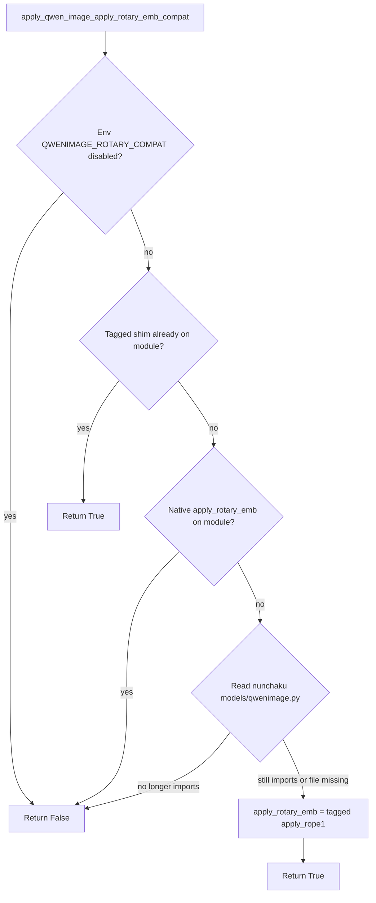
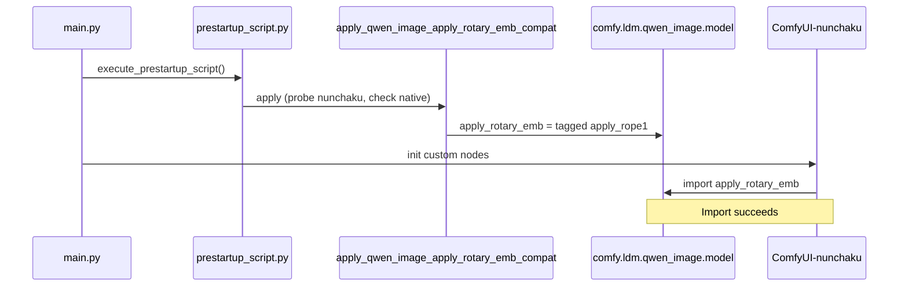
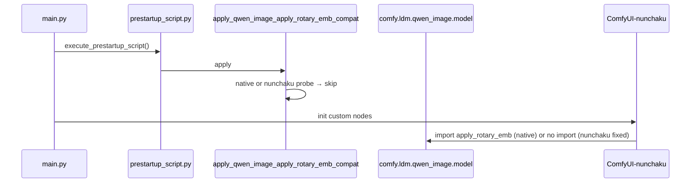

<table align="center">
  <tr>
    <td align="center" bgcolor="#e5e7eb" width="88" height="36"><a href="https://github.com/ussoewwin/ComfyUI-QwenImageLoraLoader/releases/tag/v2.4.6"><font color="#4b5563"><b>EN</b></font></a></td>
    <td align="center" bgcolor="#d4465e" width="88" height="36"><font color="#ffffff"><b>中文</b></font></td>
  </tr>
</table>

本文档记录 **ComfyUI-QwenImageLoraLoader** 中针对 **ComfyUI 0.24.x + ComfyUI-nunchaku** 环境下 `apply_rotary_emb` 导入失败问题的错误现象、根因、**条件式上游安全 shim**、修改文件、完整补丁代码及验证方法。

**修复时的环境（2026-06-10）：**

| 项目 | 值 |
|------|-----|
| ComfyUI | v0.24.1 (`ba9ffa0a2`) |
| ComfyUI-nunchaku | v1.2.1（目录 `custom_nodes/ComfyUI-nunchaku`） |
| ComfyUI-QwenImageLoraLoader | v2.4.6（`b3539cf` — 自禁用兼容层） |
| Python | 3.13（embedded） |
| PyTorch | 2.12.0+cu132 |

---

## 设计约束

1. **不修改 `ComfyUI-nunchaku` 上游文件。** 兼容层仅**读取** `models/qwenimage.py`，以检测 nunchaku 是否仍导入 `apply_rotary_emb`。
2. **仅从 ComfyUI-QwenImageLoraLoader 应用 shim**（`prestartup_script.py` + `patches/nunchaku_patch.py`）。
3. **上游修复后自禁用。** 若 ComfyUI 恢复原生 `apply_rotary_emb`，或 nunchaku 不再导入该符号，shim **不得**再 patch 模块（不覆盖、不残留别名）。

### 决策表

| 条件 | 动作 | 日志级别 |
|------|------|----------|
| `QWENIMAGE_ROTARY_COMPAT` 为 `0`、`false`、`no`、`off`、`disable` 或 `disabled` | **跳过** — 手动关闭 | INFO |
| 我们的 tagged shim 已在 `comfy.ldm.qwen_image.model` 上 | **跳过**（幂等） | — |
| ComfyUI 导出**原生** `apply_rotary_emb`（非我们的 shim） | **跳过** — 永不覆盖 | INFO |
| `ComfyUI-nunchaku/models/qwenimage.py` **不再**导入 `apply_rotary_emb` | **跳过** — nunchaku 已修复导入 | INFO |
| 符号缺失 **且** nunchaku 仍导入（或找不到 `qwenimage.py`） | **应用** — 别名 `apply_rope1`，标记 `_qwen_lora_loader_rotary_shim` | INFO |

上游修复发布后，启动日志会显示 **skip** 行而非 **Patched …**；无需编辑 nunchaku 文件，也不会永久修改 ComfyUI 核心。

### 决策流程



---

## 1. 错误内容

### 1.1 症状

ComfyUI 启动时，**ComfyUI-nunchaku** 在加载 Qwen Image 节点时失败：

```text
ImportError: cannot import name 'apply_rotary_emb' from 'comfy.ldm.qwen_image.model'
```

### 1.2 导入链

```
ComfyUI-nunchaku/__init__.py
  → nodes/models/qwenimage.py
      → models/qwenimage.py
          → from comfy.ldm.qwen_image.model import (..., apply_rotary_emb,)
```

失败文件（典型路径）：

- `custom_nodes/ComfyUI-nunchaku/models/qwenimage.py`（导入块约在 20–27 行）

### 1.3 仍可正常工作的部分

- **nunchaku** wheel 已安装（日志中 `Nunchaku version: 1.3.0.dev20260515`）。
- nunchaku 完成导入后，其他扩展仍可加载。
- 无关项：cuDNN `SUBLIBRARY_VERSION_MISMATCH`、`nunchaku_versions.json` 最小模式。

### 1.4 修复后的日志

**当 shim 被应用时**（符号仍缺失，nunchaku 仍导入）：

```text
[INFO] Patched comfy.ldm.qwen_image.model.apply_rotary_emb -> apply_rope1 (ComfyUI-nunchaku Qwen Image compat)
[INFO] ComfyUI-QwenImageLoraLoader prestartup: apply_rotary_emb compat applied
```

**当 shim 自禁用时**（上游已修复）：

```text
[INFO] apply_rotary_emb compat skipped: ComfyUI already exports apply_rotary_emb
```

或

```text
[INFO] apply_rotary_emb compat skipped: ComfyUI-nunchaku no longer imports apply_rotary_emb
```

**手动禁用时：**

```text
[INFO] apply_rotary_emb compat skipped (QWENIMAGE_ROTARY_COMPAT is disabled)
```

若无需 compat，prestartup 可能仅输出 DEBUG：

```text
[DEBUG] ComfyUI-QwenImageLoraLoader prestartup: apply_rotary_emb compat not needed or already present
```

所有成功情况下：**无** `cannot import name 'apply_rotary_emb'`，且 ComfyUI-nunchaku 初始化完成。

---

## 2. 根因

### 2.1 ComfyUI 0.24 中的 API 移除

在 **ComfyUI v0.24.x** 中，`comfy/ldm/qwen_image/model.py` 不再定义 `apply_rotary_emb`。Qwen Image 注意力路径改用 `comfy.ldm.flux.math` 中的 **`apply_rope1`**：

```python
from comfy.ldm.flux.math import apply_rope1
joint_query = apply_rope1(joint_query, image_rotary_emb)
joint_key = apply_rope1(joint_key, image_rotary_emb)
```

旧的本地 `apply_rotary_emb` 辅助函数已移除（上游 “Remove useless code”，PR #14178 一带）。旋转逻辑已统一到 Flux 风格的 `apply_rope1`。

### 2.2 ComfyUI-nunchaku 仍面向旧 API

`ComfyUI-nunchaku/models/qwenimage.py`（基于 ComfyUI **v0.3.51** Qwen Image 代码）仍执行：

```python
from comfy.ldm.qwen_image.model import (
    ...
    apply_rotary_emb,
)
```

并以与 `apply_rope1` 相同的参数形式调用：

```python
joint_query = apply_rotary_emb(joint_query, image_rotary_emb)
joint_key = apply_rotary_emb(joint_key, image_rotary_emb)
```

失败原因是**导入时版本错位**，而非注意力逻辑缺陷：

| 一方 | 预期 |
|------|------|
| ComfyUI 0.24.x | 无 `apply_rotary_emb`；使用 `apply_rope1` |
| ComfyUI-nunchaku（受影响版本） | `comfy.ldm.qwen_image.model` 上必须存在 `apply_rotary_emb` |

### 2.3 为何仅靠 `__init__.py` 为时已晚

自定义节点按**目录名字母顺序**加载。在 Windows 上，**`ComfyUI-nunchaku`** 排在 **`ComfyUI-QwenImageLoraLoader`** 之前。

1. `ComfyUI-nunchaku/__init__.py` 先执行。
2. 它导入 `models/qwenimage.py`，后者立即导入 `apply_rotary_emb`。
3. 在 `ComfyUI-QwenImageLoraLoader/__init__.py` 能 patch 任何东西之前即 **ImportError**。

### 2.4 为何使用 `prestartup_script.py`

ComfyUI 在 `main.py` 中于 `init_custom_nodes()` **之前**运行 `execute_prestartup_script()`：

```python
execute_prestartup_script()
# ... later: init_custom_nodes()
```

任意自定义节点目录可提供 `prestartup_script.py`。在此运行 shim 可在 nunchaku 导入**之前**注入 `apply_rotary_emb`。

### 2.5 为何别名 `apply_rope1`

`comfy/ldm/flux/math.py` 中的 `apply_rope1(x, freqs_cis)` 接收一个张量与旋转嵌入 `freqs_cis` — 与 nunchaku 的 `apply_rotary_emb(...)` 角色相同。在模块对象 `comfy.ldm.qwen_image.model` 上设置别名即可恢复导入，无需修改 nunchaku 源码。

### 2.6 为何使用 tagged shim（v2.4.6+）

朴素的别名在名称缺失时总是赋值 `apply_rope1`，会破坏前向兼容性：

- 若 ComfyUI **恢复**真正的 `apply_rotary_emb`，用 `apply_rope1` 覆盖可能改变行为。
- 若 nunchaku **不再导入**该名称，在模块上保留别名则多余。

本修复在函数对象上为别名打上 `_qwen_lora_loader_rotary_shim` 标记，用正则（只读）探测 nunchaku 的 `qwenimage.py`，并在检测到原生导出或上游 nunchaku 修复时**跳过**。

---

## 3. 修改文件

| 文件 | 作用 |
|------|------|
| `prestartup_script.py` | 早期执行；经 `importlib` 加载 `nunchaku_patch.py` 并调用 `apply_qwen_image_apply_rotary_emb_compat()` |
| `patches/nunchaku_patch.py` | `apply_qwen_image_apply_rotary_emb_compat()` + 在 `apply_nunchaku_patch()` 中调用（二次兜底） |

**未修改：**

- `custom_nodes/ComfyUI-nunchaku/**`（任何文件）
- ComfyUI 核心 `comfy/ldm/qwen_image/model.py`

**Git：** `fix: auto-disable rotary compat when upstream restores apply_rotary_emb`（`main` 上的 `b3539cf`）。

---

## 4. 完整补丁代码

### 4.1 `prestartup_script.py`（完整文件）

```python
"""
Inject apply_rotary_emb on comfy.ldm.qwen_image.model before any custom node __init__.

ComfyUI-nunchaku loads before ComfyUI-QwenImageLoraLoader (Windows listdir order), so
__init__.py alone is too late. prestartup_script.py runs from main.execute_prestartup_script().
"""
import importlib.util
import logging
import os

logger = logging.getLogger(__name__)

_PATCH_PATH = os.path.join(os.path.dirname(os.path.abspath(__file__)), "patches", "nunchaku_patch.py")


def _load_patch_module():
    spec = importlib.util.spec_from_file_location(
        "comfyui_qwenimageloraloader_nunchaku_patch_prestartup",
        _PATCH_PATH,
    )
    if spec is None or spec.loader is None:
        raise RuntimeError(f"Failed to load patch module spec from {_PATCH_PATH}")
    module = importlib.util.module_from_spec(spec)
    spec.loader.exec_module(module)
    return module


try:
    _patch_module = _load_patch_module()
    if _patch_module.apply_qwen_image_apply_rotary_emb_compat():
        logger.info("ComfyUI-QwenImageLoraLoader prestartup: apply_rotary_emb compat applied")
    else:
        logger.debug(
            "ComfyUI-QwenImageLoraLoader prestartup: apply_rotary_emb compat not needed or already present"
        )
except Exception:
    logger.exception("ComfyUI-QwenImageLoraLoader prestartup: apply_rotary_emb compat failed")
```

### 4.2 `patches/nunchaku_patch.py` 中的 Rotary compat 块

新增常量、辅助函数及 `apply_qwen_image_apply_rotary_emb_compat()`：

```python
_qwen_apply_rotary_emb_compat_applied: bool = False

_ROTARY_SHIM_TAG = "_qwen_lora_loader_rotary_shim"
_NUNCHAKU_QWENIMAGE_APPLY_ROTARY_PATTERNS = (
    re.compile(
        r"from\s+comfy\.ldm\.qwen_image\.model\s+import\s+\([^)]*\bapply_rotary_emb\b",
        re.MULTILINE | re.DOTALL,
    ),
    re.compile(
        r"from\s+comfy\.ldm\.qwen_image\.model\s+import\s+[^\n#]*\bapply_rotary_emb\b",
    ),
)


def _rotary_compat_disabled_by_env() -> bool:
    value = os.environ.get("QWENIMAGE_ROTARY_COMPAT", "").strip().lower()
    return value in ("0", "false", "no", "off", "disable", "disabled")


def _mark_rotary_shim(fn: Callable) -> Callable:
    setattr(fn, _ROTARY_SHIM_TAG, True)
    return fn


def _rotary_shim_installed_on(qwen_image_model) -> bool:
    fn = getattr(qwen_image_model, "apply_rotary_emb", None)
    return fn is not None and getattr(fn, _ROTARY_SHIM_TAG, False)


def _comfyui_has_native_apply_rotary_emb(qwen_image_model) -> bool:
    return (
        getattr(qwen_image_model, "apply_rotary_emb", None) is not None
        and not _rotary_shim_installed_on(qwen_image_model)
    )


def _find_nunchaku_qwenimage_py() -> Optional[str]:
    custom_nodes = os.path.abspath(
        os.path.join(os.path.dirname(__file__), os.pardir, os.pardir)
    )
    for folder in ("ComfyUI-nunchaku", "ComfyUI_Nunchaku", "comfyui-nunchaku"):
        path = os.path.join(custom_nodes, folder, "models", "qwenimage.py")
        if os.path.isfile(path):
            return path
    return None


def _nunchaku_qwenimage_still_imports_apply_rotary_emb() -> Optional[bool]:
    """
    True: nunchaku still imports apply_rotary_emb (compat may be needed).
    False: nunchaku source no longer imports it (skip shim).
    None: qwenimage.py not found (apply only if symbol missing).
    """
    path = _find_nunchaku_qwenimage_py()
    if path is None:
        return None

    try:
        with open(path, encoding="utf-8", errors="replace") as handle:
            text = handle.read()
    except OSError as exc:
        logger.debug("Could not read %s for rotary compat probe: %s", path, exc)
        return None

    for pattern in _NUNCHAKU_QWENIMAGE_APPLY_ROTARY_PATTERNS:
        if pattern.search(text):
            return True
    return False


def apply_qwen_image_apply_rotary_emb_compat() -> bool:
    """
    ComfyUI >= 0.24 removed comfy.ldm.qwen_image.model.apply_rotary_emb.
    ComfyUI-nunchaku still imports it; alias to comfy.ldm.flux.math.apply_rope1
    only when the import is still required and ComfyUI has not restored the symbol.
    """
    global _qwen_apply_rotary_emb_compat_applied
    if _qwen_apply_rotary_emb_compat_applied:
        return True

    if _rotary_compat_disabled_by_env():
        logger.info(
            "apply_rotary_emb compat skipped (QWENIMAGE_ROTARY_COMPAT is disabled)"
        )
        return False

    try:
        import comfy.ldm.qwen_image.model as qwen_image_model
        from comfy.ldm.flux.math import apply_rope1

        if _rotary_shim_installed_on(qwen_image_model):
            _qwen_apply_rotary_emb_compat_applied = True
            return True

        if _comfyui_has_native_apply_rotary_emb(qwen_image_model):
            logger.info(
                "apply_rotary_emb compat skipped: ComfyUI already exports apply_rotary_emb"
            )
            return False

        nunchaku_needs = _nunchaku_qwenimage_still_imports_apply_rotary_emb()
        if nunchaku_needs is False:
            logger.info(
                "apply_rotary_emb compat skipped: ComfyUI-nunchaku no longer imports apply_rotary_emb"
            )
            return False

        qwen_image_model.apply_rotary_emb = _mark_rotary_shim(apply_rope1)
        _qwen_apply_rotary_emb_compat_applied = True
        logger.info(
            "Patched comfy.ldm.qwen_image.model.apply_rotary_emb -> apply_rope1 "
            "(ComfyUI-nunchaku Qwen Image compat)"
        )
        return True
    except Exception as e:
        logger.error("Failed to apply apply_rotary_emb compat patch: %s", e)
        return False
```

**Nunchaku 探测细节：**

- 搜索 `custom_nodes/{ComfyUI-nunchaku,ComfyUI_Nunchaku,comfyui-nunchaku}/models/qwenimage.py`。
- 匹配括号多行与单行 `from comfy.ldm.qwen_image.model import … apply_rotary_emb`。
- **只读** — 从不写入 nunchaku 目录树。
- 若文件缺失（`None`），在符号缺失时仍可能应用 compat（损坏安装的保守默认）。

### 4.3 `apply_nunchaku_patch()` 集成

```python
def apply_nunchaku_patch():
    """
    Apply ComfyUI-nunchaku compatibility patches (LoRA planar injection + lazy Linear fixes).
    Returns True if at least one patch was applied or was already active.
    """
    rotary_compat = apply_qwen_image_apply_rotary_emb_compat()
    lazy_from = apply_svdqw4a4_lazy_linear_patch()
    lazy_fuse = apply_nunchaku_zimage_fuse_lazy_linear_patch()
    # ... planar injection ...
    return planar_ok or lazy_from or rotary_compat
```

若 prestartup 未运行，`apply_qwen_image_apply_rotary_emb_compat()` 在正常节点加载时再次执行；幂等性依赖单例模块 `comfy.ldm.qwen_image.model`。

---

## 5. 运行时行为

### 5.1 启动时序（shim 被应用）



### 5.2 启动时序（shim 被跳过）



### 5.3 幂等性与双次模块加载

- Prestartup 以模块名 `comfyui_qwenimageloraloader_nunchaku_patch_prestartup` 加载 `nunchaku_patch.py`。
- 之后 `__init__.py` 将 `patches.nunchaku_patch` 作为包子模块导入（独立模块对象、独立 `_qwen_apply_rotary_emb_compat_applied` 标志）。
- 实际作用在**单例** `comfy.ldm.qwen_image.model` 上。第二次调用会看到 tagged shim 或原生导出，不会重复 patch。
- 应用成功时，每次启动预期仅**一条** INFO “Patched …” 日志。

### 5.4 `apply_qwen_image_apply_rotary_emb_compat()` 返回值

| 返回值 | 含义 |
|--------|------|
| `True` | 本次调用已应用 shim，或已应用 / 已存在 tagged shim |
| `False` | 已跳过（原生导出、nunchaku 不再导入、环境变量禁用，或已记录错误） |

`prestartup_script.py` 仅在返回 `True` 时记录 INFO；跳过路径在 prestartup 层为 DEBUG（patch 内部对跳过原因使用 INFO）。

### 5.5 环境变量

| 变量 | 禁用 compat 的取值 |
|------|-------------------|
| `QWENIMAGE_ROTARY_COMPAT` | `0`、`false`、`no`、`off`、`disable`、`disabled`（不区分大小写） |

未设置或为其他任意值：compat 逻辑正常运行。

### 5.6 风险评估

| 主题 | 评估 |
|------|------|
| 与 ComfyUI 0.24 的正确性 | **一致**（应用时）— 与核心模型相同的 `apply_rope1` |
| 覆盖原生符号 | **已防止** — 检测到原生导出则跳过 patch |
| nunchaku 修复后残留 shim | **已防止** — 源码探测后跳过 patch |
| 其他自定义节点 | **低** — 仅在需要时添加名称；不修改核心文件 |
| 性能 | **无** — 直接别名，无包装层 |
| nunchaku 目录树 | **只读探测** — 不写入 |

### 5.7 无关项：`nunchaku_versions.json`

```text
'nunchaku_versions.json' not found. Node will start in minimal mode.
```

仅来自 **NunchakuWheelInstaller**；在已安装 `nunchaku` 时不阻止 Qwen 推理。

---

## 6. 验证

### 6.1 快速检查（ComfyUI embedded Python）

在您的 ComfyUI 安装目录执行（按需调整路径）：

```bat
D:\USERFILES\ComfyUI\python_embeded\python.exe -c ^
  "import comfy.ldm.qwen_image.model as m; from comfy.ldm.flux.math import apply_rope1; ^
   print('has apply_rotary_emb:', hasattr(m, 'apply_rotary_emb')); ^
   print('is apply_rope1:', getattr(m, 'apply_rotary_emb', None) is apply_rope1); ^
   print('is our shim:', getattr(getattr(m, 'apply_rotary_emb', None), '_qwen_lora_loader_rotary_shim', False))"
```

解读：

| `has apply_rotary_emb` | `is apply_rope1` | `is our shim` | 典型含义 |
|------------------------|------------------|---------------|----------|
| `True` | `True` | `True` | Shim 已应用（需要） |
| `True` | `False` | `False` | ComfyUI 原生导出 |
| `False` | — | — | 在完整 ComfyUI 启动**之后**运行，或 compat 已跳过 |

须在完整 ComfyUI 启动上下文中运行（或先导入 `prestartup_script` 逻辑）才能得到准确结果。

### 6.2 生产环境（ComfyUI 启动）

重启 ComfyUI 并确认：

1. 无 `cannot import name 'apply_rotary_emb'`。
2. 出现 **Patched …** 或 **compat skipped:** 的 INFO 行（见 1.4 节）。
3. ComfyUI-nunchaku 初始化完成；Qwen 节点成功注册。

### 6.3 功能测试

运行最小 Qwen Image + Nunchaku 工作流（加载 `NunchakuQwenImageDiTLoader`，执行一步采样）。

### 6.4 升级 ComfyUI 或 ComfyUI-nunchaku 之后

1. 重启 ComfyUI。
2. 若上游已修复错位，确认日志为 **skipped**（而非 **Patched**）。
3. 确认 Qwen 工作流仍可运行。

---

## 7. 回滚与清理

**完全回滚：**

1. 删除 `prestartup_script.py`。
2. 从 `patches/nunchaku_patch.py` 移除 rotary compat 代码（`apply_qwen_image_apply_rotary_emb_compat` 及其在 `apply_nunchaku_patch` 中的调用）。
3. 重启 ComfyUI。

**临时禁用（保留代码）：**

```bat
set QWENIMAGE_ROTARY_COMPAT=0
```

**上游修复后：**

Shim 应自动跳过。在不再支持旧 nunchaku 导入模式后，可稍后删除 `prestartup_script.py` 与 compat 代码以保持目录整洁。

---

## 8. 摘要

| 问题 | 答案 |
|------|------|
| 什么坏了？ | ComfyUI-nunchaku 加载时出现 `ImportError: cannot import name 'apply_rotary_emb'`。 |
| 为何？ | ComfyUI 0.24 移除了该符号；nunchaku 仍导入；LoraLoader 的 `__init__` 为时已晚。 |
| 如何修复？ | 早期 `prestartup_script.py` + **条件式** `apply_rope1` 别名，含上游探测与 shim 标记。 |
| 会自禁用吗？ | 是 — 若 ComfyUI 恢复原生 `apply_rotary_emb` 或 nunchaku 不再导入则跳过。 |
| 涉及文件？ | `prestartup_script.py`、`patches/nunchaku_patch.py`。 |
| 是否修改 nunchaku？ | **否**（仅只读探测 `models/qwenimage.py`）。 |
| 如何退出？ | `QWENIMAGE_ROTARY_COMPAT=0`（及同义取值）。 |

---

*文档版本：2026-06-10 — v2.4.6 条件式上游安全 `apply_rotary_emb` compat（`b3539cf`）。*
