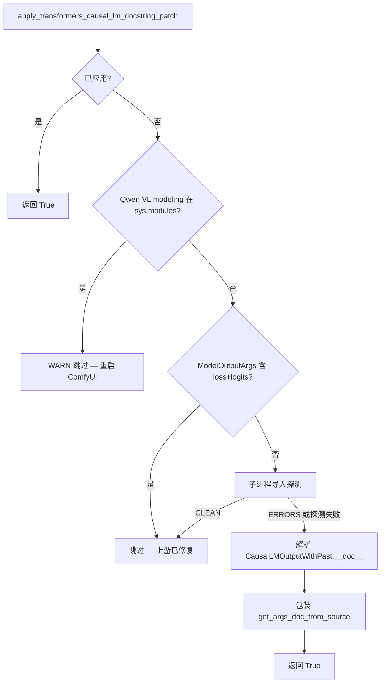
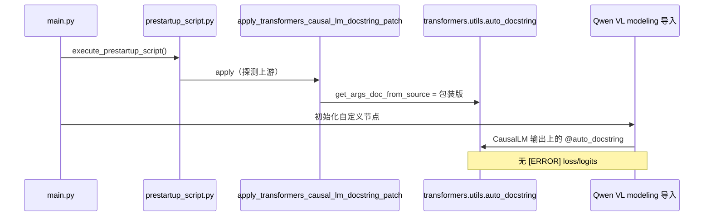

<table align="center">
  <tr>
    <td align="center" bgcolor="#e5e7eb" width="88" height="36"><a href="https://github.com/ussoewwin/ComfyUI-QwenImageLoraLoader/releases/tag/v2.4.7"><font color="#4b5563"><b>EN</b></font></a></td>
    <td align="center" bgcolor="#3478ca" width="88" height="36"><font color="#ffffff"><b>中文</b></font></td>
  </tr>
</table>

本文记录 ComfyUI 启动时，Hugging Face `transformers` 在导入 Qwen VL `*CausalLMOutputWithPast` 类时打印的 `[ERROR] loss` / `[ERROR] logits` 消息、上游 `auto_docstring` 中的根因、**条件式上游安全 monkey-patch**、修改文件、完整补丁代码与验证步骤，适用于 **ComfyUI-QwenImageLoraLoader** v2.4.7。

**这不是本节点 LoRA 加载逻辑的缺陷。** 这些消息来自上游 `transformers` 对 Qwen VL `@auto_docstring` 的校验。由于 Hugging Face 何时修复上游尚不明确，本节点仅在 `prestartup_script.py` 中本地吸收该问题（不修改 `site-packages`，不屏蔽 stderr）。

**修复时的环境（2026-06）：**

| 项目 | 值 |
|------|-----|
| transformers | 5.12.1 |
| ComfyUI-QwenImageLoraLoader | v2.4.7（`4bcd1e8` — 上游自动停用的 docstring 补丁） |
| 受影响类 | `Qwen3VLCausalLMOutputWithPast`、`Qwen2_5_VLCausalLMOutputWithPast` |

---

## 设计约束

1. **不修改 `site-packages` 中的 `transformers`。** 变通方案仅在本自定义节点进程内 monkey-patch `get_args_doc_from_source`。
2. **仅从 `prestartup_script.py` 应用。** docstring 补丁在 v2.4.6 `apply_rotary_emb` 兼容块**之前**运行，使 Qwen VL 导入时先看到包装器。
3. **完全自动的上游停用。** 每次 ComfyUI 启动时探测上游；仅在上游仍会发出 `[ERROR] loss` / `[ERROR] logits` 时安装包装器。**无用户环境变量或开关**（与仍允许 `QWENIMAGE_ROTARY_COMPAT` 退出的 v2.4.6 `apply_rotary_emb` 兼容不同）。

### 决策表

| 条件 | 动作 | 日志级别 |
|------|------|----------|
| `get_args_doc_from_source` 上已有标记包装器 | **返回 True**（幂等） | — |
| Qwen VL modeling 模块已在 `sys.modules` 中 | **跳过** — 需重启 | WARNING |
| `ModelOutputArgs` 已记录 `loss` 与 `logits` | **跳过** — 上游 schema 已修复 | INFO |
| 子进程导入探测输出 `CLEAN`（无 `[ERROR] loss/logits`） | **跳过** — 上游行为已修复 | INFO |
| 子进程探测输出 `ERRORS` 或探测无法运行（`None`） | 若前述行未跳过则 **应用** 包装器 | INFO |
| 缺少 `transformers.utils.auto_docstring` / 无 `get_args_doc_from_source` | **跳过** | DEBUG |

Hugging Face 修复上游后，启动日志显示 **skip** 行而非 **Patched …**；无需 `pip` 修改，也无永久 `site-packages` 变更。

### 决策流程



---

## 1. 现象与导入链

### 1.1 确切错误文本

当 ComfyUI 加载会导入 Qwen VL modeling 模块的自定义节点时，`transformers` 可能打印四行类似：

```text
[ERROR] `loss` is part of Qwen3VLCausalLMOutputWithPast.__init__'s signature, but not documented. Make sure to add it to the docstring of the function in ...\transformers\models\qwen3_vl\modeling_qwen3_vl.py.
[ERROR] `logits` is part of Qwen3VLCausalLMOutputWithPast.__init__'s signature, but not documented. Make sure to add it to the docstring of the function in ...\transformers\models\qwen3_vl\modeling_qwen3_vl.py.
[ERROR] `loss` is part of Qwen2_5_VLCausalLMOutputWithPast.__init__'s signature, but not documented. Make sure to add it to the docstring of the function in ...\transformers\models\qwen2_5_vl\modeling_qwen2_5_vl.py.
[ERROR] `logits` is part of Qwen2_5_VLCausalLMOutputWithPast.__init__'s signature, but not documented. Make sure to add it to the docstring of the function in ...\transformers\models\qwen2_5_vl\modeling_qwen2_5_vl.py.
```

这些**不是** Python 异常。它们是 `@auto_docstring` 在**导入时**处理期间追加到内部列表的字符串，装饰器运行时被打印。

### 1.2 典型 ComfyUI 导入链

```text
ComfyUI main.py
  └─ prestartup_script.py (ComfyUI-QwenImageLoraLoader)  ← 在此应用补丁
  └─ 自定义节点 __init__.py 导入
       └─ transformers.models.qwen3_vl.modeling_qwen3_vl
            └─ Qwen3VLCausalLMOutputWithPast 上的 @auto_docstring  → [ERROR] loss/logits
       └─ transformers.models.qwen2_5_vl.modeling_qwen2_5_vl
            └─ Qwen2_5_VLCausalLMOutputWithPast 上的 @auto_docstring → [ERROR] loss/logits
```

若在补丁运行前已触发这些模块导入，需重启 ComfyUI 后错误才会消失。

### 1.3 仍正常工作的部分

- ComfyUI 及其他自定义节点在嘈杂导入后仍可继续加载。
- **LoRA 行为不变** — 本补丁不触及 nunchaku planar 注入或 LoRA 合成逻辑。
- 无关项：v2.4.6 `apply_rotary_emb` 兼容是独立的 `prestartup` 块。

### 1.4 修复后的日志

**包装器已应用**（上游仍有问题，且 prestartup 在 Qwen VL 导入之前运行）：

```text
[INFO] Patched transformers.utils.auto_docstring.get_args_doc_from_source for Qwen VL CausalLM ModelOutput docstrings (loss/logits); removes when upstream adds them
[INFO] ComfyUI-QwenImageLoraLoader prestartup: CausalLM ModelOutput docstring patch applied
```

**上游已修复**（schema 或探测跳过 — 无包装器）：

```text
[INFO] CausalLM ModelOutput docstring patch skipped: transformers ModelOutputArgs already documents loss and logits (upstream fixed — patch not installed)
```

或

```text
[INFO] CausalLM ModelOutput docstring patch skipped: Qwen VL ModelOutput docstrings resolve loss/logits without docstring errors (upstream fixed — patch not installed)
[DEBUG] ComfyUI-QwenImageLoraLoader prestartup: CausalLM ModelOutput docstring patch not applied
```

**Qwen VL 导入过早**（需重启）：

```text
[WARNING] CausalLM ModelOutput docstring patch skipped: Qwen VL modeling modules already imported before prestartup — restart ComfyUI
[DEBUG] ComfyUI-QwenImageLoraLoader prestartup: CausalLM ModelOutput docstring patch not applied
```

所有成功情形下：干净重启后，Qwen VL `*CausalLMOutputWithPast` 类在 stdout 上**零**行包含 `[ERROR]` 与 `` `loss` `` 或 `` `logits` ``。

---

## 2. 根因（上游行为）

### 2.1 ModelOutput 子类的 `@auto_docstring` 做了什么

Qwen VL 定义继承 `CausalLMOutputWithPast` 的 dataclass 输出：

```python
@auto_docstring
@dataclass
class Qwen3VLCausalLMOutputWithPast(CausalLMOutputWithPast):
    r"""
    rope_deltas (...):
        ...
    """
    rope_deltas: torch.LongTensor | None = None
```

在 `transformers.utils.auto_docstring.auto_class_docstring`（ModelOutput 分支，约第 4200 行）：

1. `custom_args` 来自类 docstring（Qwen3 VL 仅 `rope_deltas`）。
2. 追加**直接父类** docstring：`CausalLMOutputWithPast.__doc__`（`Args:` 块中含 `loss`、`logits` 等）。
3. `auto_method_docstring` 使用 `source_args_dict=get_args_doc_from_source(ModelOutputArgs)` 构建 `__init__` 文档 — 通用 ModelOutput 字段模板的静态字典。

### 2.2 为何 `loss` 与 `logits` 被判定为「未文档化」

**父类文档有这些字段。** `CausalLMOutputWithPast.__doc__` 在 `Args:` 下记录了 `loss` 与 `logits`。

**`ModelOutputArgs` 没有。** 所有 ModelOutput dataclass 共用的回退模板类缺少 `loss` 与 `logits`。

**校验比较签名与合并后的文档。** `__init__` 中任何未出现在合并文档中的参数都会触发 `[ERROR]` 行（`auto_docstring.py` 约第 3352 行）。

**为何默认情况下父类 `Args:` 帮不上忙：** 正常调用点使用 `max_indent_level=0` 的 `parse_docstring`。`Args:` 下的参数通常缩进 4–8 空格。`max_indent_level=0` 时仅匹配零缩进行 — 父类缩进 `Args:` 块内的 `loss` / `logits` **不会**进入 `params`。代码回退到仍缺少这些键的 `ModelOutputArgs`。

### 2.3 为何不 patch `site-packages` 或过滤 stdout？

| 做法 | 问题 |
|------|------|
| 编辑 `site-packages` 中的 `transformers` | 升级丢失；违反项目约束 |
| 过滤 / 隐藏 stdout 上的 `[ERROR]` | 掩盖真实问题；未修复校验 |
| 仅 patch `auto_class_docstring` | 不足：`source_args_dict` 来自 `get_args_doc_from_source(ModelOutputArgs)` |

可行修复：patch **`get_args_doc_from_source`**，使上游请求 `ModelOutputArgs` 时，返回字典包含从 `CausalLMOutputWithPast.__doc__` 用 `parse_docstring(..., max_indent_level=4)` 提取的 `loss` 与 `logits`。

### 2.4 为何使用 `prestartup_script.py`

ComfyUI 在 `main.py` 中于 `init_custom_nodes()` **之前**运行 `execute_prestartup_script()`。必须在任何自定义节点导入 Qwen VL modeling 模块之前安装 docstring 包装器。

### 2.5 与 v2.4.6 的关系

| 版本 | 修复 | 退出方式 |
|------|------|----------|
| v2.4.6 | 为 ComfyUI-nunchaku 提供 `apply_rotary_emb` → `apply_rope1` 别名 | `QWENIMAGE_ROTARY_COMPAT` 环境变量 |
| v2.4.7 | 为 Qwen VL CausalLM 输出包装 `get_args_doc_from_source` | **无** — 仅通过上游探测跳过 |

二者均从同一 `prestartup_script.py` 运行；docstring 补丁**先**执行。

---

## 3. 修改的文件

| 文件 | 作用 |
|------|------|
| `patches/transformers_qwen_vl_docstring_patch.py` | **新增。** 核心 monkey-patch、上游探测、应用 |
| `prestartup_script.py` | **更新。** 在 rotary 兼容补丁之前应用 docstring 补丁 |

**未修改：**

- `site-packages` 中的 `transformers`
- `patches/nunchaku_patch.py`（独立的 v2.4.6 rotary 兼容）

**Git：** `fix: Qwen VL CausalLM docstring patch at prestartup`（`main` 上 `4bcd1e8`）。

---

## 4. 完整补丁代码

### 4.1 `prestartup_script.py`（完整文件）

```python
"""
Inject apply_rotary_emb on comfy.ldm.qwen_image.model before any custom node __init__.

ComfyUI-nunchaku loads before ComfyUI-QwenImageLoraLoader (Windows listdir order), so
__init__.py alone is too late. prestartup_script.py runs from main.execute_prestartup_script().
"""
import importlib.util
import logging
import os

logger = logging.getLogger(__name__)

_PATCH_DIR = os.path.join(os.path.dirname(os.path.abspath(__file__)), "patches")
_NUNCHAKU_PATCH_PATH = os.path.join(_PATCH_DIR, "nunchaku_patch.py")
_DOCSTRING_PATCH_PATH = os.path.join(_PATCH_DIR, "transformers_qwen_vl_docstring_patch.py")


def _load_patch_module(module_name: str, path: str):
    spec = importlib.util.spec_from_file_location(module_name, path)
    if spec is None or spec.loader is None:
        raise RuntimeError(f"Failed to load patch module spec from {path}")
    module = importlib.util.module_from_spec(spec)
    spec.loader.exec_module(module)
    return module


try:
    _docstring_patch_module = _load_patch_module(
        "comfyui_qwenimageloraloader_docstring_patch_prestartup",
        _DOCSTRING_PATCH_PATH,
    )
    if _docstring_patch_module.apply_transformers_causal_lm_docstring_patch():
        logger.info("ComfyUI-QwenImageLoraLoader prestartup: CausalLM ModelOutput docstring patch applied")
    else:
        logger.debug(
            "ComfyUI-QwenImageLoraLoader prestartup: CausalLM ModelOutput docstring patch not applied"
        )
except Exception:
    logger.exception("ComfyUI-QwenImageLoraLoader prestartup: CausalLM ModelOutput docstring patch failed")

try:
    _patch_module = _load_patch_module(
        "comfyui_qwenimageloraloader_nunchaku_patch_prestartup",
        _NUNCHAKU_PATCH_PATH,
    )
    if _patch_module.apply_qwen_image_apply_rotary_emb_compat():
        logger.info("ComfyUI-QwenImageLoraLoader prestartup: apply_rotary_emb compat applied")
    else:
        logger.debug(
            "ComfyUI-QwenImageLoraLoader prestartup: apply_rotary_emb compat not needed or already present"
        )
except Exception:
    logger.exception("ComfyUI-QwenImageLoraLoader prestartup: apply_rotary_emb compat failed")
```

### 4.2 `patches/transformers_qwen_vl_docstring_patch.py`（完整文件）

```python
"""
Patch transformers auto_docstring for Qwen VL CausalLM ModelOutput classes.

When Hugging Face transformers merges CausalLMOutputWithPast docs into Qwen VL
ModelOutput subclasses, validation falls back to ModelOutputArgs — which lacks
loss/logits — and prints [ERROR] at import time.

Fully automatic at ComfyUI prestartup (no user env vars):
  - Probe upstream ModelOutputArgs before installing any wrapper.
  - If upstream already documents loss/logits, skip (no wrapper).
  - If a subprocess import probe shows clean stdout, skip.
  - Otherwise install the wrapper (default when upstream is still broken).

Fix: wrap get_args_doc_from_source to merge loss/logits into the returned dict
while upstream ModelOutputArgs still omits those fields.
"""

from __future__ import annotations

import importlib
import logging
import os
import subprocess
import sys
from typing import Any, Callable, Dict, Optional, Tuple

logger = logging.getLogger(__name__)

_PATCH_TAG = "_qwen_lora_loader_causal_lm_docstring_patch"
_CAUSAL_LM_OUTPUT_FIELDS = ("loss", "logits")

_QWEN_VL_MODELING_MODULES = (
    "transformers.models.qwen3_vl.modeling_qwen3_vl",
    "transformers.models.qwen2_5_vl.modeling_qwen2_5_vl",
)

_patch_applied: bool = False
_original_get_args_doc_from_source: Optional[Callable[..., dict]] = None


def _qwen_vl_modeling_already_imported() -> bool:
    return any(name in sys.modules for name in _QWEN_VL_MODELING_MODULES)


def _upstream_model_output_args_has_causal_lm_fields(auto_docstring_module) -> bool:
    """Probe upstream native state (never via patched get_args_doc_from_source)."""
    model_output_args = auto_docstring_module.ModelOutputArgs
    for field in _CAUSAL_LM_OUTPUT_FIELDS:
        entry = getattr(model_output_args, field, None)
        if not isinstance(entry, dict) or not entry.get("description"):
            return False
    return True


def _build_causal_lm_extra_args(auto_docstring_module) -> Dict[str, dict]:
    """Extract loss/logits entries from CausalLMOutputWithPast.__doc__."""
    try:
        modeling_outputs = importlib.import_module("transformers.modeling_outputs")
    except ImportError:
        return {}

    parent_doc = getattr(modeling_outputs.CausalLMOutputWithPast, "__doc__", None)
    if not parent_doc:
        return {}

    normalized = auto_docstring_module.set_min_indent(parent_doc.strip(), 0)
    documented_params, _remainder = auto_docstring_module.parse_docstring(
        normalized,
        max_indent_level=4,
    )

    extra: Dict[str, dict] = {}
    for field in _CAUSAL_LM_OUTPUT_FIELDS:
        param = documented_params.get(field)
        if not param:
            continue
        extra[field] = {
            "description": param.get("description", ""),
            "shape": param.get("shape"),
            "optional": param.get("optional", False),
            "additional_info": param.get("additional_info", ""),
            "type": param.get("type", ""),
        }
        if param.get("default") is not None:
            extra[field]["default"] = param["default"]
    return extra


def _model_output_args_requested(args_classes: Any, model_output_args_type: type) -> bool:
    if args_classes is model_output_args_type:
        return True
    if isinstance(args_classes, (list, tuple)):
        return model_output_args_type in args_classes
    return False


def _make_patched_get_args_doc_from_source(
    auto_docstring_module,
    original: Callable[..., dict],
) -> Callable[..., dict]:
    model_output_args_type = auto_docstring_module.ModelOutputArgs
    cached_extra: Dict[str, dict] = {}

    def patched_get_args_doc_from_source(args_classes: Any) -> dict:
        result = original(args_classes)

        if not _model_output_args_requested(args_classes, model_output_args_type):
            return result

        if all(field in result for field in _CAUSAL_LM_OUTPUT_FIELDS):
            return result

        nonlocal cached_extra
        if not cached_extra:
            cached_extra = _build_causal_lm_extra_args(auto_docstring_module)

        if not cached_extra:
            return result

        merged = dict(result)
        for field in _CAUSAL_LM_OUTPUT_FIELDS:
            if field in cached_extra:
                merged.setdefault(field, cached_extra[field])
        return merged

    setattr(patched_get_args_doc_from_source, _PATCH_TAG, True)
    return patched_get_args_doc_from_source


def _import_probe_reports_clean() -> Optional[bool]:
    """
    True: Qwen VL imports emit no [ERROR] loss/logits on stdout.
    False: errors still present (patch may be needed).
    None: probe could not run.
    """
    python_exe = sys.executable
    code = (
        "import importlib, io, contextlib\n"
        "buf = io.StringIO()\n"
        "with contextlib.redirect_stdout(buf):\n"
        "    importlib.import_module('transformers.models.qwen3_vl.modeling_qwen3_vl')\n"
        "    importlib.import_module('transformers.models.qwen2_5_vl.modeling_qwen2_5_vl')\n"
        "lines = buf.getvalue().splitlines()\n"
        "errs = [l for l in lines if '[ERROR]' in l and ('loss' in l or 'logits' in l)]\n"
        "print('CLEAN' if not errs else 'ERRORS')\n"
    )
    try:
        proc = subprocess.run(
            [python_exe, "-c", code],
            capture_output=True,
            text=True,
            timeout=120,
        )
    except (OSError, subprocess.SubprocessError) as exc:
        logger.debug("CausalLM docstring import probe failed: %s", exc)
        return None

    if proc.returncode != 0:
        logger.debug(
            "CausalLM docstring import probe exit %s stderr=%s",
            proc.returncode,
            proc.stderr[:500] if proc.stderr else "",
        )
        return None

    last_line = (proc.stdout or "").strip().splitlines()
    if not last_line:
        return None
    status = last_line[-1].strip()
    if status == "CLEAN":
        return True
    if status == "ERRORS":
        return False
    return None


def apply_transformers_causal_lm_docstring_patch() -> bool:
    """
    Install get_args_doc_from_source wrapper unless upstream already fixed the issue.

    Returns True if wrapper is active (or was already applied), False if skipped.
    """
    global _patch_applied, _original_get_args_doc_from_source

    if _patch_applied:
        return True

    if _qwen_vl_modeling_already_imported():
        logger.warning(
            "CausalLM ModelOutput docstring patch skipped: Qwen VL modeling modules "
            "already imported before prestartup — restart ComfyUI"
        )
        return False

    try:
        auto_docstring_module = importlib.import_module("transformers.utils.auto_docstring")
    except ImportError:
        logger.debug("transformers.utils.auto_docstring not available; patch skipped")
        return False

    get_args = getattr(auto_docstring_module, "get_args_doc_from_source", None)
    if get_args is None:
        return False

    if getattr(get_args, _PATCH_TAG, False):
        _patch_applied = True
        return True

    if _upstream_model_output_args_has_causal_lm_fields(auto_docstring_module):
        logger.info(
            "CausalLM ModelOutput docstring patch skipped: transformers ModelOutputArgs "
            "already documents loss and logits (upstream fixed — patch not installed)"
        )
        return False

    import_probe = _import_probe_reports_clean()
    if import_probe is True:
        logger.info(
            "CausalLM ModelOutput docstring patch skipped: Qwen VL ModelOutput docstrings "
            "resolve loss/logits without docstring errors (upstream fixed — patch not installed)"
        )
        return False

    _original_get_args_doc_from_source = get_args
    auto_docstring_module.get_args_doc_from_source = _make_patched_get_args_doc_from_source(
        auto_docstring_module,
        _original_get_args_doc_from_source,
    )
    _patch_applied = True

    logger.info(
        "Patched transformers.utils.auto_docstring.get_args_doc_from_source for Qwen VL "
        "CausalLM ModelOutput docstrings (loss/logits); removes when upstream adds them"
    )
    return True


def is_patch_applied() -> bool:
    return _patch_applied


def is_patch_wrapped() -> bool:
    try:
        auto_docstring_module = importlib.import_module("transformers.utils.auto_docstring")
    except ImportError:
        return False
    get_args = getattr(auto_docstring_module, "get_args_doc_from_source", None)
    return get_args is not None and getattr(get_args, _PATCH_TAG, False)
```

---

## 5. 运行时行为

### 5.1 注入点

| 函数 | 作用 |
|------|------|
| `get_args_doc_from_source(ModelOutputArgs)` | 返回 `ModelOutputArgs.__dict__`（缺少 `loss` / `logits`） |
| **包装后的** `get_args_doc_from_source` | 请求类为 `ModelOutputArgs` 时合并 `loss` / `logits` 条目 |
| `auto_class_docstring` → `auto_method_docstring` | 使用 enriched 字典；校验通过 |

补充条目在应用时从 `CausalLMOutputWithPast.__doc__` 一次性构建，使用 `parse_docstring(..., max_indent_level=4)`。

### 5.2 `prestartup_script.py` 中的启动顺序

1. 通过 `importlib` 加载 `patches/transformers_qwen_vl_docstring_patch.py` 并调用 `apply_transformers_causal_lm_docstring_patch()`。
2. 加载 `patches/nunchaku_patch.py` 并调用 `apply_qwen_image_apply_rotary_emb_compat()`（v2.4.6；独立修复）。

### 5.3 启动时间线（包装器已应用）



### 5.4 幂等性

包装器在函数对象上设置 `_qwen_lora_loader_causal_lm_docstring_patch = True`。第二次 `apply_*()` 检测到标记后返回，不会双重包装。

### 5.5 `apply_transformers_causal_lm_docstring_patch()` 返回值

| 返回值 | 含义 |
|--------|------|
| `True` | 本次已应用包装器，或已应用 / 已有标记包装器 |
| `False` | 已跳过（上游已修复、导入过晚、缺少 API 或已记录错误） |

`prestartup_script.py` 仅在返回 `True` 时记录 INFO；跳过路径在 prestartup 层为 DEBUG（补丁内部对跳过原因记 INFO）。

### 5.6 风险评估

| 主题 | 评估 |
|------|------|
| LoRA / nunchaku 行为 | **不变** — 补丁仅影响导入时的 docstring 生成 |
| `site-packages` | **未修改** |
| 上游修复后仍覆盖 | **已防止** — schema + 子进程探测会跳过安装 |
| 性能 | **低** — prestartup 时一次性包装；首次启动子进程探测可能增加数秒 |
| 其他自定义节点 | **低** — 仅 enriched `ModelOutputArgs` 字典查找 |

---

## 6. 自动上游停用

| 场景 | 行为 |
|------|------|
| **A. 上游修复（schema）** | `ModelOutputArgs` 含非空 `description` 的 `loss` 与 `logits` → 跳过补丁，INFO |
| **B. 上游修复（探测）** | 子进程在无本补丁时导入 Qwen VL；stdout 以 `CLEAN` 结尾 → 跳过补丁，INFO |
| **C. 导入过晚** | prestartup 前 Qwen VL 模块已在 `sys.modules` → WARN；需重启后才应用 |
| **D. 缺少 API** | 无 `get_args_doc_from_source` 或无法解析父类 doc → 跳过，DEBUG |
| **E. 探测不确定** | 子进程探测失败（`None`）但 schema 仍坏 → **安装**包装器（安全默认） |

**与 v2.4.6 rotary 兼容的区别：** 本 docstring 补丁**无** `QWENIMAGE_*`（或其他）环境变量退出方式。

---

## 7. 验证

### 7.1 生产环境（ComfyUI 启动）

重启 ComfyUI 并确认：

1. 无针对 Qwen3 / Qwen2.5 VL CausalLM 输出类的 `[ERROR]` 行提及 `` `loss` `` 或 `` `logits` ``。
2. 出现 **Patched …** 或 **docstring patch skipped:** INFO 行（见 1.4 节）。
3. Qwen VL 相关自定义节点可加载；LoRA 工作流不变。

### 7.2 升级 `transformers` 后

1. 重启 ComfyUI。
2. 若 Hugging Face 已修复 `ModelOutputArgs`，确认日志为 **skipped**（非 **Patched**）。
3. 确认启动仍干净（无 `[ERROR] loss/logits`）。

### 7.3 功能

运行常用 Qwen Image / Qwen VL 工作流 — 推理行为应与 v2.4.7 之前一致，仅启动时不再刷屏错误。

---

## 8. 回滚与清理

**完全回滚：**

1. 从 `prestartup_script.py` 移除 docstring 补丁块（第一个 `try` / `_DOCSTRING_PATCH_PATH` 段）。
2. 删除 `patches/transformers_qwen_vl_docstring_patch.py`。
3. 重启 ComfyUI。

**上游修复后：**

包装器应自动跳过。若不再需要支持有问题的 `transformers` 版本，可稍后删除 docstring 补丁文件以保持仓库整洁。

---

## 9. 摘要

| 问题 | 答案 |
|------|------|
| 什么坏了？ | Qwen VL `*CausalLMOutputWithPast` 导入时打印 `[ERROR] loss` / `[ERROR] logits`。 |
| 为何？ | `ModelOutputArgs` 缺 `loss`/`logits`；校验时父类 `Args:` 在缩进 0 未解析。 |
| LoRA 缺陷？ | **否** — 上游 `transformers` `@auto_docstring` 问题；LoRA 逻辑未动。 |
| 修复？ | 在自定义节点加载前于 `prestartup_script.py` 包装 `get_args_doc_from_source`。 |
| 自动停用？ | 是 — 上游 `ModelOutputArgs` 修复和/或干净子进程导入探测；**无环境变量**。 |
| 涉及文件？ | `prestartup_script.py`、`patches/transformers_qwen_vl_docstring_patch.py`。 |
| 是否动 `site-packages`？ | **否**。 |
| 相关？ | [v2.4.6 `apply_rotary_emb` 兼容](https://github.com/ussoewwin/ComfyUI-QwenImageLoraLoader/releases/tag/v2.4.6) — 相同 prestartup / 先探测模式。 |

---

## 10. 参考（上游源码行号，transformers 5.12.1）

| 位置 | 行号（约） | 说明 |
|------|------------|------|
| `modeling_outputs.py` — `CausalLMOutputWithPast` | 610–641 | `loss` / `logits` 文档来源 |
| `modeling_qwen3_vl.py` — `Qwen3VLCausalLMOutputWithPast` | 1267–1276 | `@auto_docstring` dataclass |
| `auto_docstring.py` — `ModelOutputArgs` | 2171+ | 缺少 `loss` / `logits` |
| `auto_docstring.py` — `get_args_doc_from_source` | 2855–2858 | 补丁目标 |
| `auto_docstring.py` — `parse_docstring` | 2617+ | `max_indent_level` 行为 |
| `auto_docstring.py` — ModelOutput 分支 | 4200–4219 | 使用 `ModelOutputArgs` 字典 |
| `auto_docstring.py` — 错误消息 | 3351–3353 | `[ERROR] ... not documented` |

---

*文档版本：2026-06 — v2.4.7 上游安全 Qwen VL CausalLM docstring 补丁（`4bcd1e8`）。*
