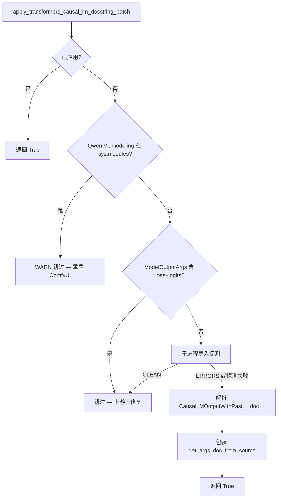

<table align="center">
  <tr>
    <td align="center" bgcolor="#e5e7eb" width="88" height="36"><a href="https://github.com/ussoewwin/ComfyUI-QwenImageLoraLoader/releases/tag/v2.4.7"><font color="#4b5563"><b>EN</b></font></a></td>
    <td align="center" bgcolor="#3478ca" width="88" height="36"><font color="#ffffff"><b>中文</b></font></td>
  </tr>
</table>

## 设计约束

1. **不要编辑 `site-packages` 中的 `transformers`。** 变通方案仅在本自定义节点进程内 monkey-patch `get_args_doc_from_source`。
2. **仅从 `prestartup_script.py` 应用。** docstring 补丁在 v2.4.6 `apply_rotary_emb` 兼容块**之前**运行，使 Qwen VL 导入时先看到包装器。
3. **完全自动的上游停用。** 每次 ComfyUI 启动时探测上游；仅在上游仍会发出 `[ERROR] loss` / `[ERROR] logits` 时安装包装器。**无用户环境变量或开关。**

### 决策表

| 条件 | 动作 | 日志级别 |
|------|------|----------|
| `get_args_doc_from_source` 上已有带标记的包装器 | **返回 True**（幂等） | — |
| Qwen VL modeling 模块已在 `sys.modules` 中 | **跳过** — 需要重启 | WARNING |
| `ModelOutputArgs` 已记录 `loss` 与 `logits` | **跳过** — 上游 schema 已修复 | INFO |
| 子进程导入探测输出 `CLEAN`（无 `[ERROR] loss/logits`） | **跳过** — 上游行为已修复 | INFO |
| 子进程探测输出 `ERRORS` 或探测无法运行（`None`） | 若前述行未跳过则 **应用** 包装器 | INFO |
| 缺少 `transformers.utils.auto_docstring` / 无 `get_args_doc_from_source` | **跳过** | DEBUG |

当 Hugging Face 修复上游后，启动日志会显示 **skip** 行而非 **Patched …**；无需 `pip` 编辑，也不会永久修改 `site-packages`。

### 决策流程



---

## 1. 现象与导入链

### 1.1 确切错误文本

当 ComfyUI 加载会导入 Qwen VL modeling 模块的自定义节点时，`transformers` 可能打印四行类似：

```text
[ERROR] `loss` is part of Qwen3VLCausalLMOutputWithPast.__init__'s signature, but not documented. Make sure to add it to the docstring of the function in ...\transformers\models\qwen3_vl\modeling_qwen3_vl.py.
[ERROR] `logits` is part of Qwen3VLCausalLMOutputWithPast.__init__'s signature, but not documented. Make sure to add it to the docstring of the function in ...\transformers\models\qwen3_vl\modeling_qwen3_vl.py.
[ERROR] `loss` is part of Qwen2_5_VLCausalLMOutputWithPast.__init__'s signature, but not documented. Make sure to add it to the docstring of the function in ...\transformers\models\qwen2_5_vl\modeling_qwen2_5_vl.py.
[ERROR] `logits` is part of Qwen2_5_VLCausalLMOutputWithPast.__init__'s signature, but not documented. Make sure to add it to the docstring of the function in ...\transformers\models\qwen2_5_vl\modeling_qwen2_5_vl.py.
```

这些**不是** Python 异常。它们是 `@auto_docstring` 在**导入时**处理期间追加到内部列表的字符串，装饰器运行时被打印。

### 1.2 典型 ComfyUI 导入链

```text
ComfyUI main.py
  └─ prestartup_script.py (ComfyUI-QwenImageLoraLoader)  ← 在此应用补丁
  └─ 自定义节点 __init__.py 导入
       └─ transformers.models.qwen3_vl.modeling_qwen3_vl
            └─ Qwen3VLCausalLMOutputWithPast 上的 @auto_docstring  → [ERROR] loss/logits
       └─ transformers.models.qwen2_5_vl.modeling_qwen2_5_vl
            └─ Qwen2_5_VLCausalLMOutputWithPast 上的 @auto_docstring → [ERROR] loss/logits
```

任何在补丁运行前触发这些模块导入的工作流或节点，在重启 ComfyUI 之前仍会显示错误。

### 1.3 已验证环境

| 项目 | 值 |
|------|-----|
| transformers | 5.12.1 |
| 受影响类 | `Qwen3VLCausalLMOutputWithPast`、`Qwen2_5_VLCausalLMOutputWithPast` |
| 修复位置 | 仅 **ComfyUI-QwenImageLoraLoader** |

---

## 2. 根因（上游行为）

### 2.1 ModelOutput 子类的 `@auto_docstring` 做了什么

Qwen VL 定义继承 `CausalLMOutputWithPast` 的 dataclass 输出：

```python
@auto_docstring
@dataclass
class Qwen3VLCausalLMOutputWithPast(CausalLMOutputWithPast):
    r"""
    rope_deltas (...):
        ...
    """
    rope_deltas: torch.LongTensor | None = None
```

在 `transformers.utils.auto_docstring.auto_class_docstring`（ModelOutput 分支，约第 4200 行）：

1. `custom_args` 来自类 docstring（Qwen3 VL 仅 `rope_deltas`）。
2. 追加**直接父类** docstring：`CausalLMOutputWithPast.__doc__`（`Args:` 块中含 `loss`、`logits` 等）。
3. `auto_method_docstring` 使用以下方式构建 `__init__` 文档：
   - `source_args_dict=get_args_doc_from_source(ModelOutputArgs)` — 通用 ModelOutput 字段模板的静态字典。

相关上游代码（`transformers/utils/auto_docstring.py`，ModelOutput 分支，约第 4200–4219 行）：

```python
elif "ModelOutput" in (x.__name__ for x in cls.__mro__):
    # We have a data class
    is_dataclass = True
    ...
    direct_ancestor = cls.__mro__[1]
    if direct_ancestor.__name__ != "ModelOutput" and direct_ancestor.__doc__:
        custom_args = "" if custom_args is None else custom_args
        custom_args = "\n" + set_min_indent(direct_ancestor.__doc__.strip("\n"), 0) + "\n" + custom_args

    docstring_args = auto_method_docstring(
        cls.__init__,
        parent_class=cls,
        custom_args=custom_args,
        checkpoint=checkpoint,
        source_args_dict=get_args_doc_from_source(ModelOutputArgs),
    ).__doc__
```

### 2.2 为何 `loss` 与 `logits` 被判定为「未文档化」

**父类文档有这些字段。** `CausalLMOutputWithPast.__doc__` 记录了 `loss` 与 `logits`：

```python
# transformers/modeling_outputs.py — CausalLMOutputWithPast（约第 610–618 行）
class CausalLMOutputWithPast(ModelOutput):
    """
    Base class for causal language model (or autoregressive) outputs.

    Args:
        loss (`torch.FloatTensor` of shape `(1,)`, *optional*, returned when `labels` is provided):
            Language modeling loss (for next-token prediction).
        logits (`torch.FloatTensor` of shape `(batch_size, sequence_length, config.vocab_size)`):
            Prediction scores of the language modeling head (scores for each vocabulary token before SoftMax).
```

**`ModelOutputArgs` 没有。** 所有 ModelOutput dataclass 共用的回退模板类缺少 `loss` 与 `logits`：

```python
# transformers/utils/auto_docstring.py — ModelOutputArgs（约第 2171 行起）
class ModelOutputArgs:
    last_hidden_state = {
        "description": """
    Sequence of hidden-states at the output of the last layer of the model.
    """,
```

**校验比较签名与合并后的文档。** 在生成 docstring 期间，合并文档中未出现的任何 `__init__` 参数都会触发 `[ERROR]` 行（约第 3352 行）：

```python
# transformers/utils/auto_docstring.py（约第 3351–3353 行）
undocumented_parameters.append(
    f"[ERROR] `{param_name}` is part of {func.__qualname__}'s signature, but not documented. ..."
)
```

**为何默认情况下父类 `Args:` 帮不上忙：** 正常调用点使用 `max_indent_level=0` 的 `parse_docstring`。`Args:` 下的参数通常缩进 4–8 空格。`max_indent_level=0` 时仅匹配零缩进行 — 因此处理拼接后的 `custom_args` 字符串时，父类缩进 `Args:` 块内的 `loss` / `logits` **不会**进入 `params`。代码随后回退到仍缺少这些键的 `ModelOutputArgs`。

### 2.3 为何不 patch `site-packages` 或过滤 stdout？

| 做法 | 问题 |
|------|------|
| 编辑 `site-packages` 中的 `transformers` | 升级后丢失；违反项目约束 |
| 过滤 / 隐藏 stdout 上的 `[ERROR]` | 掩盖真实问题；未修复校验 |
| 仅 patch `auto_class_docstring` | 不足：`source_args_dict` 来自 `get_args_doc_from_source(ModelOutputArgs)` |

可行修复：patch **`get_args_doc_from_source`**，使上游请求 `ModelOutputArgs` 时，返回字典包含从 `CausalLMOutputWithPast.__doc__` 用 `parse_docstring(..., max_indent_level=4)` 提取的 `loss` 与 `logits`。

---

## 3. 修改的文件（本扩展）

| 文件 | 变更 |
|------|------|
| `patches/transformers_qwen_vl_docstring_patch.py` | **新增。** 核心 monkey-patch、上游探测、应用 |
| `prestartup_script.py` | **更新。** 在 rotary 兼容补丁之前应用 docstring 补丁 |
| `md/TRANSFORMERS_QWEN_VL_CAUSAL_LM_DOCSTRING_PATCH.md` | **本文档** |

本修复未改动：`patches/nunchaku_patch.py`（独立的 v2.4.6 `apply_rotary_emb` 兼容）。

---

## 4. 源文件（规范）

完整实现位于仓库中（为避免副本过时，此处不重复粘贴）。

| 文件 | 作用 |
|------|------|
| `patches/transformers_qwen_vl_docstring_patch.py` | 上游探测；仅当探测表明仍需要补丁时安装包装器 |
| `prestartup_script.py` | 通过 `importlib` 在 rotary 兼容**之前**加载 docstring 补丁 |

公开 API：

| 函数 | 返回值 |
|------|--------|
| `apply_transformers_causal_lm_docstring_patch()` | 包装器活跃时为 `True`；跳过时为 `False`（上游已修复或导入过晚） |
| `is_patch_applied()` | 本进程是否安装了包装器 |
| `is_patch_wrapped()` | `get_args_doc_from_source` 是否带有补丁标记 |

`apply_transformers_causal_lm_docstring_patch()` 决策顺序（与上文**设计约束**一致）：

1. 已应用 → 返回 `True`
2. Qwen VL modeling 已在 `sys.modules` → 警告，返回 `False`（重启 ComfyUI）
3. `ModelOutputArgs` 已记录 `loss` 与 `logits` → 跳过（上游已修复）
4. 子进程导入探测输出 `CLEAN` → 跳过（无补丁时无 docstring 错误）
5. 子进程探测输出 `ERRORS` **或** 探测无法运行（`None`）→ 包装 `get_args_doc_from_source`

**无环境变量。** 当 Hugging Face 修复 `transformers` 后，步骤 3–4 会在下次 ComfyUI 启动时自动跳过安装。

---

## 5. 修复如何工作（运行时）

### 5.1 注入点

| 函数 | 作用 |
|------|------|
| `get_args_doc_from_source(ModelOutputArgs)` | 返回 `ModelOutputArgs.__dict__`（缺少 `loss` / `logits`） |
| **包装后的** `get_args_doc_from_source` | 请求类为 `ModelOutputArgs` 时，在返回值中合并 `loss` / `logits` 条目 |
| `auto_class_docstring` → `auto_method_docstring` | 使用 enriched 字典；校验通过 |

补充条目在应用时从 `CausalLMOutputWithPast.__doc__` 一次性构建，使用与上游相同的 `parse_docstring` 辅助函数，**`max_indent_level=4`** 以捕获缩进的 `Args:` 条目。

### 5.2 `prestartup_script.py` 中的启动顺序

1. 通过 `importlib` 加载 `patches/transformers_qwen_vl_docstring_patch.py` 并调用 `apply_transformers_causal_lm_docstring_patch()`。
2. 加载 `patches/nunchaku_patch.py` 并调用 `apply_qwen_image_apply_rotary_emb_compat()`（v2.4.6；独立修复）。

docstring 补丁决策树见**设计约束**下的**决策流程**。

### 5.3 幂等性

包装器设置 `_qwen_lora_loader_causal_lm_docstring_patch = True`。第二次 `apply_*()` 调用检测到标记后返回，不会双重包装。

---

## 6. 自动上游停用（与 v2.4.6 rotary 补丁相同思路）

这**不是本节点 LoRA 加载逻辑的缺陷**。`[ERROR] loss` / `[ERROR] logits` 消息来自上游 `transformers` Qwen VL `@auto_docstring` 校验。由于 Hugging Face 何时修复上游尚不明确，本节点在本地吸收该问题，并在上游修复可用后自动移除变通方案。

**每次 ComfyUI 启动时完全自动。** 无用户配置。仅在上游 `transformers` 仍会触发 `[ERROR] loss` / `[ERROR] logits` 时安装包装器，一旦 Hugging Face 修复 `ModelOutputArgs` 或干净的子进程导入探测显示零错误，则**不安装**。

| 场景 | 行为 |
|------|------|
| **A. 上游修复（schema）** | `ModelOutputArgs` 含非空 `description` 的 `loss` 与 `logits` → 跳过补丁，记录 INFO |
| **B. 上游修复（探测）** | 子进程在无本补丁时导入 Qwen VL；stdout 以 `CLEAN` 结尾 → 跳过补丁，记录 INFO |
| **C. 导入过晚** | prestartup 前 Qwen VL 模块已在 `sys.modules` → WARN；需重启后才应用 |
| **D. 缺少 API** | 无 `get_args_doc_from_source` 或无法解析父类 doc → 跳过，记录 DEBUG |
| **E. 探测不确定** | 子进程探测失败（`None`）但 schema 仍坏 → **安装**包装器（安全默认） |

当 **A** 或 **B** 适用时，不安装包装器 — 与 v2.4.6 `apply_rotary_emb` 兼容相同的 prestartup / 先探测模式。

**与 v2.4.6 rotary 兼容的区别：** 本 docstring 补丁**无** `QWENIMAGE_*`（或其他）环境变量退出方式。跳过仅由上游探测（schema + 子进程导入）或上表中的导入过晚 / 缺少 API 条件驱动。

---

## 7. 验证

### 7.1 预期 ComfyUI 日志

**当包装器应用时**（上游仍有问题，且 prestartup 在 Qwen VL 导入之前运行）：

```text
[INFO] Patched transformers.utils.auto_docstring.get_args_doc_from_source for Qwen VL CausalLM ModelOutput docstrings (loss/logits); removes when upstream adds them
[INFO] ComfyUI-QwenImageLoraLoader prestartup: CausalLM ModelOutput docstring patch applied
```

**当上游已修复时**（schema 或探测跳过 — 无包装器）：

```text
[INFO] CausalLM ModelOutput docstring patch skipped: transformers ModelOutputArgs already documents loss and logits (upstream fixed — patch not installed)
```

或

```text
[INFO] CausalLM ModelOutput docstring patch skipped: Qwen VL ModelOutput docstrings resolve loss/logits without docstring errors (upstream fixed — patch not installed)
[DEBUG] ComfyUI-QwenImageLoraLoader prestartup: CausalLM ModelOutput docstring patch not applied
```

**当 Qwen VL 导入过早时**（需要重启）：

```text
[WARNING] CausalLM ModelOutput docstring patch skipped: Qwen VL modeling modules already imported before prestartup — restart ComfyUI
[DEBUG] ComfyUI-QwenImageLoraLoader prestartup: CausalLM ModelOutput docstring patch not applied
```

所有成功情形：干净重启后，Qwen VL `*CausalLMOutputWithPast` 类在 stdout 上**零**行包含 `[ERROR]` 与 `` `loss` `` 或 `` `logits` ``。

---

## 8. 摘要

| 主题 | 详情 |
|------|------|
| **问题** | Qwen VL `*CausalLMOutputWithPast` dataclass 上的 `@auto_docstring` |
| **原因** | `ModelOutputArgs` 缺少 `loss`/`logits`；父类 `Args:` 在缩进 0 未解析 |
| **修复** | 在自定义节点 `prestartup_script.py` 中包装 `get_args_doc_from_source` |
| **范围** | 仅 ComfyUI-QwenImageLoraLoader；不修改 `site-packages` |
| **自动停用** | 上游 `ModelOutputArgs` 修复和/或干净的子进程导入探测；无用户环境变量 |
| **相关** | [v2.4.6 apply_rotary_emb 兼容](https://github.com/ussoewwin/ComfyUI-QwenImageLoraLoader/releases/tag/v2.4.6) — 相同的 prestartup / 自停用模式 |

---

## 9. 参考（上游源码行号，transformers 5.12.1）

| 位置 | 行号（约） | 说明 |
|------|------------|------|
| `modeling_outputs.py` — `CausalLMOutputWithPast` | 610–641 | `loss` / `logits` 文档文本来源 |
| `modeling_qwen3_vl.py` — `Qwen3VLCausalLMOutputWithPast` | 1267–1276 | `@auto_docstring` dataclass |
| `auto_docstring.py` — `ModelOutputArgs` | 2171+ | 缺少 `loss` / `logits` |
| `auto_docstring.py` — `get_args_doc_from_source` | 2855–2858 | 补丁目标 |
| `auto_docstring.py` — `parse_docstring` | 2617+ | `max_indent_level` 行为 |
| `auto_docstring.py` — ModelOutput 分支 | 4200–4219 | 使用 `ModelOutputArgs` 字典 |
| `auto_docstring.py` — 错误消息 | 3351–3353 | `[ERROR] ... not documented` |
