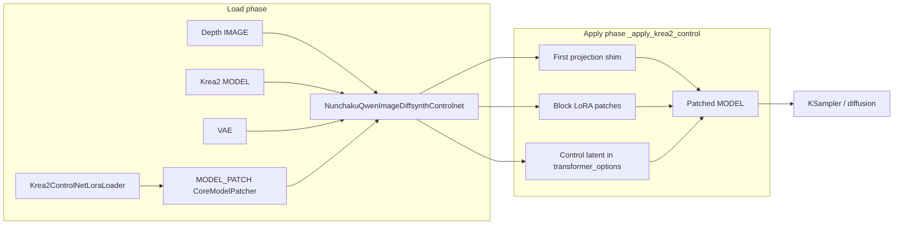

<table align="center">
  <tr>
    <td align="center" bgcolor="#e5e7eb" width="88" height="36"><a href="https://github.com/ussoewwin/ComfyUI-QwenImageLoraLoader/releases/tag/v2.5.1"><font color="#4b5563"><b>EN</b></font></a></td>
    <td align="center" bgcolor="#3478ca" width="88" height="36"><font color="#ffffff"><b>中文</b></font></td>
  </tr>
</table>

## 1. 基线与提交范围

| 项目 | 值 |
|------|--------|
| 基线提交 | `ddb37ff19ee358c6fd9ec777bd4334c72b18d229` |
| 比较范围 | `ddb37ff..HEAD`（撰写时共 22 个提交） |
| 功能提交（核心） | `84d111a`、`c191309`、`e0e0231`、`7622aca`、`188bc83`、`a47ca7d`、`f9f8de4`、`035bad4` |

在基线时，**`NunchakuQwenImageDiffsynthControlnet`** 仅路由 Z-Image、Nunchaku Qwen Image 和标准 Qwen Image。当时**没有 Krea2 路径**，也**没有 `Krea2ControlNetLoraLoader`**。

---

## 2. 新建或修改的文件

| 文件 | 状态 | 作用 |
|------|--------|------|
| `nodes/lora/krea2_controlnet_lora.py` | **新建** | 从 `controlnet/` 加载 Krea2 control LoRA → `MODEL_PATCH` |
| `nodes/controlnet.py` | **修改** | Krea2 路由 + 三层 control 应用（first projection、block LoRA、control latent） |
| `__init__.py` | **修改** | 注册 `Krea2ControlNetLoraLoader` 节点 |

---

## 3. 架构概览

Krea2 control **不是**经典的 DiffSynth ControlNet UNet 补丁。safetensors 文件是一个 **LoRA 风格的捆绑包**，它会：

1. **扩展** `diffusion_model.first`（在第一个 linear 处拼接 image + control token 特征）
2. 通过 ComfyUI `LoRAAdapter` + `add_patches` **修补** transformer block 权重
3. 通过 diffusion-model wrapper **注入**每个 forward 中经 VAE 编码的 **control latent**




### 3.1 路由表（`_classify_controlnet_target`）

| 路由 | 检测方式 | 处理函数 |
|-------|-----------|---------|
| `zimage` | `model_patch.model` 为 `ZImage_Control` | `ZImageControlPatch` |
| `nunchaku_qwenimage` | `model.model.__class__.__name__ == "NunchakuQwenImage"` | `DiffSynthCnetBlockReplace` 循环 |
| `qwenimage_standard` | `diffusion_model` 为 `ComfyQwenImageWrapper` 或 `NunchakuQwenImageTransformer2DModel` | `DiffSynthCnetPatch` |
| `krea2` | `diffusion_model` 为 `SingleStreamDiT` **或** 模块路径包含 `comfy.ldm.krea2` | `_apply_krea2_control` |
| `unknown` | 其他任意情况 | **`RuntimeError`**（严格；无静默回退） |

**相对基线的重要变更：** 此前，当 base 为 `NunchakuQwenImage` 时，`ComfyQwenImageWrapper` 可能被当作 Nunchaku 处理。现在路由按**模型家族拆分**，因此 Krea2 LoRA 权重永远不会走 Qwen/Z-Image 的 DiffSynth 路径（`c191309`）。

### 3.2 调用路径（加载 + 采样）

**加载阶段（工作流连线，每次图执行一次）：**

```
Krea2ControlNetLoraLoader.load_model_patch(name)
  → comfy.utils.load_torch_file(controlnet/<name>)
  → _Krea2LoraAsModelPatch(state_dict)
  → CoreModelPatcher(...)  # MODEL_PATCH output

NunchakuQwenImageDiffsynthControlnet.diffsynth_controlnet_nunchaku(model, model_patch, vae, image, strength)
  → model.clone()
  → _classify_controlnet_target(model, model_patch)  → "krea2"
  → _apply_krea2_control(model_patched, model_patch, vae, image, strength)
       ├─ expanded first.weight → _Krea2FirstProjection
       ├─ blocks.* LoRA pairs → add_patches(LoRAAdapter, strength_patch=strength)
       ├─ VAE encode(depth image) → transformer_options["krea2_control_latent"]
       ├─ add_wrapper_with_key(DIFFUSION_MODEL, _krea2_make_wrapper)
       ├─ set_injections(_krea2_make_injection)
       └─ ON_DETACH / ON_CLEANUP callbacks → _krea2_restore_callback
  → return (patched MODEL,)
```


**采样阶段（每次 diffusion forward）：**

```
KSampler
  → comfy.sample.sample
    → samplers: calc_cond_batch / model apply
      → patched MODEL forward
        → diffusion_model wrapper (_krea2_make_wrapper)
             ├─ read transformer_options["krea2_control_latent"]
             ├─ _krea2_latent_to_tokens(...) → projection.control_tokens
             ├─ swap diffusion_model.first → _Krea2FirstProjection
             └─ finally: restore previous first / control_tokens
        → _Krea2FirstProjection.forward(image_tokens)
             ├─ concat(image_tokens, control_tokens * strength) on last dim
             └─ F.linear with expanded weight from LoRA file
        → SingleStreamDiT blocks (with LoRA patches merged on weights)
```


**要点：** 加载器只携带权重。路由选定 `krea2` 后，所有 Krea2 计算都在 `nodes/controlnet.py` 中执行。Block LoRA 通过 ComfyUI 标准 `add_patches` 应用；first-layer control 与 latent 注入通过 wrapper + projection shim 执行。

### 3.3 `_classify_controlnet_target` — 逐行说明

| 步骤 | 条件 | 返回值 | 原因 |
|------|-----------|--------|-----|
| 1 | `model_patch.model` 为 `ZImage_Control` | `zimage` | Z-Image DiffSynth controlnet 补丁类型。 |
| 2 | `model` 没有 `.model` | `unknown` | 无法检查 base 架构。 |
| 3 | `model.model.__class__.__name__ == "NunchakuQwenImage"` | `nunchaku_qwenimage` | Nunchaku Qwen 路径使用 block-replace 循环（不是 Krea2）。 |
| 4 | 没有 `model.model.diffusion_model` | `unknown` | 没有可修补的 DiT。 |
| 5 | `dm` 为 `ComfyQwenImageWrapper` 或 `NunchakuQwenImageTransformer2DModel` | `qwenimage_standard` | **与 Nunchaku 拆分**（`c191309`）——当 base 不同时，wrapper 不再被误路由为 Nunchaku。 |
| 6 | `dm` 为 `SingleStreamDiT` **或** 模块路径包含 `comfy.ldm.krea2` | `krea2` | 专用 Krea2 应用路径（`_apply_krea2_control`）。 |
| 7 | 其他 | `unknown` | `diffsynth_controlnet_nunchaku` 抛出 **`RuntimeError`** — 不会静默回退到 Qwen/ZI。 |

---

## 4. 新文件：`nodes/lora/krea2_controlnet_lora.py`（完整源码）

### 4.1 完整代码

```python
import logging

import comfy.model_management
import comfy.model_patcher
import comfy.ops
import comfy.utils
import folder_paths


logger = logging.getLogger(__name__)


class _Krea2LoraAsModelPatch:
    """
    Minimal MODEL_PATCH backend to carry Krea2 Control LoRA weights.
    Control execution stays in controlnet patcher side.
    """

    def __init__(self, state_dict):
        self.state_dict = state_dict


class Krea2ControlNetLoraLoader:
    """
    Krea2 ControlNet LoRA file loader (MODEL_PATCH output only).
    Follows existing controlnet model loader style: select file and output model_patch.
    """

    @classmethod
    def INPUT_TYPES(cls):
        return {
            "required": {
                "name": (folder_paths.get_filename_list("controlnet"),),
            }
        }

    RETURN_TYPES = ("MODEL_PATCH",)
    FUNCTION = "load_model_patch"
    CATEGORY = "advanced/loaders/krea2"
    DESCRIPTION = "Load a Krea2 controlnet LoRA file and output MODEL_PATCH."

    def load_model_patch(self, name):
        lora_file = folder_paths.get_full_path_or_raise("controlnet", name)
        logger.info(f"[Krea2ControlNetLoraLoader] Loading controlnet LoRA: {lora_file}")
        lora_state_dict = comfy.utils.load_torch_file(lora_file, safe_load=True)
        if not isinstance(lora_state_dict, dict) or len(lora_state_dict) == 0:
            raise ValueError(f"Invalid or empty state dict: {lora_file}")

        model = _Krea2LoraAsModelPatch(lora_state_dict)
        model_patcher = comfy.model_patcher.CoreModelPatcher(
            model,
            load_device=comfy.model_management.get_torch_device(),
            offload_device=comfy.model_management.unet_offload_device(),
        )
        logger.info("[Krea2ControlNetLoraLoader] Loaded successfully")
        return (model_patcher,)

```


### 4.2 含义（逐行）

| 行号 | 含义 |
|-------|---------|
| 1–10 | 标准 ComfyUI 导入。**`comfy.ops`** 已导入但在此文件中**未使用**（无害残留；无运行时影响）。 |
| 13–20 | **`_Krea2LoraAsModelPatch`**：最小载体。ComfyUI `MODEL_PATCH` 期望 `model_patch.model`；此处 `model` 仅为带 **`state_dict`** 的该类。无 `forward`、无补丁逻辑——应用完全在 `controlnet.py` 中。 |
| 23–27 | **`Krea2ControlNetLoraLoader` docstring**：说明仅输出 MODEL_PATCH，并与其他 controlnet loader 风格一致。 |
| 29–35 | **`INPUT_TYPES`**：单一必填下拉 **`name`**，来自 **`folder_paths.get_filename_list("controlnet")`** → ComfyUI **`models/controlnet/`** 下的文件（`e0e0231`）。 |
| 37–40 | **`RETURN_TYPES` / `FUNCTION` / `CATEGORY`**：输出类型 **`MODEL_PATCH`**，方法 **`load_model_patch`**，菜单 **`advanced/loaders/krea2`**。 |
| 42–56 | **`load_model_patch`**：解析路径 → **`load_torch_file(..., safe_load=True)`** → 拒绝空/非 dict → 用 **`get_torch_device()`** / **`unet_offload_device()`** 包装为 **`CoreModelPatcher`** → 返回 **`(model_patcher,)`** 元组，供工作流连到 **`NunchakuQwenImageDiffsynthControlnet.model_patch`**。 |

**设计选择：** 不在加载器中嵌入 Krea2 数学运算。一个 loader + 一条应用路径，使 LoRA 键与 projection 逻辑集中在一处（`_apply_krea2_control`）。

---

## 5. 修改文件：`__init__.py`（仅新增行）

### 5.1 基线 vs 当前（diff）

**新增 import（第 56 行）：**

```python
    from .nodes.lora.krea2_controlnet_lora import Krea2ControlNetLoraLoader
```


**新增版本戳（第 76 行）：**

```python
    Krea2ControlNetLoraLoader.__version__ = __version__
```


**新增节点注册（第 88 行）：**

```python
    NODE_CLASS_MAPPINGS["Krea2ControlNetLoraLoader"] = Krea2ControlNetLoraLoader
```


**新增显示名称（第 115 行）：**

```python
NODE_DISPLAY_NAME_MAPPINGS["Krea2ControlNetLoraLoader"] = "Krea2 controlnet lora loader"
```


### 5.2 含义

| 变更 | 含义 |
|--------|---------|
| **Import** | 将 `Krea2ControlNetLoraLoader` 暴露给扩展节点注册表（与本仓库其他 loader 节点相同模式）。 |
| **类上的 `__version__`** | ComfyUI Manager / 调试：loader 类携带与扩展（`__init__.py` 的 `__version__`）相同的版本字符串。 |
| **`NODE_CLASS_MAPPINGS`** | 内部节点 id **`Krea2ControlNetLoraLoader`** → 类。用于工作流 JSON 的 `class_type`。 |
| **`NODE_DISPLAY_NAME_MAPPINGS`** | 菜单标签 **`Krea2 controlnet lora loader`**，位于 **`advanced/loaders/krea2`**。仅显示用；不改变张量行为。 |

Krea2 未修改其他节点或映射。现有 Qwen / Z-Image / Nunchaku 节点保持不变。

---

## 6. 修改文件：`nodes/controlnet.py` — 为 Krea2 新增的 import

基线 `ddb37ff` 已有 `import torch`、`comfy.utils`、`comfy.model_management`、`comfy.latent_formats`、`comfy.ldm.lumina.controlnet`、`logging` 等。**仅为 Krea2 代码块新增**以下 import：

```python
import torch.nn as nn
import torch.nn.functional as F
import comfy.ldm.common_dit
import comfy.patcher_extension
from comfy.weight_adapter.lora import LoRAAdapter
```


| Import | 在 Krea2 代码中的作用 |
|--------|---------------------|
| `nn`, `F` | `_Krea2FirstProjection` 模块；扩展 first projection 使用 `F.linear` |
| `comfy.ldm.common_dit` | 将 control latent 转为 patch token 时使用 `pad_to_patch_size` |
| `comfy.patcher_extension` | `WrappersMP.DIFFUSION_MODEL`、`PatcherInjection`、`CallbacksMP.ON_DETACH` / `ON_CLEANUP` |
| `LoRAAdapter` | 传给 `model_patcher.add_patches` 的 ComfyUI 原生 LoRA 补丁对象 |

Krea2 未改动其他 import 行。同一文件中现有 DiffSynth / Z-Image controlnet 代码除 `diffsynth_controlnet_nunchaku` 路由（§8）外均未改动。

---

## 7. `nodes/controlnet.py` — Krea2 代码块（完整新增代码，第 15–463 行）

以下为基线之后**完整新增的 Krea2 节**。基线没有第 15–463 行；`diffsynth_controlnet_nunchaku` 中的路由仅为内联 ZI/QI 检测。

```python
KREA2_CONTROL_LATENT_KEY = "krea2_control_latent"
KREA2_CONTROL_WRAPPER_KEY = "krea2_control_inline"


def _classify_controlnet_target(model, model_patch):
    """
    Classify ControlNet target route strictly to avoid mixing model families.

    Returns one of:
      - "zimage"
      - "nunchaku_qwenimage"
      - "qwenimage_standard"
      - "krea2"
      - "unknown"
    """
    if isinstance(model_patch.model, comfy.ldm.lumina.controlnet.ZImage_Control):
        return "zimage"

    if not hasattr(model, "model"):
        return "unknown"

    model_base_name = model.model.__class__.__name__
    if model_base_name == "NunchakuQwenImage":
        return "nunchaku_qwenimage"

    if not hasattr(model.model, "diffusion_model"):
        return "unknown"

    dm = model.model.diffusion_model
    dm_name = dm.__class__.__name__
    dm_module = getattr(dm.__class__, "__module__", "")

    if dm_name in ("ComfyQwenImageWrapper", "NunchakuQwenImageTransformer2DModel"):
        return "qwenimage_standard"

    if dm_name == "SingleStreamDiT" or "comfy.ldm.krea2" in dm_module:
        return "krea2"

    return "unknown"


class _Krea2FirstProjection(nn.Module):
    """
    Runtime projection shim for Krea2 control tokens.
    """

    def __init__(self, expanded_weight, base_in_features, base_first, bias=None):
        super().__init__()
        self.base_in_features = int(base_in_features)
        self.control_in_features = int(expanded_weight.shape[1] - base_in_features)
        if self.control_in_features <= 0:
            raise RuntimeError("Invalid Krea2 control projection width.")
        self.base_first = base_first
        self.weight = nn.Parameter(expanded_weight.detach().cpu().clone(), requires_grad=False)
        self.bias = None if bias is None else nn.Parameter(bias.detach().cpu().clone(), requires_grad=False)
        self.control_tokens = None
        self.control_strength = 1.0
        self.ab_logged = False

    def forward(self, image_tokens):
        logger.info(
            "[Krea2Control] first_forward attached=%s image_tokens_shape=%s",
            self.control_tokens is not None,
            tuple(image_tokens.shape),
        )
        if image_tokens.shape[-1] != self.base_in_features:
            raise RuntimeError(
                f"Krea2 first projection expects {self.base_in_features} image features, got {image_tokens.shape[-1]}."
            )
        if self.control_tokens is None:
            return self.base_first(image_tokens)
        control_tokens = comfy.utils.repeat_to_batch_size(self.control_tokens, image_tokens.shape[0])
        control_tokens = control_tokens.to(device=image_tokens.device, dtype=image_tokens.dtype)
        control_tokens = control_tokens * float(self.control_strength)
        if control_tokens.shape[1] != image_tokens.shape[1]:
            raise RuntimeError(
                f"Krea2 control token count mismatch: image={image_tokens.shape[1]}, control={control_tokens.shape[1]}."
            )
        x = torch.cat((image_tokens, control_tokens), dim=-1)
        weight = comfy.model_management.cast_to_device(self.weight, x.device, x.dtype)
        bias = None
        if self.bias is not None:
            bias = comfy.model_management.cast_to_device(self.bias, x.device, x.dtype)
        out = F.linear(x, weight, bias)

        # One-shot A/B diff log per run: control off vs on.
        if not self.ab_logged:
            self.ab_logged = True
            with torch.no_grad():
                base_out = self.base_first(image_tokens)
                delta = (out - base_out).detach().abs().mean().float().cpu().item()
                logger.info(
                    "[Krea2Control] first_output_delta_mean_abs=%.6f control_strength=%.4f",
                    float(delta),
                    float(self.control_strength),
                )
        return out


def _krea2_get_lora_state_dict(model_patch):
    state_dict = getattr(getattr(model_patch, "model", None), "state_dict", None)
    if not isinstance(state_dict, dict) or len(state_dict) == 0:
        raise RuntimeError("Krea2 route expects MODEL_PATCH from Krea2 controlnet lora loader.")
    return state_dict


def _krea2_find_expanded_first_weight(state_dict, out_features, in_features):
    candidates = (
        "first.weight",
        "diffusion_model.first.weight",
        "model.diffusion_model.first.weight",
        "transformer.first.weight",
    )
    for key in candidates:
        w = state_dict.get(key)
        if torch.is_tensor(w) and w.ndim == 2 and tuple(w.shape) == (out_features, in_features):
            return key
    return None


def _krea2_find_bias_for_first(state_dict, weight_key, out_features):
    check = []
    if weight_key.endswith(".weight"):
        check.append(weight_key[:-7] + ".bias")
    check.extend(
        (
            "first.bias",
            "diffusion_model.first.bias",
            "model.diffusion_model.first.bias",
            "transformer.first.bias",
        )
    )
    for key in check:
        b = state_dict.get(key)
        if torch.is_tensor(b) and b.ndim == 1 and tuple(b.shape) == (out_features,):
            return b
    return None


def _krea2_lora_pairs(state_dict):
    patterns = (
        (".lora_down.weight", ".lora_up.weight"),
        (".lora_down", ".lora_up"),
        ("_lora.down.weight", "_lora.up.weight"),
        (".A", ".B"),
        (".lora_A.weight", ".lora_B.weight"),
        (".lora_A", ".lora_B"),
    )
    seen = set()
    for down_suffix, up_suffix in patterns:
        for down_key in state_dict.keys():
            if not down_key.endswith(down_suffix):
                continue
            base = down_key[: -len(down_suffix)]
            up_key = base + up_suffix
            if up_key not in state_dict:
                continue
            pair = (down_key, up_key)
            if pair in seen:
                continue
            seen.add(pair)
            yield base, down_key, up_key


def _krea2_target_key(base):
    prefixes = ("model.diffusion_model.", "diffusion_model.", "transformer.", "model.")
    changed = True
    while changed:
        changed = False
        for prefix in prefixes:
            if base.startswith(prefix):
                base = base[len(prefix) :]
                changed = True
    if base.startswith("blocks."):
        return f"diffusion_model.{base}.weight"
    return None


def _krea2_model_key_shape(model_patcher, key):
    try:
        cur = model_patcher.model
        for part in key.split("."):
            cur = getattr(cur, part)
    except Exception:
        return None
    shape = getattr(cur, "shape", None)
    if shape is not None:
        return tuple(shape)
    data = getattr(cur, "data", None)
    if data is not None:
        tensor_shape = getattr(data, "tensor_shape", None)
        if tensor_shape is not None:
            return tuple(tensor_shape)
    tensor_shape = getattr(cur, "tensor_shape", None)
    if tensor_shape is not None:
        return tuple(tensor_shape)
    return None


def _krea2_build_block_patches(state_dict, model_patcher):
    patches = {}
    model_sd = model_patcher.model.state_dict()
    for base, down_key, up_key in _krea2_lora_pairs(state_dict):
        target_key = _krea2_target_key(base)
        if target_key is None:
            continue
        down = state_dict[down_key]
        up = state_dict[up_key]
        if not (torch.is_tensor(down) and torch.is_tensor(up) and down.ndim == 2 and up.ndim == 2):
            continue

        target_shape = _krea2_model_key_shape(model_patcher, target_key)
        if target_shape is None:
            t = model_sd.get(target_key)
            if torch.is_tensor(t):
                target_shape = tuple(t.shape)
        if target_shape is None or len(target_shape) < 2:
            continue

        out_features, in_features = target_shape[0], target_shape[1]
        if not (up.shape[0] == out_features and down.shape[1] == in_features and up.shape[1] == down.shape[0]):
            if down.shape[0] == in_features and up.shape[1] == out_features and down.shape[1] == up.shape[0]:
                down = down.t().contiguous()
                up = up.t().contiguous()
            else:
                continue

        rank = down.shape[0]
        alpha = rank
        alpha_key = None
        for suffix in (".alpha", ".network_alpha", ".scale"):
            candidate = base + suffix
            if candidate in state_dict:
                alpha_key = candidate
                val = state_dict[candidate]
                alpha = float(val.detach().cpu().reshape(-1)[0]) if torch.is_tensor(val) else float(val)
                break

        used = {down_key, up_key}
        if alpha_key is not None:
            used.add(alpha_key)
        patches[target_key] = LoRAAdapter(used, (up, down, alpha, None, None, None))
    return patches


def _krea2_prepare_control_latent(model_patcher, vae, image):
    control_image = image[:, :, :, :3].clamp(0.0, 1.0)
    control_latent = vae.encode(control_image)
    if hasattr(model_patcher.model, "process_latent_in"):
        control_latent = model_patcher.model.process_latent_in(control_latent)
    return control_latent


def _krea2_spatial_patch_size(patch_size):
    if isinstance(patch_size, int):
        return int(patch_size), int(patch_size)
    if isinstance(patch_size, (list, tuple)):
        if len(patch_size) == 0:
            raise RuntimeError("Krea2 patch_size is empty.")
        if len(patch_size) == 1:
            v = int(patch_size[0])
            return v, v
        return int(patch_size[-2]), int(patch_size[-1])
    raise RuntimeError(f"Unsupported Krea2 patch_size type: {type(patch_size)}")


def _krea2_control_latent_to_4d(control_latent):
    if control_latent.ndim == 4:
        return control_latent
    if control_latent.ndim == 5:
        b, c, t, h, w = control_latent.shape
        return control_latent.permute(0, 2, 1, 3, 4).reshape(b * t, c, h, w)
    raise RuntimeError(f"Krea2 control latent must be 4D or 5D, got {tuple(control_latent.shape)}")


def _krea2_latent_to_tokens(control_latent, x, patch_size, expected_control_features):
    if x.ndim == 5:
        batch = x.shape[0] * x.shape[2]
    elif x.ndim == 4:
        batch = x.shape[0]
    else:
        raise RuntimeError(f"Krea2 input latent must be 4D or 5D, got {tuple(x.shape)}")

    patch_h, patch_w = _krea2_spatial_patch_size(patch_size)

    control_source = _krea2_control_latent_to_4d(control_latent)
    control = comfy.utils.repeat_to_batch_size(control_source, batch)
    control = comfy.model_management.cast_to_device(control, x.device, x.dtype)

    target_h, target_w = x.shape[-2], x.shape[-1]
    if control.shape[-2:] != (target_h, target_w):
        control = comfy.utils.common_upscale(control, target_w, target_h, "bilinear", "disabled")

    control = comfy.ldm.common_dit.pad_to_patch_size(control, (patch_h, patch_w))
    b, c, h, w = control.shape
    token_features = c * patch_h * patch_w
    if token_features != expected_control_features:
        raise RuntimeError(
            f"Krea2 control token feature mismatch: got {token_features}, expected {expected_control_features}."
        )
    control = control.reshape(b, c, h // patch_h, patch_h, w // patch_w, patch_w)
    return control.permute(0, 2, 4, 1, 3, 5).reshape(b, (h // patch_h) * (w // patch_w), token_features)


def _krea2_extract_transformer_options(args, kwargs):
    transformer_options = kwargs.get("transformer_options")
    if transformer_options is None and len(args) >= 5 and isinstance(args[4], dict):
        transformer_options = args[4]
    if transformer_options is None and len(args) > 0 and isinstance(args[-1], dict):
        transformer_options = args[-1]
    return transformer_options


def _krea2_restore_projection(diffusion_model, projection):
    projection.control_tokens = None
    if getattr(diffusion_model, "first", None) is projection:
        diffusion_model.first = projection.base_first


def _krea2_make_injection(projection):
    def inject(model_patcher):
        dm = getattr(model_patcher.model, "diffusion_model", None)
        if dm is None:
            return
        current_first = getattr(dm, "first", None)
        if isinstance(current_first, _Krea2FirstProjection):
            current_first = current_first.base_first
        if current_first is not None:
            projection.base_first = current_first
            dm.first = current_first
        projection.control_tokens = None

    def eject(model_patcher):
        dm = getattr(model_patcher.model, "diffusion_model", None)
        if dm is not None:
            _krea2_restore_projection(dm, projection)

    return [comfy.patcher_extension.PatcherInjection(inject=inject, eject=eject)]


def _krea2_restore_callback(model_patcher, *args):
    attachment = model_patcher.get_attachment(KREA2_CONTROL_WRAPPER_KEY)
    if not isinstance(attachment, dict):
        return
    projection = attachment.get("projection")
    if not isinstance(projection, _Krea2FirstProjection):
        return
    dm = getattr(model_patcher.model, "diffusion_model", None)
    if dm is None:
        return
    _krea2_restore_projection(dm, projection)


def _krea2_make_wrapper(projection):
    def wrapper(executor, *args, **kwargs):
        transformer_options = _krea2_extract_transformer_options(args, kwargs)
        if not isinstance(transformer_options, dict):
            raise RuntimeError("Krea2 control wrapper could not read transformer_options.")

        control_latent = transformer_options.get(KREA2_CONTROL_LATENT_KEY)
        if control_latent is None:
            raise RuntimeError("Krea2 control latent missing in transformer_options.")

        diffusion_model = executor.class_obj
        x = args[0]
        previous_first = getattr(diffusion_model, "first", None)
        previous_tokens = projection.control_tokens
        try:
            control_tokens = _krea2_latent_to_tokens(
                control_latent,
                x,
                diffusion_model.patch,
                projection.control_in_features,
            )
            control_tokens_mean_abs = float(control_tokens.detach().abs().mean().cpu().item())
            logger.info(
                "[Krea2Control] control_tokens_shape=%s mean_abs=%.6f",
                tuple(control_tokens.shape),
                control_tokens_mean_abs,
            )
            projection.control_tokens = control_tokens
            projection.ab_logged = False
            if getattr(diffusion_model, "first", None) is not projection:
                diffusion_model.first = projection
            logger.info(
                "[Krea2Control] first_injected=%s",
                getattr(diffusion_model, "first", None) is projection,
            )
            return executor(*args, **kwargs)
        finally:
            projection.control_tokens = previous_tokens
            if getattr(diffusion_model, "first", None) is projection:
                diffusion_model.first = projection.base_first if projection.base_first is not None else previous_first

    return wrapper


def _apply_krea2_control(model_patched, model_patch, vae, image, strength):
    state_dict = _krea2_get_lora_state_dict(model_patch)
    first = model_patched.get_model_object("diffusion_model.first")
    first_weight = getattr(first, "weight", None)
    if first_weight is None or len(first_weight.shape) != 2:
        raise RuntimeError("Current MODEL is not Krea2-compatible (missing 2D diffusion_model.first.weight).")
    out_features, base_in_features = int(first_weight.shape[0]), int(first_weight.shape[1])

    expanded_key = _krea2_find_expanded_first_weight(state_dict, out_features, base_in_features * 2)
    if expanded_key is None:
        raise RuntimeError(
            f"Expanded first projection weight ({out_features}, {base_in_features * 2}) not found in Krea2 control LoRA."
        )
    expanded_weight = state_dict[expanded_key]
    expanded_bias = _krea2_find_bias_for_first(state_dict, expanded_key, out_features)
    if expanded_bias is None and hasattr(first, "bias") and torch.is_tensor(first.bias):
        expanded_bias = first.bias.detach()

    projection = _Krea2FirstProjection(expanded_weight, base_in_features, first, expanded_bias)
    projection.control_strength = float(strength)

    lora_patches = _krea2_build_block_patches(state_dict, model_patched)
    if not lora_patches:
        raise RuntimeError("No block LoRA patches matched the current Krea2 model.")
    patched_keys = model_patched.add_patches(lora_patches, strength_patch=strength, strength_model=1.0)
    if not patched_keys:
        raise RuntimeError("Krea2 model did not accept any control LoRA block patches.")

    control_latent = _krea2_prepare_control_latent(model_patched, vae, image)
    logger.info("[Krea2Control] control_latent_shape=%s", tuple(control_latent.shape))
    model_patched.add_wrapper_with_key(
        comfy.patcher_extension.WrappersMP.DIFFUSION_MODEL,
        KREA2_CONTROL_WRAPPER_KEY,
        _krea2_make_wrapper(projection),
    )
    model_patched.set_injections(KREA2_CONTROL_WRAPPER_KEY, _krea2_make_injection(projection))
    model_patched.add_callback_with_key(
        comfy.patcher_extension.CallbacksMP.ON_DETACH,
        KREA2_CONTROL_WRAPPER_KEY,
        _krea2_restore_callback,
    )
    model_patched.add_callback_with_key(
        comfy.patcher_extension.CallbacksMP.ON_CLEANUP,
        KREA2_CONTROL_WRAPPER_KEY,
        _krea2_restore_callback,
    )
    model_patched.set_attachments(
        KREA2_CONTROL_WRAPPER_KEY,
        {"projection": projection, "patched_model_keys": len(patched_keys)},
    )
    transformer_options = model_patched.model_options.setdefault("transformer_options", {})
    transformer_options[KREA2_CONTROL_LATENT_KEY] = control_latent
```


### 7.0 含义 — 常量、路由与辅助函数

| 符号 / 函数 | 作用 |
|-------------------|------|
| **`KREA2_CONTROL_LATENT_KEY`**（`"krea2_control_latent"`） | `model_patcher.model_options["transformer_options"]` 中的键，存放 VAE 编码的 control latent，供 wrapper 每次 forward 读取。 |
| **`KREA2_CONTROL_WRAPPER_KEY`**（`"krea2_control_inline"`） | wrapper、injection、callback 与 `CoreModelPatcher` 上 attachment 注册的键——集中管理 Krea2 钩子并可移除。 |
| **`_classify_controlnet_target`** | 返回 `zimage` / `nunchaku_qwenimage` / `qwenimage_standard` / `krea2` / `unknown`。先检查 `model_patch` 类型（ZImage_Control），再检查 base 模型类，再检查 `diffusion_model` 类名与模块路径。当为 `SingleStreamDiT` 或模块包含 `comfy.ldm.krea2` 时为 **`krea2`**。 |
| **`_krea2_get_lora_state_dict`** | 从 `Krea2ControlNetLoraLoader` 输出解包 `model_patch.model.state_dict`。若非非空 dict 则抛出（连线了错误补丁类型）。 |
| **`_krea2_find_expanded_first_weight`** | 在已知键前缀中扫描 shape 为 **`(out_features, base_in_features * 2)`** 的 `first.weight` — 训练时将输入宽度加倍以拼接 control。 |
| **`_krea2_find_bias_for_first`** | 查找匹配的 `first.bias`（或所发现 weight 键的兄弟键），shape 为 `(out_features,)`。 |
| **`_krea2_lora_pairs`** | 遍历 state dict 中所有 `down`/`up` 后缀对（`.lora_down`/`.lora_up`、`.A`/`.B`、`lora_A`/`lora_B` 等）。用 `seen` 集去重。**`7622aca`**：移除过严的键过滤。 |
| **`_krea2_target_key`** | 从 LoRA base 名剥离 `model.diffusion_model.` / `diffusion_model.` / `transformer.` / `model.` 前缀。仅当 base 以 `blocks.` 开头时返回 **`diffusion_model.blocks.N....weight`**；否则 `None`（跳过非 block 键）。 |
| **`_krea2_model_key_shape`** | 通过 `getattr` 遍历或 `data.tensor_shape`（Nunchaku 风格参数）解析活模型键的张量 shape。 |
| **`_krea2_build_block_patches`** | 对每个 LoRA 对：解析目标键与 shape，必要时转置 down/up，读取可选 alpha，构建以模型权重名为键的 **`LoRAAdapter(used_keys, (up, down, alpha, ...))`** 字典。 |
| **`_krea2_prepare_control_latent`** | RGB 钳制 → **`vae.encode`** → 可选 **`model.process_latent_in`**（Krea2 checkpoint latent 格式）。 |
| **`_krea2_spatial_patch_size`** | 将 `diffusion_model.patch`（int、tuple 或 list）规范为 `(patch_h, patch_w)`。 |
| **`_krea2_control_latent_to_4d`** | 接受 4D latent 或 5D 视频 latent；将时间维折入 batch（`a47ca7d`）。 |
| **`_krea2_latent_to_tokens`** | 将 control latent 上采样到与噪声 `x` 空间尺寸一致，pad 到 patch 网格，reshape 为 **`(B, num_patches, C*patch_h*patch_w)`** — 须与 **`projection.control_in_features`** 一致。 |
| **`_krea2_extract_transformer_options`** | 从 kwargs 或位置参数读取 `transformer_options`（ComfyUI 调用签名差异）。 |
| **`_krea2_restore_projection`** | 清空 `control_tokens`；通过 projection shim 将 `diffusion_model.first` 恢复为 `base_first`。 |
| **`_krea2_make_injection`** | **`inject`**：加载时把真实 `dm.first` 存入 `projection.base_first`。**`eject`**：卸载时恢复。 |
| **`_krea2_restore_callback`** | ON_DETACH / ON_CLEANUP 处理：读取 attachment，调用 `_krea2_restore_projection`，避免 clone 仍保留 shim。 |
| **`_krea2_make_wrapper`** | 每次 forward：latent → tokens，设置 `projection.control_tokens`，临时 `dm.first = projection`，调用内部 forward，**`finally`** 恢复 tokens 与 `first`。 |
| **`_apply_krea2_control`** | 编排三层（first projection、block LoRA、control latent + 钩子）。若缺少 expanded first 或 block patches 则 fail-loud。 |

### 7.1 `_Krea2FirstProjection` — 第一层拼接

Krea2 depth LoRA 训练将第一层 linear 从 **`(out, in)`** 扩展为 **`(out, in + control_in)`**。safetensors 存储**完整扩展权重**；运行时**不**单独添加 control 分支模块。而是：

1. **`control_in_features`** = `expanded_weight.shape[1] - base_in_features`（在 `__init__` 中推导）。
2. 每次 forward，若设置了 **`control_tokens`**：**`torch.cat((image_tokens, control_tokens), dim=-1)`**，再用冻结的扩展 weight/bias 做 **`F.linear`**。
3. 若 **`control_tokens is None`**：调用 **`base_first(image_tokens)`**（直通，无 control）。

**`control_strength`**：拼接前对 control tokens 乘以该标量（与节点 **`strength`** 相同）。

**校验**：dim 1 上 image 与 control 的 token 数须一致；最后一维特征维须为 **`base_in_features`**。

**`ab_logged` / A/B delta**：每个「control 已附着」周期记录一次 **`first_output_delta_mean_abs`** = 相对 `base_first` 输出的平均绝对差 — 证明 control 非零（`035bad4`）。

#### 7.1.1 `_Krea2FirstProjection` — 逐行（`__init__` + `forward`）

| 行（§7 块内） | 代码 | 含义 |
|------------------|------|---------|
| 61–62 | `super().__init__()` | 标准 `nn.Module` 初始化。 |
| 63 | `base_in_features = int(base_in_features)` | 来自活模型 **`diffusion_model.first.weight.shape[1]`** 的 image token 宽度（不单靠 LoRA 文件）。 |
| 64 | `control_in_features = expanded.shape[1] - base_in_features` | 扩展 first 权重中 baked 的 control 侧宽度（depth LoRA 训练产物）。 |
| 65–66 | `if control_in_features <= 0: raise` | 拒绝畸形扩展权重（无 control 通道）。 |
| 67 | `self.base_first = base_first` | 原始 first linear；用于直通与 A/B 基线。 |
| 68–69 | `nn.Parameter(..., requires_grad=False)` | 扩展 weight/bias 复制到 CPU 并冻结 — 仅推理 shim。 |
| 70–72 | `control_tokens`, `control_strength`, `ab_logged` | wrapper 在每组 forward 前设置的运行时状态。 |
| 74–79 | forward 入口日志 | 确认是否附着 control tokens，并记录 `image_tokens` shape。 |
| 80–83 | `image_tokens.shape[-1] != base_in_features` | 噪声 token 与 base 模型 first in_features 不一致则硬失败。 |
| 84–85 | `if control_tokens is None: return base_first(...)` | 无 control latent → 与未打补丁的 first 层相同。 |
| 86–88 | `repeat_to_batch_size`, device/dtype, `* control_strength` | batch 对齐 control tokens；匹配激活设备；缩放 depth 影响。 |
| 89–92 | dim 1 上 token 数检查 | image 与 control 流的 patch 网格 token 数须一致。 |
| 93 | `torch.cat((image_tokens, control_tokens), dim=-1)` | 单个扩展 linear 之前的 **Krea2 核心拼接**（特征维）。 |
| 94–98 | `cast_to_device` + `F.linear` | 用 LoRA 训练权重执行扩展 first projection。 |
| 101–110 | A/B 单次日志 | 比较 `out` 与 `base_first(image_tokens)`；记录一次平均绝对 delta。 |
| 111 | `return out` | 输出进入 `SingleStreamDiT` 其余 block（block LoRA 补丁仍生效）。 |

### 7.2 Block LoRA — state dict → `LoRAAdapter`

不是独立的 ControlNet UNet。`**blocks.N.*`** 下带标准 LoRA down/up 对的键映射到已加载 Krea2 模型上的 **`diffusion_model.blocks.N.*.weight`**。

- **`_krea2_lora_pairs`**：枚举兼容后缀模式，适配不同训练导出命名。
- **`_krea2_target_key`**：非 `blocks.*` 键（如 `first.*`）在此跳过 — first 层由 projection shim 处理，不用 `add_patches`。
- **`_krea2_build_block_patches`**：与活模型 shape 校验；down/up 秩互换时自动转置；alpha 来自 `.alpha` / `.network_alpha` / `.scale`，否则默认为 rank。

**`add_patches(..., strength_patch=strength, strength_model=1.0)`**：用户 **`strength`** 缩放 block LoRA 贡献；模型权重保持 1.0。

#### 7.2.1 `_krea2_build_block_patches` — 内层循环

对 LoRA **`state_dict`** 中每个 **`(key, tensor)`**：

| 步骤 | 函数 / 检查 | 含义 |
|------|------------------|---------|
| 1 | `_krea2_target_key(key)` | 将 `blocks.0.attn.qkv.lora_down` 映射为 `diffusion_model.blocks.0.attn.qkv.weight`。对 `first.*` 返回 **`None`**（由 projection shim 处理）。 |
| 2 | `_krea2_lora_pairs(key)` | 在 `.lora_down`/`.lora_up`、`.lora_A`/`.lora_B`、`.lora_down.weight`/`.lora_up.weight` 中找 `(down_suffix, up_suffix)`。 |
| 3 | 对完整性 | down 与 up 张量均须存在；否则跳过该键（非错误）。 |
| 4 | `target_key in model_sd` | 目标权重须存在于已加载 Krea2 checkpoint。 |
| 5 | `target_weight.ndim == 2` | 仅修补 2D linear 权重（Krea2 block 使用矩阵权重）。 |
| 6 | rank / shape 校验 | `down` 为 `(rank, in)` 或 `(in, rank)`；`up` 为 `(out, rank)` 或 `(rank, out)`；若互换则自动转置。 |
| 7 | Alpha | 来自兄弟键 `.alpha` / `.network_alpha` / `.scale`，否则 **`alpha = rank`**。 |
| 8 | `patches[target_key] = (LoRAAdapter(...), (alpha, down, up))` | ComfyUI 原生补丁元组，由 **`model_patcher.add_patches`** 消费。 |

循环结束后 **`len(patches) == 0`** → **`RuntimeError("No block LoRA patches matched...")`**，错误文件无法静默无操作。

### 7.3 Control latent → patch tokens

1. **`_krea2_prepare_control_latent`**：深度 **`IMAGE`**（RGB）→ VAE latent；若 base 模型有 Krea2 **`process_latent_in`** 则应用。
2. 在 **`_apply_krea2_control`** 中一次性写入 **`transformer_options[KREA2_CONTROL_LATENT_KEY]`**。
3. 每次 diffusion forward，**`_krea2_make_wrapper`** 读取该 latent，**`_krea2_latent_to_tokens`**：
   - 与噪声输入 `x` 的 batch 对齐（4D 或 5D 视频）。
   - 若 H/W 与当前去噪 latent 不同则 **`common_upscale`** 双线性上采样。
   - **`pad_to_patch_size`** 后 patchify，与 DiT **`diffusion_model.patch`** 一致的 token 布局。

projection 中的 **`control_in_features`** 须等于该 patchify 步骤的 **`C * patch_h * patch_w`** — 不匹配则 **`RuntimeError`**。

### 7.4 `_apply_krea2_control` — 三层与生命周期

| 层 | 内容 | 位置 |
|-------|------|--------|
| **A. First projection** | `_Krea2FirstProjection` + 临时 `dm.first` 交换 | 每次 forward 的 wrapper |
| **B. Block LoRA** | `blocks.*.weight` 上的 `LoRAAdapter` 补丁 | 应用时 `add_patches` |
| **C. Control 信号** | `transformer_options` 中的 VAE latent | 应用时设置；每次 forward 消费 |

**`_apply_krea2_control` 中的设置顺序：**

1. 加载 state dict；从活 **`diffusion_model.first.weight`** shape 读取 `out_features` / `base_in_features`。
2. 在 LoRA 文件中找扩展 first weight/bias；构建 **`_Krea2FirstProjection`**；设置 **`control_strength`**。
3. 构建 block patches；**`add_patches`**；若无键被接受则报错。
4. 编码 control 图像；记录 **`control_latent_shape`**。
5. 注册 **wrapper**、**injections**、**detach/cleanup callbacks**、**attachments**（保存 projection + patch 计数）。
6. 将 control latent 写入 **`transformer_options`**。

**Mask：** Krea2 分支目前忽略 **`mask`**（全帧 depth）。Z-Image / Qwen 路径在提供 mask 时仍使用（§8.2）。

---

## 8. `diffsynth_controlnet_nunchaku` — 路由变更（当前完整方法）

### 8.1 基线 `ddb37ff`（完整方法体）

来源：提交 `ddb37ff19ee358c6fd9ec777bd4334c72b18d229` 时 `nodes/controlnet.py` 第 225–286 行。

```python
    def diffsynth_controlnet_nunchaku(self, model, model_patch, vae, image, strength, mask=None):
        model_patched = model.clone()
        image = image[:, :, :, :3]
        if mask is not None:
            if mask.ndim == 3:
                mask = mask.unsqueeze(1)
            if mask.ndim == 4:
                mask = mask.unsqueeze(2)
            mask = 1.0 - mask

        # Detect ControlNet model type
        is_zimage_control = isinstance(model_patch.model, comfy.ldm.lumina.controlnet.ZImage_Control)

        # Detect Nunchaku Qwen Image model
        # Nunchaku's _forward() processes patches_replace but ignores patches["double_block"],
        # so we need to use set_model_patch_replace() instead of set_model_double_block_patch().
        is_nunchaku_qwenimage = False
        if not is_zimage_control and hasattr(model, 'model'):
            # Check model base class name (NunchakuQwenImage from ComfyUI-nunchaku model_base)
            model_base_name = model.model.__class__.__name__
            if model_base_name == 'NunchakuQwenImage':
                is_nunchaku_qwenimage = True
            # Check diffusion model class name
            elif hasattr(model.model, 'diffusion_model'):
                dm_name = model.model.diffusion_model.__class__.__name__
                if dm_name in ('ComfyQwenImageWrapper', 'NunchakuQwenImageTransformer2DModel'):
                    is_nunchaku_qwenimage = True

        logger.info(f"[ControlNet] is_zimage={is_zimage_control}, is_nunchaku_qwenimage={is_nunchaku_qwenimage}")

        if is_zimage_control:
            # ZImage ControlNet (works for both standard and Nunchaku Z-Image)
            logger.info("[ControlNet] Using ZImageControlPatch")
            patch = ZImageControlPatch(model_patch, vae, image, strength, mask=mask)
            model_patched.set_model_noise_refiner_patch(patch)
            model_patched.set_model_double_block_patch(patch)
        elif is_nunchaku_qwenimage:
            # Nunchaku Qwen Image: use patches_replace since _forward ignores patches["double_block"]
            logger.info("[ControlNet] Using DiffSynthCnetBlockReplace for Nunchaku Qwen Image")
            cnet_patch = DiffSynthCnetPatch(model_patch, vae, image, strength, mask)
            # Register via set_model_double_block_patch for model loading (models() discovery)
            model_patched.set_model_double_block_patch(cnet_patch)
            # Get number of transformer blocks from the diffusion model
            dm = model.model.diffusion_model
            try:
                num_blocks = len(dm.transformer_blocks)
            except AttributeError:
                num_blocks = 60  # Default for Qwen Image
                logger.warning(f"[ControlNet] Could not determine block count, using default {num_blocks}")
            # Register patches_replace entries for actual ControlNet execution in Nunchaku
            for i in range(num_blocks):
                model_patched.set_model_patch_replace(
                    DiffSynthCnetBlockReplace(cnet_patch, i),
                    "dit", "double_block", i
                )
            logger.info(f"[ControlNet] Registered {num_blocks} patches_replace entries for Nunchaku Qwen Image")
        else:
            # Standard Qwen Image: use patches["double_block"] (processed by ComfyUI's _forward)
            logger.info("[ControlNet] Using DiffSynthCnetPatch (standard)")
            model_patched.set_model_double_block_patch(DiffSynthCnetPatch(model_patch, vae, image, strength, mask))

        return (model_patched,)
```


**基线行为摘要：**

- 内联布尔标志 `is_zimage_control` 与 `is_nunchaku_qwenimage`。
- 仅三个分支：ZImage、Nunchaku Qwen Image（`patches_replace`）、否则标准 `DiffSynthCnetPatch`。
- 无 `_classify_controlnet_target`、无 `krea2` 路由、无 `qwenimage_standard` 拆分、未知模型无 `RuntimeError`。

### 8.2 当前 HEAD（完整方法体）

来源：`nodes/controlnet.py` 第 680–733 行。

**当前（HEAD 完整 `diffsynth_controlnet_nunchaku` 方法，第 680–733 行）：**

```python
    def diffsynth_controlnet_nunchaku(self, model, model_patch, vae, image, strength, mask=None):
        model_patched = model.clone()
        image = image[:, :, :, :3]
        if mask is not None:
            if mask.ndim == 3:
                mask = mask.unsqueeze(1)
            if mask.ndim == 4:
                mask = mask.unsqueeze(2)
            mask = 1.0 - mask

        route = _classify_controlnet_target(model, model_patch)
        logger.info(f"[ControlNet] route={route}")

        if route == "zimage":
            # ZImage ControlNet (works for both standard and Nunchaku Z-Image)
            logger.info("[ControlNet] Using ZImageControlPatch")
            patch = ZImageControlPatch(model_patch, vae, image, strength, mask=mask)
            model_patched.set_model_noise_refiner_patch(patch)
            model_patched.set_model_double_block_patch(patch)
        elif route == "nunchaku_qwenimage":
            # Nunchaku Qwen Image: use patches_replace since _forward ignores patches["double_block"]
            logger.info("[ControlNet] Using DiffSynthCnetBlockReplace for Nunchaku Qwen Image")
            cnet_patch = DiffSynthCnetPatch(model_patch, vae, image, strength, mask)
            # Register via set_model_double_block_patch for model loading (models() discovery)
            model_patched.set_model_double_block_patch(cnet_patch)
            # Get number of transformer blocks from the diffusion model
            dm = model.model.diffusion_model
            try:
                num_blocks = len(dm.transformer_blocks)
            except AttributeError:
                num_blocks = 60  # Default for Qwen Image
                logger.warning(f"[ControlNet] Could not determine block count, using default {num_blocks}")
            # Register patches_replace entries for actual ControlNet execution in Nunchaku
            for i in range(num_blocks):
                model_patched.set_model_patch_replace(
                    DiffSynthCnetBlockReplace(cnet_patch, i),
                    "dit", "double_block", i
                )
            logger.info(f"[ControlNet] Registered {num_blocks} patches_replace entries for Nunchaku Qwen Image")
        elif route == "krea2":
            # Krea2 path: dedicated Krea2 runtime patching flow.
            logger.info("[ControlNet] Applying dedicated Krea2 control route")
            _apply_krea2_control(model_patched, model_patch, vae, image, strength)
        elif route == "qwenimage_standard":
            # Standard Qwen Image: use patches["double_block"] (processed by ComfyUI's _forward)
            logger.info("[ControlNet] Using DiffSynthCnetPatch (qwenimage_standard)")
            model_patched.set_model_double_block_patch(DiffSynthCnetPatch(model_patch, vae, image, strength, mask))
        else:
            raise RuntimeError(
                "Unsupported model/controlnet route. "
                "Control routing is strict to avoid mixing QI/ZI/Nunchaku/Krea2 branches."
            )

        return (model_patched,)
```


**说明：** Krea2 分支目前**不**使用 `mask`；depth control 为全帧。ZI/QI 路径除分类移至 `_classify_controlnet_target` 外未改动。

### 8.3 含义 — 相对基线的变化

| 方面 | 基线（`ddb37ff`） | 当前（HEAD） |
|--------|----------------------|----------------|
| **检测** | 内联 `is_zimage_control` + `is_nunchaku_qwenimage` 布尔 | 单一 **`_classify_controlnet_target`** → 字符串路由 |
| **Qwen 拆分** | base 为 `NunchakuQwenImage` 时 `ComfyQwenImageWrapper` 可能与 Nunchaku 合并 | **`nunchaku_qwenimage`** 与 **`qwenimage_standard`** 为独立路由（`c191309`） |
| **Krea2** | 不支持 — 落入 **`DiffSynthCnetPatch`**（错误） | **`route == "krea2"`** → **`_apply_krea2_control`** |
| **未知模型** | 始终使用标准 Qwen 补丁（静默错误路径） | **`RuntimeError`** — fail loud |
| **日志** | `is_zimage=..., is_nunchaku_qwenimage=...` | `route=zimage|nunchaku_qwenimage|qwenimage_standard|krea2` |

**对 Krea2 的意义：** Depth LoRA 权重（扩展 `first`、`blocks.*` LoRA 对）绝不能被当作 DiffSynth ControlNet 张量。专用 **`krea2`** 分支确保仅在检测到 **`SingleStreamDiT`** / **`comfy.ldm.krea2`** 时由 **`_apply_krea2_control`** 修改模型。

**ZI/QI 未变：** Z-Image 仍用 **`ZImageControlPatch`**；Nunchaku Qwen 仍用 **`DiffSynthCnetPatch`** + **`DiffSynthCnetBlockReplace`** 循环；标准 Qwen 仍用 **`set_model_double_block_patch(DiffSynthCnetPatch(...))`**。方法顶部的 image/mask 预处理相同。

---

## 9. 预期 safetensors 键（Krea2 depth LoRA）

| 键模式 | 必需 | 作用 |
|-------------|----------|------|
| `first.weight`（或带前缀变体）shape `(O, 2*I)` | **是** | 扩展 first linear |
| `first.bias`（可选）shape `(O,)` | 否 | 偏置；回退到 base 模型 bias |
| `blocks.N.*.lora_down` / `lora_up`（任意支持的后缀对） | **是**（≥1 个 block） | Transformer block LoRA |
| `blocks.N.*.alpha` / `.network_alpha` / `.scale` | 否 | LoRA alpha；默认 = rank |

若找不到扩展 first 或零个 block patches 匹配 → 带明确信息的 **`RuntimeError`**（fail loud，非静默无操作）。

---

## 10. 工作流用法

1. 加载 **Krea2 base 模型**（checkpoint 含 `SingleStreamDiT`）。
2. **`Krea2ControlNetLoraLoader`**：从 **`models/controlnet/`** 选择 depth control LoRA。
3. **`NunchakuQwenImageDiffsynthControlnet`**（分类 `advanced/loaders/qwen`）：
   - `model` ← Krea2 MODEL
   - `model_patch` ← loader 输出
   - `vae` ← 与工作流相同的 VAE
   - `image` ← 深度图（RGB，Comfy 图像值域）
   - `strength` ← control 强度（亦通过 `strength_patch` 缩放 block LoRA）
4. 将打补丁后的 **MODEL** 连到采样器。

控制台应显示：

```
[ControlNet] route=krea2
[ControlNet] Applying dedicated Krea2 control route
[Krea2Control] control_latent_shape=(...)
[Krea2Control] control_tokens_shape=... mean_abs=...
[Krea2Control] first_forward attached=True ...
[Krea2Control] first_output_delta_mean_abs=...
```


---

## 11. 修复历史（自基线起）

| 提交 | 修复 |
|--------|-----|
| `84d111a` | 初始 Krea2 loader + 应用路径 |
| `c191309` | 严格按家族路由；禁止跨家族补丁混用 |
| `e0e0231` | 从 `controlnet` 文件夹文件列表加载 |
| `7622aca` | 移除过严 LoRA 键门控；接受多种命名模式 |
| `188bc83` | 专用 `krea2` 路由分支 |
| `a47ca7d` | 4D/5D control latent 处理 |
| `f9f8de4` / `035bad4` | 调试日志 + first 层 A/B delta + control tokens 上的 strength |

---

## 12. 故障排除

| 现象 | 可能原因 |
|---------|----------------|
| `Unsupported model/controlnet route` | Base 模型不是 Krea2 / 补丁为 Z-Image ControlNet / MODEL 连线错误 |
| `Expanded first projection weight ... not found` | LoRA 文件不是 Krea2 depth 格式或 checkpoint 配对错误 |
| `No block LoRA patches matched` | State dict 使用不支持的前缀或模型变体错误 |
| `control token count mismatch` | 上采样后噪声 latent 与 control latent 的分辨率 / patch 网格不一致 |
| `first_output_delta_mean_abs=0` | strength 为 0、深度图为空或未附着 control tokens（查日志 `attached=False`） |

---

*文档针对基线 `ddb37ff19ee358c6fd9ec777bd4334c72b18d229` → HEAD 生成。实现真源：HEAD 时仓库文件。*
