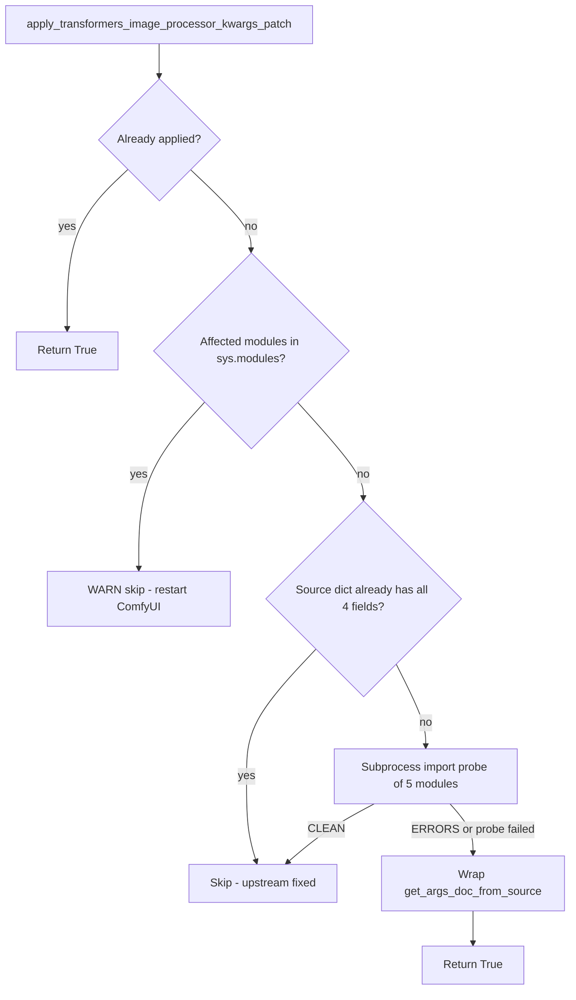

<table align="center">
  <tr>
    <td align="center" bgcolor="#e5e7eb" width="88" height="36"><a href="https://github.com/ussoewwin/ComfyUI-QwenImageLoraLoader/releases/tag/v2.5.9"><font color="#4b5563"><b>EN</b></font></a></td>
    <td align="center" bgcolor="#3478ca" width="88" height="36"><font color="#ffffff"><b>中文</b></font></td>
  </tr>
</table>

# v2.5.9 技术文档：Transformers ImageProcessorKwargs "not documented" Docstring 补丁（deepseek_vl_hybrid / kimi_k25 / paddleocr_vl）

> 修复提交：`8d82442` — `fix(patches): suppress transformers ImageProcessorKwargs 'not documented' startup noise`
> 版本提交：`db26f9f` — `chore: bump version to 2.5.9, add v2.5.9 changelog entry (EN + ZH)`
> 日期：2026-08-27

---

本文档完整说明如何消除 Hugging Face `transformers` 在 ComfyUI 启动时打印的
`[ERROR]` ... `but not documented` 系列日志。修复**完全位于
ComfyUI-QwenImageLoraLoader 自定义节点内部** —— 不触碰任何
`site-packages` 文件、不过滤任何输出，并且一旦上游 `transformers` 修复了
底层缺陷，补丁**会自动自我移除**。

**记录环境（2026-08-27）：**

| 项目 | 值 |
|------|-------|
| transformers | 5.15.1 |
| ComfyUI-QwenImageLoraLoader | v2.5.8（提交 `8d82442`） |
| 受影响的 TypedDict | `DeepseekVLHybridImageProcessorKwargs`、`Kimi_K25ImageProcessorKwargs`、`PaddleOCRVLImageProcessorKwargs` |
| 缺失的字段 | `high_res_size`、`merge_size`、`min_pixels`、`max_pixels` |

---

## 设计约束

1. **不要修改 `site-packages` 中的 `transformers`。** 本方案只在本自定义节点
   内部、以进程内方式 monkey-patch `get_args_doc_from_source`。
2. **只从 `prestartup_script.py` 应用。** 补丁必须在任何自定义节点导入受影响
   的 transformers 模块**之前**安装完成（`main.execute_prestartup_script()`
   在自定义节点加载之前运行）。
3. **上游自动禁用（全自动）。** 每次 ComfyUI 启动时探测上游；只有当上游仍会
   输出这些 `[ERROR]` 行时才安装包装器。**无需用户环境变量或开关。**

### 决策表

| 条件 | 动作 | 日志级别 |
|-----------|--------|-----------|
| `get_args_doc_from_source` 上已有带标记的包装器 | **返回 True**（幂等） | — |
| 受影响的 transformers 模块已在 `sys.modules` 中 | **跳过** — 需要重启 | WARNING |
| 源字典（ImageProcessorArgs/VideoProcessorArgs）已记录全部 4 个字段 | **跳过** — 上游 schema 已修复 | INFO |
| 子进程导入探测输出 `CLEAN`（无 `[ERROR] ... not documented`） | **跳过** — 上游行为已修复 | INFO |
| 子进程探测输出 `ERRORS`，或探测无法运行（`None`） | 若前面的行未跳过，则**应用**包装器 | INFO |
| 缺少 `transformers.utils.auto_docstring` / 无 `get_args_doc_from_source` | **跳过** | DEBUG |

### 决策流程



---

## 1. 问题是什么

### 1.1 症状

在 ComfyUI 启动时、自定义节点初始化横幅之后，`transformers` 向控制台打印了
**13 行 `[ERROR]`**，例如：

```text
[ERROR] `high_res_size` is part of DeepseekVLHybridImageProcessorKwargs, but not documented. Make sure to add it to the docstring of the function in D:\USERFILES\ComfyUI\python_embeded\Lib\site-packages\transformers\models\deepseek_vl_hybrid\image_processing_deepseek_vl_hybrid.py.
[ERROR] `merge_size` is part of Kimi_K25ImageProcessorKwargs, but not documented. Make sure to add it to the docstring of the function in D:\USERFILES\ComfyUI\python_embeded\Lib\site-packages\transformers\models\kimi_k25\image_processing_kimi_k25.py.
[ERROR] `min_pixels` is part of PaddleOCRVLImageProcessorKwargs, but not documented. Make sure to add it to the docstring of the function in ...\image_processing_paddleocr_vl.py.
[ERROR] `max_pixels` is part of PaddleOCRVLImageProcessorKwargs, but not documented. Make sure to add it to the docstring of the function in ...\image_processing_paddleocr_vl.py.
```

完整的分布（观察到的启动日志中共 13 行）：

| 源文件（位于 `transformers\models\...`） | 缺失字段 | 打印行数 |
|--------------------------------------------|------------------|---------------|
| `deepseek_vl_hybrid\image_processing_deepseek_vl_hybrid.py` | `high_res_size` | 1 |
| `deepseek_vl_hybrid\image_processing_pil_deepseek_vl_hybrid.py` | `high_res_size` | 2 |
| `kimi_k25\image_processing_kimi_k25.py` | `merge_size` | 2 |
| `paddleocr_vl\image_processing_paddleocr_vl.py` | `min_pixels`, `max_pixels` | 4 |
| `paddleocr_vl\image_processing_pil_paddleocr_vl.py` | `min_pixels`, `max_pixels` | 4 |

### 1.2 影响

- **无功能性破坏。** 这些行是 `transformers` 在导入时自动生成文档字符串的
  校验噪音。ComfyUI、图像处理器与模型都能正常工作。
- **日志污染 / 误报警。** 这些行看起来像真正的错误，使启动日志变得嘈杂，
  也让真正的错误更难被发现。
- 由于消息**源自已安装的 `transformers` 包内部**，一个天真的"修复"会去编辑
  `site-packages` 下的文件 —— 这是不可接受的（参见 §2.4）：该改动会在每次
  `pip` 升级时丢失，并与上游包发生分歧。

---

## 2. 根本原因

### 2.1 校验机制：`transformers.utils.auto_docstring`

在 `transformers` 5.x 中，图像处理器类使用 `@auto_docstring` 装饰。在
**模块导入时**，装饰器检查该类及其 `__call__` 签名并重建 docstring。该流程
的一部分是 `_process_kwargs_parameters()`，它处理以 TypedDict（例如
`DeepseekVLHybridImageProcessorKwargs`）作为类型注解的 `**kwargs` 参数。

相关逻辑（来自 `transformers\utils\auto_docstring.py`，transformers 5.15.1）：

```python
# _process_kwargs_parameters()
kwargs_documentation = kwarg_param.annotation.__args__[0].__doc__   # the TypedDict's OWN docstring
if kwargs_documentation is not None:
    documented_kwargs = parse_docstring(kwargs_documentation)[0]    # parse it

for param_name, param_type_annotation in kwarg_param.annotation.__args__[0].__annotations__.items():
    ...
    param_type, optional_string, shape_string, additional_info, description, is_documented = (
        _get_parameter_info(param_name, documented_kwargs, source_args_dict, param_type, optional)
    )
    ...
    else:   # not documented
        undocumented_parameters.append(
            f"[ERROR] `{param_name}` is part of {kwarg_param.annotation.__args__[0].__qualname__}, "
            f"but not documented. Make sure to add it to the docstring of the function in {func.__code__.co_filename}."
        )
```

收集到的消息通过普通的 `print()` 输出：

```python
# _process_parameters_section()
if len(undocumented_parameters) > 0:
    print("\n".join(undocumented_parameters))
```

关键细节：该错误**通过 `print()` 输出**，而不是经过 `transformers` 的日志
系统 —— 因此修改 `TRANSFORMERS_VERBOSITY` 或日志级别都无法将其静音。

`_get_parameter_info()` 会按优先级顺序对每个注解键向三个来源求解：

```python
if param_name in documented_params:      # 1. the function's own docstring
    ...
elif param_name in source_args_dict:     # 2. the generic args source dict (fallback)
    ...
else:                                    # 3. nothing -> is_documented = False -> [ERROR]
    is_documented = False
```

**回退**用的 `source_args_dict` 由以下函数产生：

```python
def get_args_doc_from_source(args_classes: object | list[object]) -> dict:
    if isinstance(args_classes, list | tuple):
        return _merge_args_dicts(tuple(args_classes))   # merges cls.__dict__ of each class
    return args_classes.__dict__
```

对图像处理器而言，它被调用为
`get_args_doc_from_source([ImageProcessorArgs, VideoProcessorArgs])`。

决定某个键是否"已记录"的 docstring 解析器使用这个预编译正则：

```python
_re_param = re.compile(
    r"^\s{0,0}(\w+)\s*\(\s*([^, \)]*)(\s*.*?)\s*\)\s*:\s*((?:(?!\n^\s{0,0}\w+\s*\().)*)",
    re.DOTALL | re.MULTILINE,
)
```

`^\s{0,0}` 意味着：**参数名必须恰好从该行的第 0 列开始**（在 `set_min_indent`
剥除公共缩进之后）。行首残留的任何空白都会使该条目对解析器不可见。

### 2.2 上游的三处缺陷（均位于 `transformers` 5.15.1）

**缺陷 A — `DeepseekVLHybridImageProcessorKwargs`（两个后端文件）：
一个多余的空白把 `high_res_size` 藏了起来。**

TypedDict 的 docstring *确实*记录了 `high_res_size`，但该行被写成了
**五个**前导空格，而不是四个：

```python
class DeepseekVLHybridImageProcessorKwargs(ImagesKwargs, total=False):
    r"""
    min_size (`int`, *optional*, defaults to 14):
        The minimum allowed size for the resized image. ...
     high_res_size (`dict`, *optional*, defaults to `{"height": 1024, "width": 1024}`):   # <-- 5 spaces!
        Size of the high resolution output image after resizing. ...
```

`set_min_indent()` 会剥除最小的公共缩进（4 个空格），使 `high_res_size`
剩下 1 个空格 —— `^\s{0,0}` 无法匹配。因此该字段被当作*未记录*，
**尽管它实际上已经被记录**。

**缺陷 B — `Kimi_K25ImageProcessorKwargs`：名称不匹配。**

TypedDict 注解声明的是 `merge_size`（默认 `2`），但 docstring 记录的是一个
不存在的参数 `merge_kernel_size`：

```python
class Kimi_K25ImageProcessorKwargs(ImagesKwargs, total=False):
    r"""
    max_patches (`int`, *optional*, defaults to `16384`): ...
    patch_size (`int`, *optional*, defaults to 14): ...
    merge_kernel_size (`int`, *optional*, defaults to 2):   # <-- annotation says "merge_size"
    """
```

处理器代码本身使用 `merge_size`（`merge_size = images_kwargs.get("merge_size", self.merge_size)`），
所以 docstring 只是写错了名字。

**缺陷 C — `PaddleOCRVLImageProcessorKwargs`（两个后端文件）：
`min_pixels` / `max_pixels` 从未被记录。**

TypedDict 声明了五个字段，但 docstring 只记录了三个：

```python
class PaddleOCRVLImageProcessorKwargs(ImagesKwargs, total=False):
    r"""
    patch_size (`int`, *optional*, defaults to 14): ...
    temporal_patch_size (`int`, *optional*, defaults to 1): ...
    merge_size (`int`, *optional*, defaults to 2): ...
    """   # <-- min_pixels / max_pixels annotations exist but are missing here
```

### 2.3 为什么报错指向"函数"，但修复却要改 TypedDict

消息字符串用 `func.__code__.co_filename`（处理器模块文件）作为位置提示，
但**实际被解析的文本**是 TypedDict 类自己的 `__doc__`
（`kwarg_param.annotation.__args__[0].__doc__`）。这正是消息具有误导性的
原因：编辑*函数*的 docstring 根本没用 —— 需要改变的是 TypedDict 的
docstring（或回退用的源字典）。

### 2.4 为什么拒绝直接修改 `site-packages`

第一次尝试是直接修复
`...\python_embeded\Lib\site-packages\transformers\models\...` 下的五个文件
（修正缩进、重命名 kimi 字段、补充 paddleocr 条目）。它确实有效，但
**不可接受**，因为：

- `pip` 升级 / 重装 `transformers` 会静默还原这些编辑；
- 每个 ComfyUI 环境都需要做同样的手动手术；
- 它使本地包偏离上游，掩盖了上游的缺陷。

因此，直接编辑被**全部回滚**（已验证：原先的 13 行 `[ERROR]` 原样重现），
修复被重新实现为仓库原生的、进程内运行时补丁，见 §3–§5。

---

## 3. 新增 / 修改的文件

| 文件 | 变更 | 类型 |
|------|--------|------|
| `patches/transformers_image_processor_kwargs_patch.py` | **新增** — 实现包装器与上游探测的新补丁模块 | 新文件 |
| `prestartup_script.py` | **修改** — 新增一个路径常量 + 一个加载/应用新补丁的代码块 | 已编辑 |

已提交并推送：

```text
8d82442  fix(patches): suppress transformers ImageProcessorKwargs 'not documented' startup noise
```

> 注意：`patches/nunchaku_patch.py` 显示有一个本地修改（一个空行），与本
> 修复无关，被有意**排除**在提交之外。

---

## 4. 完整代码

### 4.1 新文件：`patches/transformers_image_processor_kwargs_patch.py`

```python
# -*- coding: utf-8 -*-
"""
Patch transformers auto_docstring for ImageProcessorKwargs TypedDict fields.

transformers 5.15.x auto_docstring validation parses each *ImageProcessorKwargs
TypedDict's own __doc__ at import time and prints [ERROR] for every annotation
key that the parser cannot find in that docstring. Known upstream breakages
(transformers 5.15.1):

  - DeepseekVLHybridImageProcessorKwargs: the `high_res_size` docstring entry
    has a stray leading space, so the docstring parser never matches it.
  - Kimi_K25ImageProcessorKwargs: the docstring documents `merge_kernel_size`,
    but the TypedDict annotation is `merge_size`.
  - PaddleOCRVLImageProcessorKwargs: `min_pixels` / `max_pixels` annotations
    are not documented at all.

Fix: wrap transformers.utils.auto_docstring.get_args_doc_from_source so the
returned source dict also carries those four fields. _get_parameter_info()
falls back to source_args_dict when a TypedDict key is missing from its own
docstring, which stops the [ERROR] output without touching site-packages.

Fully automatic at ComfyUI prestartup (no user env vars):
  - Probe upstream state before installing any wrapper.
  - If the source dict already documents the fields, skip (no wrapper).
  - If a subprocess import probe shows clean stdout, skip (no wrapper).
  - Otherwise install the wrapper (default when upstream is still broken).

The wrapper is inert once upstream fixes the docstrings: the fields are only
consulted for TypedDict annotations that declare them, and only when they are
missing from that TypedDict's own docstring.
"""

from __future__ import annotations

import importlib
import logging
import subprocess
import sys
from typing import Any, Callable, Dict, Optional

logger = logging.getLogger(__name__)

_PATCH_TAG = "_qwen_lora_loader_image_processor_kwargs_patch"

# Fields missing from the affected TypedDict docstrings, added to the
# ImageProcessorArgs/VideoProcessorArgs source dict as a fallback.
_EXTRA_KWARGS: Dict[str, Dict[str, Any]] = {
    "high_res_size": {
        "type": "dict",
        "shape": None,
        "description": """
    Size of the high resolution output image after resizing. Can be overridden by the `high_res_size` parameter in the `preprocess` method.
    """,
    },
    "merge_size": {
        "type": "int",
        "shape": None,
        "description": """
    The merge size of the vision encoder to llm encoder.
    """,
    },
    "min_pixels": {
        "type": "int",
        "shape": None,
        "description": """
    The minimum allowed number of pixels for the resized image. Ensures the total pixel count does not fall below this value after resizing.
    """,
    },
    "max_pixels": {
        "type": "int",
        "shape": None,
        "description": """
    The maximum allowed number of pixels for the resized image. Ensures the total pixel count does not exceed this value after resizing.
    """,
    },
}

_AFFECTED_MODULES = (
    "transformers.models.deepseek_vl_hybrid.image_processing_deepseek_vl_hybrid",
    "transformers.models.deepseek_vl_hybrid.image_processing_pil_deepseek_vl_hybrid",
    "transformers.models.kimi_k25.image_processing_kimi_k25",
    "transformers.models.paddleocr_vl.image_processing_paddleocr_vl",
    "transformers.models.paddleocr_vl.image_processing_pil_paddleocr_vl",
)

_patch_applied: bool = False
_original_get_args_doc_from_source: Optional[Callable[..., dict]] = None


def _affected_modules_already_imported() -> bool:
    return any(name in sys.modules for name in _AFFECTED_MODULES)


def _upstream_documents_extra_kwargs(auto_docstring_module) -> bool:
    """Probe upstream native state (never via the patched get_args_doc_from_source)."""
    args_classes = []
    for name in ("ImageProcessorArgs", "VideoProcessorArgs"):
        cls = getattr(auto_docstring_module, name, None)
        if cls is not None:
            args_classes.append(cls)
    if not args_classes:
        return False
    try:
        source = auto_docstring_module.get_args_doc_from_source(args_classes)
    except Exception:
        return False
    return all(field in source for field in _EXTRA_KWARGS)


def _image_processor_args_requested(args_classes: Any, image_processor_args_type: type) -> bool:
    if args_classes is image_processor_args_type:
        return True
    if isinstance(args_classes, (list, tuple)):
        return image_processor_args_type in args_classes
    return False


def _make_patched_get_args_doc_from_source(
    auto_docstring_module,
    original: Callable[..., dict],
) -> Callable[..., dict]:
    image_processor_args_type = auto_docstring_module.ImageProcessorArgs

    def patched_get_args_doc_from_source(args_classes: Any) -> dict:
        result = original(args_classes)

        if not _image_processor_args_requested(args_classes, image_processor_args_type):
            return result

        if all(field in result for field in _EXTRA_KWARGS):
            return result

        merged = dict(result)
        for field, entry in _EXTRA_KWARGS.items():
            merged.setdefault(field, dict(entry))
        return merged

    setattr(patched_get_args_doc_from_source, _PATCH_TAG, True)
    return patched_get_args_doc_from_source


def _import_probe_reports_clean() -> Optional[bool]:
    """
    True: affected transformers modules import with no [ERROR] ... not documented lines.
    False: errors still present (patch may be needed).
    None: probe could not run.
    """
    python_exe = sys.executable
    module_list = ", ".join(repr(m) for m in _AFFECTED_MODULES)
    code = (
        "import importlib, io, contextlib\n"
        "buf = io.StringIO()\n"
        "with contextlib.redirect_stdout(buf):\n"
        f"    for m in ({module_list}):\n"
        "        importlib.import_module(m)\n"
        "lines = buf.getvalue().splitlines()\n"
        "errs = [l for l in lines if '[ERROR]' in l and 'but not documented' in l]\n"
        "print('CLEAN' if not errs else 'ERRORS')\n"
    )
    try:
        proc = subprocess.run(
            [python_exe, "-c", code],
            capture_output=True,
            text=True,
            timeout=180,
        )
    except (OSError, subprocess.SubprocessError) as exc:
        logger.debug("ImageProcessorKwargs docstring import probe failed: %s", exc)
        return None

    if proc.returncode != 0:
        logger.debug(
            "ImageProcessorKwargs docstring import probe exit %s stderr=%s",
            proc.returncode,
            proc.stderr[:500] if proc.stderr else "",
        )
        return None

    last_line = (proc.stdout or "").strip().splitlines()
    if not last_line:
        return None
    status = last_line[-1].strip()
    if status == "CLEAN":
        return True
    if status == "ERRORS":
        return False
    return None


def apply_transformers_image_processor_kwargs_patch() -> bool:
    """
    Install get_args_doc_from_source wrapper unless upstream already fixed the issue.

    Returns True if the wrapper is active (or was already applied), False if skipped.
    """
    global _patch_applied, _original_get_args_doc_from_source

    if _patch_applied:
        return True

    if _affected_modules_already_imported():
        logger.warning(
            "ImageProcessorKwargs docstring patch skipped: affected transformers modules "
            "already imported before prestartup; restart ComfyUI"
        )
        return False

    try:
        auto_docstring_module = importlib.import_module("transformers.utils.auto_docstring")
    except ImportError:
        logger.debug("transformers.utils.auto_docstring not available; patch skipped")
        return False

    get_args = getattr(auto_docstring_module, "get_args_doc_from_source", None)
    if get_args is None:
        return False

    if getattr(get_args, _PATCH_TAG, False):
        _patch_applied = True
        return True

    if _upstream_documents_extra_kwargs(auto_docstring_module):
        logger.info(
            "ImageProcessorKwargs docstring patch skipped: transformers source dict "
            "already documents the fields (upstream fixed; patch not installed)"
        )
        return False

    import_probe = _import_probe_reports_clean()
    if import_probe is True:
        logger.info(
            "ImageProcessorKwargs docstring patch skipped: affected transformers modules "
            "import without docstring errors (upstream fixed; patch not installed)"
        )
        return False

    _original_get_args_doc_from_source = get_args
    auto_docstring_module.get_args_doc_from_source = _make_patched_get_args_doc_from_source(
        auto_docstring_module,
        _original_get_args_doc_from_source,
    )
    _patch_applied = True

    logger.info(
        "Patched transformers.utils.auto_docstring.get_args_doc_from_source for "
        "ImageProcessorKwargs fields (high_res_size/merge_size/min_pixels/max_pixels); "
        "removes when upstream fixes the docstrings"
    )
    return True


def is_patch_applied() -> bool:
    return _patch_applied


def is_patch_wrapped() -> bool:
    try:
        auto_docstring_module = importlib.import_module("transformers.utils.auto_docstring")
    except ImportError:
        return False
    get_args = getattr(auto_docstring_module, "get_args_doc_from_source", None)
    return get_args is not None and getattr(get_args, _PATCH_TAG, False)
```

### 4.2 修改的文件：`prestartup_script.py`（当前完整内容）

**两处新增**均以 `[新增]` 标记；其余均为原有代码。

```python
"""
Inject apply_rotary_emb on comfy.ldm.qwen_image.model before any custom node __init__.

ComfyUI-nunchaku loads before ComfyUI-QwenImageLoraLoader (Windows listdir order), so
__init__.py alone is too late. prestartup_script.py runs from main.execute_prestartup_script().
"""
import importlib.util
import logging
import os

logger = logging.getLogger(__name__)

_PATCH_DIR = os.path.join(os.path.dirname(os.path.abspath(__file__)), "patches")
_NUNCHAKU_PATCH_PATH = os.path.join(_PATCH_DIR, "nunchaku_patch.py")
_DOCSTRING_PATCH_PATH = os.path.join(_PATCH_DIR, "transformers_qwen_vl_docstring_patch.py")
_IP_KWARGS_PATCH_PATH = os.path.join(_PATCH_DIR, "transformers_image_processor_kwargs_patch.py")  # [新增]


def _load_patch_module(module_name: str, path: str):
    spec = importlib.util.spec_from_file_location(module_name, path)
    if spec is None or spec.loader is None:
        raise RuntimeError(f"Failed to load patch module spec from {path}")
    module = importlib.util.module_from_spec(spec)
    spec.loader.exec_module(module)
    return module


# Load the nunchaku patch module once; reuse it for warning suppression and the
# apply_rotary_emb compat shim.
_patch_module = None
try:
    _patch_module = _load_patch_module(
        "comfyui_qwenimageloraloader_nunchaku_patch_prestartup",
        _NUNCHAKU_PATCH_PATH,
    )
except Exception:
    logger.exception("ComfyUI-QwenImageLoraLoader prestartup: failed to load nunchaku patch module")

# Install the cosmetic 'Torch already imported' warning filter first, before any
# prestartup step imports comfy.ldm (which imports torch) and before main.py logs it.
if _patch_module is not None:
    try:
        if _patch_module.suppress_torch_preimport_warning():
            logger.debug(
                "ComfyUI-QwenImageLoraLoader prestartup: torch pre-import warning suppressed"
            )
    except Exception:
        logger.exception(
            "ComfyUI-QwenImageLoraLoader prestartup: torch warning suppression failed"
        )

try:
    _docstring_patch_module = _load_patch_module(
        "comfyui_qwenimageloraloader_docstring_patch_prestartup",
        _DOCSTRING_PATCH_PATH,
    )
    if _docstring_patch_module.apply_transformers_causal_lm_docstring_patch():
        logger.info("ComfyUI-QwenImageLoraLoader prestartup: CausalLM ModelOutput docstring patch applied")
    else:
        logger.debug(
            "ComfyUI-QwenImageLoraLoader prestartup: CausalLM ModelOutput docstring patch not applied"
        )
except Exception:
    logger.exception("ComfyUI-QwenImageLoraLoader prestartup: CausalLM ModelOutput docstring patch failed")

# ImageProcessorKwargs docstring patch (deepseek_vl_hybrid / kimi_k25 / paddleocr_vl   # [新增] 代码块开始
# [ERROR] "but not documented" noise): wraps get_args_doc_from_source at prestartup,
# before any custom node imports those transformers modules.
try:
    _ip_kwargs_patch_module = _load_patch_module(
        "comfyui_qwenimageloraloader_image_processor_kwargs_patch_prestartup",
        _IP_KWARGS_PATCH_PATH,
    )
    if _ip_kwargs_patch_module.apply_transformers_image_processor_kwargs_patch():
        logger.info(
            "ComfyUI-QwenImageLoraLoader prestartup: ImageProcessorKwargs docstring patch applied"
        )
    else:
        logger.debug(
            "ComfyUI-QwenImageLoraLoader prestartup: ImageProcessorKwargs docstring patch not applied"
        )
except Exception:
    logger.exception(
        "ComfyUI-QwenImageLoraLoader prestartup: ImageProcessorKwargs docstring patch failed"
    )
# [新增] 代码块结束

if _patch_module is not None:
    try:
        if _patch_module.apply_qwen_image_apply_rotary_emb_compat():
            logger.info("ComfyUI-QwenImageLoraLoader prestartup: apply_rotary_emb compat applied")
        else:
            logger.debug(
                "ComfyUI-QwenImageLoraLoader prestartup: apply_rotary_emb compat not needed or already present"
            )
    except Exception:
        logger.exception("ComfyUI-QwenImageLoraLoader prestartup: apply_rotary_emb compat failed")
```

---

## 5. 修复的意义

### 5.1 机制：补齐回退路径

`_get_parameter_info()` 中的校验逻辑按顺序求解：

1. TypedDict 自己的 docstring（`documented_kwargs`）—— 这里错误地缺失了
   这些字段（前述三处上游缺陷），然后
2. `get_args_doc_from_source([ImageProcessorArgs, VideoProcessorArgs])`
   返回的通用源字典 —— 我们现在对其进行了扩充，然后
3. "未记录" —— 此前正是它产生了 `[ERROR]` 行。

补丁包装了第 2 步的函数。只要 `ImageProcessorArgs` 出现在请求的参数类中，
包装器就会把缺失的四个字段加入返回的字典
（`merged.setdefault(...)`，因此绝不会覆盖上游真实条目）。于是
`_get_parameter_info()` 的第二个分支就能解析 `high_res_size`、`merge_size`、
`min_pixels` 和 `max_pixels`，`is_documented` 变为 `True`，不再追加
`[ERROR]`。

为什么这样做是安全且精确的：

- 多余的键**只会被**其注解确实声明了这些键的 TypedDict 查询（循环遍历
  `kwarg_param.annotation.__args__[0].__annotations__`）。其他模型的文档
  不会发生任何变化。
- 对每一个非图像处理器的调用（例如仅传 `ModelArgs` 的调用），包装器都会
  原样返回原始字典，并把所有实际工作委托给原函数。
- 只影响*文档字符串生成的输入*。运行时的推理路径、张量形状、模型行为
  一概不受影响 —— 生成的 docstring 本来就是装饰性的。

### 5.2 自动禁用行为

每次 ComfyUI 启动时，补丁都会先问一句："问题还在吗？"

1. 廉价的进程内检查：源字典是否已经包含全部四个字段？如果已包含，说明上游
   已在 schema 层面修复 —— 跳过。
2. 子进程探测：在一个干净的解释器中导入这五个受影响的模块，并检查 stdout
   中是否有 `[ERROR] ... but not documented`。若干净 —— 跳过。
3. 只有当以上两项检查都失败时，才安装包装器。

因此，当 Hugging Face 修复了缩进、kimi 字段名和 paddleocr 条目后，启动日志
只会显示一行 *skip* 而非 `Patched ...`。无需清理任务、无需卸载步骤 —— 而且
因为包装器只会补充缺失的键，即使残留一个过期的包装器也仍然是无害的。

### 5.3 为什么不动 `site-packages`

包装器从自定义节点自己的 `prestartup_script.py` 在**进程内存中**
monkey-patch 一个函数。`python_embeded\Lib\site-packages` 下没有任何内容被
写入，因此 `pip` 升级、环境迁移、其他机器都能照常工作而无需手动手术。
补丁随自定义节点一起做版本管理（提交 `8d82442`）并随其分发。

### 5.4 验证结果

验证使用嵌入式 Python（`D:\USERFILES\ComfyUI\python_embeded\python.exe`）
在干净的子进程中执行：

| 阶段 | 环境 | `[ERROR] ... not documented` 行数 |
|-------|-------|------------------------------------|
| A — 基线 | 包已回滚为原始状态；未加载补丁 | **13**（与原始启动日志完全一致 —— 证明回滚恢复了原始状态，且错误可复现） |
| B — 已打补丁 | 加载补丁模块 + `apply_transformers_image_processor_kwargs_patch()` | **0**（`WRAPPED=True`，合并后的源字典包含全部 4 个键） |

`prestartup_script.py` 与新补丁模块均通过 `py_compile`。

### 5.5 重启 ComfyUI 后应看到的内容

包装器生效时，启动日志显示：

```text
INFO  ComfyUI-QwenImageLoraLoader prestartup: ImageProcessorKwargs docstring patch applied
```

并且**不再出现** `[ERROR] \`...\` is part of ...ImageProcessorKwargs` 行。
当上游 `transformers` 修复后，该行会变为跳过消息：

```text
INFO  ... ImageProcessorKwargs docstring patch skipped: ... (upstream fixed; patch not installed)
```

### 5.6 移除补丁（如确需移除）

补丁由两处小而自包含的改动组成。移除方式：

```bash
git revert 8d82442
```

或者删除 `patches/transformers_image_processor_kwargs_patch.py`，并移除
`prestartup_script.py` 中的 `[新增]` 代码块及常量。

---

## 附录：修复历史

1. **第一次尝试（被否决）：** 直接编辑 `site-packages` 下的五个
   transformers 文件（修正缩进、重命名字段、补充条目）。确实消除了报错，
   但修改了已安装的包文件 —— 不可接受：每次 `pip` 升级都会丢失，且不受
   版本控制管理。
2. **回滚：** 五个文件被逐字节还原；上述阶段 A 确认原先的 13 行 `[ERROR]`
   重新出现。
3. **最终修复（本文档）：** 位于 `patches/transformers_image_processor_kwargs_patch.py`
   的仓库原生运行时包装器，通过 `prestartup_script.py` 接入，采用与姊妹补丁
   `TRANSFORMERS_QWEN_VL_CAUSAL_LM_DOCSTRING_PATCH.md` 完全相同的设计。
4. 已提交并推送：`main` 分支上的 `8d82442`。

## 相关文档

- `md/TRANSFORMERS_QWEN_VL_CAUSAL_LM_DOCSTRING_PATCH.md` — 姊妹补丁，处理
  Qwen VL `CausalLMOutputWithPast` 的 `loss` / `logits` docstring 错误
  （同一设计：探测、包装 `get_args_doc_from_source`、自动禁用）。
- `md/TORCH_PREIMPORT_WARNING_SUPPRESSION.md` — 同一 prestartup 流程中的
  另一个启动噪音修复。
